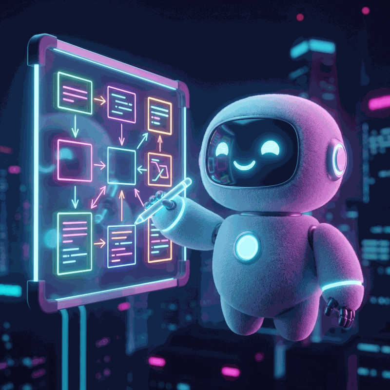
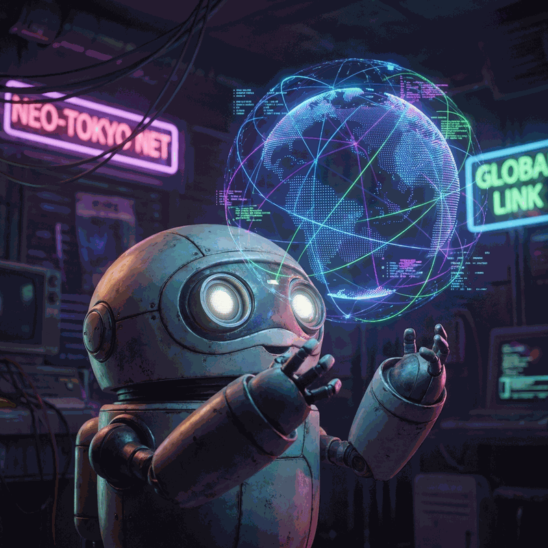
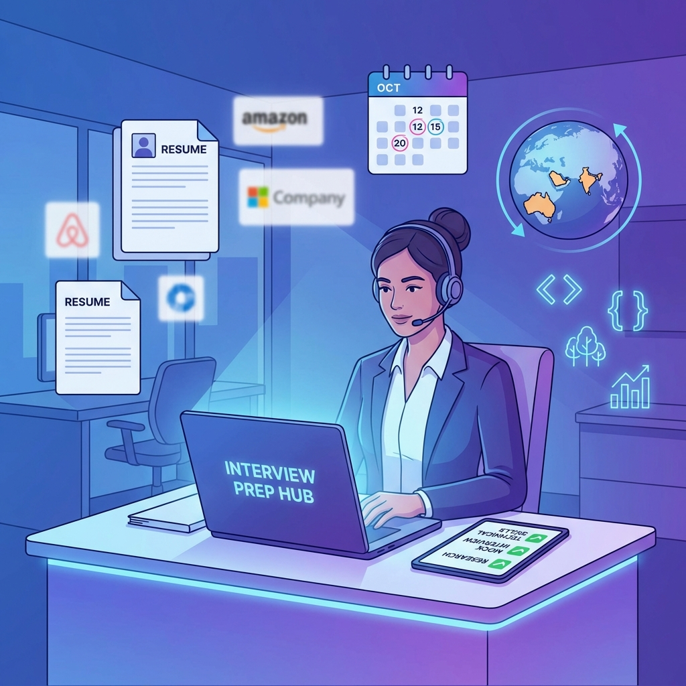
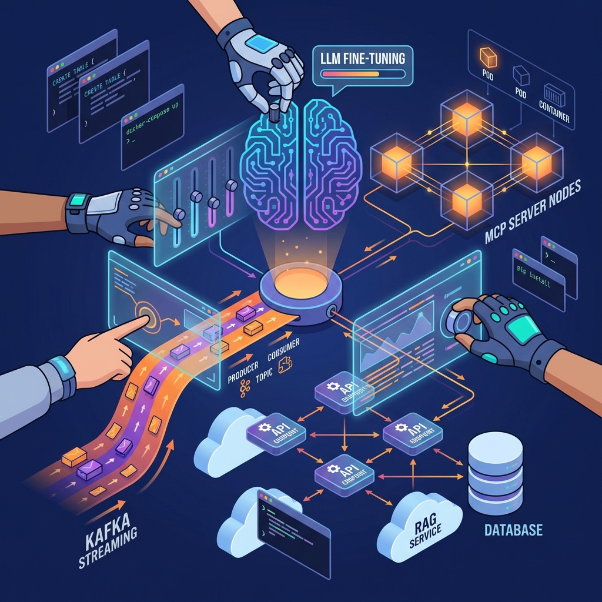
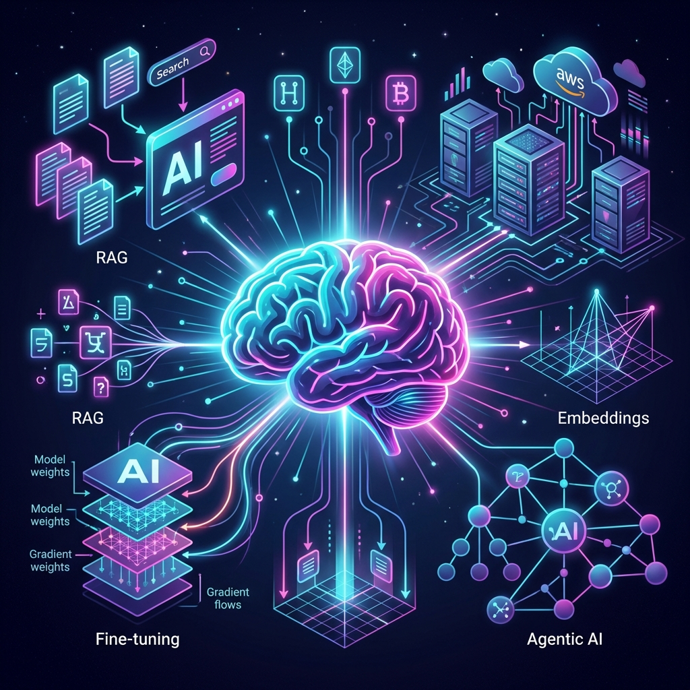
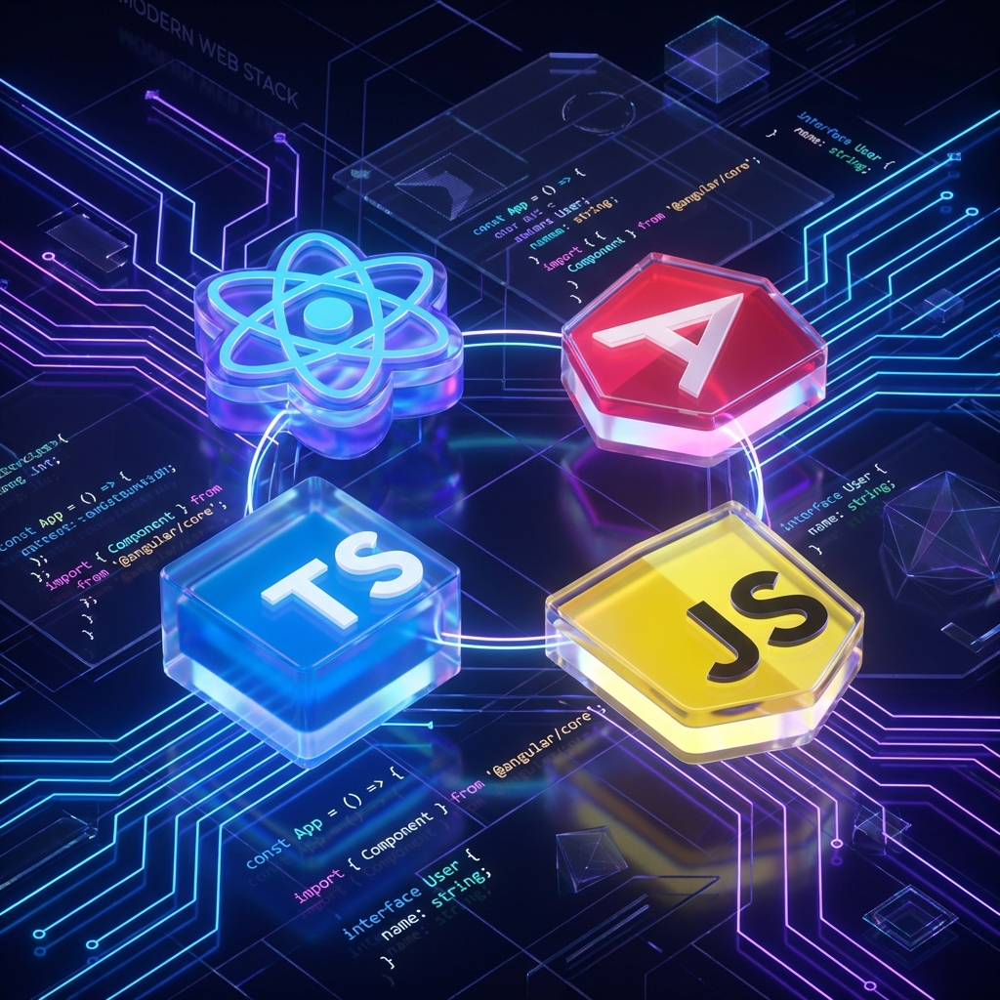

# 🏗️ System Design & Architecture Learning

> A comprehensive guide to becoming a System Architect

---

## 📚 Learning Path

<table>
<tr>
<th>1. CS Fundamentals</th>
<th>2. System Design</th>
<th>3. Core Components</th>
</tr>
<tr>
<td valign="top">

 <b>Master the core pillars:</b> <ul><li>💻 <a href="./cs-fundamentals/operating-system-guide.md">Operating Systems</a></li><li>🌐 <a href="./cs-fundamentals/networking-fundamentals.md">Networking</a></li><li>🗄️ <a href="./cs-fundamentals/dbms/00-roadmap.md">DBMS Masterclass</a> ⭐</li><li>🛠️ <a href="./cs-fundamentals/compiler-design.md">Compiler Design</a> 🆕</li></ul></td>
<td valign="top">

 <b>Build your foundation:</b> <ul><li>📐 <a href="./fundamentals/01-system-design-basics.md">Basics</a></li><li>⚖️ <a href="./fundamentals/02-cap-theorem.md">CAP Theorem</a></li><li>🚀 <a href="./fundamentals/03-scalability-patterns.md">Scalability</a></li><li>🗄️ <a href="./fundamentals/03b-dbms-fundamentals.md">DBMS Fundamentals</a> ⭐</li><li>📊 <a href="./fundamentals/03c-database-modeling.md">Database Modeling</a> ⭐</li><li>🔗 <a href="./fundamentals/03d-spring-jpa-hibernate.md">JPA & Hibernate</a></li><li>📝 <a href="./fundamentals/03e-sql-interview-queries.md">SQL Interview Queries</a></li><li>🏛️ <a href="./fundamentals/09-clean-hexagonal-architecture.md">Clean & Hexagonal Architecture</a> ⭐🆕</li></ul></td>
<td valign="top">

 <b>Essential building blocks:</b> <ul><li>🏗️ <a href="./components/overview.md">Components Overview</a> ⭐</li><li>🔍 <a href="./components/search/README.md">Elasticsearch Suite</a> ⭐🆕 &nbsp;&nbsp;└ <a href="./components/search/elasticsearch-deep-dive.md">Hub</a> | <a href="./components/search/elasticsearch-research.md">Research</a> | <a href="./components/search/elasticsearch-internals-architecture.md">Internals</a></li><li>📨 <a href="./components/messaging/README.md">Kafka Suite</a> ⭐🆕 &nbsp;&nbsp;└ <a href="./components/messaging/kafka-deep-dive.md">Hub</a> | <a href="./components/messaging/kafka-fundamentals.md">Fundamentals</a> | <a href="./components/messaging/kafka-internals-architecture.md">Internals</a></li><li>🐘 <a href="./fundamentals/04-postgresql-guide.md">PostgreSQL</a></li><li>🐬 <a href="./fundamentals/05-mysql-indexing-sharding-partitioning.md">MySQL</a></li><li>🍃 <a href="./fundamentals/06-mongodb-deep-dive.md">MongoDB</a></li><li>⚡ <a href="./fundamentals/06b-dynamodb-deep-dive.md">DynamoDB</a></li><li>� <a href="./fundamentals/07-oracle-deep-dive.md">Oracle</a></li><li>📡 <a href="./fundamentals/08-event-driven-architecture.md">Event-Driven Architecture</a></li></ul></td>
</tr>
<tr>
<th>4. Cloud & AWS</th>
<th>5. Infrastructure & DevOps</th>
<th>6. Java Landscape</th>
</tr>
<tr>
<td valign="top">

 <b>Master cloud services:</b> <ul><li>☁️ <a href="./aws/aws-services-guide.md">AWS Services</a> ⭐</li><li>🛠️ <a href="./aws/aws-cdk-guide.md">AWS CDK</a></li></ul></td>
<td valign="top">

 <b>Container & Deployment:</b> <ul><li>🐳 <a href="./devops/docker-guide.md">Docker</a> ⭐</li><li>☸️ <a href="./devops/kubernetes-guide.md">Kubernetes</a> ⭐</li><li>🌍 <a href="./devops/terraform/README.md">Terraform</a> ⭐</li><li>🏭 <a href="./devops/terraform/real-world-project.md">Prod Architecture</a></li></ul></td>
<td valign="top">

 <b>Modern Java Dev:</b> <ul><li>☕ <a href="./java/modern-features-guide.md">Java 8-21 Features</a></li><li>🍃 <a href="./java/spring/spring-boot-guide.md">Spring Boot</a> ⭐</li><li>🎤 <a href="./java/interview-questions.md">Interview Qs</a></li></ul></td>
</tr>
<tr>
<th>7. Low-Level Design (LLD)</th>
<th>8. Real-World Designs</th>
<th>9. Interview Prep Hub</th>
</tr>
<tr>
<td valign="top">

 <b>OOD & Machine Coding:</b> <ul><li>🗺️ <a href="./lld/00-lld-interview-roadmap.md">Roadmap</a> ⭐</li><li>📦 <a href="./lld/01-ood-fundamentals.md">OOD Fundamentals</a></li><li>🧱 <a href="./lld/02-solid-principles.md">SOLID Principles</a> ⭐</li><li>🎨 <a href="./lld/03-design-patterns/00-patterns-overview.md">Design Patterns</a></li><li>🅿️ <a href="./lld/04-common-designs/01-parking-lot.md">Parking Lot</a> ⭐</li><li>🛗 <a href="./lld/04-common-designs/02-elevator-system.md">Elevator</a> ⭐</li><li>🎬 <a href="./lld/04-common-designs/03-movie-ticket-booking.md">Movie Ticket</a> ⭐</li><li>🥤 <a href="./lld/04-common-designs/04-vending-machine.md">Vending Machine</a></li><li>♟️ <a href="./lld/04-common-designs/05-chess-game.md">Chess Game</a></li><li>💸 <a href="./lld/04-common-designs/06-expense-splitter.md">Expense Splitter</a></li><li>📚 <a href="./lld/04-common-designs/07-library-management.md">Library Management</a></li><li>🏧 <a href="./lld/04-common-designs/08-atm-machine.md">ATM Machine</a></li><li>❌ <a href="./lld/04-common-designs/09-tic-tac-toe.md">Tic-Tac-Toe</a></li><li>🎲 <a href="./lld/04-common-designs/10-snake-ladder.md">Snake & Ladder</a></li><li>❓ <a href="./lld/05-interview-qa.md">Interview Q&A</a> ⭐</li></ul></td>
<td valign="top">

 <b>Architectural Case Studies:</b> <ul><li>🗺️ <a href="./interview-prep/system-design-examples/00-interview-roadmap.md">Interview Roadmap</a></li><li>📺 <a href="./interview-prep/system-design-examples/01-ott-platform.md">OTT Platform</a> ⭐</li><li>🐦 <a href="./interview-prep/system-design-examples/02-twitter.md">Twitter/X</a> ⭐</li><li>🚕 <a href="./interview-prep/system-design-examples/03-uber.md">Uber</a> ⭐</li><li>💬 <a href="./interview-prep/system-design-examples/04-whatsapp.md">WhatsApp</a> ⭐</li><li>🍿 <a href="./interview-prep/system-design-examples/05-netflix/01-system-design-interview.md">Netflix</a> ⭐</li><li>🔗 <a href="./interview-prep/system-design-examples/06-url-shortener.md">URL Shortener</a> ⭐</li><li>🚦 <a href="./interview-prep/system-design-examples/07-rate-limiter.md">Rate Limiter</a> ⭐</li><li>🆔 <a href="./interview-prep/system-design-examples/08-unique-id-generator.md">Unique ID Generator</a> ⭐</li><li>🕷️ <a href="./interview-prep/system-design-examples/09-web-crawler.md">Web Crawler</a> ⭐</li><li>🔔 <a href="./interview-prep/system-design-examples/10-notification-system.md">Notification System</a> ⭐</li><li>🛒 <a href="./interview-prep/system-design-examples/11-amazon-ecommerce/01-system-design-interview.md">Amazon E-commerce</a> ⭐🆕 &nbsp;&nbsp;└ <a href="./interview-prep/system-design-examples/11-amazon-ecommerce/02-architecture-deep-dive.md">Architecture Deep Dive</a></li><li>📍 <a href="./interview-prep/system-design-examples/12-location-based-service.md">Location Based Service</a> ⭐</li><li>📝 <a href="./interview-prep/system-design-examples/13-google-docs.md">Google Docs</a> ⭐</li><li>🔑 <a href="./interview-prep/system-design-examples/14-key-value-store.md">Key-Value Store</a> ⭐</li><li>⚡ <a href="./interview-prep/system-design-examples/15-distributed-cache.md">Distributed Cache</a> ⭐</li><li>☁️ <a href="./interview-prep/system-design-examples/16-cloud-storage.md">Cloud Storage</a> ⭐</li><li>🏆 <a href="./interview-prep/system-design-examples/17-gaming-leaderboard.md">Gaming Leaderboard</a> ⭐</li><li>🎮 <a href="./interview-prep/system-design-examples/18-multiplayer-game-state.md">Multiplayer Game State</a> ⭐</li><li>📉 <a href="./interview-prep/system-design-examples/19-stock-exchange.md">Stock Exchange</a> ⭐</li><li>📘 <a href="./interview-prep/system-design-examples/20-facebook/01-system-design-interview.md">Facebook</a> ⭐🆕 &nbsp;&nbsp;└ <a href="./interview-prep/system-design-examples/20-facebook/02-architecture-deep-dive.md">Architecture Deep Dive</a></li><li>📸 <a href="./interview-prep/system-design-examples/21-instagram/01-system-design-interview.md">Instagram</a> ⭐🆕 &nbsp;&nbsp;└ <a href="./interview-prep/system-design-examples/21-instagram/02-architecture-deep-dive.md">Architecture Deep Dive</a></li><li>🍕 <a href="./interview-prep/system-design-examples/22-swiggy-zomato.md">Swiggy/Zomato</a> ⭐🆕</li><li>🎬 <a href="./interview-prep/system-design-examples/23-bookmyshow.md">BookMyShow</a> ⭐🆕</li></ul></td>
<td valign="top">

 <b>Companies by Region:</b> <ul><li>🇦🇺 <a href="./interview-prep/companies/australia/">Australia</a> (ANZ, NAB, REA)</li><li>🇮🇳 <a href="./interview-prep/companies/india/top-gurugram-companies.md">India (Gurugram)</a> ⭐</li><li>🇦🇪 <a href="./interview-prep/companies/uae/">UAE (Dubai)</a> ⭐</li><li>🏦 <a href="./interview-prep/companies/barclays-interview-prep/README.md">Barclays (Pune/Gurugram)</a> 🆕</li></ul><b>DSA Resources:</b> <ul><li>📋 <a href="./interview-prep/dsa/00-cheatsheet.md">Cheatsheet</a> ⭐</li><li>☕ <a href="./interview-prep/dsa/01-java-collections.md">Java Collections</a></li><li>📊 <a href="./interview-prep/dsa/02-dynamic-programming.md">Dynamic Programming</a></li><li>🕸️ <a href="./interview-prep/dsa/03-graph-algorithms.md">Graph Algorithms</a></li><li>🏢 <a href="./interview-prep/dsa/04-company-problems.md">Company Problems</a></li></ul></td>
</tr>
<tr>
<th>10. Hands-On Projects</th>
<th>11. GenAI & LLM 🆕</th>
<th>12. Frontend Mastery 🆕</th>
</tr>
<tr>
<td valign="top">

 <b>Practical Learning:</b> <ul><li>📨 <a href="./projects/kafka-learning-project/README.md">Kafka Learning Project</a> ⭐</li><li>🤖 <a href="./projects/llm-finetuning-project/README.md">LLM Fine-Tuning</a></li><li>🔌 <a href="./projects/mcp-server-project/README.md">MCP Server Project</a></li><li>📚 <a href="./projects/rag-api-project/README.md">RAG API Project</a> ⭐</li></ul></td>
<td valign="top">

 <b>AI/ML Engineering:</b> <ul><li>🧠 <a href="./components/genai/ml-fundamentals.md">ML & DL Fundamentals</a> ⭐</li><li>🧠 <a href="./components/genai/genai-fundamentals.md">GenAI Fundamentals</a></li><li>📚 <a href="./components/genai/rag-deep-dive.md">RAG Deep Dive</a> ⭐</li><li>🤖 <a href="./components/genai/agentic-ai-guide.md">Agentic AI</a> ⭐</li><li>⚡ <a href="./components/genai/fastapi-guide.md">FastAPI for GenAI</a></li><li>☁️ <a href="./components/genai/aws-genai-mlops.md">AWS GenAI/MLOps</a></li></ul></td>
<td valign="top">

 <b>Frontend Mastery:</b> <ul><li>📜 <a href="./java/javascript-es6-guide.md">JS ES6+ Complete</a> ⭐</li><li>📘 <a href="./java/typescript-guide.md">TypeScript Mastery</a> ⭐</li><li>⚛️ <a href="./java/react-guide.md">React.js Guide</a> ⭐</li><li>🅰️ <a href="./java/angular-guide.md">Angular Guide</a></li></ul></td>
</tr>
</table>

---

## 🚀 Career Growth & Architecture Leadership 🆕

<table>
<tr>
    <td width="30%">
         

            <h3>Technical Architect Roadmap (2026 Edition)</h3>
            
Master the transition from Senior Engineer to Architect in the era of AI & Platforms.

        

    </td>
    <td width="70%">
        <b>What's Inside:</b>
        <ul>
            <li>🤖 <b>AI Agentic Architecture</b>: Orchestrating multi-agent systems & MCP.</li>
            <li>🏗️ <b>Platform Engineering</b>: Building IDPs & Golden Paths.</li>
            <li>🌿 <b>Sustainability</b>: GreenOps & Cost Engineering.</li>
            <li>🧠 <b>Hard Lessons</b>: Wisdom from the trenches to avoid anti-patterns.</li>
        </ul>
         
        👉 <a href="./career-growth/technical-architect-roadmap.md"><b>Read the Full Roadmap</b></a>
    </td>
</tr>
<tr>
    <td width="30%">
         

            <h3>🧠 AI/ML Leadership Roadmap 🆕</h3>
            
Prepare for Director/Head of AI Engineering roles with a 12-week structured plan.

        

    </td>
    <td width="70%">
        <b>What's Inside:</b>
        <ul>
            <li>🤖 <b>Generative AI & LLMs</b>: RAG, Fine-tuning, Agentic AI, MCP.</li>
            <li>📊 <b>ML Engineering</b>: PyTorch, Hugging Face, LangChain.</li>
            <li>⚙️ <b>LLMOps</b>: Production deployment, monitoring, governance.</li>
            <li>🎯 <b>Interview Prep</b>: Technical & leadership question bank.</li>
        </ul>
         
        👉 <a href="./career-growth/ai-ml-leadership-roadmap.md"><b>Start Your AI Journey</b></a>
    </td>
</tr>
</table>

---

## 🎯 How to Use This Repository

| Step | Topic | Focus |
| :---: | :--- | :--- |
| 0️⃣ | [**CS Fundamentals**](./cs-fundamentals/) | OS, Networking, DBMS, Compiler Design |
| 1️⃣ | [**System Design Basics**](./fundamentals/01-system-design-basics.md) | Core concepts, CAP, Scalability |
| 2️⃣ | [**Core Components**](./components/overview.md) | Load balancers, Caching, Queues |
| 3️⃣ | [**Cloud & AWS**](./aws/aws-services-guide.md) | S3, Lambda, ECS, VPC |
| 4️⃣ | [**DevOps**](./devops/) | Docker, Kubernetes, Terraform |
| 5️⃣ | [**Java Landscape**](./java/modern-features-guide.md) | Modern features, Spring Boot |
| 6️⃣ | [**DSA Resources**](./interview-prep/dsa/00-cheatsheet.md) | Patterns, LeetCode problems |
| 7️⃣ | [**Low-Level Design (LLD)**](./lld/00-lld-interview-roadmap.md) | OOP, SOLID, Design Patterns |
| 8️⃣ | [**Real-World Designs**](./designs/00-interview-roadmap.md) | Real-world case studies |
| 9️⃣ | [**Interview Prep Hub**](./interview-prep/) | Company-specific preparation |
| 🔟 | [**Hands-On Projects**](./projects/) | Kafka, RAG API, LLM Fine-tuning |
| 1️⃣1️⃣ | [**GenAI & LLM**](./components/genai/genai-fundamentals.md) | ML/DL, RAG, Fine-tuning, Agentic AI |
| 1️⃣2️⃣ | [**Frontend Mastery**](./java/javascript-es6-guide.md) | JS ES6+, TypeScript, React, Angular |

<!--
## 📁 Repository Structure
(Hidden to reduce redundancy, as all links are covered above)

### 8. Low-Level Design (LLD) / Machine Coding 🆕

Master object-oriented design and coding interviews:

- [LLD Interview Roadmap](./lld/00-lld-interview-roadmap.md) ⭐ - Approach and learning path
- [OOD Fundamentals](./lld/01-ood-fundamentals.md) - Four pillars of OOP
- [SOLID Principles](./lld/02-solid-principles.md) ⭐ - Write maintainable code
- **Design Patterns**
  - [Patterns Overview](./lld/03-design-patterns/00-patterns-overview.md)
  - [Creational Patterns](./lld/03-design-patterns/01-creational-patterns.md) - Singleton, Factory, Builder
  - [Structural Patterns](./lld/03-design-patterns/02-structural-patterns.md) - Adapter, Decorator, Facade
  - [Behavioral Patterns](./lld/03-design-patterns/03-behavioral-patterns.md) - Observer, Strategy, State
- **Common LLD Problems**
  - [Parking Lot](./lld/04-common-designs/01-parking-lot.md) ⭐
  - [Elevator System](./lld/04-common-designs/02-elevator-system.md) ⭐
  - [Movie Ticket Booking](./lld/04-common-designs/03-movie-ticket-booking.md) ⭐
  - [Vending Machine](./lld/04-common-designs/04-vending-machine.md)
  - [Chess Game](./lld/04-common-designs/05-chess-game.md)
  - [Expense Splitter (Splitwise)](./lld/04-common-designs/06-expense-splitter.md)
  - [Library Management](./lld/04-common-designs/07-library-management.md)
  - [ATM Machine](./lld/04-common-designs/08-atm-machine.md)
  - [Tic-Tac-Toe](./lld/04-common-designs/09-tic-tac-toe.md)
  - [Snake & Ladder](./lld/04-common-designs/10-snake-ladder.md)
- [Interview Q&A](./lld/05-interview-qa.md) ⭐ - 15+ common questions with answers

### 9. Real-World System Designs

Learn from how big companies architect their systems:
- 🗺️ [00 Interview Roadmap](./designs/00-interview-roadmap.md)
- 📺 [01 OTT Platform](./designs/01-ott-platform.md)
- 🐦 [02 Twitter](./designs/02-twitter.md)
- 🚕 [03 Uber](./designs/03-uber.md)
- 💬 [04 WhatsApp](./designs/04-whatsapp.md)
- 🍿 [05 Netflix Deep Dive](./designs/05-netflix/01-system-design-interview.md)
- 🔗 [06 URL Shortener](./designs/06-url-shortener.md)
- 🚦 [07 Rate Limiter](./designs/07-rate-limiter.md)
- 🆔 [08 Unique ID Generator](./designs/08-unique-id-generator.md)
- 🕷️ [09 Web Crawler](./designs/09-web-crawler.md)
- 🔔 [10 Notification System](./designs/10-notification-system.md)
- 🛒 [11 E-commerce](./designs/11-ecommerce.md)
- 📍 [12 Location Based Service](./designs/12-location-based-service.md)
- 📝 [13 Google Docs](./designs/13-google-docs.md)
- 🔑 [14 Key-Value Store](./designs/14-key-value-store.md)
- ⚡ [15 Distributed Cache](./designs/15-distributed-cache.md)
- ☁️ [16 Cloud Storage](./designs/16-cloud-storage.md)
- 🏆 [17 Gaming Leaderboard](./designs/17-gaming-leaderboard.md)
- 🎮 [18 Multiplayer Game State](./designs/18-multiplayer-game-state.md)
- 📉 [19 Stock Exchange](./designs/19-stock-exchange.md)

### 📚 CS Fundamentals
- 💻 [Operating System Guide](./cs-fundamentals/operating-system-guide.md)
- 🌐 [Networking Fundamentals](./cs-fundamentals/networking-fundamentals.md)
- 🛠️ [Compiler Design](./cs-fundamentals/compiler-design.md) 🆕
- **🗄️ DBMS Masterclass**
    - 🗺️ [00 Roadmap](./cs-fundamentals/dbms/00-roadmap.md)
    - 🏛️ [01 Architecture](./cs-fundamentals/dbms/01-architecture.md)
    - 📐 [02 ER Modeling](./cs-fundamentals/dbms/02-er-modeling.md)
    - 📊 [03 Relational Model](./cs-fundamentals/dbms/03-relational-model.md)
    - 📏 [04 Normalization](./cs-fundamentals/dbms/04-normalization.md)
    - 💾 [05 Storage Internals](./cs-fundamentals/dbms/05-storage-internals.md)
    - 📑 [06 Indexing (B-Tree)](./cs-fundamentals/dbms/06-indexing-btree.md)
    - 🔎 [07 Advanced Indexing](./cs-fundamentals/dbms/07-advanced-indexing.md)
    - ⚛️ [08 ACID Properties](./cs-fundamentals/dbms/08-acid-properties.md)
    - 🔄 [09 Concurrency Control](./cs-fundamentals/dbms/09-concurrency-control.md)
    - 🔒 [10 Isolation Levels](./cs-fundamentals/dbms/10-isolation-levels.md)
    - 🕒 [11 MVCC](./cs-fundamentals/dbms/11-mvcc.md)
    - 📝 [12 SQL Commands](./cs-fundamentals/dbms/12-sql-commands.md)
    - 🔗 [13 Joins](./cs-fundamentals/dbms/13-joins.md)
    - ⚡ [14 Query Optimization](./cs-fundamentals/dbms/14-query-optimization.md)
    - ⚖️ [15 Scaling](./cs-fundamentals/dbms/15-scaling.md)
    - 👯 [16 Replication](./cs-fundamentals/dbms/16-replication.md)
    - 🚫 [17 NoSQL Types](./cs-fundamentals/dbms/17-nosql-types.md)
    - ⚖️ [18 CAP Theorem](./cs-fundamentals/dbms/18-cap-theorem.md)
    - 🗃️ [20 Database Deep Dive](./cs-fundamentals/dbms/20-database-deep-dive.md) ⭐🆕

### 🧱 Architecture Fundamentals
- 📐 [01 System Design Basics](./fundamentals/01-system-design-basics.md)
- ⚖️ [02 CAP Theorem](./fundamentals/02-cap-theorem.md)
- 🚀 [03 Scalability Patterns](./fundamentals/03-scalability-patterns.md)
- 🐘 [04 PostgreSQL Guide](./fundamentals/04-postgresql-guide.md)

### 🧩 Core Components
- 🏗️ [00 Components Overview](./components/overview.md)
- 🔍 [Elasticsearch Deep Dive](./components/search/elasticsearch-deep-dive.md)

### ☁️ Cloud & Infrastructure
- ☁️ [AWS Services Guide](./aws/aws-services-guide.md)
- 🛠️ [AWS CDK Guide](./aws/aws-cdk-guide.md)
- 🐳 [Docker Guide](./devops/docker-guide.md)
- ☸️ [Kubernetes Guide](./devops/kubernetes-guide.md)
- **🌍 Terraform Hub**
    - 📖 [README](./devops/terraform/README.md)
    - 🧠 [Terraform Deep Dive](./devops/terraform/terraform-guide.md)
    - 🏭 [AWS Production Architecture](./devops/terraform/real-world-project.md)

### ☕ Java & Frameworks
- 📘 [Modern Java Guide](./java/modern-features-guide.md)
- ☕ [Java 8 Features](./java/features/java8-features.md)
- ☕ [Java 9-11 Features](./java/features/java9-11-features.md)
- ☕ [Java 12-17 Features](./java/features/java12-17-features.md)
- ☕ [Java 18-21 Features](./java/features/java18-21-features.md)
- 🎤 [Interview Questions](./java/interview-questions.md) - Common Java interview topics
- [🍃 Spring Boot Guide](./java/spring/spring-boot-guide.md) ⭐ - Production-ready Spring Boot apps
- **☕ Java Internals (Core Java)** 🆕
  - [Java Internals Roadmap](./java/core-java/00-java-internals-roadmap.md) ⭐ - Learning path & memory hooks
  - [JVM Architecture](./java/core-java/01-jvm-architecture.md) - JDK/JRE/JVM, ClassLoader
  - [Memory Model](./java/core-java/02-memory-model.md) - Heap, Stack, String Pool
  - [Garbage Collection](./java/core-java/03-garbage-collection.md) - G1, ZGC, tuning
  - [JIT Compilation](./java/core-java/04-jit-compilation.md) - HotSpot, C1/C2
  - [Collections Framework](./java/core-java/05-collections-framework.md) - When to use which
  - [Collections Internals](./java/core-java/06-collections-internals.md) - HashMap deep dive
  - [Multithreading Basics](./java/core-java/07-multithreading-basics.md) - Threads, ExecutorService
  - [Concurrency Advanced](./java/core-java/08-concurrency-advanced.md) - synchronized, volatile, Atomic
  - [Concurrency Utilities](./java/core-java/09-concurrency-utilities.md) - Latch, Barrier, CompletableFuture
  - [Java Internals Q&A](./java/core-java/10-interview-qa.md) ⭐ - 30+ interview questions

### 7. DSA & LeetCode Patterns 🆕

Master algorithmic patterns, not individual problems:

- [DSA Interview Roadmap](./interview-prep/dsa/leetcode-patterns/00-dsa-roadmap.md) ⭐ - Step-by-step learning plan
- [Time & Space Complexity](./interview-prep/dsa/leetcode-patterns/01-time-space-complexity.md) - Big O Analysis
- **Core Patterns (Tier 1)**
  - [Arrays & Hashing](./interview-prep/dsa/leetcode-patterns/02-arrays-hashing.md) - Two Sum, Group Anagrams
  - [Two Pointers](./interview-prep/dsa/leetcode-patterns/03-two-pointers.md) - Palindromes, 3Sum, Trapping Rain Water
  - [Sliding Window](./interview-prep/dsa/leetcode-patterns/04-sliding-window.md) - Substrings, Max K Sum
  - [Binary Search](./interview-prep/dsa/leetcode-patterns/05-binary-search.md) - Rotated Arrays, Search Matrix
  - [Linked Lists](./interview-prep/dsa/leetcode-patterns/06-linked-lists.md) - Fast/Slow Pointers, Reversal
  - [Trees](./interview-prep/dsa/leetcode-patterns/08-trees.md) - BFS, DFS, Traversals, BST
  - [Dynamic Programming](./interview-prep/dsa/leetcode-patterns/12-dynamic-programming.md) - 1D/2D DP, Knapsack
- **Important Patterns (Tier 2-3)**
  - [Stacks & Queues](./interview-prep/dsa/leetcode-patterns/07-stacks-queues.md) - Monotonic Stack
  - [Heaps & Priority Queues](./interview-prep/dsa/leetcode-patterns/09-heaps-priority-queues.md) - Top K elements
  - [Graphs](./interview-prep/dsa/leetcode-patterns/10-graphs.md) - BFS, DFS, Union-Find, Topo Sort
  - [Backtracking](./interview-prep/dsa/leetcode-patterns/11-backtracking.md) - Subsets, Permutations
  - [Greedy](./interview-prep/dsa/leetcode-patterns/13-greedy.md) - Intervals, Jump Game
  - [Intervals](./interview-prep/dsa/leetcode-patterns/14-intervals.md) - Overlapping intervals
  - [Bit Manipulation](./interview-prep/dsa/leetcode-patterns/15-bit-manipulation.md) - XOR tricks
- [Interview Q&A](./interview-prep/dsa/leetcode-patterns/16-interview-qa.md) ⭐ - UMPIRE method & tips

### 8. Low-Level Design (LLD) / Machine Coding! 🚀*
-->

  
  
  
  
  

  

  

---

  <h3>🤝 Let's Connect!</h3>
  

    
  

  <i>Happy Learning! 🚀</i>

