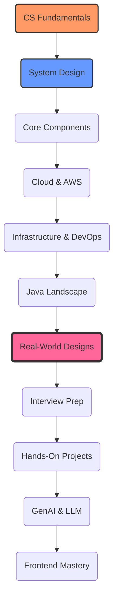

# 🏗️ System Design & Architecture Learning

> A comprehensive guide to becoming a System Architect

---

## 📚 Learning Path

<table>
<tr>
<th>1. CS Fundamentals</th>
<th>2. System Design</th>
<th>3. Core Components</th>
</tr>
<tr>
<td valign="top">

 <b>Master the core pillars:</b> <ul><li>💻 <a href="./cs-fundamentals/operating-system-guide.md">Operating Systems</a></li><li>🌐 <a href="./cs-fundamentals/networking-fundamentals.md">Networking</a></li><li>🗄️ <a href="./cs-fundamentals/dbms/00-roadmap.md">DBMS Masterclass</a> ⭐</li><li>🛠️ <a href="./cs-fundamentals/compiler-design.md">Compiler Design</a> 🆕</li></ul></td>
<td valign="top">

 <b>Build your foundation:</b> <ul><li>📐 <a href="./fundamentals/01-system-design-basics.md">Basics</a></li><li>⚖️ <a href="./fundamentals/02-cap-theorem.md">CAP Theorem</a></li><li>🚀 <a href="./fundamentals/03-scalability-patterns.md">Scalability</a></li><li>🗄️ <a href="./fundamentals/03b-dbms-fundamentals.md">DBMS Fundamentals</a> ⭐</li><li>📊 <a href="./fundamentals/03c-database-modeling.md">Database Modeling</a> ⭐</li><li>🔗 <a href="./fundamentals/03d-spring-jpa-hibernate.md">JPA & Hibernate</a></li><li>📝 <a href="./fundamentals/03e-sql-interview-queries.md">SQL Interview Queries</a></li><li>🏛️ <a href="./fundamentals/09-clean-hexagonal-architecture.md">Clean & Hexagonal Architecture</a> ⭐🆕</li></ul></td>
<td valign="top">

 <b>Essential building blocks:</b> <ul><li>🏗️ <a href="./components/overview.md">Components Overview</a> ⭐</li><li>🔍 <a href="./components/search/README.md">Elasticsearch Suite</a> ⭐🆕 &nbsp;&nbsp;└ <a href="./components/search/elasticsearch-deep-dive.md">Hub</a> | <a href="./components/search/elasticsearch-research.md">Research</a> | <a href="./components/search/elasticsearch-internals-architecture.md">Internals</a></li><li>📨 <a href="./components/messaging/README.md">Kafka Suite</a> ⭐🆕 &nbsp;&nbsp;└ <a href="./components/messaging/kafka-deep-dive.md">Hub</a> | <a href="./components/messaging/kafka-fundamentals.md">Fundamentals</a> | <a href="./components/messaging/kafka-internals-architecture.md">Internals</a></li><li>🐘 <a href="./fundamentals/04-postgresql-guide.md">PostgreSQL</a></li><li>🐬 <a href="./fundamentals/05-mysql-indexing-sharding-partitioning.md">MySQL</a></li><li>🍃 <a href="./fundamentals/06-mongodb-deep-dive.md">MongoDB</a></li><li>⚡ <a href="./fundamentals/06b-dynamodb-deep-dive.md">DynamoDB</a></li><li>� <a href="./fundamentals/07-oracle-deep-dive.md">Oracle</a></li><li>📡 <a href="./fundamentals/08-event-driven-architecture.md">Event-Driven Architecture</a></li></ul></td>
</tr>
<tr>
<th>4. Cloud & AWS</th>
<th>5. Infrastructure & DevOps</th>
<th>6. Java Landscape</th>
</tr>
<tr>
<td valign="top">

 <b>Master cloud services:</b> <ul><li>☁️ <a href="./aws/aws-services-guide.md">AWS Services</a> ⭐</li><li>📝 <a href="./aws/developer-associate-exam-guide.md">Dev Associate Exam</a> ⭐🆕</li><li>📅 <a href="./aws/aws-developer-study-plan.md">10-Day Study Plan</a> ⭐🆕</li><li>🛠️ <a href="./aws/aws-cdk-guide.md">AWS CDK</a></li></ul></td>
<td valign="top">

 <b>Container & Deployment:</b> <ul><li>🐳 <a href="./devops/docker-guide.md">Docker</a> ⭐</li><li>☸️ <a href="./devops/kubernetes-guide.md">Kubernetes</a> ⭐</li><li>🌍 <a href="./devops/terraform/README.md">Terraform</a> ⭐</li><li>🏭 <a href="./devops/terraform/real-world-project.md">Prod Architecture</a></li></ul></td>
<td valign="top">

 <b>Modern Java Dev:</b> <ul><li>☕ <a href="./java/modern-features-guide.md">Java 8-21 Features</a></li><li>🍃 <a href="./java/spring/spring-boot-guide.md">Spring Boot</a> ⭐</li><li>🎤 <a href="./java/interview-questions.md">Interview Qs</a></li></ul></td>
</tr>
<tr>
<th>7. Low-Level Design (LLD)</th>
<th>8. Real-World Designs</th>
<th>9. Interview Prep Hub</th>
</tr>
<tr>
<td valign="top">

 <b>OOD & Machine Coding:</b> <ul><li>🗺️ <a href="./lld/00-lld-interview-roadmap.md">Roadmap</a> ⭐</li><li>📦 <a href="./lld/01-ood-fundamentals.md">OOD Fundamentals</a></li><li>🧱 <a href="./lld/02-solid-principles.md">SOLID Principles</a> ⭐</li><li>🎨 <a href="./lld/03-design-patterns/00-patterns-overview.md">Design Patterns</a></li><li>🅿️ <a href="./lld/04-common-designs/01-parking-lot.md">Parking Lot</a> ⭐</li><li>🛗 <a href="./lld/04-common-designs/02-elevator-system.md">Elevator</a> ⭐</li><li>🎬 <a href="./lld/04-common-designs/03-movie-ticket-booking.md">Movie Ticket</a> ⭐</li><li>🥤 <a href="./lld/04-common-designs/04-vending-machine.md">Vending Machine</a></li><li>♟️ <a href="./lld/04-common-designs/05-chess-game.md">Chess Game</a></li><li>💸 <a href="./lld/04-common-designs/06-expense-splitter.md">Expense Splitter</a></li><li>📚 <a href="./lld/04-common-designs/07-library-management.md">Library Management</a></li><li>🏧 <a href="./lld/04-common-designs/08-atm-machine.md">ATM Machine</a></li><li>❌ <a href="./lld/04-common-designs/09-tic-tac-toe.md">Tic-Tac-Toe</a></li><li>🎲 <a href="./lld/04-common-designs/10-snake-ladder.md">Snake & Ladder</a></li><li>❓ <a href="./lld/05-interview-qa.md">Interview Q&A</a> ⭐</li></ul></td>
<td valign="top">

 <b>Architectural Case Studies:</b> <ul><li>🗺️ <a href="./interview-prep/system-design-examples/00-interview-roadmap.md">Interview Roadmap</a></li><li>📺 <a href="./interview-prep/system-design-examples/01-ott-platform.md">OTT Platform</a> ⭐</li><li>🐦 <a href="./interview-prep/system-design-examples/02-twitter.md">Twitter/X</a> ⭐</li><li>🚕 <a href="./interview-prep/system-design-examples/03-uber.md">Uber</a> ⭐</li><li>💬 <a href="./interview-prep/system-design-examples/04-whatsapp.md">WhatsApp</a> ⭐</li><li>🍿 <a href="./interview-prep/system-design-examples/05-netflix/01-system-design-interview.md">Netflix</a> ⭐</li><li>🔗 <a href="./interview-prep/system-design-examples/06-url-shortener.md">URL Shortener</a> ⭐</li><li>🚦 <a href="./interview-prep/system-design-examples/07-rate-limiter.md">Rate Limiter</a> ⭐</li><li>🆔 <a href="./interview-prep/system-design-examples/08-unique-id-generator.md">Unique ID Generator</a> ⭐</li><li>🕷️ <a href="./interview-prep/system-design-examples/09-web-crawler.md">Web Crawler</a> ⭐</li><li>🔔 <a href="./interview-prep/system-design-examples/10-notification-system.md">Notification System</a> ⭐</li><li>🛒 <a href="./interview-prep/system-design-examples/11-amazon-ecommerce/01-system-design-interview.md">Amazon E-commerce</a> ⭐🆕 &nbsp;&nbsp;└ <a href="./interview-prep/system-design-examples/11-amazon-ecommerce/02-architecture-deep-dive.md">Architecture Deep Dive</a></li><li>📍 <a href="./interview-prep/system-design-examples/12-location-based-service.md">Location Based Service</a> ⭐</li><li>📝 <a href="./interview-prep/system-design-examples/13-google-docs.md">Google Docs</a> ⭐</li><li>🔑 <a href="./interview-prep/system-design-examples/14-key-value-store.md">Key-Value Store</a> ⭐</li><li>⚡ <a href="./interview-prep/system-design-examples/15-distributed-cache.md">Distributed Cache</a> ⭐</li><li>☁️ <a href="./interview-prep/system-design-examples/16-cloud-storage.md">Cloud Storage</a> ⭐</li><li>🏆 <a href="./interview-prep/system-design-examples/17-gaming-leaderboard.md">Gaming Leaderboard</a> ⭐</li><li>🎮 <a href="./interview-prep/system-design-examples/18-multiplayer-game-state.md">Multiplayer Game State</a> ⭐</li><li>📉 <a href="./interview-prep/system-design-examples/19-stock-exchange.md">Stock Exchange</a> ⭐</li><li>📘 <a href="./interview-prep/system-design-examples/20-facebook/01-system-design-interview.md">Facebook</a> ⭐🆕 &nbsp;&nbsp;└ <a href="./interview-prep/system-design-examples/20-facebook/02-architecture-deep-dive.md">Architecture Deep Dive</a></li><li>📸 <a href="./interview-prep/system-design-examples/21-instagram/01-system-design-interview.md">Instagram</a> ⭐🆕 &nbsp;&nbsp;└ <a href="./interview-prep/system-design-examples/21-instagram/02-architecture-deep-dive.md">Architecture Deep Dive</a></li><li>🍕 <a href="./interview-prep/system-design-examples/22-swiggy-zomato.md">Swiggy/Zomato</a> ⭐🆕</li><li>🎬 <a href="./interview-prep/system-design-examples/23-bookmyshow.md">BookMyShow</a> ⭐🆕</li></ul></td>
<td valign="top">

 <b>Companies by Region:</b> <ul><li>🇦🇺 <a href="./interview-prep/companies/australia/">Australia</a> (ANZ, NAB, REA)</li><li>🇮🇳 <a href="./interview-prep/companies/india/top-gurugram-companies.md">India (Gurugram)</a> ⭐</li><li>🇦🇪 <a href="./interview-prep/companies/uae/">UAE (Dubai)</a> ⭐</li><li>🏦 <a href="./interview-prep/companies/barclays-interview-prep/README.md">Barclays (Pune/Gurugram)</a> 🆕</li></ul><b>DSA Resources:</b> <ul><li>📋 <a href="./interview-prep/dsa/00-cheatsheet.md">Cheatsheet</a> ⭐</li><li>☕ <a href="./interview-prep/dsa/01-java-collections.md">Java Collections</a></li><li>📊 <a href="./interview-prep/dsa/02-dynamic-programming.md">Dynamic Programming</a></li><li>🕸️ <a href="./interview-prep/dsa/03-graph-algorithms.md">Graph Algorithms</a></li><li>🏢 <a href="./interview-prep/dsa/04-company-problems.md">Company Problems</a></li></ul></td>
</tr>
<tr>
<th>10. Hands-On Projects</th>
<th>11. GenAI & LLM 🆕</th>
<th>12. Frontend Mastery 🆕</th>
</tr>
<tr>
<td valign="top">

 <b>Practical Learning:</b> <ul><li>📨 <a href="./projects/kafka-learning-project/README.md">Kafka Learning Project</a> ⭐</li><li>🤖 <a href="./projects/llm-finetuning-project/README.md">LLM Fine-Tuning</a></li><li>🔌 <a href="./projects/mcp-server-project/README.md">MCP Server Project</a></li><li>📚 <a href="./projects/rag-api-project/README.md">RAG API Project</a> ⭐</li></ul></td>
<td valign="top">

 <b>AI/ML Engineering:</b> <ul><li>🧠 <a href="./components/genai/ml-fundamentals.md">ML & DL Fundamentals</a> ⭐</li><li>🧠 <a href="./components/genai/genai-fundamentals.md">GenAI Fundamentals</a></li><li>📚 <a href="./components/genai/rag-deep-dive.md">RAG Deep Dive</a> ⭐</li><li>🤖 <a href="./components/genai/agentic-ai-guide.md">Agentic AI</a> ⭐</li><li>⚡ <a href="./components/genai/fastapi-guide.md">FastAPI for GenAI</a></li><li>☁️ <a href="./components/genai/aws-genai-mlops.md">AWS GenAI/MLOps</a></li></ul></td>
<td valign="top">

 <b>Frontend Mastery:</b> <ul><li>📜 <a href="./java/javascript-es6-guide.md">JS ES6+ Complete</a> ⭐</li><li>📘 <a href="./java/typescript-guide.md">TypeScript Mastery</a> ⭐</li><li>⚛️ <a href="./java/react-guide.md">React.js Guide</a> ⭐</li><li>🅰️ <a href="./java/angular-guide.md">Angular Guide</a></li></ul></td>
</tr>
</table>

---

## 🚀 Career Growth & Architecture Leadership 🆕

<table>
<tr>
    <td width="30%">
         

            <h3>Technical Architect Roadmap (2026 Edition)</h3>
            
Master the transition from Senior Engineer to Architect in the era of AI & Platforms.

        

    </td>
    <td width="70%">
        <b>What's Inside:</b>
        <ul>
            <li>🤖 <b>AI Agentic Architecture</b>: Orchestrating multi-agent systems & MCP.</li>
            <li>🏗️ <b>Platform Engineering</b>: Building IDPs & Golden Paths.</li>
            <li>🌿 <b>Sustainability</b>: GreenOps & Cost Engineering.</li>
            <li>🧠 <b>Hard Lessons</b>: Wisdom from the trenches to avoid anti-patterns.</li>
        </ul>
         
        👉 <a href="./career-growth/technical-architect-roadmap.md"><b>Read the Full Roadmap</b></a>
    </td>
</tr>
<tr>
    <td width="30%">
         

            <h3>🧠 AI/ML Leadership Roadmap 🆕</h3>
            
Prepare for Director/Head of AI Engineering roles with a 12-week structured plan.

        

    </td>
    <td width="70%">
        <b>What's Inside:</b>
        <ul>
            <li>🤖 <b>Generative AI & LLMs</b>: RAG, Fine-tuning, Agentic AI, MCP.</li>
            <li>📊 <b>ML Engineering</b>: PyTorch, Hugging Face, LangChain.</li>
            <li>⚙️ <b>LLMOps</b>: Production deployment, monitoring, governance.</li>
            <li>🎯 <b>Interview Prep</b>: Technical & leadership question bank.</li>
        </ul>
         
        👉 <a href="./career-growth/ai-ml-leadership-roadmap.md"><b>Start Your AI Journey</b></a>
    </td>
</tr>
</table>

---

## 🎯 How to Use This Repository

| Step | Topic | Focus |
| :---: | :--- | :--- |
| 0️⃣ | [**CS Fundamentals**](./cs-fundamentals/) | OS, Networking, DBMS, Compiler Design |
| 1️⃣ | [**System Design Basics**](./fundamentals/01-system-design-basics.md) | Core concepts, CAP, Scalability |
| 2️⃣ | [**Core Components**](./components/overview.md) | Load balancers, Caching, Queues |
| 3️⃣ | [**Cloud & AWS**](./aws/aws-services-guide.md) | S3, Lambda, ECS, VPC |
| 4️⃣ | [**DevOps**](./devops/) | Docker, Kubernetes, Terraform |
| 5️⃣ | [**Java Landscape**](./java/modern-features-guide.md) | Modern features, Spring Boot |
| 6️⃣ | [**DSA Resources**](./interview-prep/dsa/00-cheatsheet.md) | Patterns, LeetCode problems |
| 7️⃣ | [**Low-Level Design (LLD)**](./lld/00-lld-interview-roadmap.md) | OOP, SOLID, Design Patterns |
| 8️⃣ | [**Real-World Designs**](./designs/00-interview-roadmap.md) | Real-world case studies |
| 9️⃣ | [**Interview Prep Hub**](./interview-prep/) | Company-specific preparation |
| 🔟 | [**Hands-On Projects**](./projects/) | Kafka, RAG API, LLM Fine-tuning |
| 1️⃣1️⃣ | [**GenAI & LLM**](./components/genai/genai-fundamentals.md) | ML/DL, RAG, Fine-tuning, Agentic AI |
| 1️⃣2️⃣ | [**Frontend Mastery**](./java/javascript-es6-guide.md) | JS ES6+, TypeScript, React, Angular |

  
  
  
  
  

  

  

---

  <h3>🤝 Let's Connect!</h3>
  

    
  

  <i>Happy Learning! 🚀</i>

