# Chapter 1: Introduction to Building AI Applications with Foundation Models

> *"AI Engineering is distinct from traditional ML Engineering"*

---

## 🎯 Core Concepts

### AI Engineering vs. ML Engineering

| Aspect | Traditional ML Engineering | AI Engineering |
| :--- | :--- | :--- |
| **Data** | Tabular data, feature engineering | Text/multimodal, context construction |
| **Models** | Train from scratch | Adapt pre-trained foundation models |
| **Key Skills** | Feature engineering, model training | Prompt engineering, RAG, finetuning |
| **Annotations** | Extensive labeling | Fewer manual labels needed |
| **Iteration** | Retrain models | Update prompts, context, or finetune |
| **Evaluation** | Static metrics (AUC, F1) | Open-ended, AI-as-a-judge |

### What is a Foundation Model?

```mermaid
flowchart TD
    FM["🧠 Foundation Model"] --> LLM["LLM<br/>Large Language Model"]
    FM --> LMM["LMM<br/>Large Multimodal Model"]

    LLM --> GPT["GPT-4, Claude, Gemini"]
    LLM --> OS["Llama, Mistral, Qwen"]

    LMM --> Vision["GPT-4V, Gemini Pro Vision"]
    LMM --> Audio["Whisper, Gemini Audio"]

    style FM fill:#1a73e8,color:white
    style LLM fill:#4285f4,color:white
    style LMM fill:#34a853,color:white
```

- A **large pre-trained model** that can be adapted to many tasks
- Trained on massive datasets, they develop emergent capabilities
- The shift: from **"build models"** to **"adapt models"**

### The AI Engineering Stack

### Building a Defensible AI Product

> **Key Takeaway:** The model itself is rarely the competitive advantage — everyone has access to GPT-4 and open-source models. Your moat is in **data**, **evaluation**, and **workflow integration**.

---

## 📝 My Notes

<!-- Add your own notes, insights, and questions as you read -->

---

## ❓ Questions to Reflect On

1. How does the shift from "build models" to "adapt models" change the required skill set?
2. What makes an AI product defensible when everyone has access to the same foundation models?
3. Where does your current expertise fit in the AI Engineering Stack?
4. What are the trade-offs between using commercial APIs vs open-source models?

---

## 🔗 Key Takeaways

<!-- Summarize the most important 3-5 points after reading -->

1. 
2. 
3. 

---

## 🛠️ Practice Ideas

- [ ] Map out an AI application idea using the AI Engineering Stack
- [ ] Compare 2-3 foundation model providers (pricing, capabilities, trade-offs)
- [ ] Identify which layer of the stack you want to focus on first

---

[🏠 Home](./README.md) | [Next Chapter ➡️](./chapter-02-foundation-models.md)

