# Chapter 2: Understanding Foundation Models

> *Demystifying the core components that define a model's capabilities and limitations*

---

## 🎯 Core Concepts

### How Language Models Work

| Architecture | How It Works | Examples | Best For |
| :--- | :--- | :--- | :--- |
| **Autoregressive** | Predict next token L→R | GPT-4, Llama, Claude | Text generation, chat |
| **Masked** | Predict masked tokens | BERT, RoBERTa | Embeddings, classification |
| **Seq2Seq** | Encoder → Decoder | T5, BART | Translation, summarization |

### Tokenization — How Models See Text

- Models don't see text — they see **tokens** (subword units)
- **BPE (Byte-Pair Encoding)**: Most common tokenization approach
- Token limits affect **context window** size and costs
- Different languages have different token efficiency (English is cheaper per word than most)

### The Transformer Architecture

```mermaid
flowchart TB
    Input["Input Tokens"] --> PE["Positional Encoding"]
    PE --> SA["🔗 Self-Attention<br/>'Which tokens should<br/>attend to which?'"]
    SA --> FF["⚡ Feed-Forward Network<br/>'Process each position'"]
    FF --> LN["Layer Norm + Residual"]
    LN --> |"Repeat N layers"| SA2["🔗 Self-Attention"]
    SA2 --> FF2["⚡ Feed-Forward"]
    FF2 --> Output["Output Probabilities"]

    style SA fill:#e8eaf6,stroke:#3f51b5
    style FF fill:#e3f2fd,stroke:#2196f3
    style Output fill:#c8e6c9,stroke:#388e3c
```

**Self-Attention** is the key innovation — it lets each token "look at" every other token to understand context and relationships.

### How Models Generate Responses

### Generation Parameters

| Parameter | What It Does | Low Value | High Value |
| :--- | :--- | :--- | :--- |
| **Temperature** | Controls randomness | Deterministic, focused | Creative, diverse |
| **Top-p** | Nucleus sampling cutoff | Conservative (0.1) | Broad (0.95) |
| **Top-k** | Limits candidate tokens | Focused (5) | Diverse (100) |
| **Max Tokens** | Output length limit | Short answers | Long-form generation |
| **Stop Sequences** | When to stop generating | — | `\n`, `###`, custom |

### Capabilities & Limitations

```mermaid
flowchart LR
    subgraph CAN["✅ Capabilities"]
        direction TB
        C1["Language understanding"]
        C2["Reasoning (with prompting)"]
        C3["Code generation"]
        C4["Multilingual support"]
        C5["Instruction following"]
    end

    subgraph CANT["❌ Limitations"]
        direction TB
        L1["Hallucinations"]
        L2["Unreliable math/logic"]
        L3["No real-time information"]
        L4["Uneven language quality"]
        L5["Prompt sensitivity"]
    end

    style CAN fill:#c8e6c9,stroke:#388e3c
    style CANT fill:#ffcdd2,stroke:#c62828
```

### Types of Models — Evolution Pipeline

---

## 📝 My Notes

<!-- Add your own notes, insights, and questions as you read -->

---

## ❓ Questions to Reflect On

1. How does tokenization affect multilingual applications?
2. What are the practical implications of context window sizes?
3. How do scaling laws inform the decision between small vs. large models?
4. What's the trade-off between using base models vs. instruction-tuned models?

---

## 🔗 Key Takeaways

1. 
2. 
3. 

---

## 🛠️ Practice Ideas

- [ ] Compare tokenization of the same sentence across different models
- [ ] Experiment with temperature and sampling parameters on the same prompt
- [ ] Try using a base model vs. an instruction-tuned model and compare outputs

---

[⬅️ Previous Chapter](./chapter-01-introduction.md) | [🏠 Home](./README.md) | [Next Chapter ➡️](./chapter-03-evaluation-methodology.md)

