# Chapter 3: Evaluation Methodology

> *"If you can't measure it, you can't improve it" — Evaluation is the backbone of AI engineering*

---

## 🎯 Core Concepts

### Why Evaluation is Critical

```mermaid
flowchart LR
    NoEval["❌ No Evaluation"] --> Blind["Flying blind"]
    Blind --> Ship["Ship broken features"]
    Ship --> Users["Users lose trust"]

    HasEval["✅ Strong Evaluation"] --> Measure["Measure quality"]
    Measure --> Iterate["Fast iteration"]
    Iterate --> Improve["Continuous improvement"]

    style NoEval fill:#ffcdd2,stroke:#c62828
    style HasEval fill:#c8e6c9,stroke:#388e3c
```

- AI failures can be **catastrophic** in production (hallucinations, bias, safety)
- Unlike traditional software, AI outputs are **non-deterministic**
- Without proper evaluation, you're flying blind during development

### Types of Evaluation

```mermaid
flowchart TD
    Eval["Evaluation Approaches"] --> Auto["🤖 Automated"]
    Eval --> Human["👤 Human"]
    Eval --> AIJ["🧑‍⚖️ AI-as-a-Judge"]

    Auto --> Exact["Exact Match"]
    Auto --> Sim["Similarity<br/>BLEU, ROUGE, BERTScore"]
    Auto --> Class["Classification<br/>Accuracy, F1"]

    Human --> Likert["Likert Scale<br/>(1-5 ratings)"]
    Human --> Pair["Pairwise<br/>('A or B is better')"]
    Human --> Task["Task Completion<br/>('Did it succeed?')"]

    AIJ --> Rubric["Rubric-Based<br/>Scoring"]
    AIJ --> Ref["Reference-Based<br/>Comparison"]
    AIJ --> Open["Open-Ended<br/>Quality Assessment"]

    style Auto fill:#e3f2fd,stroke:#1976d2
    style Human fill:#fff3e0,stroke:#ff9800
    style AIJ fill:#e8eaf6,stroke:#3f51b5
```

| Type | Description | Cost | Scale | Accuracy |
| :--- | :--- | :---: | :---: | :---: |
| **Exact Match** | Output must match exactly | 💰 | ⭐⭐⭐⭐⭐ | High (for narrow tasks) |
| **Similarity (BLEU, ROUGE)** | Semantic similarity scoring | 💰 | ⭐⭐⭐⭐⭐ | Medium |
| **Human Evaluation** | Human judges rate quality | 💰💰💰 | ⭐ | High |
| **AI-as-a-Judge** | Use another AI to evaluate | 💰💰 | ⭐⭐⭐⭐ | Medium-High |

### AI-as-a-Judge — Deep Dive

**Advantages:** Scalable, cheaper than human evaluators, fast iteration

**Known Biases to Watch:**

```mermaid
flowchart LR
    subgraph BIASES["⚠️ AI Judge Biases"]
        direction TB
        B1["📍 Position Bias<br/>Prefers first/last option"]
        B2["📏 Verbosity Bias<br/>Longer = better"]
        B3["🪞 Self-Enhancement<br/>Prefers own outputs"]
        B4["❓ Criteria Ambiguity<br/>Vague rubric → inconsistent"]
    end

    subgraph FIXES["✅ Mitigations"]
        direction TB
        F1["Randomize presentation order"]
        F2["Penalize unnecessary length"]
        F3["Use different judge model"]
        F4["Write rubrics with examples"]
    end

    B1 --> F1
    B2 --> F2
    B3 --> F3
    B4 --> F4

    style BIASES fill:#fff3e0,stroke:#ff9800
    style FIXES fill:#c8e6c9,stroke:#388e3c
```

### Choosing the Right Metrics

---

## 📝 My Notes

<!-- Add your own notes, insights, and questions as you read -->

---

## ❓ Questions to Reflect On

1. When is AI-as-a-Judge appropriate vs. when do you need human evaluation?
2. How do you create clear, unambiguous evaluation rubrics?
3. What metrics matter most for your specific use case?
4. How do you balance evaluation thoroughness with iteration speed?

---

## 🔗 Key Takeaways

1. 
2. 
3. 

---

## 🛠️ Practice Ideas

- [ ] Design an evaluation rubric for a specific AI task (e.g., summarization)
- [ ] Implement AI-as-a-Judge using a strong model to evaluate a weaker one
- [ ] Compare AI-judge ratings with your own human ratings on 20 examples

---

[⬅️ Previous Chapter](./chapter-02-foundation-models.md) | [🏠 Home](./README.md) | [Next Chapter ➡️](./chapter-04-evaluating-ai-systems.md)

