# Chapter 4: Evaluating AI Systems

> *Designing robust evaluation pipelines for production AI*

---

## 🎯 Core Concepts

### System-Level vs. Component-Level Evaluation

```mermaid
flowchart TD
    subgraph SYSTEM["End-to-End System"]
        Input([User Input]) --> Retrieval["📄 Retrieval"]
        Retrieval --> Prompt["📝 Prompt Assembly"]
        Prompt --> Model["🤖 Model Inference"]
        Model --> Guard["🛡️ Guardrails"]
        Guard --> Output([Output to User])
    end

    E1["🔍 Eval: Retrieval<br/>Precision, Recall"] -.-> Retrieval
    E2["🔍 Eval: Prompt<br/>Does it elicit right behavior?"] -.-> Prompt
    E3["🔍 Eval: Model Output<br/>Quality, Safety"] -.-> Model
    E4["🔍 Eval: Guardrails<br/>Are harmful outputs filtered?"] -.-> Guard
    E5["🔍 Eval: End-to-End<br/>User satisfaction, task completion"] -.-> Output

    style SYSTEM fill:#f5f5f5,stroke:#9e9e9e
    style E5 fill:#c8e6c9,stroke:#388e3c
```

- **Component evaluation**: Test each piece in isolation
- **End-to-end evaluation**: Test the full pipeline together
- Both are necessary; failures can occur at any layer

### Designing an Evaluation Pipeline

```mermaid
flowchart LR
    Define["1️⃣ Define Criteria<br/>- Task spec<br/>- Quality dimensions<br/>- Rubrics"] --> Collect["2️⃣ Collect Test Data<br/>- Golden sets<br/>- Edge cases<br/>- Real user data"]
    Collect --> Score["3️⃣ Score & Analyze<br/>- Automated metrics<br/>- Human review<br/>- AI-as-a-judge"]
    Score --> Act["4️⃣ Act on Results<br/>- Fix failures<br/>- Update prompts<br/>- Add to eval set"]
    Act --> |"Repeat"| Define

    style Define fill:#e8eaf6,stroke:#3f51b5
    style Score fill:#e3f2fd,stroke:#2196f3
    style Act fill:#c8e6c9,stroke:#388e3c
```

### Building Test Sets

### What to Evaluate — Checklist

| Component | What to Check | Key Metrics |
| :--- | :--- | :--- |
| **Retrieval (RAG)** | Are the right docs returned? | Precision@K, Recall@K, MRR |
| **Prompt** | Does it trigger correct behavior? | Output quality across test set |
| **Model Output** | Quality, correctness, safety? | AI-judge score, human rating |
| **Guardrails** | Are harmful outputs filtered? | False positive/negative rate |
| **Full System** | Does it solve the user's problem? | Task completion rate, user satisfaction |

### Evaluation Guidelines Best Practices

```mermaid
flowchart TD
    subgraph GOOD["✅ Good Rubric"]
        direction TB
        G1["Specific: 'Extract all dates in YYYY-MM-DD format'"]
        G2["Examples: Show what 5/5 vs 1/5 looks like"]
        G3["Calibrated: Annotators agree > 80%"]
        G4["Versioned: Track changes over time"]
    end

    subgraph BAD["❌ Bad Rubric"]
        direction TB
        B1["Vague: 'Be helpful and accurate'"]
        B2["No examples: Left to interpretation"]
        B3["Uncalibrated: Each judge rates differently"]
        B4["Unversioned: Nobody knows what changed"]
    end

    style GOOD fill:#c8e6c9,stroke:#388e3c
    style BAD fill:#ffcdd2,stroke:#c62828
```

---

## 📝 My Notes

<!-- Add your own notes, insights, and questions as you read -->

---

## ❓ Questions to Reflect On

1. How do you decide which components need the most investment in evaluation?
2. What does your golden test set look like for your use case?
3. How often should you update your evaluation criteria?
4. How do you handle cases where evaluators disagree?

---

## 🔗 Key Takeaways

1. 
2. 
3. 

---

## 🛠️ Practice Ideas

- [ ] Create a golden test set (20+ examples) for an AI task
- [ ] Build an automated evaluation pipeline with scoring
- [ ] Design adversarial test cases to find failure modes

---

[⬅️ Previous Chapter](./chapter-03-evaluation-methodology.md) | [🏠 Home](./README.md) | [Next Chapter ➡️](./chapter-05-prompt-engineering.md)

