# Chapter 6: RAG and Agents

> *Extending model capabilities through retrieval and tool use*

---

## 🎯 Part 1: Retrieval-Augmented Generation (RAG)

### Why RAG?

```mermaid
flowchart LR
    subgraph WITHOUT["❌ Without RAG"]
        Q1["Q: What's our refund policy?"] --> A1["Model guesses or<br/>hallucinates an answer"]
    end

    subgraph WITH["✅ With RAG"]
        Q2["Q: What's our refund policy?"] --> R2["Retrieve: refund_policy.pdf"]
        R2 --> A2["Model answers from<br/>the actual document"]
    end

    style WITHOUT fill:#ffcdd2,stroke:#c62828
    style WITH fill:#c8e6c9,stroke:#388e3c
```

- Provides **fresh/proprietary information** beyond training data
- Reduces **hallucinations** by grounding responses in documents
- More **cost-effective** than finetuning for most knowledge tasks

### The Complete RAG Pipeline

```mermaid
flowchart TD
    subgraph OFFLINE["📥 Ingestion Pipeline (Offline)"]
        direction LR
        Docs["📁 Raw Documents"] --> Parse["🔧 Parse & Clean"]
        Parse --> Chunk["✂️ Chunk"]
        Chunk --> Embed["🔢 Embed"]
        Embed --> Store[("💾 Vector Store")]
    end

    subgraph ONLINE["🔍 Query Pipeline (Online)"]
        direction TB
        User(["👤 User Query"]) --> QT["🔄 Query Transform"]
        QT --> EQ["🔢 Embed Query"]
        EQ --> Retrieve["📥 Retrieve Top-K"]
        Store -.-> Retrieve
        Retrieve --> Rerank["⚖️ Rerank"]
        Rerank --> Augment["📝 Build Prompt:<br/>System + Context + Query"]
        Augment --> LLM["🤖 LLM"]
        LLM --> Answer(["✅ Cited Answer"])
    end

    OFFLINE --> ONLINE

    style Store fill:#e1bee7,stroke:#9c27b0
    style LLM fill:#bbdefb,stroke:#1976d2
    style Answer fill:#c8e6c9,stroke:#388e3c
```

### Chunking Strategies

| Strategy | Chunk Size | Overlap | Best For |
| :--- | :--- | :--- | :--- |
| **Fixed-size** | 256-512 tokens | 20-50 tokens | General-purpose, fast |
| **Sentence-based** | 3-5 sentences | 1 sentence | Conversational content |
| **Semantic** | Variable | Adaptive | Technical docs, code |
| **Recursive** | Hierarchical | Parent-child | Long docs with structure |
| **Document** | Full document | None | Short documents, FAQs |

### Retrieval Strategies

```mermaid
flowchart TD
    Query(["User Query"]) --> Dense["🔢 Dense Retrieval<br/>(Vector Similarity)"]
    Query --> Sparse["📝 Sparse Retrieval<br/>(BM25 / Keyword)"]

    Dense --> Hybrid["🔀 Hybrid: Combine Both"]
    Sparse --> Hybrid

    Hybrid --> Rerank["⚖️ Cross-Encoder Reranker<br/>(Cohere, BGE)"]
    Rerank --> TopK["📄 Final Top-K Documents"]

    style Hybrid fill:#e8eaf6,stroke:#3f51b5
    style Rerank fill:#fff3e0,stroke:#ff9800
```

### RAG Failure Modes & Fixes

| Failure | Symptom | Fix |
| :--- | :--- | :--- |
| **Bad retrieval** | Correct doc exists but isn't returned | Hybrid search, better embeddings, reranking |
| **Wrong chunk size** | Retrieved chunk misses key context | Increase chunk size or parent-child retrieval |
| **Stale data** | Answer is outdated | Scheduled re-indexing pipeline |
| **Hallucination despite context** | Model ignores retrieved docs | Stronger system prompt, lower temperature |
| **Too many irrelevant results** | Noisy context confuses model | Lower top-k, add reranking, better embeddings |

---

## 🎯 Part 2: Agents

### What is an Agent?

```mermaid
flowchart TD
    User(["👤 User Request"]) --> Plan["🧠 Planning<br/>Break down the task"]
    Plan --> Loop{"🔄 Reasoning Loop"}

    Loop --> Think["💭 Think<br/>What should I do next?"]
    Think --> Act["⚡ Act<br/>Call a tool"]
    Act --> Observe["👀 Observe<br/>Read the result"]
    Observe --> Done{"Task Complete?"}
    Done -- No --> Loop
    Done -- Yes --> Response(["✅ Final Response"])

    subgraph TOOLS["🧰 Available Tools"]
        Search["🔍 Search"]
        Code["💻 Code Exec"]
        API["🌐 APIs"]
        DB[("📊 Database")]
        Calc["🧮 Calculator"]
    end

    Act --> TOOLS

    style Plan fill:#e8eaf6,stroke:#3f51b5
    style Response fill:#c8e6c9,stroke:#388e3c
```

### Agent Patterns

```mermaid
flowchart LR
    subgraph REACT["ReAct"]
        direction TB
        R1["Think"] --> R2["Act"] --> R3["Observe"] --> R1
    end

    subgraph PLAN["Plan-then-Execute"]
        direction TB
        P1["Plan All Steps"] --> P2["Execute Step 1"] --> P3["Execute Step 2"] --> P4["..."]
    end

    subgraph MULTI["Multi-Agent"]
        direction TB
        M1["🔍 Researcher"] --> M2["💻 Coder"]
        M2 --> M3["📝 Reviewer"]
    end

    style REACT fill:#e3f2fd,stroke:#1976d2
    style PLAN fill:#fff3e0,stroke:#ff9800
    style MULTI fill:#e8f5e9,stroke:#4caf50
```

| Pattern | Description | Use Case | Reliability |
| :--- | :--- | :--- | :---: |
| **ReAct** | Think → Act → Observe loop | General tool-using agents | ⭐⭐⭐ |
| **Plan-then-Execute** | Plan all steps, then execute | Predictable workflows | ⭐⭐⭐⭐ |
| **Multi-Agent** | Specialized agents collaborate | Complex systems | ⭐⭐ |
| **Reflection** | Agent critiques own output | Code gen, writing | ⭐⭐⭐ |

> **💡 Real-World Tip:** Start with a deterministic pipeline. Only reach for agents when you genuinely need dynamic multi-step reasoning. Agents are powerful but hard to evaluate and debug.

---

## 📝 My Notes

<!-- Add your own notes, insights, and questions as you read -->

---

## ❓ Questions to Reflect On

1. When is RAG sufficient vs. when do you need finetuning?
2. How do you choose the right chunk size and overlap?
3. What makes agents reliable enough for production?
4. How do you handle agent failures gracefully?

---

## 🔗 Key Takeaways

1. 
2. 
3. 

---

## 🛠️ Practice Ideas

- [ ] Build a RAG pipeline with a small document set — measure retrieval quality
- [ ] Compare naive RAG vs. RAG with reranking on the same queries
- [ ] Build a simple agent with 2-3 tools (search, calculator, code exec)
- [ ] Evaluate agent performance: success rate, steps, cost analysis

---

[⬅️ Previous Chapter](./chapter-05-prompt-engineering.md) | [🏠 Home](./README.md) | [Next Chapter ➡️](./chapter-07-finetuning.md)

