# Chapter 8: Dataset Engineering

> *Data is the most underappreciated yet impactful part of AI engineering*

---

## 🎯 Core Concepts

### Why Dataset Engineering Matters

> **"Garbage in, garbage out"** applies even more with foundation models.

### Data Quality Pyramid

```mermaid
flowchart BT
    Acc["🎯 Accuracy<br/>Is the data correct?"]
    Comp["📦 Completeness<br/>Are all cases covered?"]
    Con["🔄 Consistency<br/>Are labels uniform?"]
    Div["🌍 Diversity<br/>Does it cover edge cases?"]
    Fresh["🕐 Freshness<br/>Is it up to date?"]
    Unique["🔢 Uniqueness<br/>Are duplicates removed?"]

    Acc --> Comp --> Con --> Div --> Fresh --> Unique

    style Acc fill:#4CAF50,color:white
    style Unique fill:#2196F3,color:white
```

### Data for Different Purposes

```mermaid
flowchart TD
    Purpose["What's the data for?"] --> RAG_KB["📚 RAG Knowledge Base"]
    Purpose --> FT_Data["🎯 Finetuning"]
    Purpose --> Eval_Data["🧪 Evaluation"]
    Purpose --> PT_Data["📊 Pre-training"]

    RAG_KB --> RAG_Req["Accurate, up-to-date,<br/>deduplicated documents"]
    FT_Data --> FT_Req["High-quality instruction-<br/>response pairs (500-10K)"]
    Eval_Data --> Eval_Req["Curated test cases<br/>with expected outputs (200+)"]
    PT_Data --> PT_Req["Large text corpora<br/>filtered for quality"]

    style RAG_KB fill:#e8eaf6,stroke:#3f51b5
    style FT_Data fill:#fff3e0,stroke:#ff9800
    style Eval_Data fill:#e8f5e9,stroke:#4caf50
    style PT_Data fill:#fce4ec,stroke:#e91e63
```

### How Much Data Do You Need?

| Use Case | Minimum | Sweet Spot | Notes |
| :--- | :---: | :---: | :--- |
| **LoRA Finetuning** | 200 | 1K-10K | Quality > Quantity always |
| **Full Finetuning** | 5K | 50K-500K | Needs diverse coverage |
| **RAG Knowledge Base** | 10 docs | Thousands | Depends on domain breadth |
| **Evaluation Test Set** | 50 | 200-500 | Must cover edge cases |
| **Few-Shot Examples** | 2 | 3-5 | Best diverse, representative |

### Data Collection Strategies

### Synthetic Data Pipeline

```mermaid
flowchart LR
    Seed["🌱 Seed Examples<br/>(50-100 human-written)"] --> Strong["🤖 Strong Model<br/>(GPT-4 / Claude)"]
    Strong --> Gen["📄 Generate 10x<br/>more examples"]
    Gen --> Filter["🔍 Filter & QA"]
    Filter --> Human["👤 Human reviews<br/>~20% sample"]
    Human --> Train["🎯 Use for Training"]

    style Seed fill:#fff3e0,stroke:#ff9800
    style Train fill:#c8e6c9,stroke:#388e3c
```

**Synthetic Data Techniques:**

| Technique | Description | Risk |
| :--- | :--- | :--- |
| **Distillation** | Strong model generates data for weak model | License restrictions |
| **Self-Instruct** | Model generates its own instruction data | Echo chamber effect |
| **Evol-Instruct** | Progressively increase instruction complexity | Quality degradation at extremes |
| **Backtranslation** | Translate data through another language and back | Semantic drift |

> **⚠️ Warning:** Synthetic data can cause **model collapse** if models train recursively on their own output. Always mix synthetic with real data and validate quality rigorously.

### Data Labeling Best Practices

```mermaid
flowchart TD
    Guide["📋 Write Clear Guidelines<br/>with concrete examples"] --> Pilot["🧪 Pilot with 3+ Annotators<br/>on 50 examples"]
    Pilot --> IAA["📊 Measure Agreement<br/>(Cohen's Kappa > 0.7)"]
    IAA --> Refine["🔄 Refine Guidelines<br/>based on disagreements"]
    Refine --> Scale["📈 Scale Annotation<br/>with ongoing QA"]
    Scale --> Monitor["📉 Monitor Quality<br/>over time"]

    style Guide fill:#e8eaf6,stroke:#3f51b5
    style IAA fill:#fff3e0,stroke:#ff9800
```

---

## 📝 My Notes

<!-- Add your own notes, insights, and questions as you read -->

---

## ❓ Questions to Reflect On

1. What data do you have access to, and how would you assess its quality?
2. Is synthetic data appropriate for your use case? What are the risks?
3. How do you build a data flywheel — improving data from production usage?
4. How do you balance data quantity vs. quality given your constraints?

---

## 🔗 Key Takeaways

1. 
2. 
3. 

---

## 🛠️ Practice Ideas

- [ ] Audit a dataset: check for duplicates, quality, diversity, edge cases
- [ ] Generate synthetic data using a strong model, evaluate its quality
- [ ] Build annotation guidelines for a task and measure inter-annotator agreement
- [ ] Plot a data scaling curve: train with 100, 500, 1K, 5K examples and compare

---

[⬅️ Previous Chapter](./chapter-07-finetuning.md) | [🏠 Home](./README.md) | [Next Chapter ➡️](./chapter-09-inference-optimization.md)

