# Chapter 9: Inference Optimization

> *Making models faster, cheaper, and production-ready*

---

## 🎯 Core Concepts

### The Inference Problem

```mermaid
flowchart LR
    subgraph PROBLEM["The Two Enemies"]
        direction TB
        Latency["⏱️ LATENCY<br/>Users expect < 1s responses"]
        Cost["💸 COST<br/>At scale, inference dominates spend"]
    end

    Latency --> UX["Bad UX → users leave"]
    Cost --> Budget["Blows through budget"]

    style PROBLEM fill:#ffcdd2,stroke:#c62828
```

### Optimization Priority Ladder

```mermaid
flowchart TD
    subgraph QUICK["🥇 Quick Wins (Day 1)"]
        Cache["🗃️ Response Caching"]
        Smaller["📐 Right-size Model"]
        Tokens["✂️ Reduce Token Usage"]
    end

    subgraph MEDIUM["🥈 Medium Effort (Week 1)"]
        Quant["📊 Quantization"]
        Batch["📦 Batching"]
        Stream["🌊 Streaming"]
    end

    subgraph ADVANCED["🥉 Advanced (Month 1)"]
        Spec["🔮 Speculative Decoding"]
        Route["🔀 Model Routing"]
        KV["💾 KV-Cache / Prompt Caching"]
    end

    QUICK --> MEDIUM --> ADVANCED

    style QUICK fill:#c8e6c9,stroke:#388e3c
    style MEDIUM fill:#fff3e0,stroke:#ff9800
    style ADVANCED fill:#e8eaf6,stroke:#3f51b5
```

### Quantization — Precision Trade-offs

| Precision | Memory Savings | Speed Gain | Quality Loss | Best For |
| :--- | :---: | :---: | :---: | :--- |
| **FP32** | Baseline | Baseline | None | Research only |
| **FP16** | 50% | ~1.5x | Negligible | Default for serving |
| **INT8** | 75% | ~2x | <1% | Production serving |
| **INT4** | 87% | ~3x | 1-3% | Edge, cost-sensitive |

### Model Routing — The 80/20 Rule

```mermaid
flowchart LR
    Query(["User Query"]) --> Classifier{"🔀 Complexity<br/>Classifier"}
    Classifier -- "Easy (80%)" --> Small["Small Model<br/>Llama 3 8B<br/>💰 $0.10/1M tokens"]
    Classifier -- "Hard (20%)" --> Large["Large Model<br/>GPT-4o<br/>💰 $5.00/1M tokens"]
    Small --> Response(["Response"])
    Large --> Response

    style Small fill:#c8e6c9,stroke:#388e3c
    style Large fill:#ffcdd2,stroke:#c62828
```

> **💡 Real-World Tip:** Even a simple keyword-based classifier can route 60-80% of queries to a smaller model. You don't need a perfect classifier — even crude routing saves massive costs.

### Inference-Level Optimizations

```mermaid
flowchart TD
    subgraph KV_CACHE["💾 KV-Cache"]
        direction LR
        KC1["Cache attention key-values"]
        KC2["Avoid recomputation<br/>for previous tokens"]
    end

    subgraph BATCHING["📦 Continuous Batching"]
        direction LR
        CB1["Add new requests to<br/>in-progress batches"]
        CB2["Better GPU utilization"]
    end

    subgraph SPEC["🔮 Speculative Decoding"]
        direction LR
        SD1["Small model drafts tokens"]
        SD2["Large model verifies<br/>(2-3x speedup)"]
    end

    subgraph FLASH["⚡ Flash Attention"]
        direction LR
        FA1["Memory-efficient attention"]
        FA2["Less VRAM, faster"]
    end
```

### Choosing the Right Model Size

```mermaid
flowchart TD
    Task["What's your task<br/>complexity?"] --> Simple{"Simple?<br/>Classification,<br/>extraction"}
    Simple -- Yes --> S["✅ Small (1-8B)<br/>Cheap & fast"]
    Simple -- No --> Medium{"Medium?<br/>Summarization,<br/>Q&A"}
    Medium -- Yes --> M["✅ Medium (13-34B)<br/>Good balance"]
    Medium -- No --> Complex{"Complex?<br/>Reasoning,<br/>code gen"}
    Complex -- Yes --> L["✅ Large (70B+)<br/>Best quality"]
    Complex -- No --> API["✅ API provider<br/>(GPT-4, Claude)"]

    style S fill:#c8e6c9,stroke:#388e3c
    style M fill:#fff3e0,stroke:#ff9800
    style L fill:#ffcdd2,stroke:#c62828
```

### Cost Optimization Checklist

| Strategy | Impact | Effort |
| :--- | :---: | :---: |
| Cache common queries (exact + semantic) | 🔥🔥🔥 | Low |
| Right-size model (don't over-engineer) | 🔥🔥🔥 | Low |
| Reduce token usage (shorter prompts) | 🔥🔥 | Low |
| Model routing (cheap model for easy tasks) | 🔥🔥🔥 | Medium |
| Batch non-real-time requests | 🔥🔥 | Medium |
| Quantize self-hosted models | 🔥🔥 | Medium |
| Speculative decoding | 🔥 | High |

---

## 📝 My Notes

<!-- Add your own notes, insights, and questions as you read -->

---

## ❓ Questions to Reflect On

1. What's the acceptable latency for your application?
2. Where are the biggest cost bottlenecks in your inference pipeline?
3. Could a smaller, quantized model work for your use case?
4. How would you implement model routing (small model vs. large model)?

---

## 🔗 Key Takeaways

1. 
2. 
3. 

---

## 🛠️ Practice Ideas

- [ ] Benchmark latency: compare FP16 vs INT8 vs INT4 quantized model
- [ ] Implement response caching for a simple API
- [ ] Set up model routing: classifier → small model vs. large model
- [ ] Measure cost per query across different model providers

---

[⬅️ Previous Chapter](./chapter-08-dataset-engineering.md) | [🏠 Home](./README.md) | [Next Chapter ➡️](./chapter-10-architecture-feedback.md)

