# 🧠 AI Engineering — Quick Reference & Visual Guide

> A comprehensive, diagram-rich cheat sheet for building production AI applications.
> Based on **"AI Engineering"** by Chip Huyen (O'Reilly, 2025).

[🏠 Back to Study Guide](./README.md)

---

## Table of Contents

1. [AI Engineering Landscape](#1-the-ai-engineering-landscape)
2. [Foundation Models — How They Work](#2-foundation-models--how-they-work)
3. [Choosing an Adaptation Technique](#3-choosing-an-adaptation-technique)
4. [Prompt Engineering Playbook](#4-prompt-engineering-playbook)
5. [RAG — Deep Dive](#5-rag--retrieval-augmented-generation)
6. [Agents & Tool Use](#6-agents--tool-use)
7. [Finetuning Decision Framework](#7-finetuning-decision-framework)
8. [Dataset Engineering](#8-dataset-engineering)
9. [Evaluation — The Core Skill](#9-evaluation--the-core-skill)
10. [Inference Optimization](#10-inference-optimization)
11. [Production Architecture](#11-production-architecture--guardrails)
12. [Hallucination Mitigation](#12-hallucination-mitigation)
13. [The Feedback Flywheel](#13-the-feedback-flywheel)
14. [Golden Rules](#14-golden-rules-of-ai-engineering)

---

## 1. The AI Engineering Landscape

AI Engineering is **not** traditional ML engineering. Here's how they differ:


### AI Engineering vs. Traditional ML Engineering

| Dimension | Traditional ML Engineering | AI Engineering |
| :--- | :--- | :--- |
| **Data** | Tabular, structured, labeled | Text, images, code — unstructured |
| **Core Activity** | Feature engineering, model training | Prompt engineering, context construction |
| **Model Source** | Train from scratch | Adapt pre-trained foundation models |
| **Iteration Loop** | Retrain on new data | Update prompts, retrieval, or finetune |
| **Evaluation** | Static metrics (AUC, F1) | Open-ended quality, human/AI judge |
| **Deployment** | Model binary on server | API calls, or self-hosted inference |

> **Key Insight:** In AI engineering, the model itself is rarely the competitive advantage. Your moat is in **data quality**, **evaluation rigor**, **workflow integration**, and **feedback loops**.

---

## 2. Foundation Models — How They Work

### The Core Mechanism: Next-Token Prediction


The model predicts the **probability distribution** over the next token, then samples from it.

### Generation Parameters — Know These Cold

| Parameter | What It Does | Low Value | High Value |
| :--- | :--- | :--- | :--- |
| **Temperature** | Controls randomness | Deterministic, focused | Creative, diverse |
| **Top-p** | Nucleus sampling cutoff | Conservative (0.1) | Broad (0.95) |
| **Top-k** | Limits candidate tokens | Focused (5) | Diverse (100) |
| **Max Tokens** | Output length limit | Short answers | Long-form generation |
| **Stop Sequences** | When to stop generating | — | `\n`, `###`, custom |

> **💡 Real-World Tip:** For **factual tasks** (data extraction, classification): `temperature=0`. For **creative tasks** (brainstorming, writing): `temperature=0.7-1.0`.

### Model Taxonomy


---

## 3. Choosing an Adaptation Technique

This is the most important decision in AI engineering. Use this flowchart:

```mermaid
flowchart TD
    Start([Need to improve AI output?]) --> Q1{Does the model need<br/>external/fresh data?}
    Q1 -- Yes --> RAG[✅ Use RAG]
    Q1 -- No --> Q2{Is prompt engineering<br/>giving good results?}
    Q2 -- Yes --> PE[✅ Stick with Prompting]
    Q2 -- No --> Q3{Do you need the model<br/>to learn a new style,<br/>format, or domain?}
    Q3 -- Yes --> Q4{Do you have 500+<br/>high-quality examples?}
    Q4 -- Yes --> FT[✅ Finetune]
    Q4 -- No --> FS[✅ Try Few-Shot<br/>or Synthetic Data First]
    Q3 -- No --> Q5{Does the task need<br/>multi-step actions<br/>or external tools?}
    Q5 -- Yes --> Agent[✅ Build an Agent]
    Q5 -- No --> Debug[🔍 Debug your<br/>prompt & eval first]

    style RAG fill:#4CAF50,color:white
    style PE fill:#2196F3,color:white
    style FT fill:#FF9800,color:white
    style Agent fill:#9C27B0,color:white
```



### Comparison Matrix

| Technique | Cost | Effort | Latency | When to Use | When NOT to Use |
| :--- | :---: | :---: | :---: | :--- | :--- |
| **Zero-Shot** | 💰 | ⚡ | Fast | Simple tasks, strong models | Complex formatting |
| **Few-Shot** | 💰 | ⚡ | Medium | Specific formats, subtle patterns | Token-limited contexts |
| **RAG** | 💰💰 | 🔨🔨 | Medium | Fresh/proprietary data, fact-based Q&A | Small, static knowledge |
| **Agents** | 💰💰 | 🔨🔨🔨 | Slow | Multi-step tasks, tool use | Simple single-turn Q&A |
| **Finetuning** | 💰💰💰 | 🔨🔨🔨 | Fast | Style/format consistency, domain language | Rapid iteration, small data |

---

## 4. Prompt Engineering Playbook

### Prompt Anatomy

```mermaid
flowchart TD
    subgraph PROMPT["Complete Prompt Structure"]
        direction TB
        SP["🎭 System Prompt<br/>Role, rules, output format"]
        FS["📋 Few-Shot Examples<br/>Input → Output pairs"]
        CTX["📄 Context / Retrieved Data<br/>RAG docs, user history"]
        UQ["💬 User Query<br/>The actual request"]
    end
    SP --> FS --> CTX --> UQ

    style SP fill:#e8eaf6,stroke:#3f51b5
    style FS fill:#e3f2fd,stroke:#2196f3
    style CTX fill:#e8f5e9,stroke:#4caf50
    style UQ fill:#fff3e0,stroke:#ff9800
```



### Techniques at a Glance

| Technique | How It Works | Best For | Example Trigger |
| :--- | :--- | :--- | :--- |
| **Zero-Shot** | Direct instruction only | Simple, well-defined tasks | "Classify this email as spam or not spam" |
| **Few-Shot** | Provide 2-5 examples | Output formatting, edge cases | "Here are 3 examples..." |
| **Chain-of-Thought** | Force step-by-step reasoning | Math, logic, complex reasoning | "Let's think step by step" |
| **Self-Consistency** | Multiple CoT paths → majority vote | High-stakes reasoning | Generate 5 answers, pick consensus |
| **ReAct** | Reasoning + Action interleaved | Agents with tools | "Thought → Action → Observation" |
| **Decomposition** | Break into sub-problems | Complex multi-part tasks | "First do X, then Y, then Z" |

### ⚠️ Prompt Engineering Anti-Patterns

| ❌ Don't Do This | ✅ Do This Instead |
| :--- | :--- |
| "Be helpful and accurate" (vague) | "Extract all dates in YYYY-MM-DD format" (specific) |
| Mixing instructions with data | Use XML tags or delimiters to separate: `<context>...</context>` |
| One mega-prompt for everything | Break into specialized prompts per task |
| Assuming the model remembers context | Explicitly include all relevant context every time |
| Never testing edge cases | Build a test set of 50+ diverse inputs |

---

## 5. RAG — Retrieval-Augmented Generation

### The Complete RAG Pipeline


### Chunking Strategies

| Strategy | Chunk Size | Overlap | Best For |
| :--- | :--- | :--- | :--- |
| **Fixed-size** | 256-512 tokens | 20-50 tokens | General-purpose, fast |
| **Sentence-based** | 3-5 sentences | 1 sentence | Conversational content |
| **Semantic** | Variable | Adaptive | Technical docs, code |
| **Recursive** | Hierarchical | Parent-child | Long docs with structure |

### RAG Failure Modes & Fixes

| Failure | Symptom | Fix |
| :--- | :--- | :--- |
| **Bad retrieval** | Correct doc exists but isn't returned | Hybrid search (BM25 + vector), reranking |
| **Wrong chunk size** | Retrieved chunk misses key context | Increase chunk size or use parent-child retrieval |
| **Stale data** | Answer is outdated | Scheduled re-indexing pipeline |
| **Hallucination despite context** | Model ignores retrieved docs | Stronger system prompt: "Only answer from the context provided" |
| **Too many irrelevant results** | Noisy context confuses the model | Lower top-k, add reranking, improve embedding model |

> **💡 Real-World Tip:** The #1 failure point in RAG is **retrieval quality**, not the LLM. Before switching to a bigger model, try: better embeddings → hybrid search → reranking → better chunking.

---

## 6. Agents & Tool Use

### Agent Architecture

```mermaid
flowchart TD
    User([User Request]) --> Plan[🧠 Planning]
    Plan --> Loop{Reasoning Loop}
    Loop --> Think["💭 Think<br/>(What should I do next?)"]
    Think --> Act["⚡ Act<br/>(Call a tool)"]
    Act --> Tools["🔧 Tools"]
    Tools --> Observe["👀 Observe<br/>(Read tool output)"]
    Observe --> Done{Task Complete?}
    Done -- No --> Loop
    Done -- Yes --> Response([Final Response])

    subgraph Tools
        Search[🔍 Web Search]
        Code[💻 Code Executor]
        API[🌐 API Calls]
        DB[(📊 Database)]
        Calc[🧮 Calculator]
    end

    style Plan fill:#e8eaf6,stroke:#3f51b5
    style Response fill:#c8e6c9,stroke:#388e3c
```



### Agent Patterns

| Pattern | Description | Use Case |
| :--- | :--- | :--- |
| **ReAct** | Think → Act → Observe loop | General tool-using agents |
| **Plan-then-Execute** | Plan all steps upfront, then execute | Predictable multi-step workflows |
| **Multi-Agent** | Specialized agents collaborate | Complex systems (researcher + coder + reviewer) |
| **Reflection** | Agent critiques and improves its own output | Code generation, writing |

> **💡 Real-World Tip:** Agents are powerful but **hard to evaluate and debug**. Start with a simple deterministic pipeline. Only reach for agents when you genuinely need dynamic multi-step reasoning.

---

## 7. Finetuning Decision Framework

### Should You Finetune?

```mermaid
flowchart TD
    Start([Considering Finetuning?]) --> Q1{Have you maxed out<br/>prompt engineering?}
    Q1 -- No --> MaxPE["⏸️ Go back and optimize<br/>your prompts first"]
    Q1 -- Yes --> Q2{Do you have 500+<br/>high-quality examples?}
    Q2 -- No --> Synth["🔄 Generate synthetic data<br/>or collect more examples"]
    Q2 -- Yes --> Q3{Is the goal style/format<br/>consistency or<br/>domain adaptation?}
    Q3 -- Yes --> FT["✅ Finetune!<br/>Start with LoRA"]
    Q3 -- No --> Q4{Is it cost reduction<br/>by using a smaller model?}
    Q4 -- Yes --> Distill["✅ Finetune via distillation<br/>from a large model"]
    Q4 -- No --> Skip["❌ Probably don't need<br/>finetuning — revisit RAG"]

    style FT fill:#4CAF50,color:white
    style Distill fill:#4CAF50,color:white
    style MaxPE fill:#FF9800,color:white
    style Skip fill:#f44336,color:white
```



### PEFT Methods Compared

| Method | Trainable Params | VRAM Needed | Quality | Speed |
| :--- | :---: | :---: | :---: | :---: |
| **Full Finetuning** | 100% | Very High (80GB+) | ⭐⭐⭐⭐⭐ | Slow |
| **LoRA** | ~0.1-1% | Medium (16-24GB) | ⭐⭐⭐⭐ | Fast |
| **QLoRA** | ~0.1-1% | Low (8-12GB) | ⭐⭐⭐⭐ | Fast |
| **Prefix Tuning** | ~0.01% | Low | ⭐⭐⭐ | Very Fast |
| **Adapters** | ~1-5% | Medium | ⭐⭐⭐⭐ | Fast |

### How LoRA Works (Visualized)

```
Original Weight W (d×d) — FROZEN ❄️
         ↓
    W·x  +  (A·B)·x    ← A(d×r) and B(r×d) are TRAINABLE 🔥
         ↓
   where r = 4, 8, 16, 32  (rank << d)
         ↓
   Result: Train 0.1% of parameters, get 90-95% of full finetune quality
```

---

## 8. Dataset Engineering

### Data Quality Pyramid


### How Much Data Do You Need?

| Use Case | Minimum | Sweet Spot | Notes |
| :--- | :---: | :---: | :--- |
| **LoRA Finetuning** | 200 | 1K-10K | Quality > Quantity |
| **Full Finetuning** | 5K | 50K-500K | Needs diverse coverage |
| **RAG Knowledge Base** | 10 docs | Thousands | Depends on domain breadth |
| **Evaluation Test Set** | 50 | 200-500 | Must cover edge cases |

### Synthetic Data Generation

```mermaid
flowchart LR
    Seed["🌱 Seed Examples<br/>(50-100 human-written)"] --> Strong["🤖 Strong Model<br/>(GPT-4 / Claude)"]
    Strong --> Gen["📄 Generate 10x<br/>more examples"]
    Gen --> Filter["🔍 Filter & QA<br/>(human review 20%)"]
    Filter --> Train["🎯 Use for Training<br/>or Evaluation"]

    style Seed fill:#fff3e0,stroke:#ff9800
    style Train fill:#c8e6c9,stroke:#388e3c
```



> **⚠️ Caution:** Synthetic data can cause *model collapse* if models are trained recursively on their own output. Always mix with real data and validate quality.

---

## 9. Evaluation — The Core Skill

### Evaluation Framework


### AI-as-a-Judge — How It Works


### Evaluation Biases to Watch For

| Bias | Description | Mitigation |
| :--- | :--- | :--- |
| **Position bias** | Judge prefers first or last option | Randomize order |
| **Verbosity bias** | Longer = better (not always true) | Penalize unnecessary length in rubric |
| **Self-enhancement** | Model prefers its own outputs | Use a different model as judge |
| **Criteria ambiguity** | Vague rubric → inconsistent scores | Write rubrics with concrete examples |

> **💡 Real-World Tip:** Calibrate your AI judge against **100 human-graded examples**. If agreement is below 80%, refine your rubric before trusting automated evaluation at scale.

---

## 10. Inference Optimization

### Cost & Latency Optimization Strategy

```mermaid
flowchart TD
    subgraph QUICK_WINS["🥇 Quick Wins (Do First)"]
        Cache["🗃️ Response Caching<br/>Exact + Semantic"]
        Smaller["📐 Right-size Model<br/>Don't use GPT-4 for everything"]
        Tokens["✂️ Reduce Tokens<br/>Shorter prompts & outputs"]
    end

    subgraph MEDIUM["🥈 Medium Effort"]
        Quant["📊 Quantization<br/>FP16 → INT8 → INT4"]
        Batch["📦 Batching<br/>Process requests together"]
        Stream["🌊 Streaming<br/>Perceived speed improvement"]
    end

    subgraph ADVANCED["🥉 Advanced"]
        Spec["🔮 Speculative Decoding<br/>Draft model + verify"]
        Route["🔀 Model Routing<br/>Classifier → small or large"]
        KV["💾 KV-Cache Optimization<br/>Prompt caching for shared prefixes"]
    end

    QUICK_WINS --> MEDIUM --> ADVANCED
```



### Quantization Trade-offs

| Precision | Memory | Speed | Quality Loss | Use Case |
| :--- | :---: | :---: | :---: | :--- |
| **FP32** | Baseline | Baseline | None | Research only |
| **FP16** | 50% less | ~1.5x faster | Negligible | Default for serving |
| **INT8** | 75% less | ~2x faster | <1% | Production serving |
| **INT4** | 87% less | ~3x faster | 1-3% | Edge deployment, cost-sensitive |

### Model Routing — The 80/20 Rule


> **💡 Real-World Tip:** Even a simple keyword-based or regex classifier can route 60-80% of queries to a smaller model. You don't need a perfect classifier — even crude routing saves massive costs.

---

## 11. Production Architecture & Guardrails

### End-to-End Production Architecture


### What to Monitor in Production

| Metric | Target | Alert When |
| :--- | :--- | :--- |
| **P50 Latency** | < 1s | > 2s |
| **P99 Latency** | < 5s | > 10s |
| **Error Rate** | < 0.1% | > 1% |
| **Guardrail Trigger Rate** | < 5% | > 15% (possible attack) |
| **User Satisfaction (👍/👎)** | > 80% positive | < 60% positive |
| **Cost per Query** | Budget-dependent | Spike > 2x baseline |
| **Token Usage** | Optimize over time | Sudden increase |

---

## 12. Hallucination Mitigation

### Why Models Hallucinate

```mermaid
flowchart LR
    subgraph CAUSES["Root Causes"]
        Train["Training data gaps"]
        Conf["Model over-confidence"]
        Ambig["Ambiguous prompts"]
        NoCtx["No grounding context"]
    end

    subgraph TYPES["Types"]
        Factual["❌ Factual errors"]
        Fabri["❌ Fabricated citations"]
        Incon["❌ Internal contradictions"]
        Extrap["❌ Extrapolation beyond data"]
    end

    CAUSES --> TYPES
```



### Defense-in-Depth Strategy

| Layer | Technique | Impact |
| :--- | :--- | :--- |
| **Prompting** | "Only answer based on the provided context. Say 'I don't know' if unsure." | High |
| **RAG** | Ground responses in retrieved documents | High |
| **Output Parsing** | Extract claims, verify each against sources | Medium |
| **Confidence Scoring** | Flag low-confidence answers for human review | Medium |
| **Multi-Model Consensus** | Cross-check with a second model | High (but expensive) |
| **User Feedback** | Thumbs down → flag for review → fix data | Long-term |

---

## 13. The Feedback Flywheel

The most successful AI products are built on a continuous improvement cycle:

```mermaid
flowchart TD
    Deploy["🚀 Deploy"] --> Collect["📥 Collect Feedback"]
    Collect --> Analyze["🔍 Analyze Failures"]
    Analyze --> Prioritize["📊 Prioritize by<br/>Impact × Frequency"]
    Prioritize --> Fix["🔧 Fix"]

    subgraph Fix["🔧 Improvement Actions"]
        direction LR
        F1["Update Prompts"]
        F2["Fix RAG Data"]
        F3["Add to Eval Set"]
        F4["Finetune"]
        F5["Add Guardrails"]
    end

    Fix --> Eval["✅ Evaluate Against Baseline"]
    Eval --> Deploy

    style Deploy fill:#4CAF50,color:white
    style Collect fill:#2196F3,color:white
    style Analyze fill:#FF9800,color:white
```



### Feedback Signal Types

| Signal | How to Collect | Value |
| :--- | :--- | :--- |
| **Explicit** | 👍/👎 buttons, star ratings | Direct but sparse |
| **Corrections** | User edits the AI output | Very high — free training data |
| **Implicit** | Copy-paste, time on page, follow-up questions | Abundant but noisy |
| **Escalations** | User contacts support after AI failure | High signal for critical failures |

---

## 14. Golden Rules of AI Engineering

### 1. Evaluate First, Build Second
> Before writing a single prompt, define how you'll measure success. Without eval, you're flying blind.

### 2. Iterate on Data, Not Just Prompts
> If your model is failing, the highest-leverage fix is almost always **better data** — in your RAG store, few-shot examples, or finetuning set.

### 3. Start Simple, Add Complexity When Needed
> Prompting → Few-Shot → RAG → Finetune → Agents. Don't jump to agents on day one.

### 4. The Model is Not the Moat
> Everyone has access to GPT-4. Your advantage is in **evaluation pipelines**, **data quality**, **user feedback loops**, and **workflow integration**.

### 5. Treat Prompts as Code
> Version control, A/B test, review, document, and monitor your prompts just like production code.

### 6. Fail Gracefully
> AI will always have failure modes. Design for graceful degradation: fallbacks, human escalation, confidence thresholds, and honest "I don't know" responses.

### 7. Measure Cost, Not Just Quality
> A system that's 5% better but 10x more expensive is rarely worth it. Always evaluate quality-per-dollar.

---

<div align="center">

[🏠 Back to Study Guide](./README.md)

</div>
