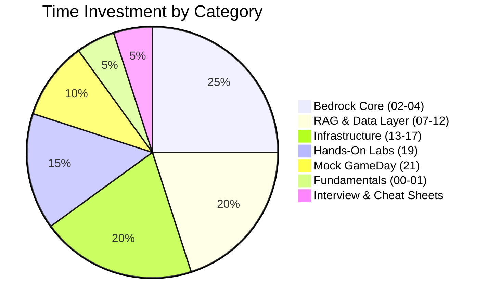

# 📅 Module 00 — Learning Roadmap

> **4 weeks from zero to GameDay-ready** — A structured study plan that adapts to your background.

---

## 🧠 Intuition — Why a Roadmap Matters

**The Problem**: AWS AI GameDay tests breadth AND depth under time pressure. Random studying leads to:
- Deep knowledge in areas that aren't tested (e.g., transformer math)
- Shallow knowledge in areas that ARE tested (e.g., IAM for Bedrock)
- No muscle memory for debugging under pressure

**The Solution**: A structured roadmap that:
1. Builds foundational knowledge in Week 1
2. Adds service-specific depth in Weeks 2-3
3. Practices under GameDay conditions in Week 4

---

## 🎯 Self-Assessment — Where Do You Stand?

Rate yourself 1-5 on each skill:

| Skill | 1 (Never Used) | 3 (Used Once) | 5 (Production Exp) | Your Score |
|-------|----------------|---------------|---------------------|------------|
| AWS IAM (Roles, Policies) | | | | ☐ |
| Amazon S3 (Buckets, Permissions) | | | | ☐ |
| AWS Lambda | | | | ☐ |
| Amazon Bedrock | | | | ☐ |
| RAG Concepts | | | | ☐ |
| Vector Databases | | | | ☐ |
| Amazon SageMaker | | | | ☐ |
| CloudWatch & Monitoring | | | | ☐ |
| GenAI/LLM Fundamentals | | | | ☐ |
| Python/boto3 | | | | ☐ |

**Scoring**:
- **40-50**: You're ready for Mock GameDay (Module 21). Skim Modules 02-04, then jump to Labs.
- **25-39**: Follow the standard 4-week plan below.
- **10-24**: Add an extra week of fundamentals. Start with existing repo content first.

---

## 📋 Prerequisites

### Must Have
- AWS Account with admin access (or [AWS Skill Builder](https://skillbuilder.aws/) sandbox)
- Python 3.10+ with `boto3` installed
- Basic understanding of REST APIs
- Familiarity with JSON/YAML

### Should Have
- [AWS CLI v2](https://docs.aws.amazon.com/cli/latest/userguide/getting-started-install.html) configured
- Experience with at least one AWS service (S3, Lambda, etc.)
- Basic understanding of LLMs (what they are, how they generate text)

### Nice to Have
- Docker installed (for some labs)
- AWS CDK or CloudFormation experience
- Previous exposure to RAG or embeddings

### Existing Repo Content to Review First
If you're new to these concepts, review these files from the parent repo before starting:

| Concept | File | Time |
|---------|------|------|
| GenAI Foundations | [genai-fundamentals.md](../../genai/genai-fundamentals.md) | 2 hours |
| ML Basics | [ml-fundamentals.md](../../genai/ml-fundamentals.md) | 2 hours |
| AWS Services Overview | [aws-services-guide.md](../../aws/aws-services-guide.md) | 3 hours |
| RAG Theory | [rag-architecture.md](../../genai/rag-architecture.md) | 2 hours |

---

## 📆 4-Week Study Plan

### Week 1 — Foundation & Bedrock Core

**Goal**: Understand the AWS AI landscape and master Bedrock fundamentals.

```mermaid
gantt
    title Week 1 - Foundation & Bedrock
    dateFormat  X
    axisFormat  Day %s
    
    section Foundation
    Self-Assessment & Prerequisites    :done, 1, 2
    Module 01 - AWS AI Fundamentals    :active, 2, 3
    
    section Bedrock
    Module 02 - Bedrock Core (APIs)    :3, 4
    Module 02 - Bedrock Core (Models)  :4, 5
    Module 03 - Knowledge Bases        :5, 6
    Module 04 - Bedrock Agents         :6, 7
    
    section Review
    Week 1 Review & Practice           :7, 8
```

| Day | Module | Focus | Time |
|-----|--------|-------|------|
| **Day 1** | [00 - Roadmap](./README.md) | Self-assessment, prerequisites setup, AWS account config | 2 hrs |
| **Day 2** | [01 - Fundamentals](../01-AWS-AI-Fundamentals/README.md) | AWS AI service landscape, selection framework | 3 hrs |
| **Day 3** | [02 - Bedrock Core](../02-Bedrock-Core/README.md) | Architecture, InvokeModel API, model catalog | 3 hrs |
| **Day 4** | [02 - Bedrock Core](../02-Bedrock-Core/README.md) | Guardrails, provisioned throughput, pricing | 3 hrs |
| **Day 5** | [03 - Knowledge Bases](../03-Bedrock-Knowledge-Bases/README.md) | Data sources, chunking, sync lifecycle | 3 hrs |
| **Day 6** | [04 - Bedrock Agents](../04-Bedrock-Agents/README.md) | Action groups, Lambda integration, memory | 3 hrs |
| **Day 7** | Review | Revisit GameDay tips from Modules 02-04 | 2 hrs |

**Week 1 Milestone**: You can explain Bedrock's architecture, create a Knowledge Base, and build a simple Agent.

---

### Week 2 — AI Patterns & Data Layer

**Goal**: Master RAG, embeddings, vector search, and prompt engineering on AWS.

| Day | Module | Focus | Time |
|-----|--------|-------|------|
| **Day 8** | [05 - Agentic AI](../05-Agentic-AI/README.md) | Multi-agent patterns, Step Functions orchestration | 3 hrs |
| **Day 9** | [06 - MCP](../06-MCP/README.md) | Protocol overview, AWS integration patterns | 2 hrs |
| **Day 10** | [07 - RAG](../07-RAG/README.md) | RAG on AWS — Bedrock KB vs Kendra vs Custom | 3 hrs |
| **Day 11** | [08 - Embeddings](../08-Embeddings/README.md) | Titan Embeddings, strategies, batch processing | 3 hrs |
| **Day 12** | [09 - Vector DBs](../09-Vector-Databases/README.md) | OpenSearch vs Aurora pgvector, indexing | 3 hrs |
| **Day 13** | [10 - OpenSearch](../10-OpenSearch/README.md) + [11 - Prompt Eng](../11-Prompt-Engineering/README.md) | k-NN, Converse API, model-specific prompting | 3 hrs |
| **Day 14** | [12 - RAG Eval](../12-RAG-Evaluation/README.md) | RAGAS metrics, quality pipelines | 2 hrs |

**Week 2 Milestone**: You can design a complete RAG pipeline on AWS, choose the right vector store, and evaluate retrieval quality.

---

### Week 3 — Infrastructure & Operations

**Goal**: Master the operational side — SageMaker, security, observability, cost.

| Day | Module | Focus | Time |
|-----|--------|-------|------|
| **Day 15** | [13 - SageMaker](../13-SageMaker/README.md) | Endpoints, JumpStart, deployment patterns | 3 hrs |
| **Day 16** | [14 - Serverless AI](../14-Serverless-AI/README.md) | Lambda + Bedrock, Step Functions, event-driven | 3 hrs |
| **Day 17** | [15 - Security](../15-Security/README.md) | IAM for AI, VPC endpoints, encryption, compliance | 3 hrs |
| **Day 18** | [16 - Observability](../16-Observability/README.md) | CloudWatch metrics, X-Ray, alerting | 3 hrs |
| **Day 19** | [17 - Cost Optimization](../17-Cost-Optimization/README.md) | Token economics, caching, right-sizing | 2 hrs |
| **Day 20** | [18 - Enterprise](../18-Enterprise-AI-Architectures/README.md) | Multi-account, governance, reference architectures | 3 hrs |
| **Day 21** | Review | End-to-end architecture design practice | 2 hrs |

**Week 3 Milestone**: You can design a secure, observable, cost-optimized AI architecture with proper IAM policies.

---

### Week 4 — Practice, Practice, Practice

**Goal**: Build muscle memory through hands-on labs and mock GameDay scenarios.

| Day | Module | Focus | Time |
|-----|--------|-------|------|
| **Day 22** | [19 - Labs 1-3](../19-Hands-On-Labs/README.md) | Bedrock chat app, Knowledge Base, Agent | 4 hrs |
| **Day 23** | [19 - Labs 4-6](../19-Hands-On-Labs/README.md) | Kendra RAG, SageMaker endpoint, Step Functions | 4 hrs |
| **Day 24** | [19 - Labs 7-10](../19-Hands-On-Labs/README.md) | Guardrails, Security, Multi-agent, Monitoring | 4 hrs |
| **Day 25** | [20 - Troubleshooting](../20-Troubleshooting/README.md) | Error codes, decision trees, runbooks | 3 hrs |
| **Day 26** | [21 - Mock GameDay A](../21-Mock-Gameday/README.md) | "The RAG Pipeline is Down" (60 min timed) | 2 hrs |
| **Day 27** | [21 - Mock GameDay B+C](../21-Mock-Gameday/README.md) | "Agent Gone Rogue" + "Enterprise AI Launch" | 3 hrs |
| **Day 28** | [22 - Interview Qs](../22-Interview-Questions/README.md) + [23 - Cheat Sheets](../23-Cheat-Sheets/README.md) | Final review, quick reference cards | 3 hrs |

**Week 4 Milestone**: You've completed all labs, survived 3 mock GameDays, and can troubleshoot any scenario.

---

## 🔑 Study Tips for Maximum Retention

### 1. Build, Don't Just Read
Every module has code examples. **Type them out** — don't copy-paste. This builds muscle memory for GameDay.

### 2. Break Things on Purpose
After each lab works, intentionally break it:
- Remove an IAM permission → What error do you get?
- Change the embedding dimension → What fails?
- Set Lambda timeout to 3 seconds → What happens?

### 3. Teach to Learn
After each module, explain the concept in 2 minutes to an imaginary junior engineer. If you can't, re-read.

### 4. GameDay Simulation
Practice with a timer. GameDay challenges are 60-90 minutes. If you can't debug an issue in 10 minutes, you're stuck — check the troubleshooting guide.

### 5. Use the Cheat Sheets
Print [Module 23 - Cheat Sheets](../23-Cheat-Sheets/README.md) and keep them next to your desk during GameDay.

---

## 📊 Effort Distribution

---

## 🏆 Success Criteria

You're GameDay-ready when you can:

- [ ] Explain Bedrock's request flow from API call to model response
- [ ] Debug a Knowledge Base sync failure in under 10 minutes
- [ ] Write an IAM policy for Bedrock Agent → Lambda → S3 access
- [ ] Design a RAG architecture and justify every component choice
- [ ] Identify cost optimization opportunities in an AI workload
- [ ] Set up CloudWatch alarms for model throttling and latency
- [ ] Complete a mock GameDay scenario scoring 80%+

---

  <a href="../01-AWS-AI-Fundamentals/README.md"><b>Next Module → 01 AWS AI Fundamentals</b></a>

