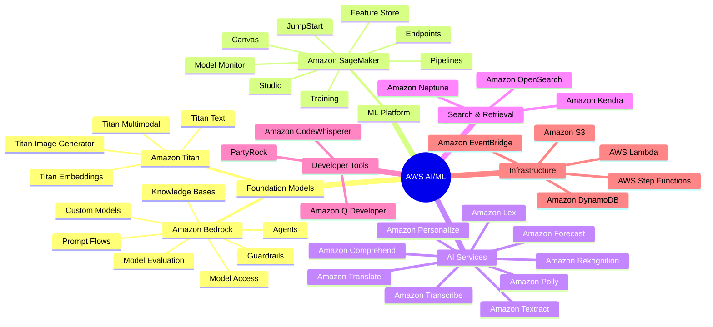
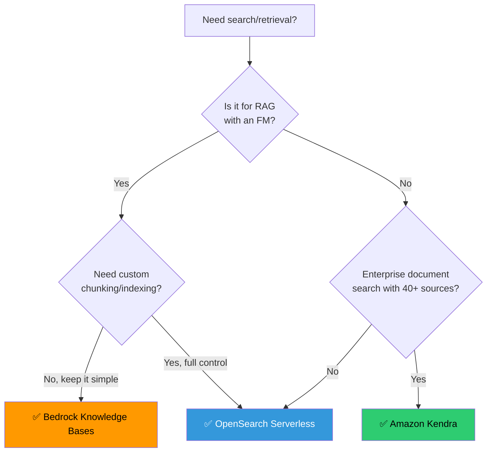
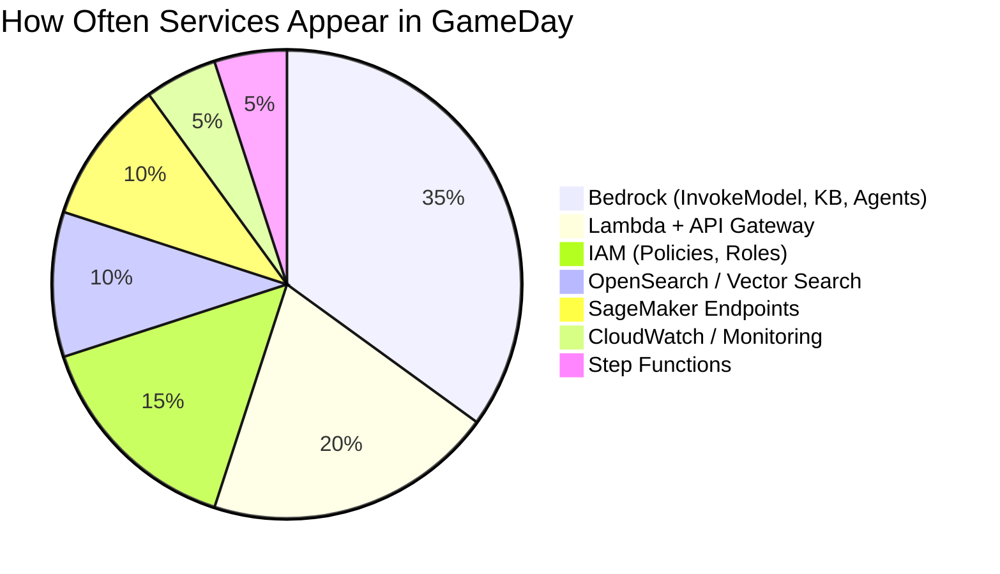

# 🧠 Module 01 — AWS AI Fundamentals

> **The Map Before the Territory** — Understand the entire AWS AI/ML landscape before diving into individual services.

---

## 🧠 1️⃣ Intuition — Why AWS Has 25+ AI Services

### The Problem AWS Solves

Imagine you're building an AI-powered customer service platform. You need:
- A foundation model to understand natural language
- A way to give it your company's knowledge
- Agents that can take actions (refund, escalate, check order)
- Guardrails to prevent inappropriate responses
- Monitoring to detect failures
- Security to protect customer data

**Without AWS AI services**, you'd need to:
- Host your own GPU clusters ($50K+/month)
- Build embedding pipelines from scratch
- Create vector search infrastructure
- Implement safety filters
- Build monitoring dashboards
- Handle scaling, patching, security

**With AWS AI services**, each of these is a managed service you configure, not build.

### The Mental Model

Think of AWS AI services in 4 layers:

```
┌─────────────────────────────────────────────────────┐
│                 APPLICATION LAYER                     │
│    Bedrock Agents | Amazon Q | PartyRock | Lex        │
├─────────────────────────────────────────────────────┤
│                   MODEL LAYER                         │
│    Bedrock (FM Access) | SageMaker JumpStart          │
│    Titan Models | Custom Fine-tuned Models            │
├─────────────────────────────────────────────────────┤
│                 ORCHESTRATION LAYER                   │
│    Bedrock KB | Kendra | Step Functions | Lambda      │
│    Bedrock Guardrails | Prompt Flows                  │
├─────────────────────────────────────────────────────┤
│                INFRASTRUCTURE LAYER                   │
│    SageMaker (Training/Hosting) | OpenSearch          │
│    S3 | DynamoDB | CloudWatch | IAM | VPC             │
└─────────────────────────────────────────────────────┘
```

**Key Insight**: GameDay challenges span ALL four layers. You'll need to debug IAM issues (infra), fix model invocation errors (model), repair Knowledge Base sync (orchestration), and test Agent behavior (application).

---

## ⚙️ 2️⃣ Internal Working — The AWS AI Service Taxonomy

### Complete Service Map



### Service Categories Explained

#### 🤖 Foundation Model Access — Amazon Bedrock

**What it is**: A fully managed service to access foundation models (Claude, Llama, Titan, Mistral, Cohere) via API.

**Why it exists**: Running FMs requires expensive GPU infrastructure. Bedrock abstracts this — you pay per token, not per GPU.

**What breaks without it**: You'd need SageMaker with GPU instances ($2-30/hour) to host models yourself.

```
User Request → API Gateway → Lambda → Bedrock InvokeModel → FM Response
                                         │
                                         ├── Claude 3.5 Sonnet
                                         ├── Llama 3.1 70B
                                         ├── Titan Text Premier
                                         └── Mistral Large
```

**GameDay Relevance**: Most GameDay challenges involve Bedrock. Know the APIs, error codes, and throttling limits cold.

---

#### 🔍 Search & Retrieval — Kendra vs OpenSearch vs Bedrock KB

This is a **critical decision** that appears in both GameDay and interviews:

| Feature | Bedrock Knowledge Bases | Amazon Kendra | OpenSearch Serverless |
|---------|------------------------|---------------|---------------------|
| **Primary Use** | RAG with FMs | Enterprise search | Vector + text search |
| **Managed Level** | Fully managed | Fully managed | Semi-managed |
| **Vector Search** | ✅ Built-in | ❌ Semantic ranking | ✅ k-NN plugin |
| **Data Sources** | S3, Confluence, Web | 40+ connectors | Custom ingestion |
| **Cost Model** | Pay per query | $1.40/hr base | OCU-based |
| **Setup Time** | Minutes | Hours | Hours |
| **Chunking** | Automatic | Automatic | Manual |
| **Best For** | GenAI RAG apps | Enterprise doc search | Custom search + RAG |
| **GameDay Freq** | ⭐⭐⭐⭐⭐ | ⭐⭐⭐ | ⭐⭐⭐⭐ |

**Decision Framework**:


---

#### 🏋️ ML Platform — SageMaker vs Bedrock

**The most common interview question**: "When would you use SageMaker instead of Bedrock?"

| Scenario | Use Bedrock | Use SageMaker |
|----------|------------|---------------|
| Access pre-trained FM | ✅ | ❌ |
| Fine-tune with < 10K examples | ✅ Custom Models | ❌ |
| Fine-tune with custom training loop | ❌ | ✅ |
| Train from scratch | ❌ | ✅ |
| Host custom model | ❌ | ✅ Endpoints |
| Real-time inference (FM) | ✅ InvokeModel | ✅ Endpoints |
| Batch inference | ✅ Batch API | ✅ Batch Transform |
| Need GPU control | ❌ | ✅ |
| MLOps pipeline | ❌ | ✅ Pipelines |

**The One-Liner**: Bedrock = **use** foundation models. SageMaker = **build/train/host** custom models.

---

#### 🛡️ AI Services — Pre-Built Intelligence

These are **single-purpose AI APIs** that don't require ML knowledge:

| Service | What It Does | Input → Output |
|---------|-------------|----------------|
| **Comprehend** | NLP analysis | Text → Sentiment, Entities, Language |
| **Rekognition** | Image/Video analysis | Image → Labels, Faces, Text, Moderation |
| **Textract** | Document extraction | PDF/Image → Structured text, Tables, Forms |
| **Transcribe** | Speech-to-text | Audio → Text transcript |
| **Polly** | Text-to-speech | Text → Audio |
| **Translate** | Language translation | Text → Translated text |
| **Lex** | Chatbot framework | Voice/Text → Intent + Slots |
| **Personalize** | Recommendations | User behavior → Personalized items |
| **Forecast** | Time-series prediction | Historical data → Future values |

**GameDay Tip**: These services rarely appear as primary challenges but may be part of a larger architecture (e.g., "transcribe a call → analyze sentiment → generate response with Bedrock").

---

## 🏗️ 3️⃣ Production Usage — Real-World Architecture Patterns

### Pattern 1: Intelligent Document Processing

```
┌──────────┐    ┌──────────┐    ┌──────────┐    ┌──────────┐
│ S3 Upload│───→│ Textract  │───→│ Comprehend│───→│ Bedrock  │
│ (PDF)    │    │ (Extract) │    │ (Classify)│    │ (Summarize)│
└──────────┘    └──────────┘    └──────────┘    └──────────┘
                                                      │
                                                      ▼
                                                ┌──────────┐
                                                │ DynamoDB  │
                                                │ (Store)   │
                                                └──────────┘
```

**Services Used**: S3 → Textract → Comprehend → Bedrock → DynamoDB
**Orchestration**: Step Functions or EventBridge

### Pattern 2: AI-Powered Customer Service

```
┌──────────┐    ┌──────────┐    ┌──────────────────────────┐
│ Customer │───→│ API      │───→│     Bedrock Agent         │
│ (Chat)   │    │ Gateway  │    │  ┌─────────────────────┐  │
└──────────┘    └──────────┘    │  │ Knowledge Base (FAQ) │  │
                                │  ├─────────────────────┤  │
                                │  │ Action: Check Order  │──┼──→ Lambda → DynamoDB
                                │  ├─────────────────────┤  │
                                │  │ Action: Create Ticket│──┼──→ Lambda → ServiceNow
                                │  ├─────────────────────┤  │
                                │  │ Guardrails (Safety)  │  │
                                │  └─────────────────────┘  │
                                └──────────────────────────┘
```

### Pattern 3: Enterprise RAG Platform

```
┌─────────────────────────────────────────────────────────┐
│                    DATA INGESTION                         │
│  S3 ──→ Lambda ──→ Chunking ──→ Titan Embed ──→ OpenSearch│
│  Confluence ──→ Connector ──→ Bedrock KB Sync            │
├─────────────────────────────────────────────────────────┤
│                    QUERY PIPELINE                         │
│  User Query ──→ Embed ──→ Hybrid Search ──→ Rerank      │
│  ──→ Prompt Assembly ──→ Bedrock Claude ──→ Response     │
├─────────────────────────────────────────────────────────┤
│                    OPERATIONS                             │
│  CloudWatch Metrics │ X-Ray Traces │ Cost Dashboard      │
│  Guardrails │ Model Eval │ A/B Testing                   │
└─────────────────────────────────────────────────────────┘
```

---

## 🎮 4️⃣ GameDay Relevance

### What is AWS AI GameDay?

AWS AI GameDay is a **team-based, timed, scenario-driven challenge** where you:
1. Receive a broken or incomplete AI architecture
2. Must diagnose and fix issues under time pressure
3. Score points for each challenge completed
4. Lose points for incorrect configurations or wasted time

### GameDay Service Frequency



### Top 10 GameDay Survival Skills

| # | Skill | Module |
|---|-------|--------|
| 1 | Debug Bedrock `ThrottlingException` | [02](../02-Bedrock-Core/README.md) |
| 2 | Fix IAM permissions for `bedrock:InvokeModel` | [15](../15-Security/README.md) |
| 3 | Repair Knowledge Base sync failures | [03](../03-Bedrock-Knowledge-Bases/README.md) |
| 4 | Configure OpenSearch k-NN index correctly | [10](../10-OpenSearch/README.md) |
| 5 | Debug Lambda timeout calling Bedrock | [14](../14-Serverless-AI/README.md) |
| 6 | Fix Agent action group OpenAPI schema | [04](../04-Bedrock-Agents/README.md) |
| 7 | Set up CloudWatch alarms for AI metrics | [16](../16-Observability/README.md) |
| 8 | Optimize Bedrock costs (on-demand vs provisioned) | [17](../17-Cost-Optimization/README.md) |
| 9 | Debug embedding dimension mismatch | [08](../08-Embeddings/README.md) |
| 10 | Fix SageMaker endpoint InsufficientInstanceCapacity | [13](../13-SageMaker/README.md) |

---

## 💼 5️⃣ Interview Perspective

### Q1: "Walk me through the AWS AI service landscape. How do you decide which service to use?"

**Model Answer**:
> "I think of AWS AI in four layers. At the top is the **application layer** — Bedrock Agents, Amazon Q, Lex — for building AI-powered applications. Below that is the **model layer** — Bedrock for accessing foundation models via API, SageMaker for training/hosting custom models. The **orchestration layer** handles data pipelines — Bedrock Knowledge Bases for managed RAG, Kendra for enterprise search, OpenSearch for custom vector search. At the bottom is the **infrastructure layer** — Lambda, Step Functions, S3, IAM.

> The key decision is Bedrock vs SageMaker. If I'm using a pre-trained foundation model with minimal customization, Bedrock is simpler, cheaper, and faster. If I need custom training loops, GPU control, or non-FM models, SageMaker gives me full flexibility. For most enterprise GenAI use cases today, I'd start with Bedrock and only drop to SageMaker when I hit its limitations."

### Q2: "You need to build an AI-powered knowledge assistant for a bank. What AWS services would you use and why?"

**Model Answer**:
> "For a banking knowledge assistant, I'd use:
> 1. **Bedrock** with Claude as the FM — strong at financial reasoning, supports long context
> 2. **Bedrock Knowledge Bases** with S3 as the data source — for ingesting policy documents, product guides, compliance docs
> 3. **OpenSearch Serverless** as the vector store — gives me hybrid search (semantic + keyword) for financial terminology
> 4. **Bedrock Guardrails** — critical for banking to prevent hallucinated financial advice, block PII exposure
> 5. **Lambda + API Gateway** — serverless API for the chat interface
> 6. **IAM + VPC endpoints** — compliance requires private connectivity, least-privilege access
> 7. **CloudWatch** — monitor latency, throttling, and guardrail activations

> The key trade-off is Bedrock KB vs custom RAG. I'd start with Bedrock KB for speed-to-market, but might need custom RAG with OpenSearch if we need fine-grained control over chunking or hybrid search tuning."

### Q3: "What's the difference between Bedrock, SageMaker, and the purpose-built AI services like Comprehend?"

**Model Answer**:
> "They serve different abstraction levels:
> - **Purpose-built services** (Comprehend, Rekognition, Textract) are task-specific APIs. You send input, get structured output. No ML knowledge needed. Use them for well-defined tasks like sentiment analysis or document extraction.
> - **Bedrock** is a managed foundation model service. It gives you access to powerful general-purpose models (Claude, Llama, Titan) that can handle any text/image task. You're working with prompts, not training data.
> - **SageMaker** is a full ML platform. It's for building, training, and hosting custom models. It gives you the most control but requires the most expertise.

> The progression is: Start with purpose-built services for specific tasks, use Bedrock for general GenAI applications, drop to SageMaker only when you need custom models or full training control."

---

## 🔗 Further Reading

| Resource | Link |
|----------|------|
| AWS AI/ML Services Overview | [AWS AI Page](https://aws.amazon.com/machine-learning/) |
| Existing AWS Services Guide | [aws-services-guide.md](../../aws/aws-services-guide.md) |
| Existing GenAI MLOps Guide | [aws-genai-mlops.md](../../genai/aws-genai-mlops.md) |
| Existing GenAI Fundamentals | [genai-fundamentals.md](../../genai/genai-fundamentals.md) |

---

<p align="center">
  <a href="../00-Learning-Roadmap/README.md">← Previous: Learning Roadmap</a> · <a href="../02-Bedrock-Core/README.md"><b>Next → 02 Bedrock Core</b></a>
</p>
