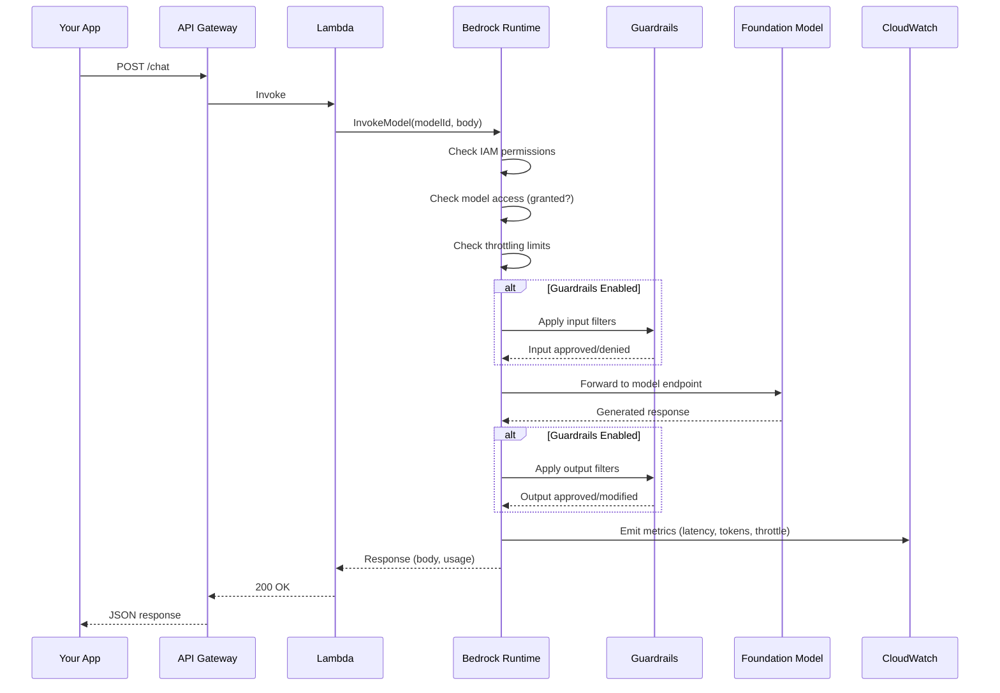
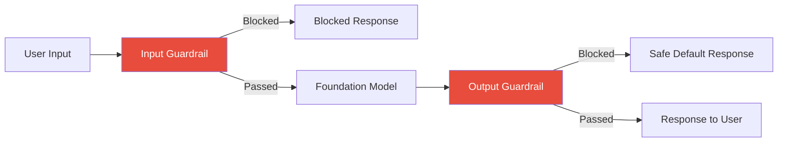

# 🤖 Module 02 — Bedrock Core

> **The Engine Room of AWS GenAI** — Master the APIs, models, guardrails, and economics of Amazon Bedrock.

---

## 🧠 1️⃣ Intuition — Why Bedrock Exists

### The Problem Before Bedrock

Before Bedrock (pre-2023), using a foundation model on AWS meant:

1. **Find a model** → Download weights from Hugging Face (100+ GB for large models)
2. **Provision GPUs** → Launch `ml.p4d.24xlarge` on SageMaker ($32/hour)
3. **Build serving infra** → Model server, load balancer, auto-scaling, health checks
4. **Handle operations** → Patching, GPU driver updates, model versioning
5. **Manage costs** → Pay for idle GPUs even when no one is asking questions

**Total time to first inference: 2-5 days. Cost: $10K+/month minimum.**

### What Bedrock Changes

Bedrock is a **fully managed API** for foundation models. Think of it as the "S3 of AI" — you don't manage servers, you just call an API.

```
Before Bedrock:
  You → Download Model → Provision GPUs → Build Server → Configure → Invoke
  (Days, $$$$$)

After Bedrock:
  You → bedrock.invoke_model(modelId, prompt) → Response
  (Seconds, pay-per-token)
```

### What Breaks Without Bedrock

- **Cost**: Self-hosting Claude 3.5 Sonnet requires ~$50K/month in GPU infrastructure
- **Ops burden**: You become responsible for GPU failures, driver updates, model versioning
- **Time-to-market**: Weeks instead of hours
- **Multi-model flexibility**: Switching between Claude, Llama, Titan requires new infrastructure for each

---

## ⚙️ 2️⃣ Internal Working — How Bedrock Processes a Request

### Request Flow Architecture



### The Two APIs You Must Know

#### API 1: `InvokeModel` (Low-Level)

Model-specific request/response format. Each model has its own JSON schema.

```python
import boto3
import json

bedrock_runtime = boto3.client('bedrock-runtime', region_name='us-east-1')

# Claude-specific format
response = bedrock_runtime.invoke_model(
    modelId='anthropic.claude-3-5-sonnet-20241022-v2:0',
    contentType='application/json',
    accept='application/json',
    body=json.dumps({
        "anthropic_version": "bedrock-2023-05-31",
        "max_tokens": 1024,
        "messages": [
            {
                "role": "user",
                "content": "Explain how Bedrock works in 3 sentences."
            }
        ],
        "temperature": 0.7
    })
)

result = json.loads(response['body'].read())
print(result['content'][0]['text'])
```

**When to use**: When you need model-specific features (e.g., Claude's `system` field, Llama's special tokens).

#### API 2: `Converse` (High-Level) ⭐ RECOMMENDED

**Unified API** that works across all models with the same request format.

```python
response = bedrock_runtime.converse(
    modelId='anthropic.claude-3-5-sonnet-20241022-v2:0',
    messages=[
        {
            "role": "user",
            "content": [
                {"text": "Explain how Bedrock works in 3 sentences."}
            ]
        }
    ],
    inferenceConfig={
        "maxTokens": 1024,
        "temperature": 0.7,
        "topP": 0.9
    },
    system=[
        {"text": "You are a helpful AWS expert."}
    ]
)

print(response['output']['message']['content'][0]['text'])
print(f"Input tokens: {response['usage']['inputTokens']}")
print(f"Output tokens: {response['usage']['outputTokens']}")
```

**When to use**: **Always prefer Converse** unless you need model-specific features. It's:
- Portable across models (switch `modelId`, nothing else changes)
- Returns standardized `usage` metrics
- Supports tool use natively
- Supports streaming via `ConverseStream`

#### Streaming with `ConverseStream`

```python
response = bedrock_runtime.converse_stream(
    modelId='anthropic.claude-3-5-sonnet-20241022-v2:0',
    messages=[{"role": "user", "content": [{"text": "Write a poem about AWS."}]}],
    inferenceConfig={"maxTokens": 512}
)

for event in response['stream']:
    if 'contentBlockDelta' in event:
        print(event['contentBlockDelta']['delta']['text'], end='')
    elif 'metadata' in event:
        usage = event['metadata']['usage']
        print(f"\nTokens: {usage['inputTokens']} in, {usage['outputTokens']} out")
```

### Tool Use with Converse API

```python
# Define tools
tools = [
    {
        "toolSpec": {
            "name": "get_weather",
            "description": "Get current weather for a city",
            "inputSchema": {
                "json": {
                    "type": "object",
                    "properties": {
                        "city": {"type": "string", "description": "City name"},
                        "unit": {"type": "string", "enum": ["celsius", "fahrenheit"]}
                    },
                    "required": ["city"]
                }
            }
        }
    }
]

response = bedrock_runtime.converse(
    modelId='anthropic.claude-3-5-sonnet-20241022-v2:0',
    messages=[{"role": "user", "content": [{"text": "What's the weather in Sydney?"}]}],
    toolConfig={"tools": tools}
)

# Check if model wants to use a tool
content = response['output']['message']['content']
for block in content:
    if 'toolUse' in block:
        tool_name = block['toolUse']['name']      # "get_weather"
        tool_input = block['toolUse']['input']     # {"city": "Sydney"}
        tool_use_id = block['toolUse']['toolUseId']
        
        # Execute the tool, then send result back
        tool_result = {"temperature": 22, "condition": "Sunny"}
        
        # Continue conversation with tool result
        messages = [
            {"role": "user", "content": [{"text": "What's the weather in Sydney?"}]},
            {"role": "assistant", "content": content},
            {"role": "user", "content": [
                {"toolResult": {
                    "toolUseId": tool_use_id,
                    "content": [{"json": tool_result}]
                }}
            ]}
        ]
```

---

### Model Catalog — What's Available

| Model Family | Models | Strengths | Max Tokens | GameDay Use |
|---|---|---|---|---|
| **Anthropic Claude** | 3.5 Sonnet, 3.5 Haiku, 3 Opus | Best reasoning, coding, analysis | 200K context | ⭐⭐⭐⭐⭐ |
| **Meta Llama** | 3.1 8B/70B/405B, 3.2 | Open-source, customizable | 128K context | ⭐⭐⭐ |
| **Amazon Titan** | Text Premier, Lite, Embeddings V2 | AWS-native, cost-effective | 32K context | ⭐⭐⭐⭐ |
| **Mistral** | Large, Small, Mixtral 8x7B | Fast, efficient, multilingual | 32K context | ⭐⭐⭐ |
| **Cohere** | Command R+, Embed | RAG-optimized, embeddings | 128K context | ⭐⭐⭐⭐ |
| **AI21 Labs** | Jamba-Instruct | Long context, enterprise | 256K context | ⭐⭐ |
| **Stability AI** | SDXL, SD3 | Image generation | N/A | ⭐⭐ |

### Model Access — Critical First Step

Before using ANY model, you must **enable access** in the AWS Console:

```
Bedrock Console → Model access → Manage model access → Select models → Request access
```

**GameDay Trap**: Teams waste 15+ minutes because they forgot to enable model access. This is a **zero-cost, zero-risk step** — enable ALL models in your GameDay region on Day 1.

```python
# Check which models you have access to
bedrock = boto3.client('bedrock', region_name='us-east-1')
response = bedrock.list_foundation_models()

for model in response['modelSummaries']:
    print(f"{model['modelId']} - {model['modelName']} - Status: {model.get('modelLifecycle', {}).get('status', 'N/A')}")
```

---

### Guardrails — Content Safety

Guardrails are **configurable filters** that sit between the user and the model:



**Guardrail Capabilities**:

| Filter | What It Does | Example |
|--------|-------------|---------|
| **Content filters** | Block harmful categories (hate, violence, sexual, insults, misconduct) | Block responses with violence score > 0.7 |
| **Denied topics** | Block specific topics you define | "Don't discuss competitor products" |
| **Word filters** | Block specific words/phrases | Block profanity, competitor names |
| **Sensitive info** | Detect/redact PII | Redact SSN, credit card numbers, emails |
| **Contextual grounding** | Check if response is grounded in source | Block hallucinated facts |

```python
# Create a guardrail
bedrock = boto3.client('bedrock', region_name='us-east-1')

response = bedrock.create_guardrail(
    name='banking-guardrail',
    description='Guardrail for banking AI assistant',
    contentPolicyConfig={
        'filtersConfig': [
            {'type': 'SEXUAL', 'inputStrength': 'HIGH', 'outputStrength': 'HIGH'},
            {'type': 'VIOLENCE', 'inputStrength': 'HIGH', 'outputStrength': 'HIGH'},
            {'type': 'HATE', 'inputStrength': 'HIGH', 'outputStrength': 'HIGH'},
            {'type': 'INSULTS', 'inputStrength': 'MEDIUM', 'outputStrength': 'HIGH'},
            {'type': 'MISCONDUCT', 'inputStrength': 'HIGH', 'outputStrength': 'HIGH'},
        ]
    },
    sensitiveInformationPolicyConfig={
        'piiEntitiesConfig': [
            {'type': 'EMAIL', 'action': 'ANONYMIZE'},
            {'type': 'PHONE', 'action': 'ANONYMIZE'},
            {'type': 'US_SOCIAL_SECURITY_NUMBER', 'action': 'BLOCK'},
            {'type': 'CREDIT_DEBIT_CARD_NUMBER', 'action': 'BLOCK'},
        ]
    },
    blockedInputMessaging='Your request contains content that violates our policies.',
    blockedOutputsMessaging='The response was filtered for safety reasons.'
)

guardrail_id = response['guardrailId']

# Use guardrail with Converse API
response = bedrock_runtime.converse(
    modelId='anthropic.claude-3-5-sonnet-20241022-v2:0',
    messages=[{"role": "user", "content": [{"text": "user query here"}]}],
    guardrailConfig={
        "guardrailIdentifier": guardrail_id,
        "guardrailVersion": "DRAFT"
    }
)
```

---

### Provisioned Throughput vs On-Demand

```
┌──────────────────────────────────────────────────────────────┐
│                     PRICING MODEL COMPARISON                  │
├────────────────┬─────────────────────┬───────────────────────┤
│                │   ON-DEMAND         │   PROVISIONED         │
├────────────────┼─────────────────────┼───────────────────────┤
│ Cost Model     │ Pay per token       │ Fixed hourly rate     │
│ Minimum Cost   │ $0 (no usage, no $) │ ~$1,800/month min     │
│ Latency        │ Variable (shared)   │ Consistent (reserved) │
│ Throughput     │ Subject to throttle │ Guaranteed capacity   │
│ Commitment     │ None                │ 1 or 6 month          │
│ Best For       │ Dev, low volume     │ Production, high vol  │
│ Break-even     │ N/A                 │ ~500K tokens/hour     │
└────────────────┴─────────────────────┴───────────────────────┘
```

**GameDay Tip**: You'll almost always use **on-demand** during GameDay. But know that `ThrottlingException` means you're hitting on-demand limits — the fix is either to request a quota increase or implement exponential backoff.

---

## 🏗️ 3️⃣ Production Usage — Patterns & Anti-Patterns

### ✅ Production Patterns

| Pattern | Description |
|---------|------------|
| **Retry with backoff** | Always implement exponential backoff for `ThrottlingException` |
| **Converse API** | Use Converse over InvokeModel for portability |
| **Model fallback** | If Claude is throttled, fall back to Llama or Titan |
| **Response caching** | Cache identical prompts to reduce cost and latency |
| **Streaming** | Use `ConverseStream` for user-facing apps (perceived performance) |
| **Token estimation** | Estimate tokens before calling to avoid surprise costs |

### ❌ Anti-Patterns

| Anti-Pattern | Why It's Bad | Fix |
|---|---|---|
| Hardcoding model IDs | Model versions get deprecated | Use config/env vars |
| No error handling | `ThrottlingException` crashes your app | Implement retry logic |
| Using InvokeModel for everything | Model-specific code breaks on switch | Use Converse API |
| No guardrails in production | Compliance risk, PR disaster | Always add guardrails |
| Ignoring token counts | Surprise $10K bills | Track and alert on usage |
| Synchronous calls from UI | 10+ second response times | Use streaming |

### Production-Grade Bedrock Call

```python
import boto3
import json
import time
from botocore.exceptions import ClientError

class BedrockClient:
    def __init__(self, primary_model, fallback_model=None, region='us-east-1'):
        self.client = boto3.client('bedrock-runtime', region_name=region)
        self.primary_model = primary_model
        self.fallback_model = fallback_model
        self.max_retries = 3
    
    def invoke(self, messages, system=None, max_tokens=1024, temperature=0.7):
        """Production-grade Bedrock invocation with retry and fallback."""
        models = [self.primary_model]
        if self.fallback_model:
            models.append(self.fallback_model)
        
        for model_id in models:
            for attempt in range(self.max_retries):
                try:
                    kwargs = {
                        'modelId': model_id,
                        'messages': messages,
                        'inferenceConfig': {
                            'maxTokens': max_tokens,
                            'temperature': temperature
                        }
                    }
                    if system:
                        kwargs['system'] = [{"text": system}]
                    
                    response = self.client.converse(**kwargs)
                    return {
                        'text': response['output']['message']['content'][0]['text'],
                        'model': model_id,
                        'usage': response['usage'],
                        'stop_reason': response['stopReason']
                    }
                    
                except ClientError as e:
                    error_code = e.response['Error']['Code']
                    
                    if error_code == 'ThrottlingException':
                        wait_time = (2 ** attempt) + (time.time() % 1)
                        print(f"Throttled on {model_id}, retry {attempt+1} in {wait_time:.1f}s")
                        time.sleep(wait_time)
                        continue
                    
                    elif error_code == 'ModelTimeoutException':
                        print(f"Timeout on {model_id}, trying next model")
                        break  # Try fallback model
                    
                    elif error_code == 'AccessDeniedException':
                        raise Exception(f"No access to {model_id}. Enable in Bedrock Console.")
                    
                    else:
                        raise
        
        raise Exception("All models exhausted after retries")

# Usage
client = BedrockClient(
    primary_model='anthropic.claude-3-5-sonnet-20241022-v2:0',
    fallback_model='amazon.titan-text-premier-v1:0'
)
result = client.invoke(
    messages=[{"role": "user", "content": [{"text": "Explain S3 versioning"}]}],
    system="You are an AWS expert. Be concise."
)
```

---

## 🎮 4️⃣ GameDay Relevance

### Common Bedrock Failures in GameDay

| # | Failure | Error Code | Root Cause | Fix Time |
|---|---------|-----------|------------|----------|
| 1 | Model not accessible | `AccessDeniedException` | Model access not enabled in console | 2 min |
| 2 | API throttled | `ThrottlingException` | On-demand rate limit exceeded | 5 min |
| 3 | Wrong region | `ResourceNotFoundException` | Model not available in region | 3 min |
| 4 | Invalid model ID | `ValidationException` | Typo or deprecated model version | 2 min |
| 5 | Payload too large | `ValidationException` | Exceeded input token limit | 5 min |
| 6 | Missing IAM permission | `AccessDeniedException` | Policy lacks `bedrock:InvokeModel` | 5 min |
| 7 | Guardrail blocking | `GuardrailAction: BLOCKED` | Overly strict content filter | 10 min |

### GameDay Debugging Checklist

```
□ Is the model enabled in Bedrock Console → Model access?
□ Does the IAM role have bedrock:InvokeModel permission?
□ Is the model available in this region? (Check Bedrock pricing page)
□ Is the model ID correct? (Include version suffix)
□ Are you within the throttling limits? (Check Service Quotas)
□ Is the request body valid JSON with correct schema?
□ Are guardrails blocking legitimate requests?
□ Is there a VPC endpoint configured if running in a private subnet?
```

### Scoring Impact

| Action | Points |
|--------|--------|
| Successfully invoke a model | +100 |
| Implement streaming response | +50 |
| Add guardrails with proper config | +100 |
| Handle throttling with retry | +75 |
| Implement model fallback | +75 |
| Broken model invocation (wrong ID, no access) | -50 |

---

## 💼 5️⃣ Interview Perspective

### Q1: "Explain how Amazon Bedrock works internally. What happens when you call InvokeModel?"

**Model Answer**:
> "When I call `InvokeModel`, the request goes through several stages:
> 1. **Authentication & Authorization**: AWS SigV4 signs the request, IAM validates the caller has `bedrock:InvokeModel` permission on the specific model ARN
> 2. **Quota Check**: Bedrock checks on-demand throttling limits (tokens-per-minute, requests-per-minute) for the account and model
> 3. **Input Guardrails** (if configured): Content filters, PII detection, and denied topics are evaluated against the input
> 4. **Model Routing**: Bedrock routes to the appropriate model endpoint — these are multi-tenant, shared GPU clusters managed by AWS, or dedicated for provisioned throughput customers
> 5. **Inference**: The model generates tokens sequentially (autoregressive generation). For streaming, tokens are sent back as they're generated
> 6. **Output Guardrails**: The response is filtered for safety before returning
> 7. **Metering**: Token counts are recorded for billing, and CloudWatch metrics are emitted
>
> The key architectural insight is that Bedrock is a **managed inference proxy** — you never interact with GPUs directly. This is why you pay per token rather than per GPU-hour."

### Q2: "When would you choose Provisioned Throughput over On-Demand?"

**Model Answer**:
> "Provisioned Throughput is for workloads that need **consistent latency** and **guaranteed capacity**. The break-even analysis depends on the model, but generally:
> - **On-Demand** if: < 500K tokens/hour, variable traffic, development/testing, cost-sensitive with unpredictable load
> - **Provisioned** if: > 500K tokens/hour consistently, user-facing with SLA requirements, latency-sensitive (P99 < 2s), or you need custom model hosting
>
> In practice, most enterprises start on-demand, monitor their usage patterns for 2-4 weeks, then provision for their baseline load while keeping on-demand for burst. The 1-month commitment for provisioned throughput is the minimum — 6-month gets ~30% discount."

### Q3: "How do you handle model migration when a model version is deprecated?"

**Model Answer**:
> "This is why I always use the Converse API instead of InvokeModel — it abstracts away model-specific request formats. For the model ID itself, I:
> 1. Store model IDs in environment variables or AWS Systems Manager Parameter Store, never hardcode
> 2. Implement a model fallback chain (e.g., Claude 3.5 Sonnet → Claude 3 Haiku → Titan Text)
> 3. Use Bedrock's model evaluation feature to validate the new model version produces similar quality output before switching
> 4. Deploy with canary or blue/green: route 10% of traffic to new model, compare latency/quality metrics, then shift fully
> 5. Set CloudWatch alarms on model invocation errors to catch deprecation issues early"

---

## 🔗 Further Reading

| Resource | Link |
|----------|------|
| Bedrock API Reference | [AWS Docs](https://docs.aws.amazon.com/bedrock/latest/APIReference/) |
| Converse API Guide | [AWS Docs](https://docs.aws.amazon.com/bedrock/latest/userguide/conversation-inference.html) |
| Model Access Setup | [AWS Docs](https://docs.aws.amazon.com/bedrock/latest/userguide/model-access.html) |
| Existing AWS GenAI Guide | [aws-genai-mlops.md](../../genai/aws-genai-mlops.md) |

---

<p align="center">
  <a href="../01-AWS-AI-Fundamentals/README.md">← Previous: AWS AI Fundamentals</a> · <a href="../03-Bedrock-Knowledge-Bases/README.md"><b>Next → 03 Bedrock Knowledge Bases</b></a>
</p>
