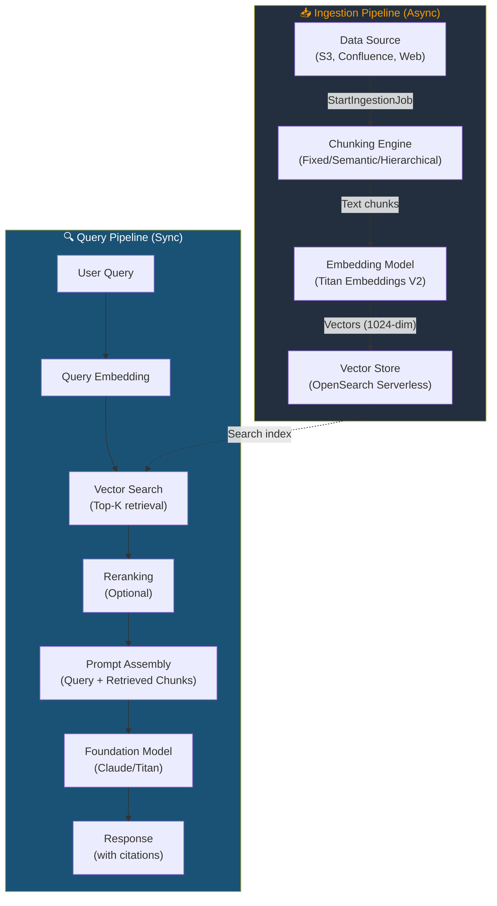
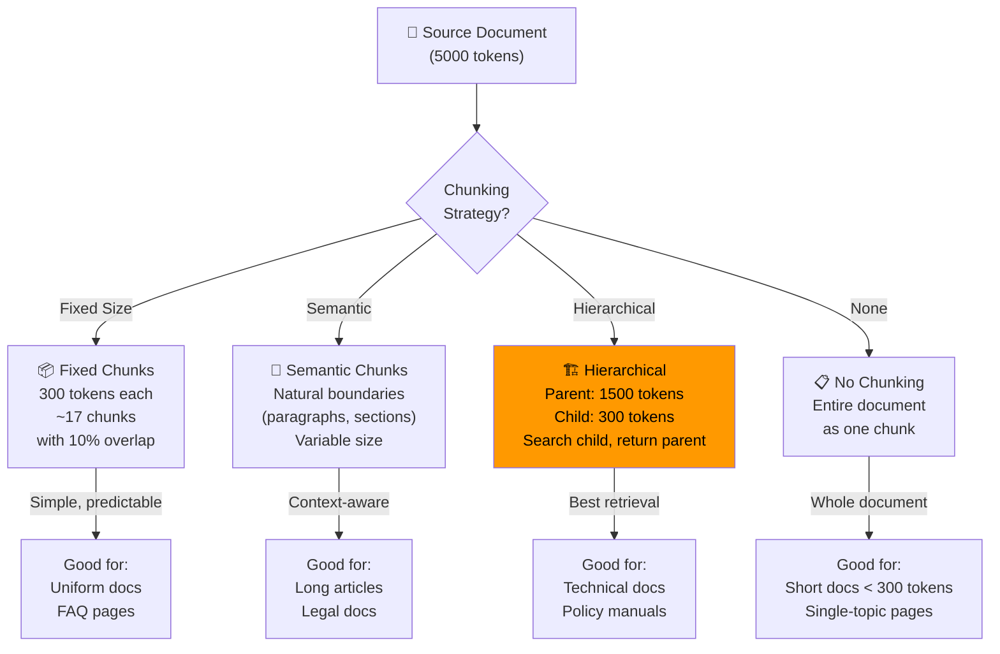
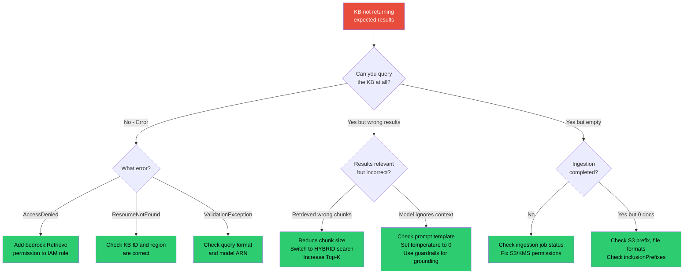

# 📚 Module 03 — Bedrock Knowledge Bases

> **Give Your Model a Brain** — Turn your documents into a searchable knowledge layer that grounds FM responses in facts.

---

## 🧠 1️⃣ Intuition — Why Knowledge Bases Exist

### The Problem

Foundation models are trained on public internet data up to a cutoff date. They don't know:
- Your company's internal policies
- Last week's product updates
- Customer-specific data
- Proprietary research

If you ask Claude "What's our refund policy?", it will **hallucinate** a plausible-sounding but completely fabricated answer.

### The Solution: Retrieval-Augmented Generation (RAG)

Instead of hoping the model knows the answer, you:
1. **Store** your documents in a searchable format (vectors)
2. **Retrieve** relevant chunks when a user asks a question
3. **Augment** the model's prompt with those chunks
4. **Generate** a response grounded in your actual data

**Bedrock Knowledge Bases** = managed RAG pipeline. AWS handles chunking, embedding, indexing, retrieval, and prompt augmentation.

### What Breaks Without It

Without a Knowledge Base:
- Model hallucinates facts about your company → ❌ Compliance risk
- Users get confidently wrong answers → ❌ Trust erosion
- You build custom RAG pipeline → ❌ Months of engineering effort

```
Without KB:  User → "What's our PTO policy?" → Model → "I think it's 15 days" → WRONG ❌
With KB:     User → "What's our PTO policy?" → KB retrieves HR doc → Model → "Per policy doc v3.2, 
             you get 20 days PTO plus 10 sick days..." → CORRECT ✅ (with citation)
```

---

## ⚙️ 2️⃣ Internal Working — The Full KB Pipeline

### Architecture Overview



### Step-by-Step: Creating a Knowledge Base

#### Step 1: Create the Knowledge Base

```python
import boto3

bedrock_agent = boto3.client('bedrock-agent', region_name='us-east-1')

# Create Knowledge Base
kb_response = bedrock_agent.create_knowledge_base(
    name='company-policies-kb',
    description='Company policy documents for employee assistant',
    roleArn='arn:aws:iam::123456789012:role/BedrockKBRole',
    knowledgeBaseConfiguration={
        'type': 'VECTOR',
        'vectorKnowledgeBaseConfiguration': {
            'embeddingModelArn': 'arn:aws:bedrock:us-east-1::foundation-model/amazon.titan-embed-text-v2:0',
            'embeddingModelConfiguration': {
                'bedrockEmbeddingModelConfiguration': {
                    'dimensions': 1024  # Titan V2 supports 256, 512, 1024
                }
            }
        }
    },
    storageConfiguration={
        'type': 'OPENSEARCH_SERVERLESS',
        'opensearchServerlessConfiguration': {
            'collectionArn': 'arn:aws:aoss:us-east-1:123456789012:collection/abc123',
            'vectorIndexName': 'company-policies-index',
            'fieldMapping': {
                'vectorField': 'embedding',
                'textField': 'text',
                'metadataField': 'metadata'
            }
        }
    }
)

kb_id = kb_response['knowledgeBase']['knowledgeBaseId']
```

#### Step 2: Add a Data Source

```python
# Add S3 data source
ds_response = bedrock_agent.create_data_source(
    knowledgeBaseId=kb_id,
    name='policy-docs-s3',
    description='Policy documents from S3',
    dataSourceConfiguration={
        'type': 'S3',
        's3Configuration': {
            'bucketArn': 'arn:aws:s3:::company-policy-docs',
            'inclusionPrefixes': ['policies/', 'handbooks/']
        }
    },
    vectorIngestionConfiguration={
        'chunkingConfiguration': {
            'chunkingStrategy': 'HIERARCHICAL',
            'hierarchicalChunkingConfiguration': {
                'levelConfigurations': [
                    {'maxTokens': 1500},  # Parent chunks
                    {'maxTokens': 300}    # Child chunks
                ],
                'overlapTokens': 60
            }
        }
    }
)

data_source_id = ds_response['dataSource']['dataSourceId']
```

#### Step 3: Start Ingestion

```python
# Trigger sync
ingestion = bedrock_agent.start_ingestion_job(
    knowledgeBaseId=kb_id,
    dataSourceId=data_source_id
)

ingestion_job_id = ingestion['ingestionJob']['ingestionJobId']

# Monitor sync status
import time
while True:
    status = bedrock_agent.get_ingestion_job(
        knowledgeBaseId=kb_id,
        dataSourceId=data_source_id,
        ingestionJobId=ingestion_job_id
    )
    job_status = status['ingestionJob']['status']
    print(f"Status: {job_status}")
    
    if job_status in ['COMPLETE', 'FAILED']:
        if job_status == 'FAILED':
            print(f"Failure: {status['ingestionJob'].get('failureReasons', 'Unknown')}")
        break
    time.sleep(10)
```

#### Step 4: Query the Knowledge Base

```python
bedrock_agent_runtime = boto3.client('bedrock-agent-runtime', region_name='us-east-1')

response = bedrock_agent_runtime.retrieve_and_generate(
    input={'text': 'What is our remote work policy?'},
    retrieveAndGenerateConfiguration={
        'type': 'KNOWLEDGE_BASE',
        'knowledgeBaseConfiguration': {
            'knowledgeBaseId': kb_id,
            'modelArn': 'arn:aws:bedrock:us-east-1::foundation-model/anthropic.claude-3-5-sonnet-20241022-v2:0',
            'retrievalConfiguration': {
                'vectorSearchConfiguration': {
                    'numberOfResults': 5,
                    'overrideSearchType': 'HYBRID'  # Semantic + keyword
                }
            },
            'generationConfiguration': {
                'inferenceConfig': {
                    'textInferenceConfig': {
                        'maxTokens': 1024,
                        'temperature': 0.0  # Deterministic for factual queries
                    }
                }
            }
        }
    }
)

print(response['output']['text'])

# Print citations
for citation in response.get('citations', []):
    for ref in citation.get('retrievedReferences', []):
        print(f"Source: {ref['location']['s3Location']['uri']}")
        print(f"Score: {ref.get('score', 'N/A')}")
```

---

### Data Sources Supported

| Source Type | Description | Sync Method | GameDay Relevance |
|---|---|---|---|
| **Amazon S3** | Files in S3 buckets (PDF, TXT, MD, HTML, CSV, DOCX, XLS) | Manual or scheduled | ⭐⭐⭐⭐⭐ |
| **Confluence** | Atlassian Confluence pages | OAuth2 connector | ⭐⭐ |
| **SharePoint** | Microsoft SharePoint Online | OAuth2 connector | ⭐⭐ |
| **Web Crawler** | Public web pages | URL seed list | ⭐⭐⭐ |
| **Salesforce** | Salesforce knowledge articles | OAuth2 connector | ⭐ |
| **Custom** | Any source via Lambda connector | Custom Lambda function | ⭐⭐⭐ |

---

### Chunking Strategies — The Most Critical Decision



| Strategy | Pros | Cons | Best For |
|---|---|---|---|
| **Fixed Size** (default) | Simple, predictable | May split mid-sentence | FAQ, short docs |
| **Semantic** | Respects document structure | Variable chunk sizes | Articles, reports |
| **Hierarchical** ⭐ | Best retrieval quality | More storage, complex | Technical docs, policies |
| **No Chunking** | Preserves full context | Only works for short docs | Single-page docs |

**GameDay Tip**: Hierarchical chunking with parent chunks of 1500 tokens and child chunks of 300 tokens is the **gold standard** for most use cases. It searches at the granular child level but returns the broader parent context to the model.

---

### Vector Store Options

| Store | Type | Managed By | Cost | Setup Effort |
|---|---|---|---|---|
| **OpenSearch Serverless** ⭐ | Serverless | Bedrock auto-creates | ~$700/month (2 OCU min) | Low |
| **Aurora PostgreSQL** (pgvector) | Provisioned | You manage | ~$200/month | Medium |
| **Pinecone** | Serverless (external) | Pinecone | Based on usage | Low |
| **Redis Enterprise** | Managed | Redis | Based on usage | Medium |
| **MongoDB Atlas** | Managed | MongoDB | Based on usage | Medium |
| **Neptune Analytics** | Serverless | AWS | Based on usage | Medium |

**GameDay Default**: AWS typically provisions **OpenSearch Serverless** in GameDay environments. Know its quirks:
- Minimum 2 OCUs (Opensearch Compute Units) — cannot scale to zero
- Collection types: `VECTORSEARCH` for KB
- Index needs explicit creation with k-NN settings

---

## 🏗️ 3️⃣ Production Usage

### ✅ Best Practices

1. **Use hierarchical chunking** for documents longer than 1 page
2. **Set `overrideSearchType: 'HYBRID'`** for better retrieval (combines semantic + keyword)
3. **Use `temperature: 0.0`** for factual Q&A to minimize hallucination
4. **Schedule ingestion jobs** for frequently updated data sources
5. **Enable metadata filtering** to scope retrieval by document category
6. **Monitor ingestion job failures** with CloudWatch Events
7. **Use guardrails** with the Knowledge Base to prevent PII leakage

### ❌ Anti-Patterns

| Anti-Pattern | Consequence | Fix |
|---|---|---|
| Single giant chunk per document | Poor retrieval, context overflow | Use hierarchical chunking |
| No overlap between chunks | Lost context at chunk boundaries | Set 10-20% overlap |
| Ingesting non-text files (images, videos) | Ingestion failure or garbage text | Use Textract for PDFs with images |
| Not monitoring ingestion status | Silent failures, stale data | Check ingestion job status |
| Using `SEMANTIC` search only | Misses keyword-critical queries | Use `HYBRID` search |
| Too many results (Top-K > 10) | Context window overflow, noise | Start with K=5, tune |

---

## 🎮 4️⃣ GameDay Relevance

### Top 5 Knowledge Base Failures in GameDay

| # | Failure | Symptom | Root Cause | Fix |
|---|---------|---------|-----------|-----|
| 1 | **Ingestion stuck** | Status: `IN_PROGRESS` for 30+ min | S3 bucket policy missing, KMS key access denied | Add `s3:GetObject` and `kms:Decrypt` to KB role |
| 2 | **Empty retrieval** | Query returns 0 results | Embedding dimension mismatch between model and index | Recreate index with correct dimensions (1024 for Titan V2) |
| 3 | **Wrong answers** | Model returns irrelevant info | Chunk size too large, poor chunking strategy | Switch to hierarchical chunking, reduce child chunk size |
| 4 | **Permission denied** | `AccessDeniedException` on query | Missing `bedrock:Retrieve` permission | Add `bedrock:Retrieve` and `bedrock:RetrieveAndGenerate` to caller role |
| 5 | **Stale data** | KB returns outdated info | Ingestion not re-run after S3 update | Schedule or trigger re-ingestion |

### GameDay Debugging Flowchart



### Required IAM Permissions for Knowledge Base

```json
{
    "Version": "2012-10-17",
    "Statement": [
        {
            "Sid": "BedrockKBIngestion",
            "Effect": "Allow",
            "Action": [
                "bedrock:CreateKnowledgeBase",
                "bedrock:CreateDataSource",
                "bedrock:StartIngestionJob",
                "bedrock:GetIngestionJob",
                "bedrock:ListIngestionJobs"
            ],
            "Resource": "*"
        },
        {
            "Sid": "S3Access",
            "Effect": "Allow",
            "Action": [
                "s3:GetObject",
                "s3:ListBucket"
            ],
            "Resource": [
                "arn:aws:s3:::company-policy-docs",
                "arn:aws:s3:::company-policy-docs/*"
            ]
        },
        {
            "Sid": "EmbeddingModel",
            "Effect": "Allow",
            "Action": "bedrock:InvokeModel",
            "Resource": "arn:aws:bedrock:us-east-1::foundation-model/amazon.titan-embed-text-v2:0"
        },
        {
            "Sid": "OpenSearchAccess",
            "Effect": "Allow",
            "Action": "aoss:APIAccessAll",
            "Resource": "arn:aws:aoss:us-east-1:123456789012:collection/*"
        }
    ]
}
```

---

## 💼 5️⃣ Interview Perspective

### Q1: "Walk me through how Bedrock Knowledge Bases work end-to-end."

**Model Answer**:
> "Bedrock Knowledge Bases implements a fully managed RAG pipeline with two phases:
>
> **Ingestion** (async): When I add an S3 data source and start an ingestion job, Bedrock reads each file, parses it (PDF, DOCX, HTML, etc.), applies my chosen chunking strategy (I prefer hierarchical — 1500-token parent, 300-token child chunks with overlap), generates embeddings using the configured model (Titan Embeddings V2 at 1024 dimensions), and stores the vectors in the connected vector store (typically OpenSearch Serverless).
>
> **Query** (sync): When a user sends a query via `RetrieveAndGenerate`, Bedrock embeds the query using the same model, performs a vector similarity search (optionally hybrid with keyword matching) to find the top-K most relevant chunks, assembles a prompt with the query + retrieved context + system instructions, sends this to the configured FM (e.g., Claude), and returns the response with source citations.
>
> The key architectural decisions are: chunking strategy (hierarchical for most cases), vector store choice (OpenSearch Serverless for fully managed, Aurora pgvector for cost optimization), and search type (hybrid for best recall)."

### Q2: "Your Knowledge Base is returning wrong answers. How do you debug?"

**Model Answer**:
> "I'd debug layer by layer:
> 1. **Retrieval quality** — Use the `Retrieve` API (not `RetrieveAndGenerate`) to see the raw chunks being retrieved. If they're irrelevant, it's a retrieval problem — I'd check chunking strategy, increase Top-K, or switch to hybrid search.
> 2. **Embedding alignment** — Ensure the query embedding dimensions match the index. Titan V2 defaults to 1024; if the index was created with 256, there's a mismatch.
> 3. **Ingestion completeness** — Check if the ingestion job completed successfully and all documents were processed. Look for failure reasons in the job status.
> 4. **Generation quality** — If retrieval is good but answers are bad, the issue is in the prompt or model. Set temperature to 0, add a system prompt emphasizing 'only answer from the provided context', and consider using contextual grounding guardrails.
> 5. **Data freshness** — If the source documents were updated but ingestion wasn't re-run, the KB has stale data."

---

<p align="center">
  <a href="../02-Bedrock-Core/README.md">← Previous: Bedrock Core</a> · <a href="../04-Bedrock-Agents/README.md"><b>Next → 04 Bedrock Agents</b></a>
</p>
