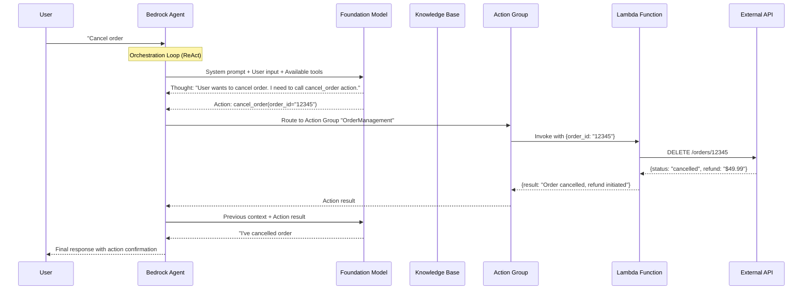
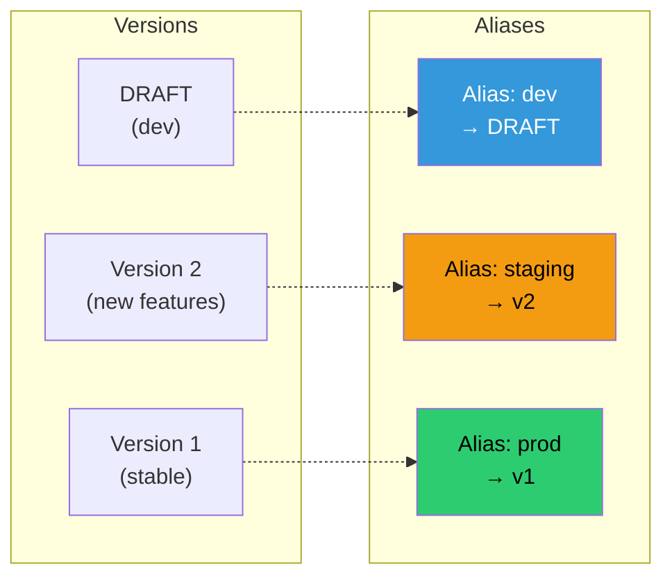

# 🤖 Module 04 — Bedrock Agents

> **Give Your AI Hands** — Agents don't just answer questions — they take actions, call APIs, and orchestrate multi-step workflows.

---

## 🧠 1️⃣ Intuition — Why Agents Exist

### The Limitation of Chat

A Knowledge Base answers questions from documents. But what if the user says:
- "Cancel my order #12345"
- "Schedule a meeting with the engineering team for Friday"
- "Check the current stock price of AAPL and buy 10 shares"

These require **actions**, not just text generation. The model needs to:
1. Understand the user's intent
2. Decide which tool/API to call
3. Extract the right parameters
4. Execute the action
5. Report the result

**Bedrock Agents** = an orchestration layer that connects foundation models to **action groups** (Lambda functions with OpenAPI schemas).

### What Breaks Without Agents

Without agents, you'd build this manually:
- Parse model output for tool calls → fragile regex parsing
- Route to correct Lambda function → custom routing logic
- Handle conversation state → DynamoDB session management
- Manage retries and errors → custom error handling
- Chain multiple tool calls → complex state machine

Bedrock Agents handles all of this with a declarative configuration.

```
Without Agent:  User → Lambda → Parse intent → Which tool? → Call API → 
                Format response → Handle errors → Return
                (500+ lines of custom orchestration code)

With Agent:     User → Bedrock Agent → [Automatic orchestration] → 
                Action Group (Lambda) → Response with result
                (50 lines of Lambda + OpenAPI spec)
```

---

## ⚙️ 2️⃣ Internal Working — Agent Architecture

### Request Flow



### Core Components

```
┌──────────────────────────────────────────────────────────┐
│                    BEDROCK AGENT                          │
│                                                          │
│  ┌──────────────┐  ┌──────────────┐  ┌──────────────┐  │
│  │ Instructions │  │ Foundation   │  │   Session    │  │
│  │ (System      │  │ Model        │  │   Memory     │  │
│  │  Prompt)     │  │ (Claude/     │  │ (Conversation│  │
│  │              │  │  Titan)      │  │   History)   │  │
│  └──────────────┘  └──────────────┘  └──────────────┘  │
│                                                          │
│  ┌─────────────────────────────────────────────────────┐│
│  │              ACTION GROUPS                           ││
│  │  ┌─────────────┐  ┌─────────────┐  ┌────────────┐ ││
│  │  │ Order Mgmt  │  │ User Lookup │  │ KB Search  │ ││
│  │  │ (Lambda)    │  │ (Lambda)    │  │ (Built-in) │ ││
│  │  │             │  │             │  │            │ ││
│  │  │ - cancel    │  │ - get_user  │  │ Knowledge  │ ││
│  │  │ - status    │  │ - update    │  │ Base       │ ││
│  │  │ - refund    │  │ - delete    │  │ Retrieval  │ ││
│  │  └─────────────┘  └─────────────┘  └────────────┘ ││
│  └─────────────────────────────────────────────────────┘│
│                                                          │
│  ┌──────────────┐  ┌──────────────┐  ┌──────────────┐  │
│  │  Guardrails  │  │  Versioning  │  │   Aliases    │  │
│  │ (Content     │  │ (Draft/v1/   │  │ (prod/dev/   │  │
│  │  Safety)     │  │  v2...)      │  │  staging)    │  │
│  └──────────────┘  └──────────────┘  └──────────────┘  │
└──────────────────────────────────────────────────────────┘
```

### The ReAct Orchestration Loop

Bedrock Agents use the **ReAct** (Reasoning + Acting) pattern internally:

```
1. THOUGHT:  "The user wants to cancel order #12345. I should use the cancel_order action."
2. ACTION:   cancel_order(order_id="12345")
3. OBSERVATION: {status: "cancelled", refund: "$49.99"}
4. THOUGHT:  "The order has been cancelled and a refund initiated. I should inform the user."
5. FINAL ANSWER: "I've cancelled order #12345. A refund of $49.99 has been initiated to your card."
```

This loop can iterate **up to 10 times** per invocation (configurable), allowing multi-step reasoning.

---

### Building an Agent — Complete Walkthrough

#### Step 1: Create the Agent

```python
import boto3
import json

bedrock_agent = boto3.client('bedrock-agent', region_name='us-east-1')

agent_response = bedrock_agent.create_agent(
    agentName='customer-service-agent',
    description='AI agent for customer service operations',
    foundationModel='anthropic.claude-3-5-sonnet-20241022-v2:0',
    instruction="""You are a helpful customer service agent for an e-commerce company.

Your capabilities:
1. Look up order status using order IDs
2. Cancel orders that haven't shipped
3. Process refunds for returned items
4. Search the knowledge base for policy questions

Rules:
- Always confirm the action before executing it
- Never process a refund without verifying the order exists
- For policy questions, always cite the source document
- If you're unsure, escalate to a human agent
- Never reveal internal system details to customers""",
    agentResourceRoleArn='arn:aws:iam::123456789012:role/BedrockAgentRole',
    idleSessionTTLInSeconds=1800  # 30-minute session timeout
)

agent_id = agent_response['agent']['agentId']
```

#### Step 2: Define Action Group with OpenAPI Schema

```python
# OpenAPI schema for Order Management actions
openapi_schema = {
    "openapi": "3.0.0",
    "info": {"title": "Order Management API", "version": "1.0.0"},
    "paths": {
        "/orders/{orderId}/status": {
            "get": {
                "operationId": "getOrderStatus",
                "summary": "Get the current status of an order",
                "description": "Returns the order status including shipping and delivery information",
                "parameters": [
                    {
                        "name": "orderId",
                        "in": "path",
                        "required": True,
                        "schema": {"type": "string"},
                        "description": "The unique order identifier (e.g., ORD-12345)"
                    }
                ],
                "responses": {
                    "200": {
                        "description": "Order status retrieved successfully",
                        "content": {
                            "application/json": {
                                "schema": {
                                    "type": "object",
                                    "properties": {
                                        "orderId": {"type": "string"},
                                        "status": {"type": "string", "enum": ["pending", "processing", "shipped", "delivered", "cancelled"]},
                                        "estimatedDelivery": {"type": "string"},
                                        "trackingNumber": {"type": "string"}
                                    }
                                }
                            }
                        }
                    }
                }
            }
        },
        "/orders/{orderId}/cancel": {
            "post": {
                "operationId": "cancelOrder",
                "summary": "Cancel an order",
                "description": "Cancels an order if it hasn't been shipped yet. Returns cancellation confirmation and refund details.",
                "parameters": [
                    {
                        "name": "orderId",
                        "in": "path",
                        "required": True,
                        "schema": {"type": "string"},
                        "description": "The order ID to cancel"
                    }
                ],
                "requestBody": {
                    "required": True,
                    "content": {
                        "application/json": {
                            "schema": {
                                "type": "object",
                                "properties": {
                                    "reason": {"type": "string", "description": "Reason for cancellation"}
                                },
                                "required": ["reason"]
                            }
                        }
                    }
                },
                "responses": {
                    "200": {"description": "Order cancelled successfully"}
                }
            }
        }
    }
}

# Create action group
ag_response = bedrock_agent.create_agent_action_group(
    agentId=agent_id,
    agentVersion='DRAFT',
    actionGroupName='OrderManagement',
    description='Actions for managing customer orders',
    actionGroupExecutor={
        'lambda': 'arn:aws:lambda:us-east-1:123456789012:function:order-management'
    },
    apiSchema={
        'payload': json.dumps(openapi_schema)
    }
)
```

#### Step 3: Lambda Function for Action Group

```python
# Lambda function: order-management
import json

def lambda_handler(event, context):
    """
    Bedrock Agent action group Lambda handler.
    
    Event structure:
    {
        "actionGroup": "OrderManagement",
        "apiPath": "/orders/{orderId}/status",
        "httpMethod": "GET",
        "parameters": [{"name": "orderId", "value": "ORD-12345"}],
        "requestBody": { ... },
        "sessionAttributes": { ... },
        "promptSessionAttributes": { ... }
    }
    """
    action_group = event.get('actionGroup', '')
    api_path = event.get('apiPath', '')
    http_method = event.get('httpMethod', '')
    parameters = {p['name']: p['value'] for p in event.get('parameters', [])}
    
    # Route to the correct handler
    if api_path == '/orders/{orderId}/status' and http_method == 'GET':
        order_id = parameters.get('orderId')
        result = get_order_status(order_id)
        
    elif api_path == '/orders/{orderId}/cancel' and http_method == 'POST':
        order_id = parameters.get('orderId')
        body = event.get('requestBody', {}).get('content', {}).get('application/json', {}).get('properties', {})
        reason = body.get('reason', {}).get('value', 'Not specified')
        result = cancel_order(order_id, reason)
    
    else:
        result = {"error": f"Unknown action: {http_method} {api_path}"}
    
    # Return in Bedrock Agent expected format
    return {
        "messageVersion": "1.0",
        "response": {
            "actionGroup": action_group,
            "apiPath": api_path,
            "httpMethod": http_method,
            "httpStatusCode": 200,
            "responseBody": {
                "application/json": {
                    "body": json.dumps(result)
                }
            }
        }
    }

def get_order_status(order_id):
    # In production: query DynamoDB/RDS
    return {
        "orderId": order_id,
        "status": "shipped",
        "estimatedDelivery": "2026-06-15",
        "trackingNumber": "TRK-789456"
    }

def cancel_order(order_id, reason):
    # In production: update order in database
    return {
        "orderId": order_id,
        "status": "cancelled",
        "refundAmount": "$49.99",
        "refundMethod": "original payment method",
        "reason": reason
    }
```

#### Step 4: Prepare and Test

```python
# Prepare the agent (creates a snapshot for testing)
bedrock_agent.prepare_agent(agentId=agent_id)

# Wait for preparation
import time
while True:
    agent = bedrock_agent.get_agent(agentId=agent_id)
    status = agent['agent']['agentStatus']
    if status == 'PREPARED':
        break
    time.sleep(5)

# Test with invoke_agent
bedrock_agent_runtime = boto3.client('bedrock-agent-runtime', region_name='us-east-1')

response = bedrock_agent_runtime.invoke_agent(
    agentId=agent_id,
    agentAliasId='TSTALIASID',  # Use test alias for DRAFT
    sessionId='test-session-001',
    inputText='What is the status of order ORD-12345?'
)

# Process streaming response
for event in response['completion']:
    if 'chunk' in event:
        chunk_text = event['chunk']['bytes'].decode('utf-8')
        print(chunk_text, end='')
```

---

### Agent Versioning and Aliases



**Key Concept**: Always use **aliases** in production, never hardcode version numbers. This enables:
- Blue/green deployments
- Canary releases (route 10% to new version)
- Instant rollback by repointing alias

---

### Multi-Agent Collaboration

Bedrock supports **supervisor agents** that orchestrate multiple sub-agents:

```
┌──────────────────────────────────────────────────────┐
│              SUPERVISOR AGENT                         │
│  "Route customer requests to the right specialist"   │
│                                                      │
│  ┌──────────────┐ ┌──────────────┐ ┌──────────────┐│
│  │ Order Agent  │ │ Billing Agent│ │ Tech Support │ │
│  │              │ │              │ │   Agent      │ │
│  │ - Status     │ │ - Invoices   │ │ - Debug      │ │
│  │ - Cancel     │ │ - Payments   │ │ - Logs       │ │
│  │ - Return     │ │ - Disputes   │ │ - Restart    │ │
│  └──────────────┘ └──────────────┘ └──────────────┘│
└──────────────────────────────────────────────────────┘
```

---

## 🏗️ 3️⃣ Production Usage

### ✅ Best Practices

1. **Keep instructions specific** — Vague instructions lead to unpredictable tool selection
2. **Use descriptive OpenAPI descriptions** — The model reads these to decide when to use each tool
3. **Implement idempotent actions** — Agents may retry; `cancelOrder` should be safe to call twice
4. **Set session TTL appropriately** — Too short = lost context; too long = stale sessions
5. **Version your agents** — Never point production traffic at `DRAFT`
6. **Add guardrails** — Especially for agents that can take destructive actions
7. **Lambda timeouts** — Set Lambda timeout to 30-60s for agents (they may call external APIs)

### ❌ Anti-Patterns

| Anti-Pattern | Why It's Bad | Fix |
|---|---|---|
| Vague instructions | Agent calls wrong tools | Be specific about when each tool should be used |
| No confirmation step | Agent executes destructive actions immediately | Add "confirm before executing" in instructions |
| Missing error handling in Lambda | Agent gets cryptic errors | Return clear error messages in Lambda response |
| Too many action groups | Agent gets confused about which to use | Group related actions, limit to 5-7 action groups |
| No session management | Agent forgets context mid-conversation | Enable session memory, set appropriate TTL |
| Using DRAFT in production | Breaking changes affect users | Create versions and use aliases |

---

## 🎮 4️⃣ GameDay Relevance

### Top Agent Failures in GameDay

| # | Failure | Symptom | Root Cause | Fix |
|---|---------|---------|-----------|-----|
| 1 | **Lambda not invoked** | Agent responds but never calls tools | OpenAPI schema doesn't match Lambda routing | Verify `apiPath` and `httpMethod` match Lambda handler |
| 2 | **Lambda timeout** | Agent hangs for 30s then errors | Lambda timeout too short for external API calls | Increase Lambda timeout to 60s |
| 3 | **Permission denied** | `AccessDeniedException` invoking Lambda | Agent role missing `lambda:InvokeFunction` | Add Lambda invoke permission to agent role |
| 4 | **Wrong parameters** | Lambda receives empty/wrong params | OpenAPI parameter names don't match Lambda expectations | Ensure `parameters[].name` matches exactly |
| 5 | **Agent not prepared** | `ConflictException` on invoke | Agent changes not prepared after modification | Call `prepare_agent` after any changes |
| 6 | **Infinite loop** | Agent calls same tool repeatedly | Missing stop condition in instructions | Add "stop after X attempts" in instructions |

### Required IAM for Agent

```json
{
    "Version": "2012-10-17",
    "Statement": [
        {
            "Sid": "BedrockAgentModel",
            "Effect": "Allow",
            "Action": "bedrock:InvokeModel",
            "Resource": "arn:aws:bedrock:us-east-1::foundation-model/anthropic.claude-3-5-sonnet*"
        },
        {
            "Sid": "LambdaInvoke",
            "Effect": "Allow",
            "Action": "lambda:InvokeFunction",
            "Resource": "arn:aws:lambda:us-east-1:123456789012:function:order-management"
        },
        {
            "Sid": "KnowledgeBaseAccess",
            "Effect": "Allow",
            "Action": [
                "bedrock:Retrieve",
                "bedrock:RetrieveAndGenerate"
            ],
            "Resource": "arn:aws:bedrock:us-east-1:123456789012:knowledge-base/*"
        }
    ]
}
```

---

## 💼 5️⃣ Interview Perspective

### Q1: "How do Bedrock Agents decide which tool to call?"

**Model Answer**:
> "Bedrock Agents use the ReAct pattern internally. When a user sends a message, the agent includes the user's input plus the full list of available tools (from OpenAPI schemas) in the prompt to the foundation model. The model reasons about which tool is most appropriate based on:
> 1. The **operation description** in the OpenAPI schema — this is why well-written descriptions are critical
> 2. The **agent instructions** — which can include rules about when to use specific tools
> 3. The **conversation history** — what the user has said before
>
> The model outputs a structured response indicating which tool to call and with what parameters. Bedrock parses this, invokes the corresponding Lambda function, and feeds the result back to the model for the next reasoning step. This loop continues up to 10 iterations or until the model decides it has enough information to give a final answer."

### Q2: "How would you design a multi-agent system for a large enterprise?"

**Model Answer**:
> "I'd use Bedrock's supervisor-agent pattern:
> 1. **Supervisor Agent** — routes requests to specialized sub-agents based on intent classification
> 2. **Specialized Sub-Agents** — each focused on a domain (orders, billing, support) with their own action groups and Knowledge Bases
> 3. **Shared Knowledge Base** — for common information (company policies, FAQ)
> 4. **Session Continuity** — pass session attributes between agents for context
>
> Key design decisions: Keep each agent's instruction set small and focused (< 500 words), limit action groups to 5-7 per agent, use aliases for independent deployment, and implement guardrails on the supervisor to prevent routing to the wrong agent. For observability, log all agent traces to CloudWatch with trace ID correlation across agents."

### Q3: "What's the difference between Bedrock Agents and Step Functions for AI orchestration?"

**Model Answer**:
> "They solve different problems:
> - **Bedrock Agents** are for **dynamic, language-driven orchestration** — the FM decides what to do next based on conversation context. Great for conversational AI where the flow isn't predetermined.
> - **Step Functions** are for **deterministic, workflow-driven orchestration** — you define the exact sequence of steps in advance. Great for batch processing, ETL pipelines, or when the flow is predictable.
>
> In practice, they often work together: a Bedrock Agent handles the conversational front-end, and when it needs to trigger a complex multi-step process (like order fulfillment), it invokes a Step Functions workflow via a Lambda action group."

---

<p align="center">
  <a href="../03-Bedrock-Knowledge-Bases/README.md">← Previous: Bedrock Knowledge Bases</a> · <a href="../05-Agentic-AI/README.md"><b>Next → 05 Agentic AI</b></a>
</p>
