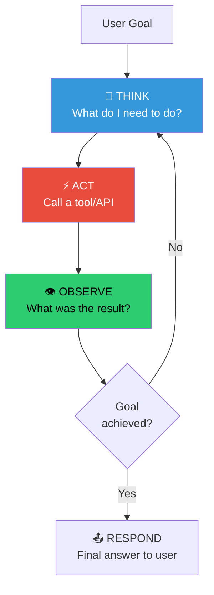
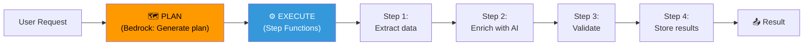

# 🕸️ Module 05 — Agentic AI on AWS

> **Beyond Chat** — Design autonomous AI systems that reason, plan, and act across multi-step workflows on AWS.

---

## 🧠 1️⃣ Intuition — Why Agentic AI Matters

### The Evolution of AI Applications

```
Level 0: Static Prompting    → "Summarize this text" → One-shot response
Level 1: RAG                 → "Answer using these docs" → Grounded response  
Level 2: Tool Use            → "Check the weather" → Call API + respond
Level 3: Single Agent        → "Book me a flight" → Multi-step reasoning + actions
Level 4: Multi-Agent System  → "Plan my vacation" → Multiple specialized agents collaborating
```

**Agentic AI** is Levels 3-4: AI systems that autonomously decompose complex goals into steps, decide which tools to use, handle errors, and iterate until the goal is achieved.

### Why This Matters for GameDay

GameDay 2025+ challenges increasingly involve **agentic workflows** — not just calling a model, but building systems where the model orchestrates complex processes. Understanding agentic patterns is the difference between solving simple "invoke model" challenges and dominating multi-step scenario challenges.

---

## ⚙️ 2️⃣ Internal Working — Agentic Patterns on AWS

### Pattern 1: ReAct Agent (Bedrock Agents)

The most common pattern. The model thinks, acts, observes, and repeats.



**AWS Implementation**: Bedrock Agents (see [Module 04](../04-Bedrock-Agents/README.md))

### Pattern 2: Plan-and-Execute (Step Functions + Bedrock)

For deterministic multi-step workflows where the plan is known upfront.



```python
# Step Functions state machine with Bedrock integration
state_machine_definition = {
    "Comment": "AI Document Processing Pipeline",
    "StartAt": "ExtractText",
    "States": {
        "ExtractText": {
            "Type": "Task",
            "Resource": "arn:aws:states:::textract:analyzeDocument",
            "Parameters": {
                "Document": {"S3Object": {"Bucket.$": "$.bucket", "Name.$": "$.key"}}
            },
            "Next": "ClassifyDocument"
        },
        "ClassifyDocument": {
            "Type": "Task",
            "Resource": "arn:aws:states:::bedrock:invokeModel",
            "Parameters": {
                "ModelId": "anthropic.claude-3-5-sonnet-20241022-v2:0",
                "ContentType": "application/json",
                "Body": {
                    "anthropic_version": "bedrock-2023-05-31",
                    "max_tokens": 256,
                    "messages": [{
                        "role": "user",
                        "content.$": "States.Format('Classify this document into one of: invoice, contract, letter, report.\n\nDocument text:\n{}', $.extractedText)"
                    }]
                }
            },
            "Next": "RouteByType"
        },
        "RouteByType": {
            "Type": "Choice",
            "Choices": [
                {"Variable": "$.classification", "StringEquals": "invoice", "Next": "ProcessInvoice"},
                {"Variable": "$.classification", "StringEquals": "contract", "Next": "ProcessContract"}
            ],
            "Default": "ProcessGeneric"
        },
        "ProcessInvoice": {"Type": "Task", "Resource": "arn:aws:lambda:...", "End": True},
        "ProcessContract": {"Type": "Task", "Resource": "arn:aws:lambda:...", "End": True},
        "ProcessGeneric": {"Type": "Task", "Resource": "arn:aws:lambda:...", "End": True}
    }
}
```

### Pattern 3: Multi-Agent Supervisor (Bedrock Multi-Agent)

```
┌──────────────────────────────────────────────────────────────┐
│                    SUPERVISOR AGENT                            │
│  Model: Claude 3.5 Sonnet                                     │
│  Role: "Route to specialist, aggregate results"               │
│                                                                │
│  ┌────────────────┐  ┌────────────────┐  ┌────────────────┐  │
│  │ Research Agent  │  │  Writer Agent   │  │  Review Agent  │  │
│  │                 │  │                 │  │                │  │
│  │ KB: Tech docs   │  │ No KB           │  │ KB: Style guide│  │
│  │ Tools: Search   │  │ Tools: None     │  │ Tools: Grammar │  │
│  │ Model: Claude   │  │ Model: Claude   │  │ Model: Haiku   │  │
│  └────────────────┘  └────────────────┘  └────────────────┘  │
└──────────────────────────────────────────────────────────────┘
```

### Pattern 4: Event-Driven Agent (EventBridge + Lambda + Bedrock)

For async, reactive agent systems that respond to events.

```python
# Lambda triggered by EventBridge rule
def lambda_handler(event, context):
    """React to S3 upload events with AI processing."""
    
    bedrock = boto3.client('bedrock-runtime')
    
    # Parse event
    bucket = event['detail']['bucket']['name']
    key = event['detail']['object']['key']
    
    # Read document
    s3 = boto3.client('s3')
    doc = s3.get_object(Bucket=bucket, Key=key)['Body'].read().decode()
    
    # AI-powered classification and action
    response = bedrock.converse(
        modelId='anthropic.claude-3-5-sonnet-20241022-v2:0',
        messages=[{"role": "user", "content": [{"text": f"Classify and extract key info:\n{doc}"}]}],
        system=[{"text": "Extract: document_type, priority, action_required. Return JSON."}],
        inferenceConfig={"maxTokens": 512, "temperature": 0}
    )
    
    result = json.loads(response['output']['message']['content'][0]['text'])
    
    # Route based on AI classification
    if result['priority'] == 'high':
        sns = boto3.client('sns')
        sns.publish(TopicArn='arn:aws:sns:...:urgent-docs', Message=json.dumps(result))
    
    return result
```

---

## 🏗️ 3️⃣ Production Usage

### Choosing the Right Agentic Pattern

| Pattern | Use When | AWS Services | Complexity |
|---|---|---|---|
| **ReAct (Bedrock Agent)** | Conversational, dynamic flow | Bedrock Agents, Lambda | Medium |
| **Plan-and-Execute** | Deterministic pipeline | Step Functions, Bedrock, Lambda | Medium |
| **Multi-Agent Supervisor** | Multiple specialized domains | Bedrock Multi-Agent Collaboration | High |
| **Event-Driven** | Async, reactive processing | EventBridge, Lambda, Bedrock | Low-Medium |
| **Human-in-the-Loop** | High-stakes decisions | Step Functions (wait for callback), Bedrock | Medium |

### ✅ Best Practices

1. **Start simple** — Single ReAct agent before multi-agent
2. **Limit tool count** — 5-7 tools per agent maximum
3. **Implement guardrails** — Especially for agents that can take destructive actions
4. **Add observability** — Log every thought/action/observation step
5. **Set iteration limits** — Cap ReAct loops to prevent runaway costs
6. **Use session memory wisely** — Clear irrelevant context to stay within token limits

### ❌ Anti-Patterns

| Anti-Pattern | Risk | Fix |
|---|---|---|
| One agent with 20+ tools | Confusion, wrong tool selection | Split into specialized sub-agents |
| No iteration limit | Infinite loops, cost explosion | Set max iterations (5-10) |
| No fallback for agent failures | User gets cryptic errors | Implement graceful degradation |
| Synchronous multi-agent calls | 30+ second response times | Use async patterns with Step Functions |

---

## 🎮 4️⃣ GameDay Relevance

### GameDay Agentic Scenarios

| Scenario | Pattern Needed | Key Skills |
|---|---|---|
| "Build a doc processing pipeline" | Plan-and-Execute | Step Functions + Bedrock integration |
| "Create a customer service agent" | ReAct | Bedrock Agent + action groups |
| "Debug why the agent calls wrong tool" | ReAct | OpenAPI schema debugging |
| "Optimize multi-step agent latency" | Any | Streaming, caching, parallel calls |

---

## 💼 5️⃣ Interview Perspective

### Q: "How would you design a multi-agent system for a banking platform?"

**Model Answer**:
> "I'd design a supervisor-agent architecture:
> - **Supervisor Agent** classifies intent (account inquiry, loan application, fraud alert, general FAQ)
> - **Account Agent** with action groups for balance, transactions, transfers — connected to core banking API via Lambda
> - **Loan Agent** with Knowledge Base of loan products and action groups for application submission
> - **Fraud Agent** with real-time transaction monitoring tools and escalation to human reviewers
>
> Key guardrails: PII redaction on all responses, transaction limits without human approval, audit logging of every action. The supervisor uses Claude 3.5 Sonnet for complex routing; specialized agents can use Haiku for cost optimization on simpler tasks."

---

<p align="center">
  <a href="../04-Bedrock-Agents/README.md">← Previous: Bedrock Agents</a> · <a href="../06-MCP/README.md"><b>Next → 06 MCP</b></a>
</p>
