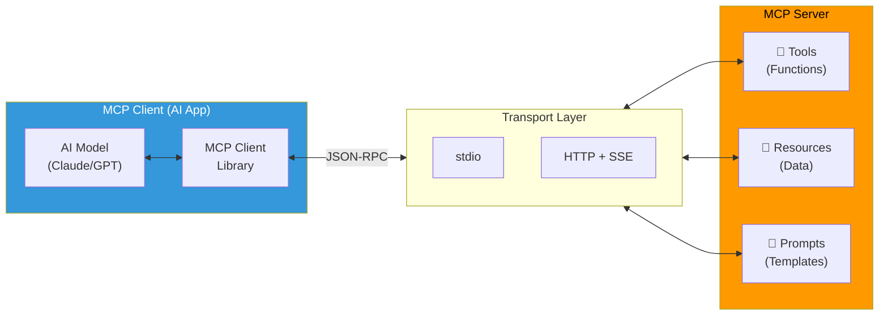

# 🔌 Module 06 — Model Context Protocol (MCP)

> **The USB-C of AI** — A universal standard for connecting AI models to tools, data sources, and services.

---

## 🧠 1️⃣ Intuition — Why MCP Exists

### The Problem: Tool Integration Fragmentation

Every AI framework defines tool integration differently:
- OpenAI uses **function calling** with JSON schemas
- Anthropic uses **tool_use** blocks in the API
- LangChain uses **Tool** classes
- Bedrock uses **action groups** with OpenAPI specs

If you build a "weather lookup" tool, you implement it 4 different times for 4 different systems.

### The Solution: One Protocol to Rule Them All

**MCP (Model Context Protocol)** is an open standard that defines:
- How AI models **discover** available tools
- How models **invoke** tools with structured parameters
- How tools **return** results to models
- How tools expose **resources** (files, data) and **prompts** (templates)

**Analogy**: MCP is to AI tools what HTTP is to web services — a universal protocol that any client and server can speak.

### MCP on AWS

While MCP is framework-agnostic, on AWS it integrates with:
- **Bedrock Agents** → action groups can expose MCP-compatible tools
- **Lambda** → MCP servers can run as Lambda functions
- **ECS/Fargate** → MCP servers can run as long-running containers
- **API Gateway** → MCP endpoints can be exposed as REST APIs

---

## ⚙️ 2️⃣ Internal Working — MCP Architecture

### Protocol Components



### MCP Primitives

| Primitive | Purpose | Example |
|---|---|---|
| **Tools** | Actions the model can execute | `get_weather(city)`, `create_ticket(title, desc)` |
| **Resources** | Data the model can read | `file://config.yaml`, `db://users/123` |
| **Prompts** | Reusable prompt templates | `summarize(text, length)`, `translate(text, lang)` |

### Building an MCP Server on AWS Lambda

```python
# MCP Server running as Lambda (via Function URL or API Gateway)
from mcp import Server, Tool, Resource
import json
import boto3

server = Server("aws-tools")

@server.tool("get_ec2_instances")
async def get_ec2_instances(region: str = "us-east-1", state: str = "running"):
    """List EC2 instances in a region, filtered by state."""
    ec2 = boto3.client('ec2', region_name=region)
    response = ec2.describe_instances(
        Filters=[{'Name': 'instance-state-name', 'Values': [state]}]
    )
    instances = []
    for reservation in response['Reservations']:
        for instance in reservation['Instances']:
            instances.append({
                'id': instance['InstanceId'],
                'type': instance['InstanceType'],
                'state': instance['State']['Name'],
                'name': next((t['Value'] for t in instance.get('Tags', []) if t['Key'] == 'Name'), 'N/A')
            })
    return instances

@server.tool("invoke_bedrock")
async def invoke_bedrock(prompt: str, model: str = "anthropic.claude-3-5-sonnet-20241022-v2:0"):
    """Invoke a Bedrock foundation model with a prompt."""
    bedrock = boto3.client('bedrock-runtime', region_name='us-east-1')
    response = bedrock.converse(
        modelId=model,
        messages=[{"role": "user", "content": [{"text": prompt}]}],
        inferenceConfig={"maxTokens": 1024}
    )
    return response['output']['message']['content'][0]['text']

@server.resource("s3://{bucket}/{key}")
async def read_s3_object(bucket: str, key: str):
    """Read an object from S3."""
    s3 = boto3.client('s3')
    response = s3.get_object(Bucket=bucket, Key=key)
    return response['Body'].read().decode('utf-8')
```

---

## 🏗️ 3️⃣ Production Usage

### MCP on AWS — Deployment Options

| Option | Best For | Latency | Cost | Scaling |
|---|---|---|---|---|
| **Lambda + Function URL** | Stateless tools | Medium | Pay-per-use | Auto |
| **ECS Fargate** | Stateful servers, long connections | Low | Container-based | Auto |
| **EC2** | Maximum control | Lowest | Instance-based | Manual |
| **App Runner** | Simple HTTP servers | Low | Auto-scaled | Auto |

### Connecting MCP to Bedrock Agents

MCP servers can serve as the backend for Bedrock Agent action groups:

```
Bedrock Agent → Action Group → Lambda → MCP Server → Tool Execution
```

This gives you the best of both worlds: Bedrock's managed orchestration + MCP's universal tool protocol.

### ✅ Best Practices

1. **Security first** — MCP servers have access to AWS resources; use least-privilege IAM
2. **Validate inputs** — Never trust tool parameters from the model; validate and sanitize
3. **Rate limit** — Agents may call tools rapidly; implement rate limiting
4. **Logging** — Log every tool invocation for audit and debugging
5. **Error handling** — Return clear, actionable error messages the model can reason about

---

## 🎮 4️⃣ GameDay Relevance

**GameDay Frequency**: ⭐⭐ (Low-Medium) — MCP is emerging technology, unlikely to be a primary GameDay challenge. However, understanding the concept helps with:
- Bedrock Agent tool integration
- Understanding how AI tools work at the protocol level
- Future-proofing for MCP-based GameDay challenges

---

## 💼 5️⃣ Interview Perspective

### Q: "What is MCP and how does it relate to AWS Bedrock?"

**Model Answer**:
> "MCP (Model Context Protocol) is an open standard for connecting AI models to external tools and data sources. Think of it as the 'USB-C of AI' — a universal interface that any AI client (Claude, GPT, etc.) can use to interact with any tool server.
>
> On AWS, MCP complements Bedrock Agents. While Bedrock Agents use OpenAPI schemas and Lambda for tool integration (AWS-specific), MCP provides a framework-agnostic protocol. You can build MCP servers on Lambda or ECS and connect them to Bedrock via action groups, or use them with other AI frameworks.
>
> The practical benefit: tools you build with MCP work across Claude Desktop, VS Code Copilot, LangChain, and Bedrock — write once, use everywhere."

### 🔗 Further Reading

| Resource | Link |
|---|---|
| MCP Specification | [modelcontextprotocol.io](https://modelcontextprotocol.io) |
| Existing MCP Guide | [Model-Context-Protocol-MCP-Practical-Guide.md](../../genai/Model-Context-Protocol-MCP-Practical-Guide.md) |

---

<p align="center">
  <a href="../05-Agentic-AI/README.md">← Previous: Agentic AI</a> · <a href="../07-RAG/README.md"><b>Next → 07 RAG</b></a>
</p>
