# 🔍 Module 07 — RAG on AWS

> **The #1 GameDay Topic** — Master the three ways to build Retrieval-Augmented Generation on AWS.

---

## 🧠 1️⃣ Intuition — Why RAG on AWS is Different

You already understand RAG conceptually (see [rag-architecture.md](../../genai/rag-architecture.md)). This module focuses on **AWS-specific implementation** — the services, configurations, and failure modes you'll encounter in GameDay.

### The Three RAG Architectures on AWS

```mermaid
flowchart TD
    subgraph Option1["Option 1: Bedrock Knowledge Bases\n(Fully Managed)"]
        S3_1["S3 Docs"] --> KB["Bedrock KB\n(auto-chunk, embed, index)"]
        KB --> RAG1["RetrieveAndGenerate API"]
    end
    
    subgraph Option2["Option 2: Kendra + Bedrock\n(Enterprise Search)"]
        SOURCES["40+ Data Sources"] --> KENDRA["Amazon Kendra\n(managed index)"]
        KENDRA --> RAG2["Kendra Retrieve → Bedrock Converse"]
    end
    
    subgraph Option3["Option 3: Custom RAG\n(Full Control)"]
        DATA["Any Data Source"] --> LAMBDA["Lambda\n(chunk + embed)"]
        LAMBDA --> OS["OpenSearch\n(vector index)"]
        OS --> CUSTOM["Custom Query Pipeline\n→ Bedrock Converse"]
    end
    
    style Option1 fill:#2ecc71,color:#000
    style Option2 fill:#3498db,color:#fff
    style Option3 fill:#FF9900,color:#000
```



### Decision Framework

| Factor | Bedrock KB | Kendra + Bedrock | Custom (OpenSearch) |
|---|---|---|---|
| **Setup time** | 30 minutes | 2-4 hours | 1-2 days |
| **Chunking control** | Limited (4 strategies) | Auto (managed) | Full control |
| **Data sources** | S3, Confluence, Web, Salesforce | 40+ native connectors | Anything (custom ingestion) |
| **Vector search** | Built-in | Semantic ranking (no vectors) | k-NN, script_score, hybrid |
| **Hybrid search** | Supported (keyword + semantic) | Native (keyword + semantic) | Full control (BM25 + k-NN) |
| **Cost** | Pay per query + vector store | $1.40/hr minimum | OCU-based (OpenSearch) |
| **Best for** | Most use cases | Enterprise doc search | Complex/custom RAG |
| **GameDay frequency** | ⭐⭐⭐⭐⭐ | ⭐⭐⭐ | ⭐⭐⭐⭐ |

---

## ⚙️ 2️⃣ Internal Working — Each Architecture in Detail

### Architecture 1: Bedrock Knowledge Bases RAG

Full details in [Module 03](../03-Bedrock-Knowledge-Bases/README.md). Key query-time flow:

```python
# Simplest RAG on AWS — 5 lines
import boto3
client = boto3.client('bedrock-agent-runtime', region_name='us-east-1')

response = client.retrieve_and_generate(
    input={'text': 'What are the refund policies?'},
    retrieveAndGenerateConfiguration={
        'type': 'KNOWLEDGE_BASE',
        'knowledgeBaseConfiguration': {
            'knowledgeBaseId': 'KB_ID_HERE',
            'modelArn': 'arn:aws:bedrock:us-east-1::foundation-model/anthropic.claude-3-5-sonnet-20241022-v2:0'
        }
    }
)
print(response['output']['text'])
```

### Architecture 2: Kendra + Bedrock RAG

```python
import boto3
import json

kendra = boto3.client('kendra', region_name='us-east-1')
bedrock = boto3.client('bedrock-runtime', region_name='us-east-1')

# Step 1: Retrieve from Kendra
kendra_response = kendra.retrieve(
    IndexId='KENDRA_INDEX_ID',
    QueryText='What is the work from home policy?',
    PageSize=5
)

# Step 2: Format context from Kendra results
context_chunks = []
for result in kendra_response['ResultItems']:
    context_chunks.append(f"[Source: {result['DocumentTitle']}]\n{result['Content']}")
context = "\n\n---\n\n".join(context_chunks)

# Step 3: Generate response with Bedrock
response = bedrock.converse(
    modelId='anthropic.claude-3-5-sonnet-20241022-v2:0',
    messages=[{
        "role": "user",
        "content": [{"text": f"""Answer the question using ONLY the context below. 
If the answer isn't in the context, say "I don't have information about that."

Context:
{context}

Question: What is the work from home policy?"""}]
    }],
    inferenceConfig={"maxTokens": 1024, "temperature": 0}
)
print(response['output']['message']['content'][0]['text'])
```

### Architecture 3: Custom RAG with OpenSearch

```python
import boto3
import json
from opensearchpy import OpenSearch, RequestsHttpConnection
from requests_aws4auth import AWS4Auth

# Initialize clients
bedrock = boto3.client('bedrock-runtime', region_name='us-east-1')
credentials = boto3.Session().get_credentials()
awsauth = AWS4Auth(credentials.access_key, credentials.secret_key,
                   'us-east-1', 'aoss', session_token=credentials.token)

opensearch = OpenSearch(
    hosts=[{'host': 'abc123.us-east-1.aoss.amazonaws.com', 'port': 443}],
    http_auth=awsauth, use_ssl=True, connection_class=RequestsHttpConnection
)

def rag_query(question: str, index_name: str = 'documents', k: int = 5):
    # Step 1: Embed the query
    embed_response = bedrock.invoke_model(
        modelId='amazon.titan-embed-text-v2:0',
        contentType='application/json',
        body=json.dumps({"inputText": question, "dimensions": 1024, "normalize": True})
    )
    query_vector = json.loads(embed_response['body'].read())['embedding']
    
    # Step 2: Hybrid search (vector + keyword)
    search_body = {
        "size": k,
        "query": {
            "hybrid": {
                "queries": [
                    {   # Vector search (semantic)
                        "knn": {
                            "embedding": {
                                "vector": query_vector,
                                "k": k
                            }
                        }
                    },
                    {   # Keyword search (BM25)
                        "match": {
                            "text": {"query": question}
                        }
                    }
                ]
            }
        }
    }
    results = opensearch.search(index=index_name, body=search_body)
    
    # Step 3: Assemble context
    context = "\n\n---\n\n".join([
        f"[Score: {hit['_score']:.3f}] {hit['_source']['text']}"
        for hit in results['hits']['hits']
    ])
    
    # Step 4: Generate with Bedrock
    response = bedrock.converse(
        modelId='anthropic.claude-3-5-sonnet-20241022-v2:0',
        messages=[{"role": "user", "content": [{"text": f"Context:\n{context}\n\nQuestion: {question}"}]}],
        system=[{"text": "Answer using only the provided context. Cite sources."}],
        inferenceConfig={"maxTokens": 1024, "temperature": 0}
    )
    
    return response['output']['message']['content'][0]['text']
```

---

### Advanced RAG Patterns on AWS

#### HyDE (Hypothetical Document Embeddings)

```python
def hyde_rag(question: str):
    """Generate a hypothetical answer, embed it, then search for real docs."""
    
    # Step 1: Generate hypothetical answer
    hypo = bedrock.converse(
        modelId='anthropic.claude-3-haiku-20240307-v1:0',  # Use fast model
        messages=[{"role": "user", "content": [{"text": f"Write a short answer to: {question}"}]}],
        inferenceConfig={"maxTokens": 256, "temperature": 0.7}
    )
    hypothetical_answer = hypo['output']['message']['content'][0]['text']
    
    # Step 2: Embed the hypothetical answer (better retrieval than raw question)
    embedding = get_embedding(hypothetical_answer)
    
    # Step 3: Search with the hypothetical embedding
    results = vector_search(embedding, k=5)
    
    # Step 4: Generate final answer with real documents
    return generate_answer(question, results)
```

#### Multi-Query RAG

```python
def multi_query_rag(question: str):
    """Generate multiple query variants for broader retrieval."""
    
    # Step 1: Generate query variants
    variants = bedrock.converse(
        modelId='anthropic.claude-3-haiku-20240307-v1:0',
        messages=[{"role": "user", "content": [{"text": f"""Generate 3 different search queries 
that could help answer: "{question}"
Return as JSON array of strings."""}]}],
        inferenceConfig={"maxTokens": 256, "temperature": 0.8}
    )
    queries = json.loads(variants['output']['message']['content'][0]['text'])
    
    # Step 2: Search with each variant
    all_results = set()
    for query in [question] + queries:
        embedding = get_embedding(query)
        results = vector_search(embedding, k=3)
        all_results.update(results)
    
    # Step 3: Deduplicate and rerank
    reranked = rerank(question, list(all_results))
    
    # Step 4: Generate
    return generate_answer(question, reranked[:5])
```

---

## 🏗️ 3️⃣ Production Usage

### ✅ Best Practices for RAG on AWS

1. **Start with Bedrock KB** for 80% of use cases — customize only when needed
2. **Use hybrid search** (`HYBRID` in Bedrock KB, or BM25 + k-NN in OpenSearch)
3. **Set temperature to 0** for factual Q&A to minimize hallucination
4. **Implement citations** — always return source references
5. **Cache frequent queries** — DynamoDB or ElastiCache for repeated questions
6. **Monitor retrieval quality** — track retrieval relevance scores
7. **Chunk wisely** — hierarchical chunking for long docs, fixed for short docs

### ❌ Anti-Patterns

| Anti-Pattern | Impact | Fix |
|---|---|---|
| Only semantic search, no keyword | Misses exact matches (IDs, names) | Use hybrid search |
| Top-K too high (>10) | Context overflow, noise | Start with K=5, tune |
| No reranking | Irrelevant chunks in context | Add reranking step |
| Same model for embed + generate | Sub-optimal on both tasks | Use Titan Embed + Claude Generate |
| No caching | Unnecessary cost + latency | Cache popular queries |

---

## 🎮 4️⃣ GameDay Relevance

### Top RAG Failures

| # | Failure | Fix |
|---|---------|-----|
| 1 | Empty retrieval results | Check ingestion status, embedding dimensions, index mapping |
| 2 | Irrelevant chunks returned | Switch to hybrid search, reduce chunk size, add reranking |
| 3 | Model ignores context | Set temperature=0, strengthen system prompt, check context length |
| 4 | Slow retrieval (>5s) | Reduce Top-K, optimize OpenSearch index, use Bedrock KB instead |
| 5 | Citations point to wrong source | Verify metadata is preserved during chunking |

---

## 💼 5️⃣ Interview Perspective

### Q: "Design a RAG system for a legal firm on AWS"

**Model Answer**:
> "For a legal firm, I'd design a multi-tier RAG system:
> 1. **Ingestion**: Lambda processes PDFs from S3 (Textract for scanned docs), hierarchical chunking at section/paragraph level, Titan Embeddings V2 at 1024 dimensions
> 2. **Storage**: OpenSearch Serverless for hybrid search — legal queries need both semantic understanding ('cases about privacy') and exact keyword matching ('GDPR Article 17')
> 3. **Retrieval**: Multi-query RAG to capture different phrasings of legal questions, reranking with Cohere to prioritize relevant sections
> 4. **Generation**: Claude 3.5 Sonnet with temperature=0, system prompt requiring citations to specific document sections and page numbers
> 5. **Guardrails**: Bedrock Guardrails for PII redaction (client names, case numbers), grounding check to prevent hallucinated case citations
> 6. **Security**: VPC endpoints for all services, KMS encryption for documents, IAM policies scoped to specific document collections per user role"

### 🔗 Further Reading

| Resource | Link |
|---|---|
| Existing RAG Architecture Guide | [rag-architecture.md](../../genai/rag-architecture.md) |
| RAG & Fine-Tuning Mastery | [RAG-FineTuning-LLM-Mastery.md](../../genai/RAG-FineTuning-LLM-Mastery.md) |

---

<p align="center">
  <a href="../06-MCP/README.md">← Previous: MCP</a> · <a href="../08-Embeddings/README.md"><b>Next → 08 Embeddings</b></a>
</p>
