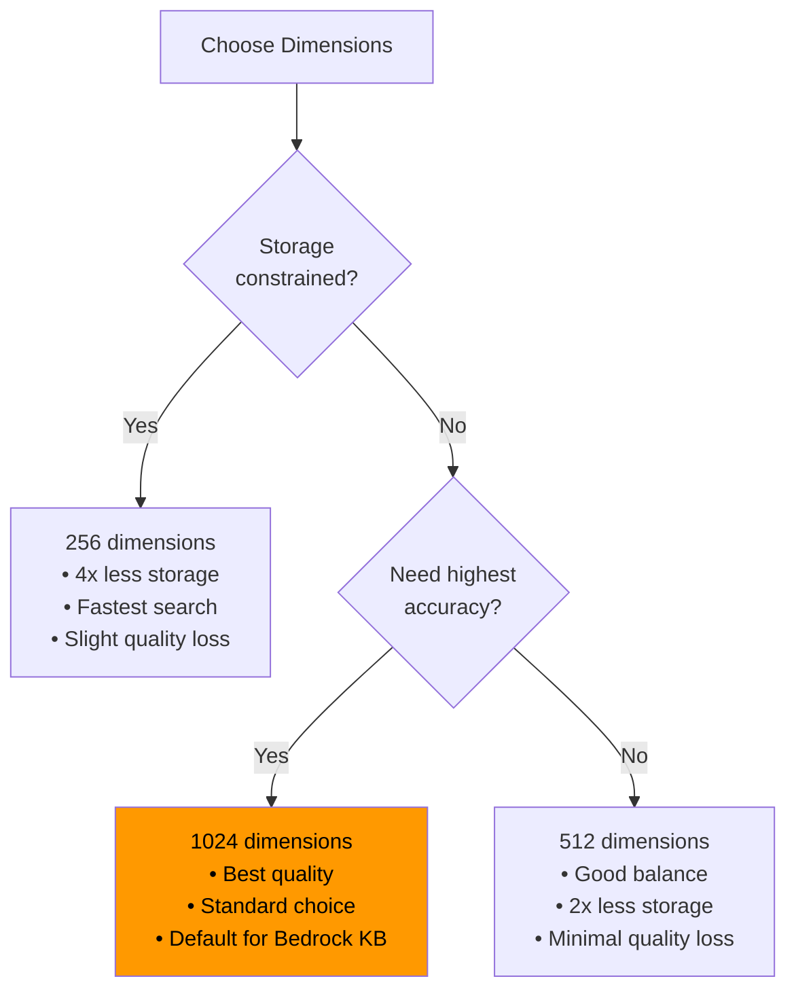

# 🧬 Module 08 — Embeddings on AWS

> **The Hidden Engine of Search** — Transform text into vectors that make semantic search possible.

---

## 🧠 1️⃣ Intuition — Why Embeddings Matter

### The Problem

Computers don't understand meaning. The word "dog" and "puppy" are just different strings. Traditional search (keyword matching) fails when:
- User searches "refund policy" but the document says "return guidelines"
- User asks about "cloud storage" but the doc mentions "S3 buckets"
- Synonyms, paraphrases, and related concepts get missed

### The Solution: Embeddings

Embeddings convert text into **dense numerical vectors** where **semantically similar texts are close together** in vector space.

```
"dog"    → [0.82, -0.14, 0.56, 0.91, ...]  ← similar vectors
"puppy"  → [0.79, -0.11, 0.58, 0.88, ...]  ← similar vectors

"car"    → [0.12, 0.67, -0.34, 0.22, ...]  ← far from dog/puppy
```

**On AWS, embeddings power**: Bedrock Knowledge Bases, OpenSearch k-NN, and every RAG pipeline.

---

## ⚙️ 2️⃣ Internal Working — Embedding Models on AWS

### Available Models

| Model | Dimensions | Max Tokens | Cost (per 1M tokens) | Use Case |
|---|---|---|---|---|
| **Titan Embeddings V2** ⭐ | 256/512/1024 | 8,192 | $0.02 | General purpose, configurable dimensions |
| **Titan Embeddings V1** | 1,536 | 8,192 | $0.10 | Legacy, higher dimension |
| **Titan Multimodal Embeddings** | 256/384/1024 | 128 tokens + image | $0.06 | Text + image embeddings |
| **Cohere Embed English** | 1,024 | 512 | $0.10 | English-optimized, search + clustering |
| **Cohere Embed Multilingual** | 1,024 | 512 | $0.10 | 100+ languages |

### Titan Embeddings V2 — The Go-To Choice

```python
import boto3
import json

bedrock = boto3.client('bedrock-runtime', region_name='us-east-1')

def get_embedding(text, dimensions=1024, normalize=True):
    """Generate embedding using Titan Embeddings V2."""
    response = bedrock.invoke_model(
        modelId='amazon.titan-embed-text-v2:0',
        contentType='application/json',
        body=json.dumps({
            "inputText": text,
            "dimensions": dimensions,   # 256, 512, or 1024
            "normalize": normalize       # L2 normalize for cosine similarity
        })
    )
    return json.loads(response['body'].read())['embedding']

# Example: Embed a document chunk
doc_embedding = get_embedding("Amazon S3 provides scalable object storage.")
print(f"Dimensions: {len(doc_embedding)}")  # 1024
print(f"First 5 values: {doc_embedding[:5]}")

# Example: Embed a query
query_embedding = get_embedding("What is S3?")
```

### Dimension Selection Strategy



### Batch Embedding for Large Datasets

```python
import concurrent.futures

def batch_embed(texts, dimensions=1024, batch_size=25):
    """Embed multiple texts with concurrent requests."""
    embeddings = [None] * len(texts)
    
    def embed_single(idx_text):
        idx, text = idx_text
        retries = 3
        for attempt in range(retries):
            try:
                emb = get_embedding(text, dimensions)
                return idx, emb
            except Exception as e:
                if attempt == retries - 1:
                    raise
                time.sleep(2 ** attempt)
    
    with concurrent.futures.ThreadPoolExecutor(max_workers=10) as executor:
        futures = executor.map(embed_single, enumerate(texts))
        for idx, emb in futures:
            embeddings[idx] = emb
    
    return embeddings
```

---

## 🏗️ 3️⃣ Production Usage

### ✅ Best Practices

1. **Normalize embeddings** — Set `normalize: true` for cosine similarity search
2. **Use consistent dimensions** — Query and document embeddings MUST use same dimensions
3. **Same model for query and doc** — Never embed queries with one model and docs with another
4. **Cache embeddings** — Store in DynamoDB/S3 to avoid re-computing
5. **Batch processing** — Use concurrent requests for large ingestion jobs

### ❌ Anti-Patterns

| Anti-Pattern | What Breaks |
|---|---|
| Different dimensions for query vs document | Zero search results or errors |
| Embedding long text without chunking | Truncation at model's max token limit (8192) |
| Using text generation model for embeddings | Wrong output format, high cost |
| Not normalizing before cosine similarity | Incorrect similarity scores |

---

## 🎮 4️⃣ GameDay Relevance

### Most Common Embedding Issue: Dimension Mismatch

```
ERROR: Dimension mismatch — document indexed at 1024 dims, query uses 256 dims

Fix:
1. Check embedding model configuration in Bedrock KB
2. Check vector index mapping in OpenSearch (dimension field)
3. Ensure both use the same model and dimension setting
```

---

## 💼 5️⃣ Interview Perspective

### Q: "How do you choose an embedding model for a RAG system?"

**Model Answer**:
> "I evaluate embedding models on four axes: **quality** (how well do similar texts cluster?), **cost** (price per million tokens), **latency** (embedding speed for real-time queries), and **compatibility** (does it work natively with my vector store?).
> On AWS, I default to **Titan Embeddings V2 at 1024 dimensions** because it's cost-effective ($0.02/M tokens), natively integrates with Bedrock Knowledge Bases, supports configurable dimensions for storage optimization, and has 8K token context — enough for most chunks."

### 🔗 Further Reading

| Resource | Link |
|---|---|
| Vector DBs Math Deep-Dive | [VectorDatabases-Math-DeepDive.md](../../genai/VectorDatabases-Math-DeepDive.md) |

---

<p align="center">
  <a href="../07-RAG/README.md">← Previous: RAG</a> · <a href="../09-Vector-Databases/README.md"><b>Next → 09 Vector Databases</b></a>
</p>
