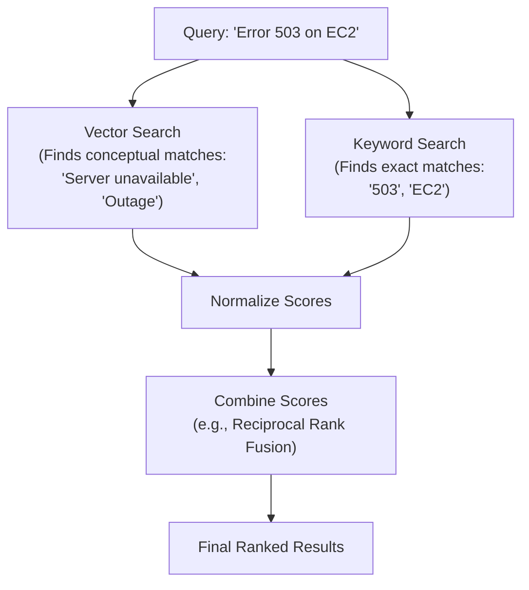

# 🔍 Module 10 — OpenSearch for AI

> **The Search Engine of AWS GenAI** — Master OpenSearch Serverless, vector collections, and hybrid search.

---

## 🧠 1️⃣ Intuition — Why OpenSearch?

When building RAG, you need a place to store and search embeddings. While you *could* use an external service like Pinecone, **OpenSearch Serverless** is the native AWS choice and the default backend for Bedrock Knowledge Bases.

### Serverless vs Managed

- **OpenSearch Managed Cluster**: You pick instances (e.g., `r6g.large.search`), manage shards, and pay hourly regardless of usage.
- **OpenSearch Serverless**: You create a "Collection". AWS manages the instances. You pay for OpenSearch Compute Units (OCUs) based on actual indexing and search load.

**Why Serverless for AI?** Vector workloads are extremely bursty. You might ingest 100,000 documents in an hour, then have 10 queries per day. Serverless scales compute automatically (though note it has a minimum of 2 OCUs).

---

## ⚙️ 2️⃣ Internal Working — OpenSearch Serverless Architecture

### Collection Types

When you create an OpenSearch Serverless Collection, you must choose a type:

1. **Time Series**: For logs, metrics (CloudWatch, fluent bit). High ingest.
2. **Search**: For full-text search (e-commerce, document search).
3. **Vector Search (New)**: Optimized for AI/RAG. Scales indexing and search independently for vector workloads. **Always use this for GenAI.**

### Data Access Policy (The Security Trap)

OpenSearch Serverless uses a completely different security model than managed OpenSearch. You need three things to access a collection:

1. **Network Policy**: Is access allowed from VPC or Public internet?
2. **Encryption Policy**: What KMS key encrypts the data?
3. **Data Access Policy**: Who can read/write data? (IAM users/roles)

**GameDay Trap**: Teams assign IAM permissions to a Lambda function but forget to add that Lambda's role to the OpenSearch *Data Access Policy*. The Lambda will get an `AccessDenied` error.

### Hybrid Search (The Secret Sauce)

Vector search finds semantic meaning ("canine" ≈ "dog"). Keyword search finds exact matches ("ID-84729"). **Hybrid search** does both and combines the scores.



---

## 🏗️ 3️⃣ Production Usage

### Creating an Index for Vector Search (Python)

```python
from opensearchpy import OpenSearch, RequestsHttpConnection
from requests_aws4auth import AWS4Auth
import boto3

credentials = boto3.Session().get_credentials()
awsauth = AWS4Auth(credentials.access_key, credentials.secret_key, 'us-east-1', 'aoss', session_token=credentials.token)

client = OpenSearch(
    hosts=[{'host': 'your-collection.us-east-1.aoss.amazonaws.com', 'port': 443}],
    http_auth=awsauth,
    use_ssl=True,
    connection_class=RequestsHttpConnection
)

# Create index with vector and text fields
index_body = {
    "settings": {
        "index.knn": True
    },
    "mappings": {
        "properties": {
            "embedding": {
                "type": "knn_vector",
                "dimension": 1024,
                "method": {
                    "name": "hnsw",
                    "engine": "nmslib",
                    "space_type": "cosinesimil"
                }
            },
            "text": { "type": "text" },
            "metadata": { "type": "object" }
        }
    }
}

client.indices.create(index="knowledge-base", body=index_body)
```

### ✅ Best Practices

1. **Use `VECTORSEARCH` collection type** for RAG workloads.
2. **Implement Hybrid Search** for production RAG to catch exact matches (names, IDs) and semantic matches.
3. **Set minimum OCUs wisely**: The default is 2 OCUs for indexing and 2 for search (~$700/month). You cannot scale to 0.

### ❌ Anti-Patterns

| Anti-Pattern | Consequence |
|---|---|
| Using `text` field type for vectors | OpenSearch rejects the index mapping |
| Public network access | Security risk, fails enterprise compliance |
| Forgetting to add IAM role to Data Access Policy | `403 Forbidden` when querying from Lambda/Bedrock |

---

## 🎮 4️⃣ GameDay Relevance

### Troubleshooting OpenSearch Errors

| Error | Root Cause | Fix |
|---|---|---|
| `AccessDeniedException` (from Lambda/Bedrock) | Role not in Data Access Policy | Go to OS Console → Data Access Policies → Add role |
| `IllegalArgumentException: Mapper for [embedding] conflicts` | Index expects 256 dims, you sent 1024 | Delete and recreate index with correct dimensions |
| `OpenSearchException: failed to find action` | Collection is still creating | Wait ~5-10 minutes for collection to be ACTIVE |

---

## 💼 5️⃣ Interview Perspective

### Q: "Explain the security model of OpenSearch Serverless and how you would securely connect a Lambda function to it."

**Model Answer**:
> "OpenSearch Serverless decouples security into three distinct policies: Network, Encryption, and Data Access.
> To securely connect a Lambda function:
> 1. Give the Lambda an IAM Execution Role with `aoss:APIAccessAll`.
> 2. Create an OpenSearch **Network Policy** restricting access to the VPC where the Lambda runs (using VPC Endpoints).
> 3. Create a **Data Access Policy** in OpenSearch that explicitly grants `ReadDocument` and `WriteDocument` permissions to the Lambda's IAM Role ARN.
>
> A common mistake is granting the IAM permission but forgetting the Data Access Policy, which results in a 403 error. The request must be signed using AWS SigV4 when calling the OpenSearch API."

---

<p align="center">
  <a href="../09-Vector-Databases/README.md">← Previous: Vector Databases</a> · <a href="../11-Prompt-Engineering/README.md"><b>Next → 11 Prompt Engineering</b></a>
</p>
