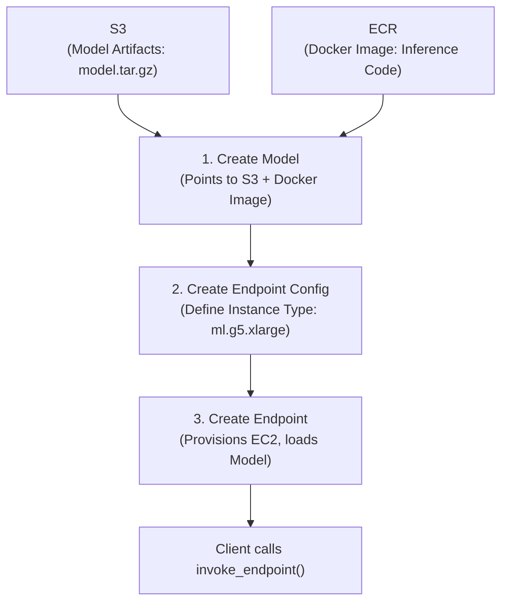

# 🧪 Module 13 — Amazon SageMaker

> **The Heavy Machinery** — Build, train, fine-tune, and host custom machine learning models with total control.

---

## 🧠 1️⃣ Intuition — Bedrock vs SageMaker

If Bedrock is a **managed ride-sharing service** (you just ask for a ride and pay per mile), SageMaker is a **car factory and garage** (you build the car, tune the engine, and hire the driver).

### When to use SageMaker over Bedrock:
1. **Custom Architecture**: You designed a novel neural network architecture from scratch.
2. **Heavy Fine-Tuning**: You have 100,000+ labeled examples and need to alter the model weights significantly.
3. **Non-Generative AI**: You are building tabular data models (XGBoost), time-series forecasting, or custom computer vision.
4. **Data Privacy / Isolation**: Your compliance rules dictate that the model weights must live entirely within your VPC on dedicated hardware.

---

## ⚙️ 2️⃣ Internal Working — The SageMaker Ecosystem

SageMaker is not one service; it is an umbrella of ~20 different tools covering the entire ML Lifecycle.

### The Core Components

| Component | Purpose | What it actually is |
|---|---|---|
| **SageMaker Studio** | IDE | A managed JupyterLab environment running on EC2. |
| **SageMaker JumpStart** | Model Hub | AWS's version of Hugging Face. 1-click deployment of open-source models (Llama, Mistral, BERT). |
| **SageMaker Training** | Compute | Ephemeral EC2 instances that spin up, run your training script, save weights to S3, and shut down. |
| **SageMaker Endpoints** | Hosting | Dedicated EC2 instances running behind a load balancer, exposing your model as a REST API. |

### The Deployment Flow (Hosting a Model)



---

## 🏗️ 3️⃣ Production Usage — Endpoint Types

Choosing the right endpoint type is critical for cost and performance.

| Endpoint Type | Traffic Pattern | Billing | Latency |
|---|---|---|---|
| **Real-Time** | Steady, consistent traffic | Pay per hour (EC2 runs 24/7) | Milliseconds |
| **Serverless** | Intermittent, unpredictable | Pay per invocation & memory | Milliseconds (Cold starts possible) |
| **Asynchronous** | Heavy payloads (large images/video) | Pay per hour (can scale to 0) | Minutes |
| **Batch Transform** | Bulk offline processing (nightly jobs) | Pay only while job runs | Hours |

### Example: Invoking a Real-Time Endpoint

```python
import boto3
import json

sagemaker_runtime = boto3.client('sagemaker-runtime', region_name='us-east-1')

payload = {
    "inputs": "Translate English to French: Hello, how are you?",
    "parameters": {"max_new_tokens": 50, "temperature": 0.5}
}

response = sagemaker_runtime.invoke_endpoint(
    EndpointName='my-llama-3-endpoint',
    ContentType='application/json',
    Body=json.dumps(payload)
)

result = json.loads(response['Body'].read().decode())
print(result)
```

---

## 🎮 4️⃣ GameDay Relevance

### Common SageMaker Failures

| # | Error/Symptom | Root Cause | Fix |
|---|---|---|---|
| 1 | `ModelError` on invocation | Payload format mismatch | Check the expected `ContentType` and JSON structure for that specific model container. |
| 2 | Endpoint creation fails | `InsufficientInstanceCapacity` | The requested GPU instance type is out of stock in that AZ. Switch AZs or use a different instance type. |
| 3 | `AccessDenied` | IAM role missing | The SageMaker Execution Role needs `s3:GetObject` to download model artifacts, and `ecr:GetDownloadUrlForLayer` to pull the container. |
| 4 | Client gets `Timeout` | Inference takes too long | Real-time endpoints time out after 60 seconds. Switch to Asynchronous Endpoints. |

---

## 💼 5️⃣ Interview Perspective

### Q: "Your team deployed a large language model to a SageMaker Real-Time endpoint (ml.g5.12xlarge). The AWS bill is huge, but traffic is very spiky — busy during the day, zero traffic at night. How do you optimize costs?"

**Model Answer**:
> "I would implement **Application Auto Scaling** for the SageMaker endpoint.
> 1. I'd define a scaling policy based on the `SageMakerVariantInvocationsPerInstance` CloudWatch metric.
> 2. During the day, as invocations increase, Auto Scaling will add instances.
> 3. At night, as traffic drops, it will scale down to a minimum instance count (e.g., 1).
> 
> Alternatively, if latency requirements permit cold starts, I would evaluate moving to **SageMaker Serverless Inference**, which automatically scales to zero when there is no traffic, eliminating idle costs completely."

### 🔗 Further Reading

| Resource | Link |
|---|---|
| Complete MLOps Guide | [aws-genai-mlops.md](../../genai/aws-genai-mlops.md) |
| Deep Learning Fundamentals | [deep-learning-fundamentals.md](../../genai/deep-learning-fundamentals.md) |

---

<p align="center">
  <a href="../12-RAG-Evaluation/README.md">← Previous: RAG Eval</a> · <a href="../14-Serverless-AI/README.md"><b>Next → 14 Serverless AI</b></a>
</p>
