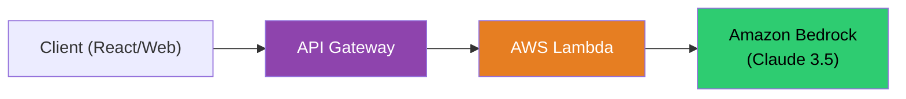
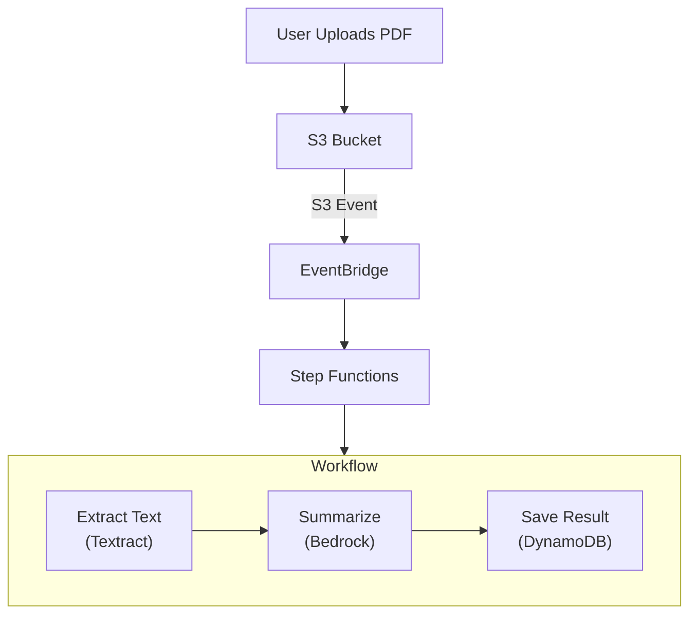

# ⚡ Module 14 — Serverless AI Architectures

> **Code, Not Servers** — Orchestrating Bedrock with Lambda, API Gateway, and Step Functions.

---

## 🧠 1️⃣ Intuition — The AWS Serverless AI Stack

Bedrock is inherently serverless (you don't manage instances). To build a scalable, cost-effective application around it, you should use serverless compute to match.

- **API Gateway**: The front door (handles auth, rate limiting).
- **Lambda**: The glue (executes business logic, calls Bedrock API).
- **Step Functions**: The orchestrator (manages complex, multi-step workflows).
- **EventBridge**: The nervous system (triggers AI processes based on events).

### Why it matters
If you put Bedrock behind an EC2 instance, you lose the primary benefit of serverless: scaling to zero. The Serverless AI stack ensures you only pay when an AI inference is actually requested.

---

## ⚙️ 2️⃣ Internal Working — Core Architectures

### Pattern 1: Synchronous API (Chatbot)

User sends a message, waits for a response.



**The Lambda Timeout Trap**:
API Gateway has a hard timeout of **29 seconds**. LLMs (especially generating long text) can easily take 30-40 seconds. If generation takes >29s, API Gateway kills the connection, returning a 504 Gateway Timeout to the user, even if Lambda is still running.

**Solution**: Use streaming (returning chunks as they generate) or an asynchronous pattern.

### Pattern 2: Asynchronous AI (Document Processing)

User uploads a file, process runs in background, user checks back later.



### Pattern 3: Step Functions Native Integration

Step Functions can call Bedrock *directly*, without needing a Lambda function in between. This is called a **Direct Integration**.

```json
// Step Functions State calling Bedrock directly
{
  "Type": "Task",
  "Resource": "arn:aws:states:::bedrock:invokeModel",
  "Parameters": {
    "ModelId": "anthropic.claude-3-haiku-20240307-v1:0",
    "Body": {
      "anthropic_version": "bedrock-2023-05-31",
      "max_tokens": 512,
      "messages": [
        {
          "role": "user",
          "content": [{"text.$": "$.input_text"}]
        }
      ]
    }
  },
  "ResultPath": "$.ai_response",
  "Next": "ProcessResponse"
}
```

---

## 🏗️ 3️⃣ Production Usage

### Handling Lambda Cold Starts

Lambda functions take time to initialize, especially with heavy Python libraries (like Pandas or large SDKs).
- **Optimization**: Initialize `boto3.client('bedrock-runtime')` *outside* the Lambda handler. It will be reused across warm invocations.

```python
import boto3

# GOOD: Initialize outside handler (persists across warm starts)
bedrock = boto3.client('bedrock-runtime') 

def lambda_handler(event, context):
    response = bedrock.converse(...)
    return response
```

### Event-Driven Prompt Injection Defense

Instead of blocking the user synchronously, evaluate inputs asynchronously.

1. User submits text to SQS.
2. Lambda reads from SQS, calls Bedrock Guardrails.
3. If safe, calls Bedrock Claude. If malicious, updates DynamoDB status to "Blocked".

---

## 🎮 4️⃣ GameDay Relevance

### Troubleshooting Serverless AI

| Symptom | Root Cause | Fix |
|---|---|---|
| **API Gateway 504 Error** | Lambda execution exceeded 29 seconds. | Optimize prompt, switch to a faster model (Haiku), or decouple into an async workflow (SQS -> Lambda). |
| **Lambda `Task timed out after 3.00 seconds`** | Default Lambda timeout is 3 seconds; Bedrock takes longer. | Increase Lambda timeout in configuration to 30-60 seconds. |
| **`AccessDeniedException` calling Bedrock** | Lambda Execution Role lacks permissions. | Attach policy allowing `bedrock:InvokeModel`. |

---

## 💼 5️⃣ Interview Perspective

### Q: "You are building an AI app where users ask questions and get answers. During load testing, API Gateway throws 504 errors. How do you fix this architecturally?"

**Model Answer**:
> "A 504 from API Gateway means the backend (Lambda + Bedrock) took longer than 29 seconds.
> There are two architectural fixes depending on UX requirements:
> 
> 1. **Synchronous Fix (Streaming)**: Use Bedrock's `ConverseStream` API and configure Lambda to return a streaming response (via Lambda Web Adapter or HTTP API payload format 2.0). API Gateway keeps the connection alive as long as bytes are flowing.
> 
> 2. **Asynchronous Fix (Decoupling)**: Change the architecture. API Gateway immediately returns an HTTP 202 (Accepted) with a `job_id`, while placing the request in an SQS queue. A backend Lambda processes the queue, calls Bedrock, and writes the answer to DynamoDB/WebSocket. The client polls or listens for the completion."

---

<p align="center">
  <a href="../13-SageMaker/README.md">← Previous: SageMaker</a> · <a href="../15-Security/README.md"><b>Next → 15 Security</b></a>
</p>
