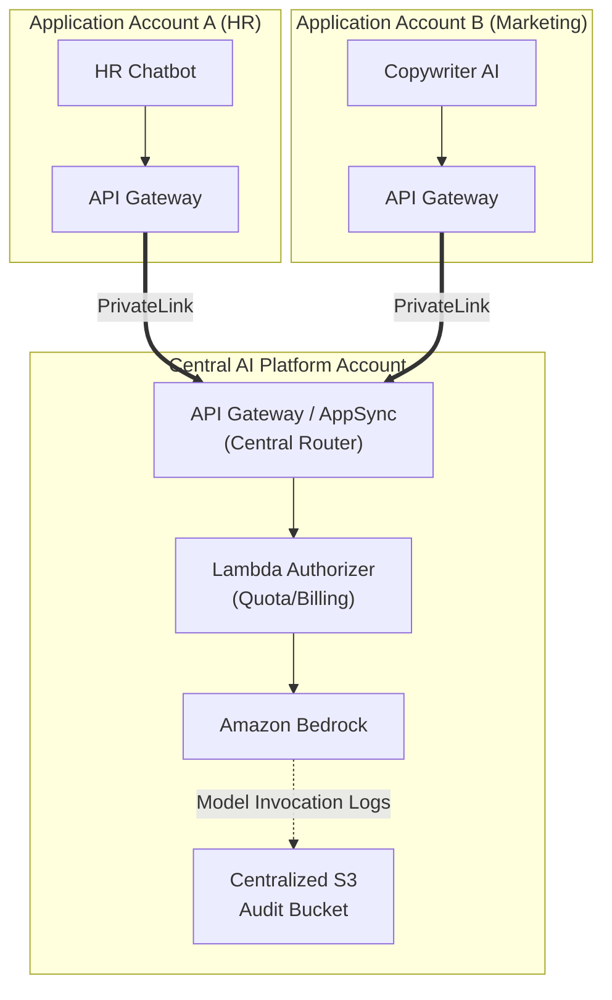

# 🏢 Module 18 — Enterprise AI Architectures

> **Beyond the Sandbox** — Designing multi-account, secure, and governed AI platforms for large organizations.

---

## 🧠 1️⃣ Intuition — The Enterprise Challenge

Building a GenAI app in a single AWS account is easy.
Building GenAI for a bank (like NAB) or a healthcare provider is hard.

**Enterprise Constraints:**
- **Data Residency**: Data cannot cross geographical borders.
- **Multi-Tenancy**: Team A cannot see Team B's knowledge bases.
- **Compliance**: Every prompt and response must be audited.
- **Cost Allocation**: The Marketing department must pay for their AI usage; HR pays for theirs.

### The Solution: Platform Engineering for AI

Instead of every team building their own RAG stack, the organization builds a **Centralized AI Platform** offering GenAI as a Service to internal teams.

---

## ⚙️ 2️⃣ Internal Working — Enterprise Architecture Patterns

### Pattern 1: The Multi-Account Hub and Spoke

This is the AWS recommended architecture for Enterprise GenAI.

**Benefits**:
- **Centralized Billing**: The Hub account pays AWS. The Hub Router tracks usage and bills back to Spoke A and Spoke B.
- **Centralized Governance**: Security teams only have to audit the Guardrails and Logging in one account.
- **Model Access Control**: Spoke A might be allowed to use Claude; Spoke B might be restricted to Titan.

### Pattern 2: The Data Mesh for RAG

In an enterprise, data is siloed. HR data lives in Workday, engineering data in Jira.

Instead of copying all data into one giant vector database, use a **Federated RAG** approach.

1. **Central Agent**: Receives user query.
2. **Intent Router**: Determines if query is about HR, Engineering, or Finance.
3. **Domain Knowledge Bases**: The query is routed to the specific Bedrock Knowledge Base owned by that domain.
4. **Aggregation**: Results are synthesized and returned.

This enforces data boundaries—if a user asks the Central Agent an HR question, but their identity token lacks HR permissions, the Domain KB rejects the request.

---

## 🏗️ 3️⃣ Production Usage — Governance & Compliance

### AI Model Registry & Approval Workflows

In highly regulated environments, developers cannot just switch from Claude 3 to Claude 3.5.
- Use **Amazon SageMaker Model Registry** to track approved model versions.
- Implement **AWS CodePipeline**. Changing the `model_id` in a CloudFormation template requires manual approval from the AI Governance Board.

### Data Loss Prevention (DLP)

Enterprises fear code or PII leaking into the model.
- **Implementation**: Place **Amazon Macie** or **Bedrock Guardrails** in front of every invocation. If a user pastes a Social Security Number into the prompt, the Guardrail redacts it before it reaches Anthropic.

---

## 🎮 4️⃣ GameDay Relevance

**GameDay Frequency**: ⭐⭐⭐ (Medium)

GameDay challenges occasionally feature cross-account IAM issues.
- **Scenario**: Application in Account A gets `AccessDenied` calling Bedrock in Account B.
- **Fix**: You must configure IAM cross-account trust. Account A's role must have permission to `sts:AssumeRole` into Account B. Account B's role must grant trust to Account A, and have `bedrock:InvokeModel` permissions.

---

## 💼 5️⃣ Interview Perspective

### Q: "You are the Lead Architect at a major bank (e.g., NAB). Multiple teams want to use GenAI, but the CISO is concerned about data leakage and cost spiraling. How do you design the AWS architecture?"

**Model Answer**:
> "I would design a Hub-and-Spoke architecture using AWS Organizations.
> 
> **For Security & Data Leakage**: I would create a Central AI Platform account. All application accounts must connect to this central account via AWS PrivateLink, ensuring no traffic crosses the public internet. Inside the central account, I would enforce Bedrock Guardrails to redact PII and block malicious prompts. I would also mandate Bedrock Model Invocation Logging to a secure, immutable S3 bucket for compliance auditing.
> 
> **For Cost Spiraling**: The central API Gateway will act as an internal billing mechanism. Every request must include a header indicating the consuming application. We track token usage per application and implement quotas. If the Marketing team exhausts their monthly token budget, the central API Gateway throttles their requests until they request a budget increase."

---

  <a href="../17-Cost-Optimization/README.md">← Previous: Cost Optimization</a> · <a href="../19-Hands-On-Labs/README.md"><b>Next → 19 Hands-On Labs</b></a>

