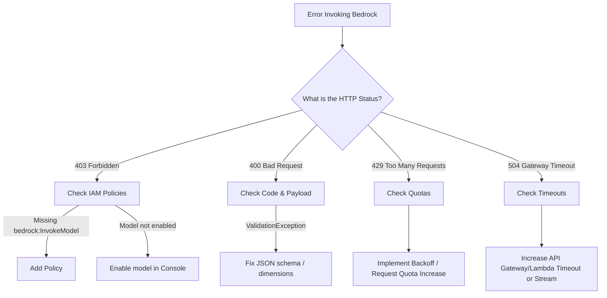

# 🚑 Module 20 — Troubleshooting & Runbooks

> **The Fixer's Guide** — Diagnose and resolve AWS AI architecture failures under time pressure.

---

## 🧠 1️⃣ Intuition — Debugging Under Pressure

In an AWS GameDay, you don't get a pristine, working environment. You get an environment that is subtly broken, and the clock is ticking.

The key to fast troubleshooting is **not guessing**. Guessing wastes time. Instead, use a systematic process of elimination:
1. Is it a **Permissions (IAM)** issue?
2. Is it a **Network/VPC** issue?
3. Is it a **Code/Configuration** issue?
4. Is it a **Quota/Limits** issue?

---

## ⚙️ 2️⃣ The Master Diagnostic Decision Tree

If an AI pipeline is failing, ask these questions in this exact order:

---

## 🏗️ 3️⃣ Common Failure Scenarios & Runbooks

### Scenario A: The Lambda Function times out after 3 seconds.
**Symptom**: CloudWatch Logs for Lambda show `Task timed out after 3.00 seconds`.
**Root Cause**: The default Lambda timeout is 3 seconds. Bedrock calls (especially text generation) usually take 5-15 seconds.
**Fix**: Go to Lambda Console -> Configuration -> General configuration -> Edit -> Change Timeout to 1 minute.

### Scenario B: Bedrock Knowledge Base Sync Fails
**Symptom**: The ingestion job status goes from `IN_PROGRESS` to `FAILED`.
**Root Cause**: Usually IAM or KMS. The Knowledge Base execution role cannot read from the S3 bucket or decrypt the files.
**Fix**: 
1. Call `GetIngestionJob` API to see the specific failure reason.
2. Verify the IAM role attached to the KB has `s3:GetObject` and `s3:ListBucket` for the target bucket.
3. If the bucket uses KMS encryption, ensure the IAM role has `kms:Decrypt`.

### Scenario C: OpenSearch Serverless Returns "Mapper for [embedding] conflicts"
**Symptom**: Ingestion or query fails with an OpenSearch `IllegalArgumentException`.
**Root Cause**: Dimension mismatch. You are trying to insert a 1024-dimension vector (e.g., from Titan V2) into an index configured for 256 dimensions.
**Fix**: OpenSearch index mappings cannot be changed after creation. You must delete the index and recreate it with the correct `"dimension": 1024` setting.

### Scenario D: Action Group Lambda is Never Called by the Agent
**Symptom**: You ask the Bedrock Agent to perform an action, but it hallucinates a response instead of calling your Lambda function.
**Root Cause**: The Foundation Model does not understand *when* to use your tool because the OpenAPI schema descriptions are vague, or the Agent instructions are poor.
**Fix**: 
1. Rewrite the OpenAPI `description` fields to be extremely specific. (e.g., Change "Gets status" to "Retrieves the shipping status of an order using an order ID").
2. Explicitly tell the Agent in its instructions: "You MUST use the OrderLookup tool when a user asks about shipping."

### Scenario E: `AccessDeniedException` when calling OpenSearch from Lambda
**Symptom**: Lambda has full admin permissions, but gets a 403 when talking to OpenSearch Serverless.
**Root Cause**: OpenSearch Serverless uses Data Access Policies independent of IAM.
**Fix**: Go to OpenSearch Console -> Serverless -> Data access policies -> Create a policy granting the Lambda's IAM Role ARN read/write access to the collection.

---

## 🎮 4️⃣ GameDay Relevance

In GameDay, every second you spend hunting for logs is a point you aren't scoring.

**Pro-Tip**: Keep a terminal window open tailing CloudWatch logs using the AWS CLI:
`aws logs tail /aws/lambda/MyAI_Function --follow`

If you get a generic error in the UI, look immediately at the terminal. The exact Exception name (e.g., `ThrottlingException`, `ValidationException`) tells you exactly which runbook to follow.

---

## 💼 5️⃣ Interview Perspective

### Q: "Your application in production suddenly starts throwing 'ThrottlingException' errors from Bedrock. What is your immediate incident response, and what is your long-term architectural fix?"

**Model Answer**:
> "My immediate response is to look at CloudWatch metrics to confirm if it's an overall spike in traffic or a localized issue. If the application is entirely down, I would implement an exponential backoff and retry mechanism in the application code as an immediate band-aid to handle the transient errors. 
>
> For the long-term fix, I would analyze the token usage. If the volume is legitimately higher, I would submit a quota increase request for On-Demand limits. If this high volume is the new normal and requires consistent latency, I would perform a cost analysis to transition the workload to Bedrock Provisioned Throughput, which guarantees capacity and eliminates On-Demand throttling."

---

  <a href="../19-Hands-On-Labs/README.md">← Previous: Hands-On Labs</a> · <a href="../21-Mock-Gameday/README.md"><b>Next → 21 Mock GameDay</b></a>

