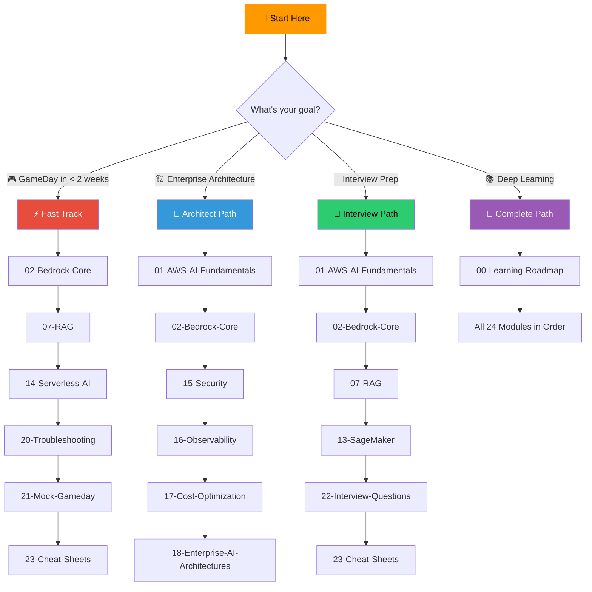
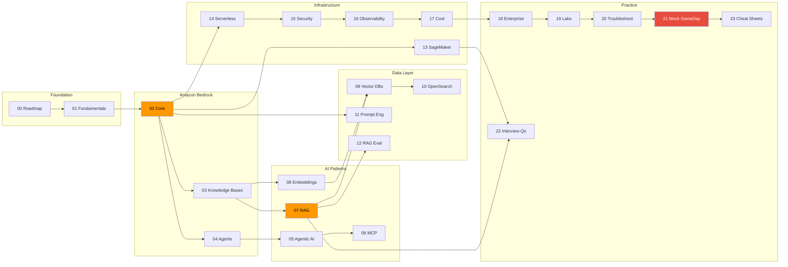

# 🎮 AWS AI GameDay — Master Preparation Repository

> **From Zero to GameDay Hero** — A production-grade learning repository for AWS AI GameDay, Enterprise GenAI Architecture, Amazon Bedrock, and AWS AI Interviews.

[](https://aws.amazon.com)
[](https://aws.amazon.com/bedrock/)
[](LICENSE)

---

## 🎯 What This Repository Covers

| Goal | Description |
|------|-------------|
| 🎮 **AWS AI GameDay** | Survive and dominate timed AI/ML challenges |
| 🏢 **Enterprise GenAI** | Design production-grade AI architectures on AWS |
| 🤖 **Amazon Bedrock** | Master every Bedrock feature: KB, Agents, Guardrails |
| 💼 **AWS AI Interviews** | 100+ questions with model answers and trade-offs |
| 🏦 **NAB Innovation Centre** | Banking/FinServ AI patterns and compliance |

---

## 🧭 Choose Your Learning Path



---

## 📚 Module Index

### 🏗️ Foundation
| # | Module | Focus | GameDay Weight |
|---|--------|-------|----------------|
| 00 | [Learning Roadmap](./00-Learning-Roadmap/README.md) | 4-week study plan, prerequisites, self-assessment | ⭐ |
| 01 | [AWS AI Fundamentals](./01-AWS-AI-Fundamentals/README.md) | Service landscape, selection framework, mental models | ⭐⭐⭐ |

### 🤖 Amazon Bedrock Deep-Dive
| # | Module | Focus | GameDay Weight |
|---|--------|-------|----------------|
| 02 | [Bedrock Core](./02-Bedrock-Core/README.md) | APIs, models, Guardrails, provisioned throughput | ⭐⭐⭐⭐⭐ |
| 03 | [Bedrock Knowledge Bases](./03-Bedrock-Knowledge-Bases/README.md) | Data sources, chunking, sync, retrieval | ⭐⭐⭐⭐⭐ |
| 04 | [Bedrock Agents](./04-Bedrock-Agents/README.md) | Action groups, Lambda, orchestration, memory | ⭐⭐⭐⭐⭐ |

### 🧠 AI Patterns & Techniques
| # | Module | Focus | GameDay Weight |
|---|--------|-------|----------------|
| 05 | [Agentic AI](./05-Agentic-AI/README.md) | Multi-agent, ReAct, tool use on AWS | ⭐⭐⭐⭐ |
| 06 | [MCP](./06-MCP/README.md) | Model Context Protocol, tool integration | ⭐⭐ |
| 07 | [RAG](./07-RAG/README.md) | RAG on AWS — Bedrock KB, Kendra, OpenSearch | ⭐⭐⭐⭐⭐ |
| 08 | [Embeddings](./08-Embeddings/README.md) | Titan Embeddings, strategies, batch processing | ⭐⭐⭐⭐ |

### 💾 Data & Search Layer
| # | Module | Focus | GameDay Weight |
|---|--------|-------|----------------|
| 09 | [Vector Databases](./09-Vector-Databases/README.md) | AWS vector stores, indexing, scaling | ⭐⭐⭐⭐ |
| 10 | [OpenSearch](./10-OpenSearch/README.md) | Serverless, k-NN, vector engine, hybrid search | ⭐⭐⭐⭐ |
| 11 | [Prompt Engineering](./11-Prompt-Engineering/README.md) | Bedrock-specific prompting, Converse API | ⭐⭐⭐⭐ |
| 12 | [RAG Evaluation](./12-RAG-Evaluation/README.md) | RAGAS, quality metrics, A/B testing | ⭐⭐⭐ |

### ⚙️ Infrastructure & Operations
| # | Module | Focus | GameDay Weight |
|---|--------|-------|----------------|
| 13 | [SageMaker](./13-SageMaker/README.md) | Endpoints, JumpStart, training, deployment | ⭐⭐⭐⭐ |
| 14 | [Serverless AI](./14-Serverless-AI/README.md) | Lambda + Bedrock, Step Functions, event-driven | ⭐⭐⭐⭐⭐ |
| 15 | [Security](./15-Security/README.md) | IAM, VPC, encryption, Guardrails, compliance | ⭐⭐⭐⭐⭐ |
| 16 | [Observability](./16-Observability/README.md) | CloudWatch, X-Ray, model monitoring, alerting | ⭐⭐⭐⭐ |
| 17 | [Cost Optimization](./17-Cost-Optimization/README.md) | Token economics, provisioned throughput, caching | ⭐⭐⭐ |

### 🏢 Enterprise & Practice
| # | Module | Focus | GameDay Weight |
|---|--------|-------|----------------|
| 18 | [Enterprise AI Architectures](./18-Enterprise-AI-Architectures/README.md) | Multi-account, governance, MLOps, reference archs | ⭐⭐⭐ |
| 19 | [Hands-On Labs](./19-Hands-On-Labs/README.md) | 10 guided labs with step-by-step instructions | ⭐⭐⭐⭐⭐ |
| 20 | [Troubleshooting](./20-Troubleshooting/README.md) | Error codes, decision trees, runbooks | ⭐⭐⭐⭐⭐ |
| 21 | [Mock GameDay](./21-Mock-Gameday/README.md) | 3 timed scenarios with scoring rubrics | ⭐⭐⭐⭐⭐ |
| 22 | [Interview Questions](./22-Interview-Questions/README.md) | 100+ questions with model answers | ⭐⭐⭐ |
| 23 | [Cheat Sheets](./23-Cheat-Sheets/README.md) | Quick reference cards for all services | ⭐⭐⭐⭐ |

---

## 📐 Module Dependency Graph



---

## 📏 Every Module Follows 5 Pillars

| Pillar | Icon | What It Covers |
|--------|------|----------------|
| **Intuition** | 🧠 | Why this service exists, what problem it solves, what breaks without it |
| **Internal Working** | ⚙️ | Request flow, data flow, control flow, scaling behavior |
| **Production Usage** | 🏗️ | Real-world architectures, common patterns, anti-patterns |
| **GameDay Relevance** | 🎮 | Common failures, scoring impact, troubleshooting checklists |
| **Interview Perspective** | 💼 | FAQs, design questions, trade-offs to articulate |

---

## 🔗 Cross-References to Existing Content

This repository builds on top of existing deep-dives in the parent repo:

| Topic | Existing Resource | What This Repo Adds |
|-------|-------------------|---------------------|
| RAG Theory | [rag-architecture.md](../genai/rag-architecture.md) | AWS-specific RAG (Bedrock KB, Kendra, OpenSearch) |
| GenAI Fundamentals | [genai-fundamentals.md](../genai/genai-fundamentals.md) | AWS service mapping, GameDay scenarios |
| Vector DBs Math | [VectorDatabases-Math-DeepDive.md](../genai/VectorDatabases-Math-DeepDive.md) | OpenSearch k-NN, Aurora pgvector operations |
| Agentic AI | [agentic-ai-guide.md](../genai/agentic-ai-guide.md) | Bedrock Agents, action groups, Lambda tools |
| AWS Services | [aws-services-guide.md](../aws/aws-services-guide.md) | AI-specific service configurations |
| Prompt Engineering | [prompt-engineering.md](../genai/prompt-engineering.md) | Bedrock Converse API, model-specific prompts |
| AWS GenAI/MLOps | [aws-genai-mlops.md](../genai/aws-genai-mlops.md) | GameDay troubleshooting, hands-on labs |

---

## ✅ Progress Tracker

Use this checklist to track your preparation:

- [ ] **Week 1**: Foundation (Modules 00-04)
- [ ] **Week 2**: AI Patterns & Data Layer (Modules 05-12)
- [ ] **Week 3**: Infrastructure & Operations (Modules 13-17)
- [ ] **Week 4**: Enterprise, Labs & Mock GameDay (Modules 18-23)

---

## 🏁 Quick Start

```bash
# Clone the repo
git clone https://github.com/samargupta096/software-engineering.git
cd software-engineering/aws-ai-gameday-prep

# Start with your learning path
# GameDay Fast Track → Start at 02-Bedrock-Core
# Full Path → Start at 00-Learning-Roadmap
```

---

<p align="center">
  <b>Built for engineers who prefer intuition over memorization 🧠</b>
</p>
