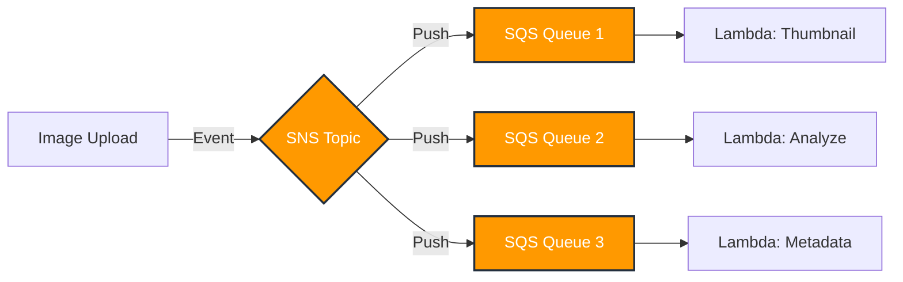
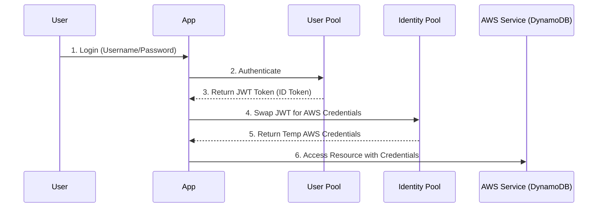
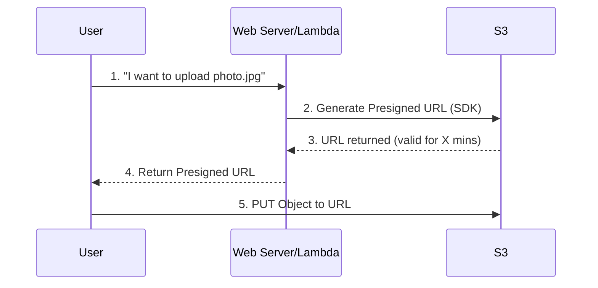
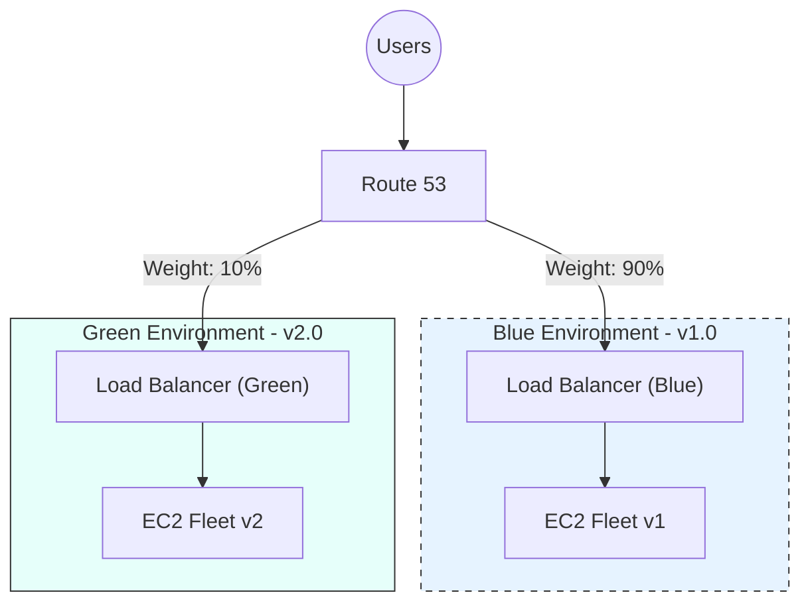

# AWS Developer Associate Exam Preparation Guide

> 📅 **NEW:** Follow the [**10-Day Master Study Plan**](./aws-developer-study-plan.md) for a structured daily roadmap.

This guide is designed to help you prepare for the AWS Certified Developer - Associate (DVA-C02) exam. It focuses on key concepts, scenario-based questions, and detailed explanations, grouped by service categories.

---

## 1. Compute Services (Lambda, EC2, ECS, Elastic Beanstalk)

### Key Concepts

- **AWS Lambda**: Serverless compute. Triggers (S3, DynamoDB, API Gateway, etc.). Execution limits (15 mins). Memory/CPU allocation. Layers for dependencies (e.g., NumPy). Versions & Aliases (e.g., `prod`, `dev`). Traffic shifting (Canary/Linear).
- **Amazon EC2**: Virtual servers. Instance types (T-series, M-series, etc.). User data scripts (bootstrapping). IAM Roles for EC2. Security Groups (stateful) vs. NACLs (stateless).
- **Amazon ECS**: Container orchestration. Task Definitions, Services, Clusters. Fargate (serverless) vs. EC2 launch type.
- **AWS Elastic Beanstalk**: Platform as a Service (PaaS). Deploys code, manages infrastructure. Deployment policies (All-at-once, Rolling, Rolling with batch, Immutable, Blue/Green). `.ebextensions` for config.

### Scenario-Based Questions

#### Scenario 1: Serverless Processing

**Question**: A developer has created a Lambda function that processes images uploaded to an S3 bucket. The function processing time varies, sometimes taking up to 10 minutes. The developer needs to ensure the function doesn't time out. What is the MAXIMUM execution time limit for an AWS Lambda function?

Click to reveal answer

**Answer**: 15 minutes (900 seconds).

**Explanation**:

- AWS Lambda functions have a maximum execution timeout of 15 minutes. If your process takes longer, you should consider using AWS Step Functions to orchestrate multiple Lambda functions or run the task on ECS/EC2.

#### Scenario 2: Zero-Downtime Deployment

**Question**: You are deploying a new version of an application to Elastic Beanstalk. The application must remain available to all users during the deployment, and you need to be able to roll back immediately if issues are detected. Which deployment policy should you choose?

Click to reveal answer

**Answer**: Immutable or Blue/Green.

**Explanation**:

- **All-at-once**: Fastest, but downtime is inevitable.
- **Rolling**: Updates a batch at a time. Reduced capacity during deployment. Rollback is slow (re-deploy old version).
- **Rolling with additional batch**: No reduced capacity, but rollback is still a re-deploy.
- **Immutable**: Deploys to fresh instances in a new Auto Scaling Group (ASG). If health checks pass, traffic is switched. Instant rollback (just termination of new ASG).
- **Blue/Green**: Similar to Immutable but often involves DNS swapping (CNAME swap). Good for verifying in a separate environment before switching.
- **Reasoning**: "Immutable" is often the exam answer for "quick rollback" and "no downtime" within the Beanstalk context without managing external DNS swaps manually.

#### Scenario 3: ECS Task Role

**Question**: An application running in a Docker container on Amazon ECS needs to access an S3 bucket to download configuration files. What is the most secure way to grant these permissions?

Click to reveal answer

**Answer**: Create an IAM Role with S3 permissions and associate it with the **ECS Task Definition** (Task Role).

**Explanation**:

- **Task Role**: Grants permissions to the *application* running inside the container. This follows the principle of least privilege.
- **Task Execution Role**: Grants permissions to the *ECS agent* to pull images from ECR and send logs to CloudWatch. Do not confuse this with the Task Role.
- **Instance Role**: Grants permissions to the underlying EC2 instance. All containers on that instance would share these permissions, which is less secure.

---

## 2. Storage & Databases (S3, DynamoDB, RDS, ElastiCache)

### Key Concepts

- **Amazon S3**: Object storage. Storage classes (Standard, IA, Glacier). Versioning. Encryption (SSE-S3, SSE-KMS, SSE-C). Presigned URLs (temp access). CORS.
- **Amazon DynamoDB**: NoSQL. Partition Key vs. Composite Key (Partition + Sort). LSI vs. GSI. Read/Write Capacity Modes (On-Demand vs. Provisioned). DAX (caching). TTL (Time To Live). Streams (triggers Lambda).
- **Amazon RDS**: Relational DB. Multi-AZ (high availability) vs. Read Replicas (scaling reads). Proxy (connection pooling for Lambda).
- **Amazon ElastiCache**: Caching managed service. Redis (complex data types, persistence, pub/sub) vs. Memcached (simple threading, simple k/v). Strategies: Lazy Loading vs. Write-Through.

### Scenario-Based Questions

#### Scenario 1: Handling High Traffic Reads

**Question**: A news website stores article metadata in DynamoDB. The application is experiencing high read latency during breaking news events when millions of users request the same popular article. What is the MOST efficient way to resolve this?

Click to reveal answer

**Answer**: Enable Amazon DynamoDB Accelerator (DAX).

**Explanation**:

- **DAX**: An in-memory cache for DynamoDB. It reduces response times from milliseconds to microseconds and offloads read traffic from the main table. Ideally suited for "hot keys" or read-heavy workloads.
- **ElastiCache**: Could work, but requires application code changes to manage the cache (check cache, fetch DB, write cache). DAX is transparent (no code changes needed, just endpoint change).
- **Read Capacity Units (RCUs)**: Increasing RCUs handles more throughput but doesn't solve the "network latency" issue as effectively as in-memory caching for the *same* item.

#### Scenario 2: Private Content Distribution

**Question**: You have a mobile app where users can upload and view private photos stored in S3. You want to allow users to view their own photos securely without making the bucket public. What should you generate for the user?

Click to reveal answer

**Answer**: Generate a Presigned URL.

**Explanation**:

- **Presigned URL**: Allows you to grant temporary access to a specific S3 object using your security credentials. The user's app does not need AWS credentials.
- **Bucket Policy**: Generally used for broad access rules (e.g., "Allow this IP range" or "Allow this Referrer"), not for individual user authentication dynamic per object.
- **OAI (Origin Access Identity)**: Used with CloudFront to restrict S3 access to only CloudFront.

#### Scenario 3: Database Connection Exhaustion

**Question**: A highly scalable serverless application uses Lambda functions to write data to an Amazon RDS for MySQL database. During peak loads, the database becomes unresponsive due to too many open connections. How should you fix this?

Click to reveal answer

**Answer**: Implement Amazon RDS Proxy.

**Explanation**:

- Lambda functions scale rapidly, creating a new database connection for each concurrent execution. This can quickly exhaust the `max_connections` limit of a relational database.
- **RDS Proxy**: Pools and shares database connections, allowing Lambda to scale without overwhelming the database.

---

## 3. Security & Identity (IAM, KMS, Cognito)

### Key Concepts

- **IAM**: Users, Groups, Roles, Policies. Principle of Least Privilege. Access Key ID / Secret Access Key (CLI/SDK). Role-based access for services.
- **AWS KMS**: Key Management Service. CMK (Customer Master Key). Envelope Encryption (encrypting data keys). `GenerateDataKey` vs `Encrypt`.
- **Amazon Cognito**: User Pools (Authentication - Sign up/Sign in, JWT tokens) vs. Identity Pools (Authorization - Exchange tokens for AWS credentials to access services).

### Scenario-Based Questions

#### Scenario 1: Mobile App Authentication

**Question**: You are building a mobile game and want users to sign in using their Facebook or Google accounts. After signing in, the app needs to write user game data to DynamoDB. Which services should you use?

Click to reveal answer

**Answer**: Amazon Cognito User Pool for authentication and Cognito Identity Pool for authorization.

**Explanation**:

- **User Pool**: Handles the "Sign-in" part (Identity Provider). It manages users and returns a JWT.
- **Identity Pool**: Takes that JWT (or one from Facebook/Google) and exchanges it for temporary AWS credentials (IAM Role) that allow access to AWS resources like DynamoDB.

#### Scenario 2: Encrypting Large Files

**Question**: You need to encrypt a 1GB file before uploading it to S3 using the AWS CLI. You want to use a KMS key. Which KMS API call should you use?

Click to reveal answer

**Answer**: `GenerateDataKey` (Implementing Envelope Encryption).

**Explanation**:

- **KMS `Encrypt` API**: Only supports data up to 4KB.
- **Envelope Encryption**: 
    1. Call `GenerateDataKey` to get a plaintext data key and an encrypted data key.
    2. Use the *plaintext* key to encrypt your 1GB file locally (using AES, etc.).
    3. Destroy the plaintext key from memory.
    4. Store the *encrypted* data key alongside your encrypted file.

---

## 4. Deployment & Monitoring (CI/CD, CloudFormation, CloudWatch, X-Ray)

### Key Concepts

- **CodeCommit**: Git repo.
- **CodeBuild**: Compiles code, runs tests, produces artifacts. `buildspec.yml`.
- **CodeDeploy**: Automates deployment to EC2, Lambda, ECS. `appspec.yml`. In-place vs. Blue/Green.
- **CodePipeline**: Orchestrates the workflow (Source -> Build -> Deploy).
- **CloudFormation**: Infrastructure as Code (JSON/YAML). Resources, Parameters, Outputs, Mappings. Serverless Application Model (SAM).
- **CloudWatch**: Logs (Log Groups/Streams), Metrics (standard vs. custom), Alarms.
- **AWS X-Ray**: Tracing distributed applications. Debugging latency issues. Service Map. Annotations (searchable) vs. Metadata (not searchable).

### Scenario-Based Questions

#### Scenario 1: Debugging Performance

**Question**: A microservices application running on Lambda and API Gateway is experiencing intermittent high latency. You need to identify which specific component or downstream service is causing the bottleneck. What should you use?

Click to reveal answer

**Answer**: Enable AWS X-Ray.

**Explanation**:

- **X-Ray**: Provides end-to-end tracing of requests. It generates a **Service Map** showing how services interact and where latency or errors are occurring. You can drill down into individual traces (segments/subsegments).
- **CloudWatch Metrics**: Shows *that* latency is high, but not necessarily *where* inside the logic flow.

#### Scenario 2: Automated Deployment Config

**Question**: You are using AWS CodeDeploy to deploy a Go application to a fleet of EC2 instances. You need to run a shell script to stop the current application before the new version is installed. Where should you define this instruction?

Click to reveal answer

**Answer**: In the `appspec.yml` file under the `ApplicationStop` or `BeforeInstall` lifecycle hook.

**Explanation**:

- **`appspec.yml`**: The configuration file for CodeDeploy.
- **Lifecycle Hooks**: Define scripts to run at specific stages: `ApplicationStop`, `BeforeInstall`, `AfterInstall`, `ApplicationStart`, `ValidateService`.
- **`buildspec.yml`**: Used by CodeBuild, not CodeDeploy.

#### Scenario 3: CloudFormation Errors

**Question**: You launched a CloudFormation stack that creates an S3 bucket and an EC2 instance. The EC2 instance failed to launch, and CloudFormation initiated a rollback. You want to debug the EC2 instance failure, but it was terminated during rollback. What should you do?

Click to reveal answer

**Answer**: Set the `DisableRollback` (or `--disable-rollback` in CLI) option or use `OnFailure=DO_NOTHING` when creating the stack.

**Explanation**:

- By default, CloudFormation cleans up (deletes) resources created during a failed stack launch. Disabling rollback allows the resources to remain so you can inspect logs or configuration to debug the error.

---

## 5. Integration & Messaging (SQS, SNS, Kinesis, API Gateway, Step Functions)

### Key Concepts

- **Amazon SQS**: Message queue. Decoupling. Standard (best effort ordering, at least once) vs. FIFO (strictly ordered, exactly once, lower throughput). Visibility Timeout. Dead Letter Queue (DLQ). Long Polling (wait for msg) vs. Short Polling.
- **Amazon SNS**: Pub/Sub. Topics. Fan-out pattern (SNS -> multiple SQS). Push notifications (Email, SMS, Mobile).
- **Amazon Kinesis**: Real-time streaming data.
    - **Kinesis Data Streams**: Shards (throughput unit). Consumers (KCL). Retention (24h default). Replay capability.
    - **Kinesis Data Firehose**: Load data into S3, Redshift, ElasticSearch, Splunk. Near real-time.
- **API Gateway**: REST/HTTP/WebSocket APIs. Throttling/Quotas. Caching. Stages (dev, prod). Integration types (Lambda Proxy vs. Custom).
- **AWS Step Functions**: Orchestration. State machines. ASL (Amazon States Language). Long-running workflows (Standard) vs. High throughput (Express).

### Scenario-Based Questions

#### Scenario 1: Handling Order Processing

**Question**: An e-commerce site needs to process orders. Access to the database is limited, so orders must be buffered and processed one by one. The order of processing must match the order of receipt exactly. Which service fits best?

Click to reveal answer

**Answer**: Amazon SQS FIFO Queue.

**Explanation**:

- **SQS**: Buffers/decouples the producer (website) from the consumer (worker).
- **FIFO**: Ensures "First-In-First-Out" delivery and "Exactly-Once" processing, which is critical for orders to prevent duplicates or processing out of turn.
- **Kinesis**: Could work for ordering, but SQS is simpler for a work-queue pattern where individual items are deleted after processing.

#### Scenario 2: API Rate Limiting

**Question**: You have exposed a Lambda function via API Gateway. You want to monetize your API by offering "Basic" and "Premium" tiers. "Basic" users should be limited to 1000 req/day, while "Premium" get 10,000 req/day. How do you implement this?

Click to reveal answer

**Answer**: Create Usage Plans and API Keys.

**Explanation**:

- **API Keys**: Identify the client.
- **Usage Plans**: Define the throttle limits (rate/burst) and quota limits (requests per day/week) for associated API Keys. You would create two plans (Basic, Premium) and associate keys accordingly.

#### Scenario 3: Fan-out Pattern

**Question**: When a new image is uploaded to S3, you need to trigger three separate processes: generate a thumbnail, analyze with Rekognition, and update a database. Adding multiple triggers to S3 is becoming unmanageable. What is the best architectural pattern?

Click to reveal answer

**Answer**: S3 Event -> SNS Topic -> Fan-out to 3 SQS Queues.

**Explanation**:

- **Fan-out**: Publish the message once to an **SNS Topic**.
- **Subscribers**: Multiple **SQS Queues** subscribe to that SNS topic.
- **Workers**: Individual services process messages from their own SQS queue independently. This ensures if one process fails (e.g., database update), it doesn't affect the others (thumbnail generation).

---

## 6. Developer Tools & Serverless (SAM, CLI, SDKs)

### Key Concepts

- **AWS SAM (Serverless Application Model)**: Extension of CloudFormation. `template.yaml`. `AWS::Serverless::Function`, `AWS::Serverless::Api`, `AWS::Serverless::SimpleTable`. `sam build`, `sam package`, `sam deploy`. `sam local invoke` (test locally).
- **AWS CLI**: Managing profiles (`~/.aws/credentials`, `~/.aws/config`). Pagination (`--page-size`, `--max-items`). Dry run (`--dry-run`). `sts get-caller-identity`.
- **AWS SDK**: Exponential Backoff (logic for retrying throttled requests). Environment variables for region/credentials.

### Scenario-Based Questions

#### Scenario 1: Local Testing

**Question**: You are developing a serverless application using AWS SAM. You want to test a Lambda function locally on your machine with a payload before deploying it to AWS. Which command should you run?

Click to reveal answer

**Answer**: `sam local invoke`

**Explanation**:

- **`sam local invoke "FunctionName" -e event.json`**: Docker spins up a container mimicking the Lambda environment, executes the function with the provided event, and shuts down.
- **`sam local start-api`**: Mimics API Gateway locally for testing HTTP endpoints.

#### Scenario 2: Handling Throttling

**Question**: Your application writes data to DynamoDB. Occasionally, you receive a `ProvisionedThroughputExceededException`. You have already configured the AWS SDK. How does the SDK handle this by default?

Click to reveal answer

**Answer**: The SDK automatically implements Exponential Backoff and Jitter.

**Explanation**:

- **Exponential Backoff**: The SDK will retry the request after a short wait, then a longer wait, and so on (e.g., 50ms, 100ms, 200ms).
- **Jitter**: Adds randomness to the wait time to prevent all retrying clients from hitting the service at the exact same millisecond (thundering herd).
- If the errors persist after retries, you may need to increase DynamoDB capacity or implement a queue.

---

## Top Exam Tips

1. **Read the last sentence first**: Often the scenario is long (distractors), but the actual question is simple (e.g., "What is the most secure way?").
2. **Look for keywords**:
    - "Decouple" -> SQS
    - "Real-time stream" -> Kinesis
    - "Serverless orchestration" -> Step Functions
    - "Portability/Docker" -> ECS/Fargate
    - "Relational DB scaling reads" -> Read Replicas
    - "Trace/Debug latency" -> X-Ray
3. **Security First**: IAM Roles are almost always the answer over storing credentials.
4. **Least Privilege**: Always grant only the permissions needed.

---

## 7. Advanced & High-Frequency Topics

### DynamoDB Deep Dive
- **Query vs. Scan**: 
    - **Query**: Efficient. Finds items based on Primary Key (Partition Key + optional Sort Key).
    - **Scan**: Inefficient. Reads *every* item in the table. Use only when necessary, and use `Limit` or Parallel Scans to optimize.
- **LSI vs. GSI**:
    - **Local Secondary Index (LSI)**: Must be created *at table creation*. Uses same Partition Key, different Sort Key. Shared capacity with base table.
    - **Global Secondary Index (GSI)**: Can be created *any time*. Different Partition Key and Sort Key. Has its own Provisioned Throughput.
- **Strongly vs. Eventually Consistent Reads**:
    - Default is **Eventually Consistent** (cheaper, faster, might be stale).
    - **Strongly Consistent** (higher cost, guarantees latest data) is an option for `GetItem`, `Query`, and `Scan`. **GSIs only support Eventual Consistency.**
- **Optimistic Locking**: Prevents overwriting changes. Uses `@DynamoDBVersionAttribute` in Java SDK. Conditional Write (`AttributeNotExists` or `ExpectedVersion`).

### AWS Lambda Power-Ups
- **Concurrency**:
    - **Reserved Concurrency**: Guarantees a limit for a function (e.g., "This function gets 100 max"). Also used to *kill* a function (set to 0).
    - **Provisioned Concurrency**: Keeps functions "warm" and ready to respond immediately (no cold starts).
- **Event Source Mappings**:
    - Used for poll-based services: **Kinesis**, **DynamoDB Streams**, **SQS**.
    - Lambda polls the service, grabs a batch, and invokes the function.
    - **BisectBatchOnFunctionError**: If a batch fails, split it in half and retry. Good for isolating "poison pill" records.

### Security Secrets & Parameters
- **AWS Systems Manager Parameter Store**:
    - Storage for configuration data (strings, lists) and secrets (SecureString).
    - **Free/Cheap**.
    - **Manual** rotation (trigger Lambda).
- **AWS Secrets Manager**:
    - Specifically for secrets (DB credentials, API keys).
    - **Automatic Rotation** (built-in integration with RDS, Redshift, DocumentDB).
    - significantly **More Expensive** than Parameter Store.
    - *Exam Tip*: If the question mentions "auto-rotation of DB credentials", the answer is Secrets Manager.

### S3 Performance & Security
- **Encryption Headers**:
    - To enforce server-side encryption, use a Bucket Policy that denies `PutObject` unless `x-amz-server-side-encryption` header is present.
- **CORS (Cross-Origin Resource Sharing)**:
    - If your JS code on `files.example.com` tries to access s3 bucket `my-bucket`, the browser blocks it unless S3 sends correct CORS headers.
- **Transfer Acceleration**:
    - Uses CloudFront Edge Locations to upload data to S3 faster over long distances.

---

## 8. Logical Thinking Cheat Sheet

Use this table to map common exam scenarios to the most likely service or feature.

| **Scenario / Requirement** | **Think of Service / Feature** | **Why? (The Logic)** |
| :--- | :--- | :--- |
| **"Sub-millisecond latency"** for database reads | **DynamoDB + DAX** | DAX is an in-memory cache specifically for DynamoDB. |
| **"Decouple"** components | **SQS** | Queues break the tight binding between producer and consumer. |
| **"Fan-out"** architecture (1 msg -> multiple apps) | **SNS + SQS** | SNS publishes to a topic; multiple SQS queues subscribe to that topic. |
| **"Serverless orchestration"** / "Wait for callback" | **Step Functions** | Lambda is stateless and times out (15m). Step Functions manages state and long-running workflows (up to 1 year). |
| **"Debug distributed application"** / "Trace latency" | **X-Ray** | X-Ray visualizes the request path across microservices to find bottlenecks. |
| **"Port existing containerized app"** | **ECS / Fargate** | ECS is the container orchestrator. Fargate removes the need to manage EC2 instances. |
| **"Store DB credentials"** with **"Automatic Rotation"** | **Secrets Manager** | Parameter Store stores secrets but doesn't rotate them automatically. |
| **"Real-time data streaming"** / "Shards" | **Kinesis Data Streams** | Kinesis works with "streams" and "shards" for high-throughput ingestion. |
| **"Process S3 uploads"** (Thumbnail, Resize) | **Lambda (S3 Trigger)** | Event-driven compute. S3 Event Notification invokes Lambda. |
| **"Expose Lambda as HTTP API"** | **API Gateway** | Acts as the "front door" for serverless functions, handling auth, throttling, and routing. |
| **"Block malicious IP addresses"** (Global) | **AWS WAF** | Web Application Firewall attaches to CloudFront, ALB, or API Gateway. |
| **"Private Git permissions"** | **IAM Policies** | CodeCommit uses IAM for access control (unlike GitHub which uses its own user system). |
| **"Deployment scripts"** (`appspec.yml`) | **CodeDeploy** | `appspec.yml` is the config file for CodeDeploy lifecycle hooks. |
| **"Build instructions"** (`buildspec.yml`) | **CodeBuild** | `buildspec.yml` tells CodeBuild how to compile/test. |
| **"Infrastructure as Code"** (JSON/YAML) | **CloudFormation / SAM** | Define resources in a template file to provision them repeatedly. |
| **"Global Read Latency"** for DB | **DynamoDB Global Tables** | Replicates DynamoDB tables across regions for fast local reads/writes. |
| **"NFS File Share"** for Lambda | **EFS (Elastic File System)** | Lambda can mount EFS to share files across concurrent executions (S3 is object storage, not a file system). |

---

## 9. Visual Concept Diagrams

### Fan-Out Pattern (SNS + SQS)
Use this when you need to trigger multiple different backend processes from a single event (e.g., Image Upload).

### Cognito Authentication Flow
Distinguish between **User Pools** (Identity Provider) and **Identity Pools** (AWS Credential Provider).

### S3 Presigned URL Flow
Use this to let users upload directly to S3 without passing data through your web server (reducing load).

### Blue/Green Deployment (Traffic Shifting)
Use this for zero-downtime deployments with instant rollback capability.

