# Spring Boot Cloud-Native Development on AWS

A practical guide to deploying and scaling Spring Boot applications using AWS services.

---

## 🗺️ Architecture Overview


---

## 1️⃣ Compute Options Comparison

| Feature | **ECS Fargate** | **EKS** | **Lambda** |
| :--- | :--- | :--- | :--- |
| **Best For** | Containers, simplified ops | K8s ecosystem, portability | Event-driven, short tasks |
| **Scaling** | Task-based auto-scaling | HPA, Karpenter | Automatic (per request) |
| **Cold Start** | ~5-10s (container pull) | None (pods always running) | ~1-3s (SnapStart helps) |
| **Cost Model** | Per vCPU/memory/hour | EC2 nodes + overhead | Per invocation + duration |
| **Spring Fit** | ⭐⭐⭐⭐⭐ Excellent | ⭐⭐⭐⭐⭐ Excellent | ⭐⭐⭐ Good (with caveats) |

---

## 2️⃣ ECS Fargate Deployment (Recommended Start)

### Architecture


### Dockerfile (Optimized)

```dockerfile
# Stage 1: Build
FROM eclipse-temurin:21-jdk-alpine AS builder
WORKDIR /app
COPY . .
RUN ./mvnw package -DskipTests

# Stage 2: Runtime
FROM eclipse-temurin:21-jre-alpine
WORKDIR /app
COPY --from=builder /app/target/*.jar app.jar

# Non-root user for security
RUN addgroup -S spring && adduser -S spring -G spring
USER spring

EXPOSE 8080
ENTRYPOINT ["java", "-jar", "app.jar"]
```

### ECS Task Definition (Key Parts)

```json
{
  "family": "my-spring-app",
  "networkMode": "awsvpc",
  "requiresCompatibilities": ["FARGATE"],
  "cpu": "512",
  "memory": "1024",
  "containerDefinitions": [{
    "name": "app",
    "image": "123456789.dkr.ecr.region.amazonaws.com/my-app:latest",
    "portMappings": [{ "containerPort": 8080 }],
    "healthCheck": {
      "command": ["CMD-SHELL", "curl -f http://localhost:8080/actuator/health || exit 1"],
      "interval": 30,
      "timeout": 5
    },
    "logConfiguration": {
      "logDriver": "awslogs",
      "options": {
        "awslogs-group": "/ecs/my-spring-app",
        "awslogs-region": "ap-south-1"
      }
    }
  }]
}
```

---

## 3️⃣ Spring Cloud AWS Integration

Add the BOM to your `pom.xml`:

```xml
<dependencyManagement>
    <dependencies>
        <dependency>
            <groupId>io.awspring.cloud</groupId>
            <artifactId>spring-cloud-aws-dependencies</artifactId>
            <version>3.2.0</version>
            <type>pom</type>
            <scope>import</scope>
        </dependency>
    </dependencies>
</dependencyManagement>
```

### Key Starters

| Starter | Purpose |
| :--- | :--- |
| `spring-cloud-aws-starter-s3` | S3 file storage |
| `spring-cloud-aws-starter-sqs` | SQS message queues |
| `spring-cloud-aws-starter-sns` | SNS notifications |
| `spring-cloud-aws-starter-parameter-store` | Secrets Management |
| `spring-cloud-aws-starter-secrets-manager` | Secrets Management |

### S3 Example

```java
@Service
public class FileStorageService {

    private final S3Client s3Client;

    public FileStorageService(S3Client s3Client) {
        this.s3Client = s3Client;
    }

    public void upload(String bucket, String key, byte[] data) {
        s3Client.putObject(
            PutObjectRequest.builder().bucket(bucket).key(key).build(),
            RequestBody.fromBytes(data)
        );
    }
}
```

### SQS Listener Example

```java
@Service
public class OrderProcessor {

    @SqsListener("order-queue")
    public void processOrder(Order order) {
        log.info("Processing order: {}", order.getId());
        // Business logic here
    }
}
```

### Parameter Store for Config

```yaml
# application.yml
spring:
  config:
    import: "aws-parameterstore:/my-app/"

# Access via @Value
# @Value("${db.password}") String dbPassword;
```

---

## 🔐 Secrets & Configuration Management (Deep Dive)

Managing secrets and configuration is critical for cloud-native apps. AWS provides two primary services:


### Secrets Manager vs Parameter Store

| Feature | **Secrets Manager** | **SSM Parameter Store** |
| :--- | :--- | :--- |
| **Best For** | Sensitive credentials (DB passwords, API keys) | Application config, feature flags |
| **Auto-Rotation** | ✅ Built-in (RDS, Redshift, DocumentDB) | ❌ Manual or Lambda |
| **Cost** | $0.40/secret/month + API calls | Free (Standard), $0.05/param (Advanced) |
| **Encryption** | ✅ Always encrypted (KMS) | ✅ SecureString option |
| **Versioning** | ✅ Automatic | ✅ Automatic |
| **Max Size** | 64 KB | 4 KB (Standard), 8 KB (Advanced) |

> **Rule of Thumb**: Use **Secrets Manager** for credentials that need rotation. Use **Parameter Store** for everything else.

---

### SSM Parameter Store Setup

#### 1. Create Parameters (AWS CLI)

```bash
# String parameter
aws ssm put-parameter \
    --name "/my-app/prod/api.url" \
    --value "https://api.example.com" \
    --type String

# SecureString (encrypted with KMS)
aws ssm put-parameter \
    --name "/my-app/prod/db.password" \
    --value "super-secret-password" \
    --type SecureString \
    --key-id "alias/my-kms-key"
```

#### 2. Spring Boot Integration

```xml
<dependency>
    <groupId>io.awspring.cloud</groupId>
    <artifactId>spring-cloud-aws-starter-parameter-store</artifactId>
</dependency>
```

```yaml
# application.yml
spring:
  config:
    import: "aws-parameterstore:/my-app/${spring.profiles.active}/"
  cloud:
    aws:
      parameterstore:
        reload:
          strategy: refresh  # Auto-reload on change
          period: 60s
```

```java
@Service
public class MyService {

    @Value("${api.url}")
    private String apiUrl;

    @Value("${db.password}")
    private String dbPassword;  // Decrypted automatically!
}
```

---

### Secrets Manager Setup

#### 1. Create Secret (AWS CLI)

```bash
aws secretsmanager create-secret \
    --name "/my-app/prod/database" \
    --secret-string '{"username":"admin","password":"super-secret","host":"db.example.com"}'
```

#### 2. Spring Boot Integration

```xml
<dependency>
    <groupId>io.awspring.cloud</groupId>
    <artifactId>spring-cloud-aws-starter-secrets-manager</artifactId>
</dependency>
```

```yaml
# application.yml
spring:
  config:
    import: "aws-secretsmanager:/my-app/prod/database"
```

```java
@ConfigurationProperties(prefix = "database")
public record DatabaseProperties(String username, String password, String host) {}

@Configuration
@EnableConfigurationProperties(DatabaseProperties.class)
public class AppConfig {}
```

#### 3. Enable Secret Rotation (RDS Example)

```bash
aws secretsmanager rotate-secret \
    --secret-id /my-app/prod/database \
    --rotation-lambda-arn arn:aws:lambda:region:123456789:function:SecretsManagerRDSRotation \
    --rotation-rules AutomaticallyAfterDays=30
```

---

### IAM Permissions for ECS/Lambda

Your ECS Task Role or Lambda Execution Role needs these policies:

```json
{
  "Version": "2012-10-17",
  "Statement": [
    {
      "Effect": "Allow",
      "Action": [
        "ssm:GetParameter",
        "ssm:GetParameters",
        "ssm:GetParametersByPath"
      ],
      "Resource": "arn:aws:ssm:*:*:parameter/my-app/*"
    },
    {
      "Effect": "Allow",
      "Action": [
        "secretsmanager:GetSecretValue"
      ],
      "Resource": "arn:aws:secretsmanager:*:*:secret:/my-app/*"
    },
    {
      "Effect": "Allow",
      "Action": "kms:Decrypt",
      "Resource": "arn:aws:kms:*:*:key/your-kms-key-id"
    }
  ]
}
```

---

### Best Practices for Secrets

```mermaid
flowchart LR
    A[Hardcoded in Code] -->|"❌ NEVER"| X[Security Risk]
    B[Environment Variables] -->|"⚠️ OK for non-sensitive"| ECS
    C[Secrets Manager] -->|"✅ Best for credentials"| ECS
    D[Parameter Store] -->|"✅ Best for config"| ECS
```



| Practice | Description |
| :--- | :--- |
| **Never hardcode secrets** | Use Secrets Manager or Parameter Store |
| **Use SecureString** | Always encrypt sensitive params in SSM |
| **Enable rotation** | Use Secrets Manager auto-rotation for DB creds |
| **Least privilege IAM** | Only allow access to specific secret ARNs |
| **Use `/env/` prefix** | Organize by environment: `/my-app/prod/`, `/my-app/dev/` |
| **Audit access** | Enable CloudTrail logging for secret access |

---

## 4️⃣ Database & Caching

### RDS Aurora (PostgreSQL)

```yaml
# application.yml
spring:
  datasource:
    url: jdbc:postgresql://${RDS_ENDPOINT}:5432/mydb
    username: ${DB_USER}
    password: ${DB_PASS}
    hikari:
      maximum-pool-size: 10 # Match Fargate task count
```

### ElastiCache Redis (for Caching)

```java
@Configuration
@EnableCaching
public class CacheConfig {
    @Bean
    public RedisCacheManager cacheManager(RedisConnectionFactory factory) {
        return RedisCacheManager.builder(factory)
            .cacheDefaults(RedisCacheConfiguration.defaultCacheConfig()
                .entryTtl(Duration.ofMinutes(10)))
            .build();
    }
}

@Service
public class ProductService {
    @Cacheable("products")
    public Product getProduct(Long id) {
        return productRepository.findById(id).orElse(null);
    }
}
```

---

## 5️⃣ Observability Stack


### CloudWatch Integration

```xml
<dependency>
    <groupId>io.micrometer</groupId>
    <artifactId>micrometer-registry-cloudwatch2</artifactId>
</dependency>
```

```yaml
management:
  cloudwatch:
    metrics:
      export:
        enabled: true
        namespace: MySpringApp
```

### X-Ray Tracing

```xml
<dependency>
    <groupId>com.amazonaws</groupId>
    <artifactId>aws-xray-recorder-sdk-spring</artifactId>
</dependency>
```

---

## 6️⃣ CI/CD Pipeline


### `buildspec.yml` (CodeBuild)

```yaml
version: 0.2
phases:
  pre_build:
    commands:
      - echo Logging in to Amazon ECR...
      - aws ecr get-login-password --region $AWS_DEFAULT_REGION | docker login --username AWS --password-stdin $ECR_URI
  build:
    commands:
      - echo Build started on `date`
      - mvn package -DskipTests
      - docker build -t $ECR_URI:$CODEBUILD_RESOLVED_SOURCE_VERSION .
      - docker push $ECR_URI:$CODEBUILD_RESOLVED_SOURCE_VERSION
  post_build:
    commands:
      - echo Updating ECS service...
      - aws ecs update-service --cluster my-cluster --service my-service --force-new-deployment
```

---

## 7️⃣ Lambda with Spring (GraalVM Native)

For serverless, use **Spring Boot 3 + GraalVM Native Image** for fast cold starts.

### Dependency

```xml
<dependency>
    <groupId>org.springframework.cloud</groupId>
    <artifactId>spring-cloud-function-adapter-aws</artifactId>
</dependency>
```

### Handler

```java
@SpringBootApplication
public class LambdaApp {
    @Bean
    public Function<APIGatewayProxyRequestEvent, APIGatewayProxyResponseEvent> handler() {
        return request -> {
            var response = new APIGatewayProxyResponseEvent();
            response.setStatusCode(200);
            response.setBody("{\"message\": \"Hello from Lambda!\"}");
            return response;
        };
    }
}
```

### Native Build

```bash
./mvnw -Pnative native:compile
```

---

## 8️⃣ Quick Reference Cheat Sheet

| Task | AWS Service | Spring Integration |
| :--- | :--- | :--- |
| Run Containers | ECS Fargate / EKS | Standard Spring Boot |
| Store Files | S3 | `spring-cloud-aws-starter-s3` |
| Message Queue | SQS | `@SqsListener` |
| Pub/Sub | SNS | `SnsTemplate` |
| Secrets | Secrets Manager | `spring-cloud-aws-starter-secrets-manager` |
| Config | Parameter Store | `spring.config.import` |
| Caching | ElastiCache Redis | Spring Data Redis |
| Database | RDS Aurora | Spring Data JPA |
| Tracing | X-Ray | `aws-xray-recorder-sdk-spring` |
| Metrics | CloudWatch | Micrometer CloudWatch |

---

## 9️⃣ Best Practices Checklist

- [ ] **Use Fargate** for simplified container management.
- [ ] **Store secrets** in Secrets Manager or Parameter Store, not in code.
- [ ] **Enable health checks** (`/actuator/health`) for ALB and ECS.
- [ ] **Set resource limits** (CPU/Memory) appropriately in Task Definition.
- [ ] **Use private subnets** for ECS tasks, public only for ALB.
- [ ] **Enable X-Ray** for distributed tracing.
- [ ] **Use SQS** for async processing to decouple services.
- [ ] **Cache aggressively** with ElastiCache to reduce RDS load.

---

*Build Cloud-Native, Scale Globally! ☁️*
