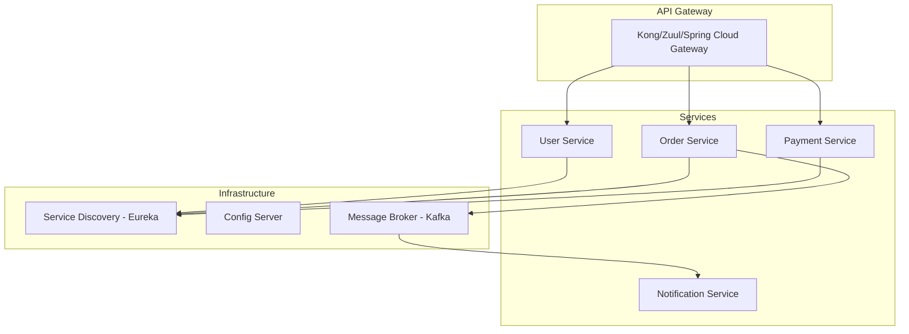
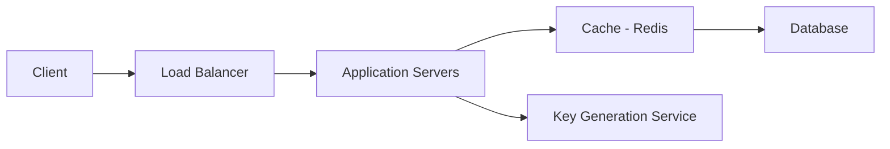
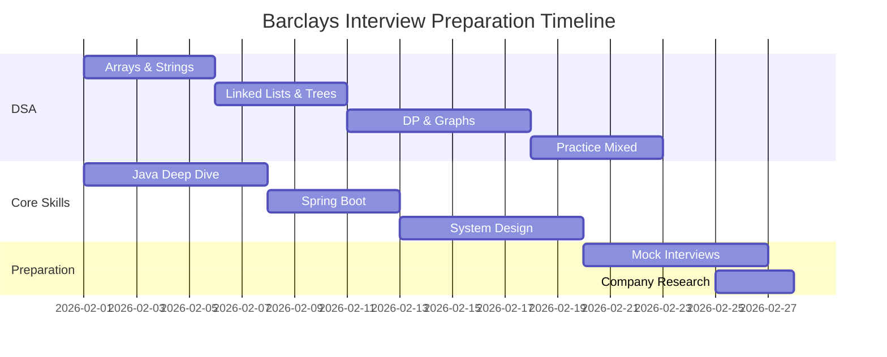

# Barclays Pune & Gurugram Interview Preparation Guide 🏦

> **Target Locations:** Pune & Gurugram, India  
> **Interview Focus:** Software Engineer / Technology Roles  
> **Last Updated:** February 2026

---

## 📋 Table of Contents

1. [Interview Process Overview](#interview-process-overview)
2. [DSA & Problem Solving](#dsa--problem-solving)
3. [Core Java Questions](#core-java-questions)
4. [Spring Boot & Microservices](#spring-boot--microservices)
5. [System Design](#system-design)
6. [Database & SQL](#database--sql)
7. [Computer Science Fundamentals](#computer-science-fundamentals)
8. [Behavioral Interview (RISES Values)](#behavioral-interview-rises-values)
9. [Preparation Resources & Strategy](#preparation-resources--strategy)

---

## 🔄 Interview Process Overview

Barclays typically follows this interview structure:


| Round                      | Duration   | Focus                       |
| -------------------------- | ---------- | --------------------------- |
| **Online Assessment (OA)** | 60-90 mins | MCQs + 2-3 Coding Problems  |
| **Technical Round 1**      | 45-60 mins | DSA + Core Concepts         |
| **Technical Round 2**      | 45-60 mins | System Design + Deep Dive   |
| **HR/Behavioral**          | 30-45 mins | RISES Values + Cultural Fit |

---

## 🧮 DSA & Problem Solving

### Difficulty Level Summary

| Round               | Difficulty         | LeetCode Equivalent                |
| ------------------- | ------------------ | ---------------------------------- |
| Online Assessment   | **Easy to Medium** | LC Easy - LC Medium                |
| Technical Interview | **Medium to Hard** | LC Medium - LC Hard (occasionally) |

### Topic-wise Breakdown & Practice Problems

#### 1. Arrays (High Priority ⭐⭐⭐)

| Problem                         | Difficulty | LeetCode Link                                                         | Key Concept         |
| ------------------------------- | ---------- | --------------------------------------------------------------------- | ------------------- |
| Maximum Subarray Sum (Kadane's) | Medium     | [LC 53](https://leetcode.com/problems/maximum-subarray/)              | Dynamic Programming |
| Two Sum                         | Easy       | [LC 1](https://leetcode.com/problems/two-sum/)                        | HashMap             |
| 3Sum                            | Medium     | [LC 15](https://leetcode.com/problems/3sum/)                          | Two Pointers        |
| Product of Array Except Self    | Medium     | [LC 238](https://leetcode.com/problems/product-of-array-except-self/) | Prefix Sum          |
| Container With Most Water       | Medium     | [LC 11](https://leetcode.com/problems/container-with-most-water/)     | Two Pointers        |
| First Missing Positive          | Hard       | [LC 41](https://leetcode.com/problems/first-missing-positive/)        | In-place Hashing    |
| Merge Intervals                 | Medium     | [LC 56](https://leetcode.com/problems/merge-intervals/)               | Sorting + Greedy    |

#### 2. Strings (High Priority ⭐⭐⭐)

| Problem                             | Difficulty | LeetCode Link                                                                         | Key Concept               |
| ----------------------------------- | ---------- | ------------------------------------------------------------------------------------- | ------------------------- |
| Reverse String In-Place             | Easy       | [LC 344](https://leetcode.com/problems/reverse-string/)                               | Two Pointers              |
| Longest Palindromic Substring       | Medium     | [LC 5](https://leetcode.com/problems/longest-palindromic-substring/)                  | DP / Expand Around Center |
| Word Count in Paragraph             | Easy       | Custom                                                                                | String Manipulation       |
| Valid Anagram                       | Easy       | [LC 242](https://leetcode.com/problems/valid-anagram/)                                | HashMap/Sorting           |
| Longest Substring Without Repeating | Medium     | [LC 3](https://leetcode.com/problems/longest-substring-without-repeating-characters/) | Sliding Window            |
| String to Integer (atoi)            | Medium     | [LC 8](https://leetcode.com/problems/string-to-integer-atoi/)                         | Parsing                   |

#### 3. Linked Lists (Medium Priority ⭐⭐)

| Problem                  | Difficulty | LeetCode Link                                                            | Key Concept         |
| ------------------------ | ---------- | ------------------------------------------------------------------------ | ------------------- |
| Reverse Linked List      | Easy       | [LC 206](https://leetcode.com/problems/reverse-linked-list/)             | Iteration/Recursion |
| Detect Cycle             | Easy       | [LC 141](https://leetcode.com/problems/linked-list-cycle/)               | Floyd's Algorithm   |
| Merge Two Sorted Lists   | Easy       | [LC 21](https://leetcode.com/problems/merge-two-sorted-lists/)           | Two Pointers        |
| Remove Nth Node From End | Medium     | [LC 19](https://leetcode.com/problems/remove-nth-node-from-end-of-list/) | Two Pointers        |
| LRU Cache                | Medium     | [LC 146](https://leetcode.com/problems/lru-cache/)                       | HashMap + DLL       |

#### 4. Trees & Graphs (High Priority ⭐⭐⭐)

| Problem                        | Difficulty | LeetCode Link                                                                    | Key Concept           |
| ------------------------------ | ---------- | -------------------------------------------------------------------------------- | --------------------- |
| BFS on Graph                   | Medium     | [LC 102](https://leetcode.com/problems/binary-tree-level-order-traversal/)       | Level Order Traversal |
| Detect Cycle in Directed Graph | Medium     | [LC 207](https://leetcode.com/problems/course-schedule/)                         | DFS + Coloring        |
| Binary Tree Inorder Traversal  | Easy       | [LC 94](https://leetcode.com/problems/binary-tree-inorder-traversal/)            | DFS                   |
| Validate BST                   | Medium     | [LC 98](https://leetcode.com/problems/validate-binary-search-tree/)              | Inorder Property      |
| Lowest Common Ancestor         | Medium     | [LC 236](https://leetcode.com/problems/lowest-common-ancestor-of-a-binary-tree/) | Recursion             |
| Number of Islands              | Medium     | [LC 200](https://leetcode.com/problems/number-of-islands/)                       | DFS/BFS               |

#### 5. Dynamic Programming (High Priority ⭐⭐⭐)

| Problem                        | Difficulty | LeetCode Link                                                           | Key Concept        |
| ------------------------------ | ---------- | ----------------------------------------------------------------------- | ------------------ |
| Longest Increasing Subsequence | Medium     | [LC 300](https://leetcode.com/problems/longest-increasing-subsequence/) | Classic DP         |
| Fibonacci Number               | Easy       | [LC 509](https://leetcode.com/problems/fibonacci-number/)               | Memoization        |
| Climbing Stairs                | Easy       | [LC 70](https://leetcode.com/problems/climbing-stairs/)                 | 1D DP              |
| House Robber                   | Medium     | [LC 198](https://leetcode.com/problems/house-robber/)                   | 1D DP              |
| Longest Common Subsequence     | Medium     | [LC 1143](https://leetcode.com/problems/longest-common-subsequence/)    | 2D DP              |
| Coin Change                    | Medium     | [LC 322](https://leetcode.com/problems/coin-change/)                    | Unbounded Knapsack |

#### 6. Binary Search (Medium Priority ⭐⭐)

| Problem                          | Difficulty | LeetCode Link                                                                                   | Key Concept             |
| -------------------------------- | ---------- | ----------------------------------------------------------------------------------------------- | ----------------------- |
| First & Last Position of Element | Medium     | [LC 34](https://leetcode.com/problems/find-first-and-last-position-of-element-in-sorted-array/) | Lower/Upper Bound       |
| Search in Rotated Array          | Medium     | [LC 33](https://leetcode.com/problems/search-in-rotated-sorted-array/)                          | Modified Binary Search  |
| Find Peak Element                | Medium     | [LC 162](https://leetcode.com/problems/find-peak-element/)                                      | Binary Search on Answer |

#### 7. Stacks & Queues (Medium Priority ⭐⭐)

| Problem                      | Difficulty | LeetCode Link                                                         | Key Concept |
| ---------------------------- | ---------- | --------------------------------------------------------------------- | ----------- |
| Valid Parentheses            | Easy       | [LC 20](https://leetcode.com/problems/valid-parentheses/)             | Stack       |
| Implement Queue using Stacks | Easy       | [LC 232](https://leetcode.com/problems/implement-queue-using-stacks/) | Stack       |
| Min Stack                    | Medium     | [LC 155](https://leetcode.com/problems/min-stack/)                    | Design      |

---

## ☕ Core Java Questions

### Frequently Asked Topics

#### Object-Oriented Programming

```java
// Key OOP Concepts to Master:
// 1. Encapsulation - Data hiding using private fields + getters/setters
// 2. Inheritance - IS-A relationship, extends keyword
// 3. Polymorphism - Method overloading (compile-time) vs overriding (runtime)
// 4. Abstraction - Abstract classes vs Interfaces
```

**Common Questions:**

1. Explain the difference between `abstract class` and `interface` in Java 8+
2. What is method overloading vs method overriding? Discuss constraints.
3. How does polymorphism work at runtime?
4. Explain the diamond problem and how Java solves it.

#### Collections Framework

```java
// HashMap Internal Working
// - Uses array of buckets (Entry<K,V>[])
// - hashCode() -> hash -> bucket index
// - equals() for collision resolution
// - Threshold (load factor * capacity) triggers resize
// - Java 8+: LinkedList -> TreeNode (when bucket size > 8)
```

| Collection          | Thread-Safe? | Null Keys/Values                  | Use Case          |
| ------------------- | ------------ | --------------------------------- | ----------------- |
| `HashMap`           | ❌           | 1 null key, multiple null values  | General purpose   |
| `ConcurrentHashMap` | ✅           | ❌ null key/value                 | Concurrent access |
| `Hashtable`         | ✅           | ❌ null key/value                 | Legacy (avoid)    |
| `TreeMap`           | ❌           | ❌ null key (if using Comparator) | Sorted by keys    |

**Common Questions:**

1. How does `HashMap` handle collisions? What happens when threshold exceeds?
2. Difference between `HashMap`, `ConcurrentHashMap`, and `Hashtable`?
3. Why override both `equals()` and `hashCode()`?
4. Explain fail-fast vs fail-safe iterators.

#### Java Memory Model & Garbage Collection

```java
// Memory Areas:
// 1. Heap - Objects, shared across threads
// 2. Stack - Method frames, thread-local
// 3. Metaspace (Java 8+) - Class metadata
// 4. Code Cache - JIT compiled code
```

**Common Questions:**

1. Explain the difference between heap and stack memory.
2. What are the different types of garbage collectors in Java?
3. How does G1 garbage collector work?
4. What is memory leak in Java? How to detect?

#### Multithreading & Concurrency

```java
// Creating Threads:
// 1. Extending Thread class
// 2. Implementing Runnable interface
// 3. Using Callable with ExecutorService
// 4. Using CompletableFuture (Java 8+)

// Synchronization Mechanisms:
// - synchronized keyword
// - ReentrantLock
// - ReadWriteLock
// - Semaphore
// - CountDownLatch
```

**Common Questions:**

1. How to create a thread in Java? Compare different approaches.
2. What is a deadlock? How to prevent it?
3. Explain volatile vs synchronized.
4. What is the purpose of `wait()`, `notify()`, and `notifyAll()`?

#### Making a Class Immutable

```java
public final class ImmutablePerson {
    private final String name;
    private final List<String> hobbies;

    public ImmutablePerson(String name, List<String> hobbies) {
        this.name = name;
        // Defensive copy
        this.hobbies = new ArrayList<>(hobbies);
    }

    public String getName() {
        return name;
    }

    public List<String> getHobbies() {
        // Return copy, not original
        return new ArrayList<>(hobbies);
    }
}
```

---

## 🍃 Spring Boot & Microservices

### Spring Boot Core Concepts

**Key Annotations to Know:**

| Annotation               | Purpose                                                                 |
| ------------------------ | ----------------------------------------------------------------------- |
| `@SpringBootApplication` | Combines `@Configuration`, `@EnableAutoConfiguration`, `@ComponentScan` |
| `@RestController`        | `@Controller` + `@ResponseBody`                                         |
| `@Service`               | Business logic layer marker                                             |
| `@Repository`            | Data access layer marker                                                |
| `@Autowired`             | Dependency injection                                                    |
| `@Value`                 | Inject properties                                                       |
| `@Transactional`         | Transaction management                                                  |
| `@Entity`                | JPA entity marker                                                       |

**Common Questions:**

1. How does Spring Boot simplify application development?
2. What is the purpose of `application.properties`/`application.yml`?
3. Explain Spring Boot Starters.
4. How does auto-configuration work?
5. What are Spring Boot profiles and how to use them?

### Building REST APIs

```java
@RestController
@RequestMapping("/api/users")
public class UserController {

    @Autowired
    private UserService userService;

    @GetMapping("/{id}")
    public ResponseEntity<User> getUser(@PathVariable Long id) {
        return ResponseEntity.ok(userService.findById(id));
    }

    @PostMapping
    public ResponseEntity<User> createUser(@Valid @RequestBody User user) {
        return ResponseEntity.status(HttpStatus.CREATED)
                           .body(userService.save(user));
    }

    @ExceptionHandler(UserNotFoundException.class)
    public ResponseEntity<Error> handleNotFound(UserNotFoundException ex) {
        return ResponseEntity.status(HttpStatus.NOT_FOUND)
                           .body(new Error(ex.getMessage()));
    }
}
```

### Microservices Architecture



**Key Microservices Topics:**

1. **Service Discovery** - Eureka, Consul
2. **API Gateway** - Spring Cloud Gateway, Zuul
3. **Inter-Service Communication** - Feign Client, RestTemplate, WebClient
4. **Circuit Breaker** - Resilience4j (Hystrix deprecated)
5. **Event-Driven Architecture** - Kafka, RabbitMQ
6. **Distributed Tracing** - Zipkin, Sleuth

**Common Questions:**

1. Explain the difference between Monolithic, SOA, and Microservices.
2. How do you handle inter-service communication?
3. What is a circuit breaker pattern? Why is it important?
4. How does service discovery work?
5. What are the challenges in microservices architecture?

### Apache Kafka Use Cases

| Use Case                    | Description                            |
| --------------------------- | -------------------------------------- |
| Real-time Data Streaming    | Processing live data from sources      |
| Log Aggregation             | Collecting logs from multiple services |
| Event-Driven Microservices  | Async communication between services   |
| Messaging Systems (Pub-Sub) | Decoupled publishers and subscribers   |
| Database CDC                | Capturing database changes for sync    |
| Data Replication            | Syncing data across systems            |

---

## 🏗️ System Design

### Common System Design Questions at Barclays

1. **URL Shortener Service** (frequently asked)
2. Rate Limiter
3. Notification Service
4. Payment Processing System
5. Real-time Dashboard

### URL Shortener Design Template



**Key Considerations:**

- Base62 encoding vs Hash-based
- Collision handling
- Read-heavy (use caching)
- Database sharding strategy
- TTL for expired URLs

### SQL vs NoSQL Trade-offs

| Aspect   | SQL (PostgreSQL/MySQL)        | NoSQL (MongoDB/Cassandra)                |
| -------- | ----------------------------- | ---------------------------------------- |
| Schema   | Fixed, structured             | Flexible, schema-less                    |
| Scaling  | Vertical (primarily)          | Horizontal                               |
| ACID     | Strong guarantees             | Eventual consistency (typically)         |
| Joins    | Native support                | Limited/No support                       |
| Use Case | Complex queries, transactions | High write throughput, unstructured data |

---

## 💾 Database & SQL

### Commonly Asked SQL Questions

```sql
-- 1. Find the second highest salary
SELECT MAX(salary)
FROM employees
WHERE salary < (SELECT MAX(salary) FROM employees);

-- OR using DENSE_RANK()
SELECT salary FROM (
    SELECT salary, DENSE_RANK() OVER (ORDER BY salary DESC) as rank
    FROM employees
) ranked WHERE rank = 2;

-- 2. Find employees earning more than their manager
SELECT e.name as Employee
FROM employees e
JOIN employees m ON e.manager_id = m.id
WHERE e.salary > m.salary;

-- 3. Department-wise highest salary
SELECT d.name as Department, e.name as Employee, e.salary
FROM employees e
JOIN departments d ON e.department_id = d.id
WHERE (e.department_id, e.salary) IN (
    SELECT department_id, MAX(salary)
    FROM employees
    GROUP BY department_id
);
```

### JPA/Hibernate Concepts

**Common Questions:**

1. Explain lazy loading vs eager loading. When to use each?
2. What is N+1 problem? How to solve it?
3. Difference between `load()` and `get()` methods.
4. What are the different cascade types in JPA?
5. Explain `@OneToMany`, `@ManyToOne`, `@ManyToMany` relationships.

---

## 📚 Computer Science Fundamentals

### Operating Systems

| Topic              | Key Concepts                           |
| ------------------ | -------------------------------------- |
| Process vs Thread  | Memory sharing, context switching cost |
| Process Scheduling | Round Robin, Priority, FCFS, SJF       |
| Deadlock           | Conditions, prevention, detection      |
| Memory Management  | Paging, segmentation, virtual memory   |
| Synchronization    | Mutex, semaphore, monitors             |

### Computer Networks

| Topic          | Key Concepts                          |
| -------------- | ------------------------------------- |
| OSI Model      | 7 layers and their functions          |
| TCP vs UDP     | Connection-oriented vs connectionless |
| HTTP/HTTPS     | Methods, status codes, SSL/TLS        |
| DNS            | Resolution process                    |
| Load Balancing | L4 vs L7, algorithms                  |

### DBMS Concepts

| Topic           | Key Concepts                                   |
| --------------- | ---------------------------------------------- |
| ACID Properties | Atomicity, Consistency, Isolation, Durability  |
| Normalization   | 1NF, 2NF, 3NF, BCNF                            |
| Indexing        | B-Tree, Hash, Clustered vs Non-clustered       |
| Transactions    | Isolation levels, locking mechanisms           |
| CAP Theorem     | Consistency, Availability, Partition tolerance |

---

## 🤝 Behavioral Interview (RISES Values)

Barclays evaluates candidates on their **RISES** values:

| Value           | Description                            | Sample Question                                                    |
| --------------- | -------------------------------------- | ------------------------------------------------------------------ |
| **R**espect     | Value diversity, treat everyone fairly | "Describe a time you worked with someone very different from you." |
| **I**ntegrity   | Do the right thing, be transparent     | "Tell me about a time you faced an ethical dilemma."               |
| **S**ervice     | Put customers and clients first        | "How did you go above and beyond for a customer/stakeholder?"      |
| **E**xcellence  | High standards, continuous improvement | "Describe a situation where you improved a process."               |
| **S**tewardship | Think long-term, be responsible        | "How do you ensure code quality in your projects?"                 |

### STAR Method for Behavioral Answers

```
S - Situation: Set the context
T - Task: Your responsibility
A - Action: What you did specifically
R - Result: Outcomes and learnings
```

### Common Behavioral Questions

1. "Why Barclays?"
2. "Tell me about a challenging technical problem you solved."
3. "Describe a situation where you disagreed with a team member."
4. "How do you stay updated with new technologies?"
5. "Tell me about a project you're most proud of."

---

## 📖 Preparation Resources & Strategy

### Recommended Study Plan (4-6 Weeks)



### DSA Practice Resources

| Resource                   | Focus             | Link                                                                                              |
| -------------------------- | ----------------- | ------------------------------------------------------------------------------------------------- |
| LeetCode Top Interview 150 | Curated list      | [LeetCode](https://leetcode.com/studyplan/top-interview-150/)                                     |
| NeetCode 150               | Pattern-based     | [NeetCode](https://neetcode.io/)                                                                  |
| GeeksforGeeks              | Theory + Practice | [GFG](https://www.geeksforgeeks.org/)                                                             |
| Striver's SDE Sheet        | Comprehensive     | [TakeUForward](https://takeuforward.org/strivers-a2z-dsa-course/strivers-a2z-dsa-course-sheet-2/) |

### System Design Resources

| Resource                                | Type                 |
| --------------------------------------- | -------------------- |
| "Designing Data-Intensive Applications" | Book                 |
| System Design Primer (GitHub)           | Repository           |
| ByteByteGo                              | YouTube + Newsletter |
| Alex Xu's System Design Interview       | Book                 |

### Java & Spring Boot Resources

| Resource                      | Focus              |
| ----------------------------- | ------------------ |
| Baeldung                      | Spring tutorials   |
| Java Brains (YouTube)         | Spring Boot series |
| Official Spring Docs          | Reference          |
| Effective Java (Joshua Bloch) | Best practices     |

---

## ✅ Interview Day Checklist

- [ ] Review your resume and projects thoroughly
- [ ] Prepare 2-3 stories using STAR method
- [ ] Research Barclays recent news and initiatives
- [ ] Have questions ready for the interviewer
- [ ] Test your video/audio if virtual interview
- [ ] Keep pen and paper ready for whiteboarding
- [ ] Dress professionally (business formal)
- [ ] Join 5-10 minutes early

---

## 💡 Pro Tips

> [!TIP]
> **During Coding Interviews:**
>
> - Always clarify requirements before coding
> - Think out loud and explain your approach
> - Start with brute force, then optimize
> - Test your code with edge cases

> [!IMPORTANT]
> **Key Differentiators:**
>
> - Barclays values code quality and clean architecture
> - They appreciate knowledge of financial domain
> - Security awareness is a plus for banking technology roles

> [!NOTE]
> **Online Assessment Tips:**
>
> - Practice typing speed for faster implementation
> - The OA typically uses HackerRank or Codility
> - Time management is crucial - don't get stuck on one problem

---

**Good luck with your Barclays interview! 🍀**

_Remember: Consistency in preparation beats intensity. Practice regularly and you'll ace it!_
