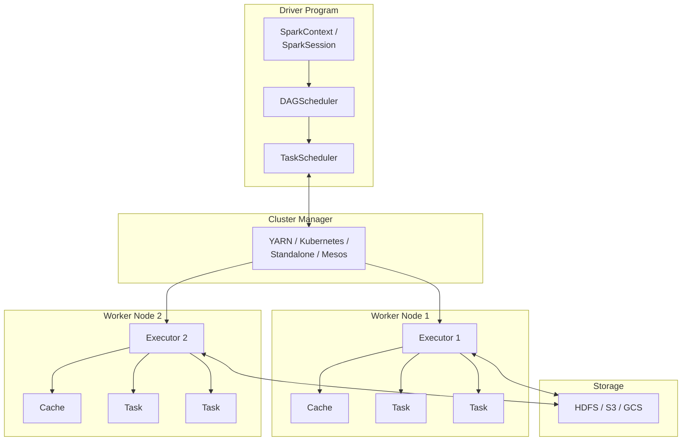
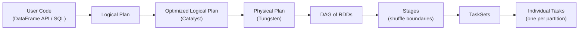
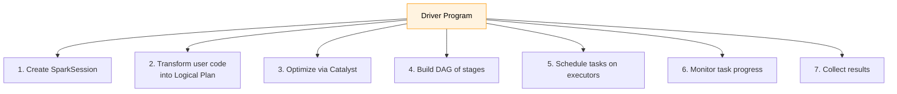
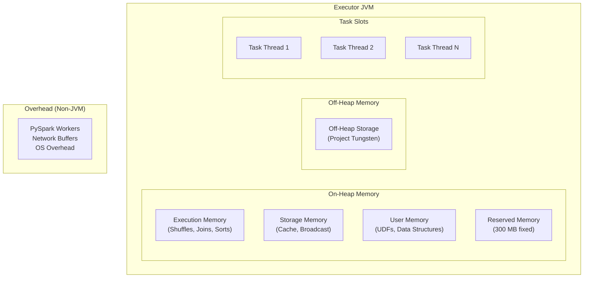
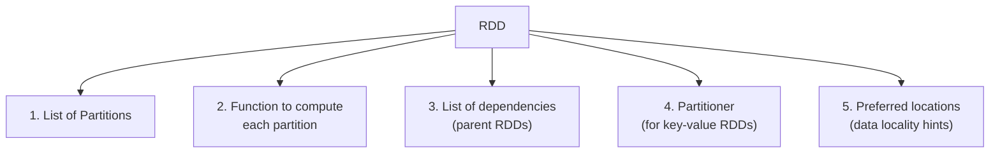
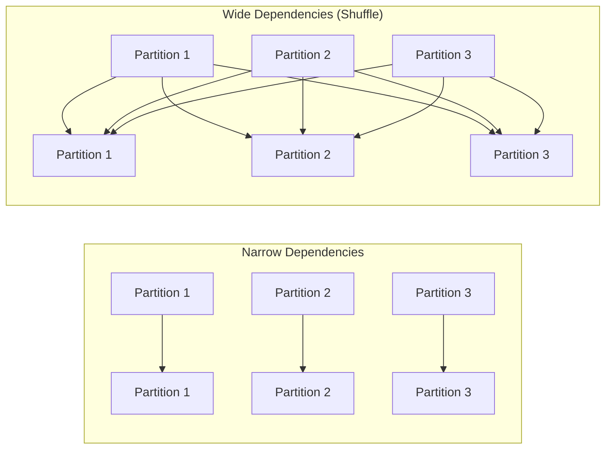
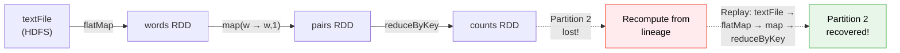
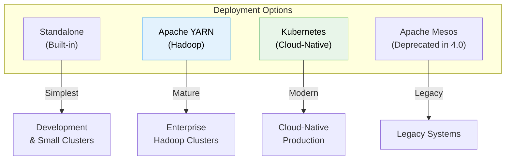
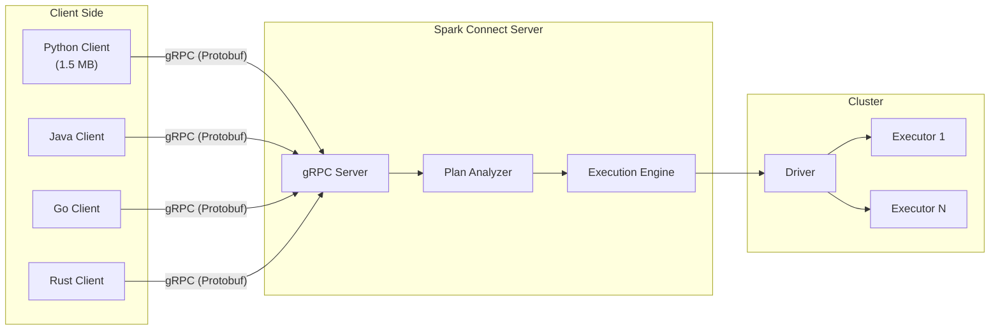

# ⚡ Module 1: Apache Spark — Architecture & Internals

[⬅️ Back to Hub](spark-flink-guide.md) | [➡️ Next: Execution Engine Deep Dive](02_spark_execution_engine.md)

---

## 1. What is Apache Spark?

Apache Spark is a **unified analytics engine** for large-scale data processing. Originally developed at UC Berkeley's AMPLab in 2009, it became an Apache top-level project in 2014. Spark provides:

- **Speed**: 100x faster than Hadoop MapReduce (in-memory), 10x faster on disk
- **Unified**: Batch, streaming, ML, and graph processing in one engine
- **Ease of Use**: High-level APIs in Java, Scala, Python, R, and SQL
- **Generality**: Libraries for SQL, streaming, ML, and graph computation

> **Spark 4.0** (released May 2025) is the latest major release, bringing ANSI SQL compliance, the VARIANT data type, Spark Connect maturation, and Java 17 as the default JDK.

---

## 2. High-Level Architecture



### Key Components

| Component | Role |
|:---|:---|
| **Driver** | The "brain" — creates SparkContext, builds DAG, schedules tasks |
| **SparkSession** | Unified entry point (replaces SparkContext, SQLContext, HiveContext) |
| **Cluster Manager** | Allocates resources (executors) across the cluster |
| **Executor** | A JVM process on a worker node that runs tasks and stores data |
| **Task** | The smallest unit of work — processes one partition of data |
| **Cache/Storage** | In-memory (or disk) data caching for iterative algorithms |

---

## 3. Application Lifecycle — From Code to Execution

Understanding how Spark translates your code into distributed computation is the **#1 most important** internals concept.



### Step-by-Step Breakdown

1. **User writes code** using the DataFrame/Dataset API or SQL
2. **Catalyst Optimizer** creates a Logical Plan, then optimizes it (predicate pushdown, join reordering, etc.)
3. **Physical Plan** is generated — Catalyst picks the best execution strategy
4. **Tungsten** generates optimized Java bytecode
5. **DAG is built** — a graph of RDD transformations
6. **DAGScheduler** breaks the DAG into **Stages** at shuffle boundaries
7. Each Stage is decomposed into **Tasks** (one per partition)
8. **TaskScheduler** sends tasks to available Executors

---

## 4. The Driver Program — In Detail

The Driver is the process where your `main()` function runs. It's responsible for:



### Driver Memory Pitfalls

> [!CAUTION]
> The Driver is a **single JVM**. These operations can crash it:
> - `collect()` on a large DataFrame → pulls ALL data to the Driver
> - Large broadcast variables that exceed Driver memory
> - Too many accumulated task results (e.g., thousands of small tasks)

```python
# ❌ DANGEROUS — pulls entire DataFrame to Driver memory
huge_df.collect()

# ✅ SAFE — take only what you need
huge_df.take(100)
huge_df.show(20)
```

---

## 5. Executors — The Workhorses

Each Executor is a **long-running JVM process** on a worker node. Key characteristics:

| Property | Description |
|:---|:---|
| **Cores** | Number of concurrent tasks the executor can run (`spark.executor.cores`) |
| **Memory** | JVM heap for task execution + caching (`spark.executor.memory`) |
| **Lifetime** | Lives for the entire duration of the Spark application |
| **Isolation** | Each application gets its own set of executors (no sharing between apps) |

### Executor Internal Architecture



> [!TIP]
> **Unified Memory Management** (since Spark 1.6): Execution and Storage memory share a common pool. If one region is empty, the other can borrow from it. Execution memory can evict Storage memory if needed, but not vice versa.

---

## 6. RDD — The Foundation

**Resilient Distributed Dataset (RDD)** is Spark's fundamental data abstraction. Everything in Spark — DataFrames, Datasets, SQL — compiles down to RDD operations internally.

### Five Properties of an RDD



### Narrow vs Wide Dependencies

This distinction is **critical** — it determines where Spark draws stage boundaries.



| Type | Description | Examples | Stage Impact |
|:---|:---|:---|:---|
| **Narrow** | Each parent partition maps to at most one child partition | `map`, `filter`, `flatMap`, `union` | Same stage |
| **Wide** | Each parent partition maps to **multiple** child partitions | `groupByKey`, `reduceByKey`, `join`, `repartition` | **New stage** (shuffle boundary) |

---

## 7. Fault Tolerance: Lineage-Based Recovery

Unlike traditional systems that replicate data for fault tolerance, Spark uses **lineage** — the history of transformations.



### How It Works
1. Each RDD remembers the chain of transformations that created it
2. If a partition is lost (executor crash), Spark traces back through the lineage
3. Only the **lost partitions** are recomputed — not the entire dataset
4. Narrow dependencies require recomputing from only the parent partition
5. Wide dependencies may require recomputing from multiple parents (more expensive)

> [!IMPORTANT]
> **Checkpointing** breaks the lineage by saving the RDD to stable storage (HDFS/S3). Use it for:
> - Very long lineage chains (iterative algorithms)
> - RDDs with wide dependencies that are expensive to recompute

```python
# Set checkpoint directory
spark.sparkContext.setCheckpointDir("hdfs:///checkpoints")

# Checkpoint a frequently-reused RDD
expensive_rdd.checkpoint()
expensive_rdd.count()  # Triggers the checkpoint
```

---

## 8. Cluster Managers — Compared



| Manager | Pros | Cons | Best For |
|:---|:---|:---|:---|
| **Standalone** | Zero dependencies, easy setup | No multi-tenancy, limited features | Development, small teams |
| **YARN** | Mature, multi-tenant, Hadoop integration | Heavy, tightly coupled to Hadoop | Existing Hadoop infrastructure |
| **Kubernetes** | Cloud-native, elastic, containerized | Complex setup, networking overhead | Cloud production, microservices |
| **Mesos** | Fine-grained sharing | Deprecated in Spark 4.0 | Don't use for new projects |

---

## 9. Spark 4.0 — What's New (May 2025)

### Major Highlights

| Feature | Description | Impact |
|:---|:---|:---|
| **ANSI SQL Mode (Default)** | Strict type checking, runtime exceptions for invalid ops | Catches bugs earlier, PostgreSQL-like behavior |
| **VARIANT Data Type** | Native semi-structured data (JSON) storage + querying | No more exploding JSON strings; direct nested queries |
| **Spark Connect (GA)** | Thin client-server architecture, 1.5 MB Python client | Remote execution, language-agnostic (Go, Swift, Rust) |
| **Pipe Syntax (`\|>`)** | Functional-style SQL chaining | `SELECT * FROM t \|> WHERE x > 5 \|> LIMIT 10` |
| **`transformWithState`** | Arbitrary stateful processing in Structured Streaming | Timers, TTL, state schema evolution |
| **Python Data Source API** | Create custom data sources in pure Python | No Scala/Java needed |
| **Java 17 Default** | Modern JVM with better GC, performance | Improved garbage collection, security |
| **Structured Logging** | Machine-readable JSON logs | Better observability in production |

### Spark Connect Architecture (Spark 4.0)



> [!TIP]
> **Spark Connect** decouples the client from the Spark cluster. This means:
> - You can run PySpark from a **Jupyter notebook** without installing Spark locally
> - Multiple languages can connect to the **same** Spark cluster
> - **Resource isolation**: Client failures don't crash the Spark Driver

---

## 10. Interview Essentials 🎯

### Q1: What happens when you call `spark.read.csv("data.csv").filter(...).groupBy(...).count().show()`?

**Answer:**
1. `spark.read.csv()` → Creates an unresolved logical plan
2. `filter()` → Adds a Filter node to the plan (lazy)
3. `groupBy().count()` → Adds Aggregate node (lazy)
4. `.show()` → **Action!** Triggers the entire pipeline:
   - Catalyst optimizes the logical plan (pushes filter before groupBy if possible)
   - Physical plan selected (hash aggregate vs sort aggregate)
   - DAG built, stages created at the shuffle boundary (groupBy)
   - Tasks launched on executors
   - Results collected to Driver and printed

### Q2: Why is Spark faster than MapReduce?

| Factor | MapReduce | Spark |
|:---|:---|:---|
| **Storage** | Writes intermediate results to disk (HDFS) | Keeps data in memory between stages |
| **Execution** | Two-phase model (Map → Reduce) only | DAG-based, arbitrary pipeline of operations |
| **Optimization** | None (user must optimize manually) | Catalyst optimizer + Tungsten code generation |
| **Iteration** | Each iteration reads from and writes to disk | Caches data in memory for iterative algorithms |

### Q3: What is the difference between `repartition()` and `coalesce()`?

- `repartition(n)`: **Full shuffle** → can increase or decrease partitions. Produces evenly distributed partitions.
- `coalesce(n)`: **No shuffle** → can only **decrease** partitions. Merges existing partitions (may be uneven).
- Use `coalesce()` when reducing partitions to avoid expensive shuffle.

---

📄 **Navigation:**
[⬅️ Back to Hub](spark-flink-guide.md) | [➡️ Next: Execution Engine Deep Dive](02_spark_execution_engine.md)
