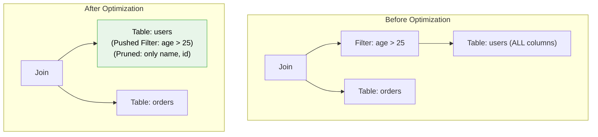
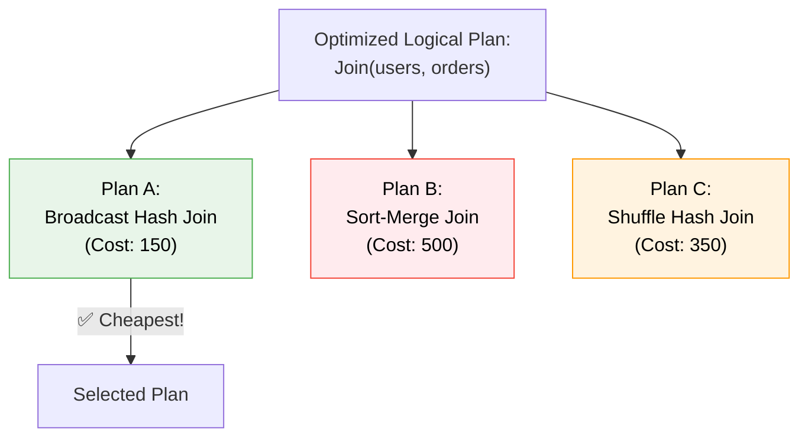
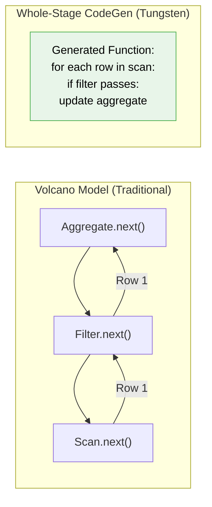
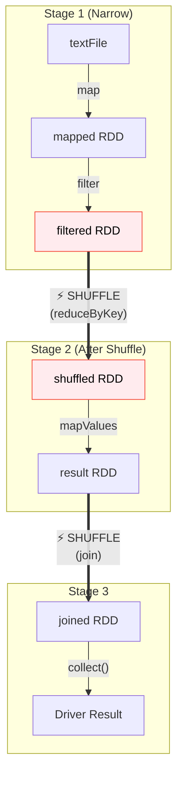
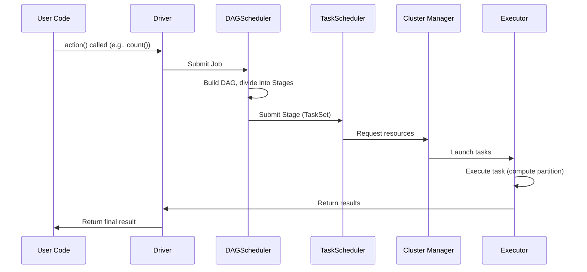
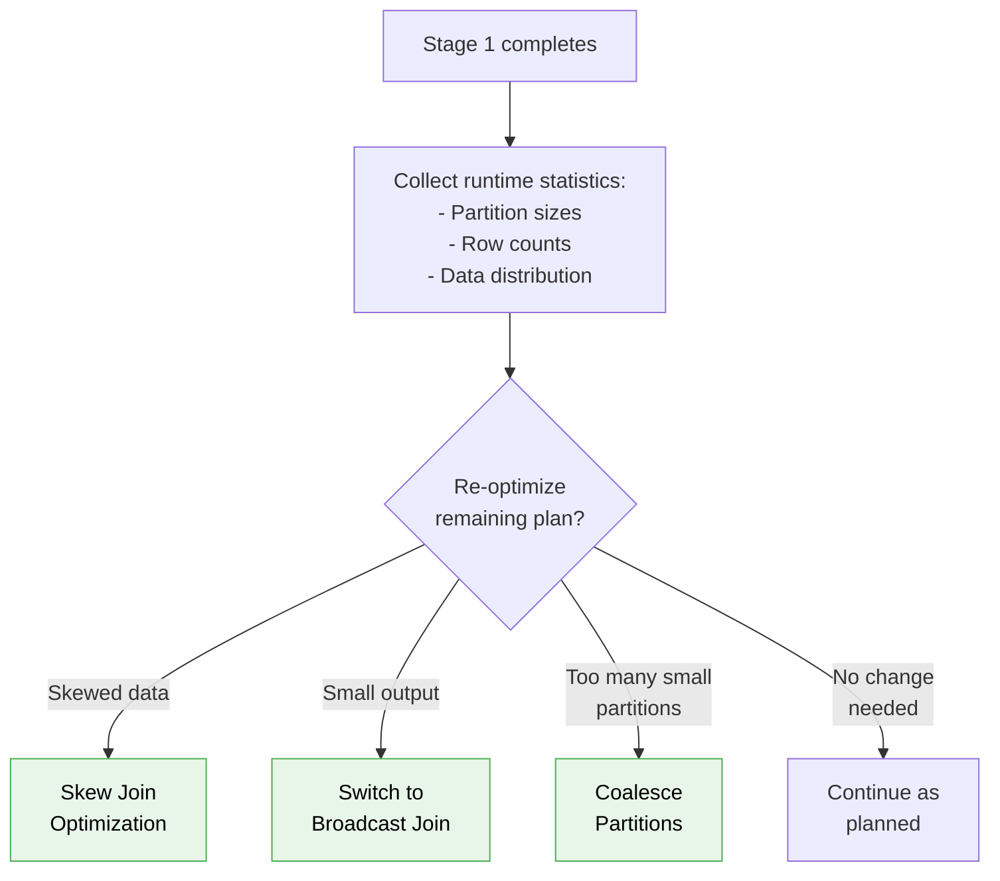
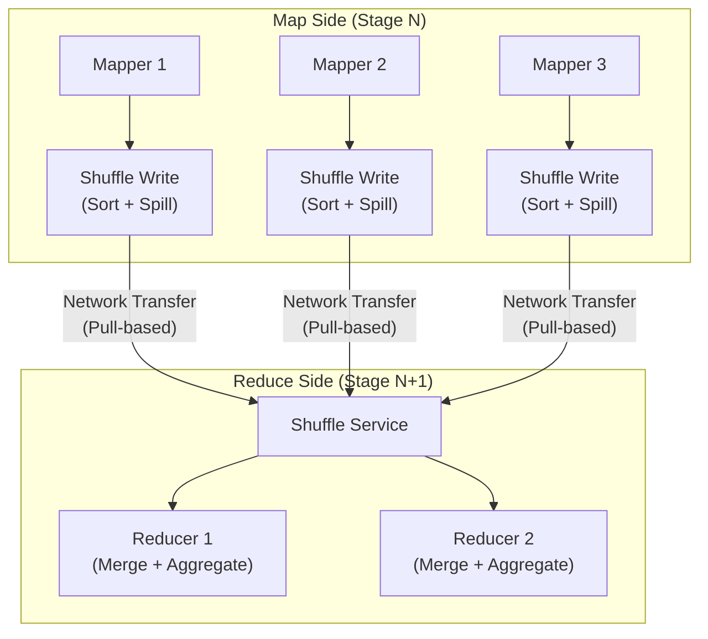

# ⚡ Module 2: Spark Execution Engine — Catalyst, Tungsten & AQE Deep Dive

[⬅️ Previous: Architecture & Internals](01_spark_architecture_internals.md) | [➡️ Next: Data APIs & SQL](03_spark_data_apis_sql.md)

---

## 1. The Query Execution Pipeline

Every query in Spark goes through a sophisticated optimization pipeline before a single byte of data is processed.

```mermaid
graph LR
    A["SQL / DataFrame\nUser Code"] --> B["Unresolved\nLogical Plan"]
    B -->|"Analysis\n(Catalog Lookup)"| C["Resolved\nLogical Plan"]
    C -->|"Logical\nOptimization"| D["Optimized\nLogical Plan"]
    D -->|"Physical\nPlanning"| E["Physical Plans\n(Multiple)"]
    E -->|"Cost Model\nSelection"| F["Selected\nPhysical Plan"]
    F -->|"Code\nGeneration"| G["RDDs of\nJava Bytecode"]

    style A fill:#E3F2FD,stroke:#2196F3,color:#000
    style D fill:#E8F5E9,stroke:#4CAF50,color:#000
    style G fill:#FFF3E0,stroke:#FF9800,color:#000
```



---

## 2. Catalyst Optimizer — The Brain

Catalyst is a **rule-based and cost-based** query optimization framework built using Scala's functional programming features (pattern matching on trees).

### Phase 1: Analysis

Resolves column names, table references, and data types by consulting the **Catalog**.

```
Unresolved Plan:               Resolved Plan:
Filter(age > 25)               Filter(users.age#12 > 25)
  Project(name, age)     →       Project(users.name#11, users.age#12)
    UnresolvedRelation              LogicalRelation(users_table,
      ("users")                       schema=[name:STRING, age:INT])
```

### Phase 2: Logical Optimization (Rule-Based)

Applies a series of optimization rules. The most impactful ones:

| Rule | What It Does | Example |
|:---|:---|:---|
| **Predicate Pushdown** | Moves filters closer to the data source | Filter applied before join, not after |
| **Column Pruning** | Reads only required columns | SELECT 2 of 50 columns → scan only 2 |
| **Constant Folding** | Pre-computes constant expressions | `WHERE age > 20 + 5` → `WHERE age > 25` |
| **Boolean Simplification** | Simplifies boolean expressions | `WHERE true AND x > 5` → `WHERE x > 5` |
| **Join Reordering** | Reorders joins to minimize intermediate data | Smallest table joined first |



### Phase 3: Physical Planning (Cost-Based)

Catalyst generates **multiple physical plans** and picks the cheapest one.



**Join Strategy Selection Rules:**

| Strategy | When Used | Condition |
|:---|:---|:---|
| **Broadcast Hash Join** | One side is small enough to broadcast | Table < `spark.sql.autoBroadcastJoinThreshold` (10MB default) |
| **Sort-Merge Join** | Both sides are large | Default for equi-joins on large tables |
| **Shuffle Hash Join** | One side is much smaller (but too big for broadcast) | When build side fits in memory |
| **Cartesian Product** | No join condition | `CROSS JOIN` — avoid! |

---

## 3. Tungsten Engine — The Muscle

While Catalyst decides **what** to do, Tungsten decides **how** to do it at the hardware level.

### 3.1 Off-Heap Memory Management

Traditional JVM objects have massive overhead:

```
Standard Java String "hello":
┌──────────────────────────────────────┐
│ Object Header (12 bytes)             │  ← JVM overhead
│ Hash (4 bytes)                       │
│ Length (4 bytes)                      │
│ Pointer to char[] (8 bytes)          │  ← Pointer overhead
│   └─ char[] header (16 bytes)        │  ← Another object!
│       └─ 'h','e','l','l','o' (10 bytes)│
│ Padding (2 bytes)                    │
└──────────────────────────────────────┘
Total: ~56 bytes for 5 characters!

Tungsten Binary Format:
┌──────────────────────────────────────┐
│ Length (4 bytes) | "hello" (5 bytes)  │
└──────────────────────────────────────┘
Total: 9 bytes! (84% reduction)
```

### 3.2 Whole-Stage Code Generation (WSCG)

Instead of each operator processing rows individually via virtual function calls, Tungsten **fuses** an entire pipeline of operators into a single Java function.



**Why is this faster?**
- **No virtual function calls**: JVM can inline the entire pipeline
- **CPU register usage**: Data stays in CPU registers, not memory
- **Loop fusion**: Multiple operations happen in a single tight loop
- **SIMD potential**: The JIT compiler can auto-vectorize simple loops

### 3.3 Cache-Aware Computation

Tungsten algorithms are designed to exploit CPU cache hierarchy:

```
CPU Register: ~1 ns    (64 bytes)
L1 Cache:     ~1 ns    (64 KB)
L2 Cache:     ~4 ns    (256 KB)
L3 Cache:     ~12 ns   (8-64 MB)
Main Memory:  ~100 ns  (GBs)
Disk/SSD:     ~100 μs  (TBs)
```

Tungsten's sort algorithm stores fixed-length keys + pointers in a contiguous memory block, allowing the CPU to prefetch data efficiently.

---

## 4. DAG Scheduler — The Orchestrator

### Stage Division

The DAGScheduler divides the computation DAG into **Stages** at shuffle boundaries.



### Task Execution Flow



---

## 5. Adaptive Query Execution (AQE) — Runtime Re-Optimization

AQE, introduced in Spark 3.0 and enhanced in 4.0, allows Spark to **re-optimize the query plan at runtime** based on actual statistics from completed stages.



### AQE Feature Breakdown

#### 5.1 Dynamic Partition Coalescing
```
Before AQE:  200 shuffle partitions, 180 are tiny (< 1MB)
After AQE:   Merged into 20 well-sized partitions automatically
```

#### 5.2 Dynamic Join Strategy Switching
```
At compile time: Table A estimated at 500MB → Sort-Merge Join planned
At runtime:      Table A after filter = 8MB → Switched to Broadcast Join!
```

#### 5.3 Skew Join Optimization
```
Before: Partition 42 has 10x the data → 1 task takes 10x longer
After:  Spark splits partition 42 into sub-partitions, runs in parallel
```

### Enable AQE
```python
spark.conf.set("spark.sql.adaptive.enabled", "true")  # Default ON in Spark 3.2+
spark.conf.set("spark.sql.adaptive.coalescePartitions.enabled", "true")
spark.conf.set("spark.sql.adaptive.skewJoin.enabled", "true")
```

---

## 6. Shuffle — The Most Expensive Operation

Shuffles are where performance bottlenecks hide. Understanding them is critical.



### Shuffle Internals

| Phase | What Happens |
|:---|:---|
| **Shuffle Write** | Map tasks sort records by partition key, write to local disk |
| **Shuffle Read** | Reduce tasks pull data from all map tasks via network |
| **Sort-Based Shuffle** | Default since Spark 1.2; produces one file per map task |
| **External Shuffle Service** | Survives executor failures; decoupled in Spark 4.0 (RSS) |

### Operations That Cause Shuffles

> [!WARNING]
> These operations trigger a shuffle (expensive!):
> - `groupByKey()`, `reduceByKey()`, `aggregateByKey()`
> - `join()`, `cogroup()`
> - `repartition()`
> - `distinct()`
> - `sortByKey()`

> [!TIP]
> **Minimize shuffles by:**
> - Using `reduceByKey` instead of `groupByKey` (combines locally first)
> - Broadcasting small tables in joins
> - Using `coalesce` instead of `repartition` when reducing partitions
> - Pre-partitioning data with `repartition` before repeated joins on the same key

---

## 7. Interview Essentials 🎯

### Q1: Explain the Catalyst optimization pipeline.
**Answer:** Catalyst transforms user queries through 4 phases: (1) Analysis — resolve table/column references via catalog, (2) Logical Optimization — apply rule-based rewrites like predicate pushdown and column pruning, (3) Physical Planning — generate multiple physical plans and pick the cheapest using a cost model, (4) Code Generation — use Tungsten's WSCG to produce optimized Java bytecode.

### Q2: What is Whole-Stage Code Generation?
**Answer:** WSCG collapses an entire pipeline of operators (scan → filter → project → aggregate) into a single, hand-optimized Java function. This eliminates virtual function call overhead from the traditional Volcano iterator model, keeps data in CPU registers, and enables SIMD vectorization.

### Q3: How does AQE improve performance?
**Answer:** AQE re-optimizes the query plan at runtime using actual statistics from completed stages. Three key features: (1) coalescing many small post-shuffle partitions into fewer larger ones, (2) switching from Sort-Merge Join to Broadcast Join if a filtered table is small enough, (3) splitting skewed partitions into sub-partitions for parallel processing.

---

📄 **Navigation:**
[⬅️ Previous: Architecture & Internals](01_spark_architecture_internals.md) | [➡️ Next: Data APIs & SQL](03_spark_data_apis_sql.md)
