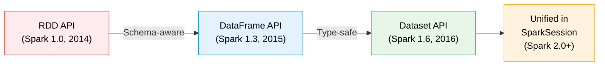
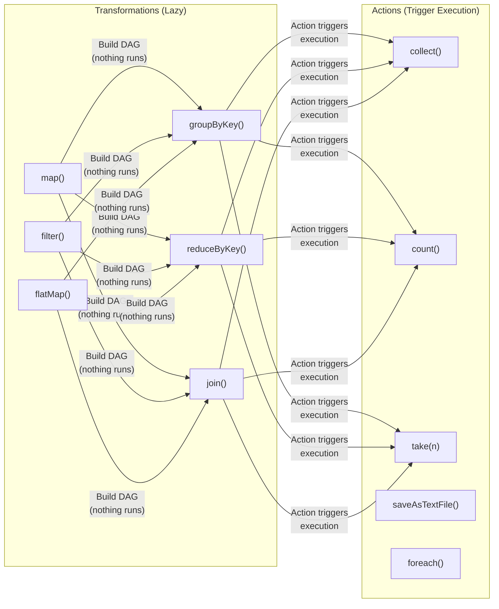
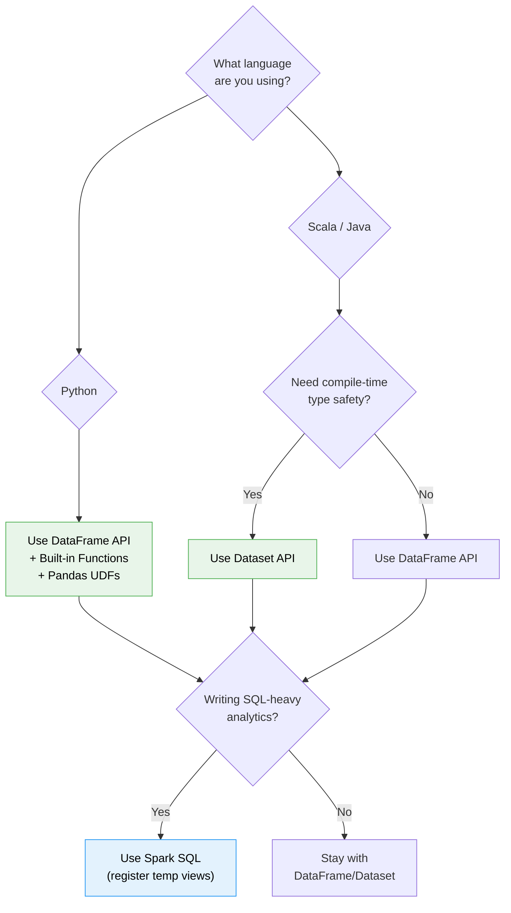

# ⚡ Module 3: Spark Data APIs & Spark SQL

[⬅️ Previous: Execution Engine](02_spark_execution_engine.md) | [➡️ Next: Structured Streaming](04_spark_streaming.md)

---

## 1. The API Evolution



| API | Type Safety | Optimization | Performance | Use When |
|:---|:---|:---|:---|:---|
| **RDD** | Compile-time | None (opaque to Catalyst) | Slowest | Low-level transformations, custom partitioning |
| **DataFrame** | Runtime only | Full Catalyst + Tungsten | Fastest | SQL-like analytics, ETL, interactive exploration |
| **Dataset** | Compile-time | Full Catalyst + Tungsten | Near-fastest | Type-safe domain models (Scala/Java only) |

> [!IMPORTANT]
> In **PySpark**, DataFrame and Dataset are the same thing. The typed Dataset API is only available in **Scala and Java**.

---

## 2. RDD API — The Low-Level Foundation

### Transformations (Lazy) vs Actions (Eager)



### Code Example: Word Count with RDD

```python
# Python (PySpark)
text_rdd = spark.sparkContext.textFile("hdfs:///data/books/*.txt")

word_counts = (
    text_rdd
    .flatMap(lambda line: line.split(" "))     # Narrow
    .map(lambda word: (word.lower(), 1))        # Narrow
    .reduceByKey(lambda a, b: a + b)            # Wide (shuffle!)
    .sortBy(lambda pair: pair[1], ascending=False)  # Wide (shuffle!)
)

word_counts.take(10)  # Action → triggers execution
```

```scala
// Scala
val textRDD = spark.sparkContext.textFile("hdfs:///data/books/*.txt")

val wordCounts = textRDD
  .flatMap(_.split(" "))
  .map(word => (word.toLowerCase, 1))
  .reduceByKey(_ + _)
  .sortBy(_._2, ascending = false)

wordCounts.take(10)
```

> [!WARNING]
> **Avoid RDD API for new code.** Use DataFrame/Dataset instead. RDDs bypass Catalyst optimization entirely — you're on your own for performance.

---

## 3. DataFrame API — The Sweet Spot

DataFrames are distributed collections of `Row` objects organized into named columns. Think of them as distributed SQL tables.

### Creating DataFrames

```python
# From a data source
df = spark.read.format("parquet").load("s3://bucket/data/")
df = spark.read.csv("data.csv", header=True, inferSchema=True)
df = spark.read.json("data.json")

# From in-memory data
from pyspark.sql import Row
data = [Row(name="Alice", age=30), Row(name="Bob", age=25)]
df = spark.createDataFrame(data)

# From an existing RDD
rdd = spark.sparkContext.parallelize([(1, "Alice"), (2, "Bob")])
df = rdd.toDF(["id", "name"])
```

### Core Operations

```python
from pyspark.sql.functions import col, avg, count, when, lit

# Selection & Filtering
df.select("name", "age").filter(col("age") > 25)

# Aggregation
df.groupBy("department").agg(
    avg("salary").alias("avg_salary"),
    count("*").alias("employee_count")
)

# Adding / Transforming Columns
df.withColumn("is_senior", when(col("age") > 40, True).otherwise(False))
df.withColumn("salary_usd", col("salary_inr") / 85)

# Joins
employees.join(departments, "dept_id", "left")

# Window Functions
from pyspark.sql.window import Window
window_spec = Window.partitionBy("department").orderBy(col("salary").desc())
df.withColumn("rank", rank().over(window_spec))
```

---

## 4. Dataset API — Type Safety (Scala/Java)

```scala
// Define a case class (compile-time type)
case class Employee(id: Long, name: String, age: Int, salary: Double)

// Create a typed Dataset
val employees: Dataset[Employee] = spark.read
  .parquet("employees.parquet")
  .as[Employee]  // Convert DataFrame → Dataset

// Type-safe operations
val seniors: Dataset[Employee] = employees
  .filter(_.age > 40)
  .map(e => e.copy(salary = e.salary * 1.1))

// Mix with DataFrame operations
seniors
  .groupBy("department")
  .avg("salary")
  .show()
```

> [!TIP]
> **When to use Dataset over DataFrame:**
> - You need compile-time type checking (catch errors before running on cluster)
> - You have well-defined domain models (case classes)
> - You're writing library code consumed by others

---

## 5. Spark SQL — The SQL Interface

### Basic Usage

```python
# Register a DataFrame as a temporary view
df.createOrReplaceTempView("employees")

# Run SQL queries
result = spark.sql("""
    SELECT department, 
           AVG(salary) as avg_salary,
           COUNT(*) as headcount
    FROM employees
    WHERE age > 25
    GROUP BY department
    HAVING COUNT(*) > 5
    ORDER BY avg_salary DESC
""")
result.show()
```

### Spark 4.0: Pipe Syntax

```sql
-- Traditional SQL (hard to read for complex queries)
SELECT department, AVG(salary) as avg_sal
FROM employees
WHERE age > 25
GROUP BY department
HAVING AVG(salary) > 80000
ORDER BY avg_sal DESC
LIMIT 10;

-- Spark 4.0 Pipe Syntax (reads top-to-bottom!)
FROM employees
|> WHERE age > 25
|> AGGREGATE AVG(salary) as avg_sal GROUP BY department
|> WHERE avg_sal > 80000
|> ORDER BY avg_sal DESC
|> LIMIT 10;
```

### Spark 4.0: VARIANT Data Type

```sql
-- Store semi-structured JSON natively
CREATE TABLE events (
    event_id BIGINT,
    payload VARIANT  -- Native JSON storage
);

-- Query nested JSON directly (no explode/get_json_object!)
SELECT 
    payload:user:name::STRING as user_name,
    payload:action::STRING as action,
    payload:metadata:device::STRING as device
FROM events
WHERE payload:action::STRING = 'purchase';
```

---

## 6. User-Defined Functions (UDFs)

### Python UDF (Slow)

```python
from pyspark.sql.functions import udf
from pyspark.sql.types import StringType

@udf(returnType=StringType())
def categorize_age(age):
    if age < 25: return "Junior"
    elif age < 40: return "Mid"
    else: return "Senior"

df.withColumn("category", categorize_age(col("age")))
```

> [!CAUTION]
> **Python UDFs are SLOW** because they serialize data from JVM → Python → JVM for every row. Use **Pandas UDFs** (vectorized) or built-in functions instead.

### Pandas UDF (Fast — Vectorized)

```python
import pandas as pd
from pyspark.sql.functions import pandas_udf

@pandas_udf("string")
def categorize_age_fast(ages: pd.Series) -> pd.Series:
    return ages.apply(
        lambda a: "Junior" if a < 25 else ("Mid" if a < 40 else "Senior")
    )

df.withColumn("category", categorize_age_fast(col("age")))
# 10-100x faster than regular Python UDF!
```

### SQL-Defined UDF (Spark 4.0)

```sql
-- Define UDF entirely in SQL (no Python/Scala needed)
CREATE FUNCTION categorize_age(age INT) RETURNS STRING
    RETURN CASE
        WHEN age < 25 THEN 'Junior'
        WHEN age < 40 THEN 'Mid'
        ELSE 'Senior'
    END;

SELECT name, categorize_age(age) as category FROM employees;
```

---

## 7. API Decision Flowchart



---

## 8. Performance Tips

| Tip | Why |
|:---|:---|
| Prefer built-in functions over UDFs | Built-in functions are Catalyst-optimized; UDFs are black boxes |
| Use `select()` early to prune columns | Fewer columns = less data shuffled and cached |
| Cache wisely with `df.cache()` | Only cache DataFrames used multiple times |
| Avoid `collect()` on large data | Pulls entire DataFrame to single Driver JVM |
| Use `explain()` to debug plans | `df.explain(True)` shows all optimization phases |
| Partition by high-cardinality columns | Avoids data skew in shuffles and writes |

---

📄 **Navigation:**
[⬅️ Previous: Execution Engine](02_spark_execution_engine.md) | [➡️ Next: Structured Streaming](04_spark_streaming.md)
