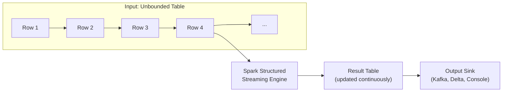
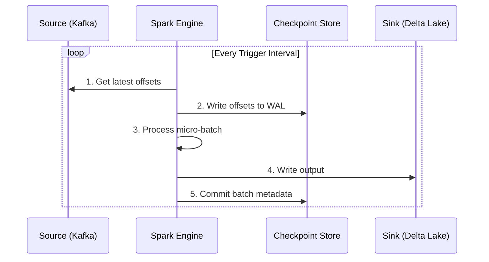
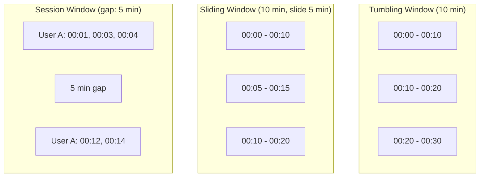
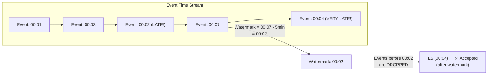
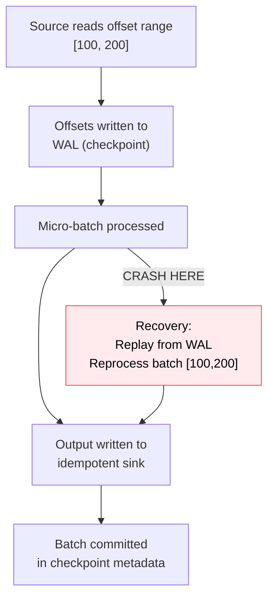

# ⚡ Module 4: Spark Structured Streaming

[⬅️ Previous: Data APIs & SQL](03_spark_data_apis_sql.md) | [➡️ Next: Ecosystem & Tuning](05_spark_ecosystem_tuning.md)

---

## 1. What is Structured Streaming?

Structured Streaming treats a live data stream as an **unbounded table** that keeps growing. Every new piece of data is like a new row appended to that table. You write your streaming logic using the same DataFrame/SQL API as batch.



### Key Philosophy
- **Same API for batch and streaming** — switch from `spark.read` to `spark.readStream`
- **Event-time support** with watermarking for late data
- **End-to-end exactly-once** guarantees (with micro-batch)
- **Fault tolerance** via checkpointing

---

## 2. Execution Models

### 2.1 Micro-Batch Processing (Default)



| Trigger Type | Behavior | Use Case |
|:---|:---|:---|
| `default` | Process next batch immediately after previous | Maximum throughput |
| `processingTime("10 seconds")` | Process every 10 seconds | Control resource usage |
| `once()` | Process one batch and stop | Incremental batch processing |
| `availableNow()` | Process all available data in multiple batches, then stop | Backfill / catch-up |

### 2.2 Continuous Processing (Experimental)

```python
# Ultra-low latency (~1ms) — at-least-once semantics
query = (
    df.writeStream
    .format("kafka")
    .trigger(continuous="1 second")  # Checkpoint interval, NOT batch interval
    .start()
)
```

| Feature | Micro-Batch | Continuous |
|:---|:---|:---|
| **Latency** | ~100ms+ | ~1ms+ |
| **Fault Tolerance** | Exactly-once | At-least-once |
| **Supported Ops** | All | Limited (map-like only) |
| **Production Ready** | ✅ Yes | ⚠️ Experimental |

---

## 3. Reading from Sources

```python
# Kafka Source
kafka_df = (
    spark.readStream
    .format("kafka")
    .option("kafka.bootstrap.servers", "broker1:9092,broker2:9092")
    .option("subscribe", "transactions")
    .option("startingOffsets", "latest")  # or "earliest"
    .load()
)

# Parse the Kafka value (binary → JSON → DataFrame)
from pyspark.sql.functions import from_json, col
from pyspark.sql.types import StructType, StructField, StringType, DoubleType, TimestampType

schema = StructType([
    StructField("user_id", StringType()),
    StructField("amount", DoubleType()),
    StructField("timestamp", TimestampType()),
    StructField("location", StringType())
])

parsed_df = kafka_df.select(
    from_json(col("value").cast("string"), schema).alias("data")
).select("data.*")
```

---

## 4. Output Modes

| Mode | Behavior | Use With |
|:---|:---|:---|
| **Append** | Only new rows since last trigger | Flat transformations, watermarked aggregations |
| **Complete** | Entire result table each trigger | Aggregations without watermark |
| **Update** | Only changed rows since last trigger | Aggregations (most efficient) |

```python
# Append mode — for flat transformations
query = parsed_df.writeStream.outputMode("append").format("delta").start()

# Complete mode — for full aggregation results
query = agg_df.writeStream.outputMode("complete").format("console").start()

# Update mode — only changed aggregation rows
query = agg_df.writeStream.outputMode("update").format("console").start()
```

---

## 5. Windowed Aggregations

### Window Types



### Code Examples

```python
from pyspark.sql.functions import window, col, sum, count

# Tumbling Window: Non-overlapping, fixed-size windows
txn_df.groupBy(
    window(col("timestamp"), "10 minutes"),
    col("location")
).agg(
    sum("amount").alias("total_amount"),
    count("*").alias("txn_count")
)

# Sliding Window: Overlapping windows
txn_df.groupBy(
    window(col("timestamp"), "10 minutes", "5 minutes"),  # window=10min, slide=5min
    col("location")
).agg(sum("amount").alias("total_amount"))

# Session Window (Spark 3.2+)
from pyspark.sql.functions import session_window
txn_df.groupBy(
    session_window(col("timestamp"), "5 minutes"),
    col("user_id")
).agg(sum("amount").alias("session_total"))
```

---

## 6. Watermarking & Late Data

Watermarks tell Spark how long to wait for late data before closing a window.



```python
# Allow data up to 10 minutes late
windowed_counts = (
    parsed_df
    .withWatermark("timestamp", "10 minutes")   # ← Late data threshold
    .groupBy(
        window(col("timestamp"), "5 minutes"),
        col("user_id")
    )
    .agg(count("*").alias("event_count"))
)

# Write with append mode (only emit finalized windows)
query = (
    windowed_counts.writeStream
    .outputMode("append")
    .format("delta")
    .option("checkpointLocation", "s3://checkpoints/windowed_counts")
    .start("s3://output/windowed_counts")
)
```

> [!IMPORTANT]
> **Watermark = max event time seen - threshold.** Events with timestamps older than the watermark are dropped. This allows Spark to **clean up old state** and prevent unbounded memory growth.

---

## 7. Stateful Processing: `transformWithState` (Spark 4.0)

The new `transformWithState` API replaces `flatMapGroupsWithState` and provides:
- **State schema evolution**: Change your state structure without losing data
- **TTL (Time-To-Live)**: Automatic state expiration
- **Timers**: Process events at specific future times
- **Multiple state variables**: Per-key state with different types

```python
from pyspark.sql.streaming import StatefulProcessor, StatefulProcessorHandle

class SessionTracker(StatefulProcessor):
    def init(self, handle: StatefulProcessorHandle):
        # Define state variables
        self.session_state = handle.getValueState("session", schema)
        self.event_count = handle.getValueState("count", IntegerType())
        
        # Register a timer for session timeout
        handle.registerTimer(duration="30 minutes")
    
    def handleInputRows(self, key, rows, timer_values):
        current_count = self.event_count.get() or 0
        for row in rows:
            current_count += 1
        self.event_count.update(current_count)
        
        yield Row(user_id=key, total_events=current_count)
    
    def handleExpiredTimer(self, key, timer_values):
        # Session timed out — emit final result and clean up
        final_count = self.event_count.get()
        self.event_count.clear()
        yield Row(user_id=key, total_events=final_count, status="expired")

# Apply stateful processing
result = parsed_df.groupBy("user_id").transformWithState(
    SessionTracker(),
    outputMode="append",
    outputSchema=output_schema
)
```

---

## 8. Exactly-Once Semantics — How It Works



**Three requirements for exactly-once:**
1. **Replayable source**: Kafka (offsets), Kinesis (sequence numbers)
2. **Deterministic processing**: Same input → same output
3. **Idempotent sink**: Writing same data twice = same result (Delta Lake, databases with upsert)

---

## 9. Complete Example: Real-Time Clickstream Analytics

```python
from pyspark.sql import SparkSession
from pyspark.sql.functions import *
from pyspark.sql.types import *

spark = SparkSession.builder.appName("ClickstreamAnalytics").getOrCreate()

# 1. Read from Kafka
raw_stream = (
    spark.readStream
    .format("kafka")
    .option("kafka.bootstrap.servers", "kafka:9092")
    .option("subscribe", "clickstream")
    .option("startingOffsets", "latest")
    .load()
)

# 2. Parse JSON payload
click_schema = StructType([
    StructField("user_id", StringType()),
    StructField("page", StringType()),
    StructField("action", StringType()),
    StructField("event_time", TimestampType())
])

clicks = raw_stream.select(
    from_json(col("value").cast("string"), click_schema).alias("data")
).select("data.*")

# 3. Windowed aggregation with watermark
page_stats = (
    clicks
    .withWatermark("event_time", "5 minutes")
    .groupBy(
        window(col("event_time"), "1 minute"),
        col("page")
    )
    .agg(
        count("*").alias("views"),
        countDistinct("user_id").alias("unique_users"),
        count(when(col("action") == "purchase", True)).alias("purchases")
    )
)

# 4. Write to Delta Lake
query = (
    page_stats.writeStream
    .outputMode("append")
    .format("delta")
    .option("checkpointLocation", "s3://checkpoints/clickstream")
    .trigger(processingTime="30 seconds")
    .start("s3://analytics/page_stats")
)

query.awaitTermination()
```

---

## 10. Interview Essentials 🎯

### Q1: Explain the difference between micro-batch and continuous processing in Spark.
**Answer:** Micro-batch (default) processes data in small, discrete batches with exactly-once semantics by using WAL checkpointing and idempotent sinks. Continuous processing keeps long-running tasks on executors that constantly read and write data, achieving ~1ms latency but only at-least-once guarantees.

### Q2: What is watermarking and why is it needed?
**Answer:** Watermarking defines how long Spark waits for late-arriving data before finalizing a window. Without watermarks, Spark would need to keep all window state forever (unbounded memory). The watermark = max event time seen - threshold. Events older than the watermark are dropped, and their window state is cleaned up.

### Q3: How does Spark achieve exactly-once with Kafka?
**Answer:** Three mechanisms: (1) Kafka offsets are tracked in the checkpoint WAL before processing, (2) processing is deterministic, so replaying a batch produces identical results, (3) the sink must be idempotent (Delta Lake's ACID transactions, or database upserts). On failure recovery, Spark replays the batch from the WAL'd offsets.

---

📄 **Navigation:**
[⬅️ Previous: Data APIs & SQL](03_spark_data_apis_sql.md) | [➡️ Next: Ecosystem & Tuning](05_spark_ecosystem_tuning.md)
