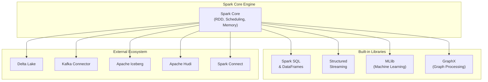
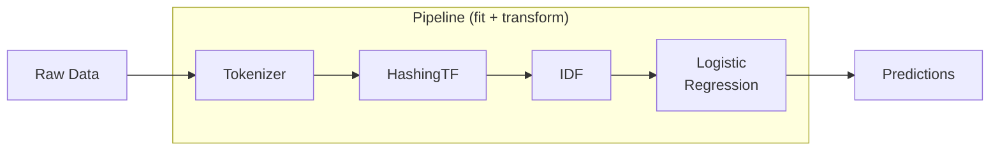
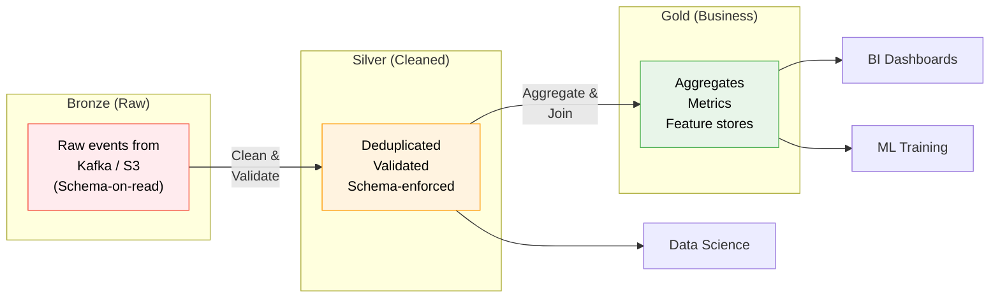
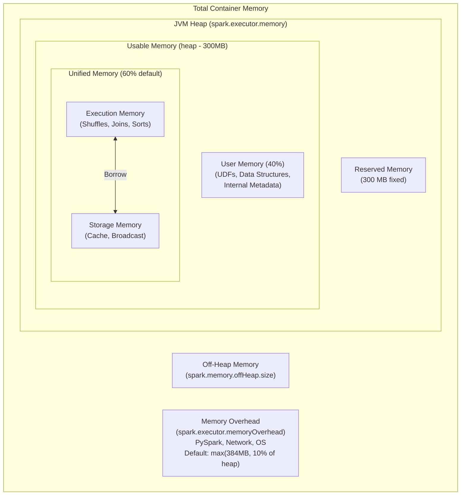

# ⚡ Module 5: Spark Ecosystem & Performance Tuning

[⬅️ Previous: Structured Streaming](04_spark_streaming.md) | [➡️ Next: Flink Architecture & Internals](06_flink_architecture_internals.md)

---

## 1. The Spark Ecosystem



---

## 2. MLlib — Distributed Machine Learning

### Pipeline Architecture



### Code Example: Classification Pipeline

```python
from pyspark.ml import Pipeline
from pyspark.ml.feature import VectorAssembler, StandardScaler, StringIndexer
from pyspark.ml.classification import RandomForestClassifier
from pyspark.ml.evaluation import MulticlassClassificationEvaluator

# 1. Prepare features
indexer = StringIndexer(inputCol="category", outputCol="label")
assembler = VectorAssembler(
    inputCols=["age", "salary", "experience"],
    outputCol="raw_features"
)
scaler = StandardScaler(inputCol="raw_features", outputCol="features")

# 2. Define model
rf = RandomForestClassifier(numTrees=100, maxDepth=10)

# 3. Build pipeline
pipeline = Pipeline(stages=[indexer, assembler, scaler, rf])

# 4. Train and evaluate
train, test = df.randomSplit([0.8, 0.2])
model = pipeline.fit(train)
predictions = model.transform(test)

evaluator = MulticlassClassificationEvaluator(metricName="accuracy")
print(f"Accuracy: {evaluator.evaluate(predictions):.2%}")
```

### Key MLlib Algorithms

| Category | Algorithms |
|:---|:---|
| **Classification** | Logistic Regression, Random Forest, GBT, SVM, Naive Bayes |
| **Regression** | Linear, Decision Tree, Random Forest, GBT, Isotonic |
| **Clustering** | K-Means, Bisecting K-Means, GMM, LDA |
| **Recommendation** | ALS (Alternating Least Squares) |
| **Feature Eng.** | TF-IDF, Word2Vec, PCA, One-Hot, Normalizer, Bucketizer |

---

## 3. Kafka Integration

### Reading from Kafka (Batch & Streaming)

```python
# Streaming
stream_df = (
    spark.readStream.format("kafka")
    .option("kafka.bootstrap.servers", "broker:9092")
    .option("subscribe", "orders")
    .option("startingOffsets", "latest")
    .option("maxOffsetsPerTrigger", 10000)
    .load()
)

# Batch (read a snapshot)
batch_df = (
    spark.read.format("kafka")
    .option("kafka.bootstrap.servers", "broker:9092")
    .option("subscribe", "orders")
    .option("startingOffsets", "earliest")
    .option("endingOffsets", "latest")
    .load()
)
```

### Writing to Kafka

```python
output_df = (
    processed_df.select(
        col("user_id").cast("string").alias("key"),
        to_json(struct("*")).alias("value")
    )
)

query = (
    output_df.writeStream
    .format("kafka")
    .option("kafka.bootstrap.servers", "broker:9092")
    .option("topic", "processed-orders")
    .option("checkpointLocation", "s3://checkpoints/kafka-sink")
    .start()
)
```

---

## 4. Delta Lake & Lakehouse Architecture

### The Medallion Architecture



### Delta Lake Features

```python
# Write with ACID transactions
df.write.format("delta").mode("overwrite").save("s3://lake/bronze/events")

# Schema enforcement (auto-rejects bad data)
df.write.format("delta").option("mergeSchema", "true").save(...)

# Time travel
spark.read.format("delta").option("versionAsOf", 5).load(path)
spark.read.format("delta").option("timestampAsOf", "2025-01-01").load(path)

# UPSERT (merge)
from delta.tables import DeltaTable

target = DeltaTable.forPath(spark, "s3://lake/silver/users")
target.alias("t").merge(
    updates.alias("u"),
    "t.user_id = u.user_id"
).whenMatchedUpdateAll().whenNotMatchedInsertAll().execute()

# Optimize (compact small files)
# In Spark SQL:
# OPTIMIZE delta.`s3://lake/silver/users` ZORDER BY (user_id)
```

---

## 5. Memory Architecture — Deep Dive

### Executor Memory Layout



### Key Configuration Parameters

| Parameter | Default | Description |
|:---|:---|:---|
| `spark.executor.memory` | `1g` | JVM heap per executor |
| `spark.executor.cores` | `1` | CPU cores per executor |
| `spark.executor.instances` | `2` | Number of executors |
| `spark.memory.fraction` | `0.6` | Fraction of heap for execution + storage |
| `spark.memory.storageFraction` | `0.5` | Fraction of unified memory for storage |
| `spark.executor.memoryOverhead` | `max(384MB, 10%)` | Non-JVM memory (increase for PySpark!) |
| `spark.memory.offHeap.enabled` | `false` | Enable off-heap memory |
| `spark.sql.shuffle.partitions` | `200` | Number of partitions after shuffle |

### Right-Sizing Executors — Rules of Thumb

```
Cluster: 10 nodes × 64 GB RAM × 16 cores each

❌ Fat Executors (1 per node):
   spark.executor.memory = 58g    # Too large → GC issues
   spark.executor.cores = 15      # HDFS throughput bottleneck

✅ Balanced Executors (3 per node):
   spark.executor.memory = 18g    # Under 32GB (compressed OOPs)
   spark.executor.cores = 5       # Sweet spot for parallelism
   spark.executor.instances = 29  # 30 total - 1 for AM
   # Leave 1 core + 1GB per node for OS/YARN
```

> [!TIP]
> **For PySpark**, increase `spark.executor.memoryOverhead` to **20-40%** of executor memory. Python processes run outside the JVM and need their own memory.

---

## 6. Serialization — Kryo vs Java

| Feature | Java Serialization | Kryo Serialization |
|:---|:---|:---|
| **Speed** | Slow | 10x faster |
| **Size** | Large (verbose) | Compact |
| **Setup** | Zero config | Requires registration |
| **Default** | ✅ Yes | Must enable |

```python
spark.conf.set("spark.serializer", "org.apache.spark.serializer.KryoSerializer")
spark.conf.set("spark.kryo.registrationRequired", "true")

# Register custom classes (Scala)
# spark.conf.set("spark.kryo.classesToRegister", 
#     "com.example.MyClass,com.example.AnotherClass")
```

---

## 7. Common Performance Anti-Patterns

> [!CAUTION]
> **Anti-Pattern 1: `groupByKey` instead of `reduceByKey`**
> `groupByKey` shuffles ALL data, then aggregates. `reduceByKey` aggregates locally FIRST, then shuffles (much less data).

```python
# ❌ BAD — shuffles everything, then reduces
rdd.groupByKey().mapValues(sum)

# ✅ GOOD — reduces locally first, then shuffles
rdd.reduceByKey(lambda a, b: a + b)
```

> [!CAUTION]
> **Anti-Pattern 2: Collecting large data to Driver**

```python
# ❌ KILLS the Driver
huge_df.collect()

# ✅ Use distributed write instead
huge_df.write.parquet("s3://output/")
```

> [!WARNING]
> **Anti-Pattern 3: Too many or too few shuffle partitions**

```python
# 200 default partitions for a 10 GB dataset = 50 MB each ✅
# 200 default partitions for a 10 TB dataset = 50 GB each ❌ OOM!
# 200 default partitions for a 10 MB dataset = 50 KB each ❌ Overhead!

# Rule: Aim for 128-200 MB per partition
spark.conf.set("spark.sql.shuffle.partitions", str(total_data_gb * 8))
```

> [!WARNING]
> **Anti-Pattern 4: Not caching iteratively-used DataFrames**

```python
# ❌ Recomputes expensive_df twice
result1 = expensive_df.filter(...).count()
result2 = expensive_df.groupBy(...).agg(...)

# ✅ Cache once, use multiple times
expensive_df.cache()
result1 = expensive_df.filter(...).count()
result2 = expensive_df.groupBy(...).agg(...)
expensive_df.unpersist()  # Clean up when done!
```

---

## 8. Monitoring & Debugging

### Using `explain()`

```python
df.filter(col("age") > 25).groupBy("dept").count().explain(True)

# Output shows:
# == Parsed Logical Plan ==
# == Analyzed Logical Plan ==
# == Optimized Logical Plan ==   ← See Catalyst optimizations
# == Physical Plan ==             ← See chosen join strategies, scans
```

### Spark UI Key Tabs

| Tab | What to Look For |
|:---|:---|
| **Jobs** | Failed jobs, long-running jobs |
| **Stages** | Shuffle read/write sizes, task skew |
| **Storage** | Cached DataFrames, memory usage |
| **SQL** | Query plans, scan statistics |
| **Executors** | GC time, memory utilization |
| **Streaming** | Batch duration, processing rate, input rate |

### GC Tuning

```python
spark.conf.set("spark.executor.extraJavaOptions",
    "-XX:+UseG1GC -XX:InitiatingHeapOccupancyPercent=35 "
    "-verbose:gc -XX:+PrintGCDetails -XX:+PrintGCTimeStamps")
```

---

## 9. Production Checklist

| Category | Setting | Recommendation |
|:---|:---|:---|
| **Serialization** | `spark.serializer` | Use KryoSerializer |
| **Shuffle** | `spark.sql.shuffle.partitions` | Match to data size (128-200 MB/partition) |
| **AQE** | `spark.sql.adaptive.enabled` | `true` (default in 3.2+) |
| **Broadcast** | `spark.sql.autoBroadcastJoinThreshold` | Increase to 50-100 MB if memory allows |
| **Memory** | `spark.executor.memoryOverhead` | 20-40% for PySpark |
| **Logging** | `spark.eventLog.enabled` | `true` for post-mortem analysis |
| **Speculation** | `spark.speculation` | `true` for stragglers in heterogeneous clusters |

---

📄 **Navigation:**
[⬅️ Previous: Structured Streaming](04_spark_streaming.md) | [➡️ Next: Flink Architecture & Internals](06_flink_architecture_internals.md)
