# 🔥 Module 6: Apache Flink — Architecture & Internals

[⬅️ Previous: Spark Ecosystem & Tuning](05_spark_ecosystem_tuning.md) | [➡️ Next: State & Checkpointing](07_flink_state_checkpointing.md)

---

## 1. What is Apache Flink?

Apache Flink is a **distributed stream processing framework** designed for **stateful computations over unbounded and bounded data streams**. Unlike Spark (which started as a batch engine and added streaming), Flink was **stream-first from day one**.

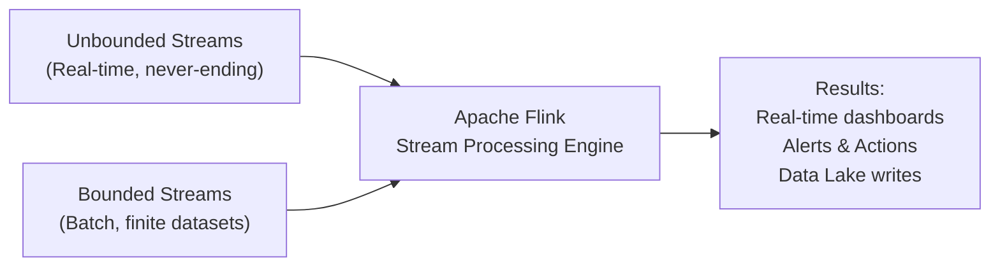

### Key Differentiators
- **True event-at-a-time processing** (not micro-batching)
- **First-class state management** built into the engine
- **Exactly-once semantics** via distributed snapshots
- **Event-time processing** with watermarks for out-of-order data
- **Millisecond-level latency** at scale

> **Flink 2.0** (released early 2025) is the latest major release, introducing disaggregated state storage, an asynchronous execution model, and ForSt state store.

---

## 2. High-Level Architecture

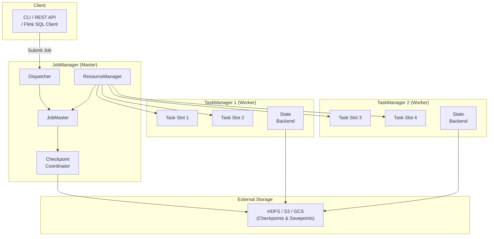

### Key Components

| Component | Role |
|:---|:---|
| **Dispatcher** | Receives job submissions, provides REST API and Web UI |
| **ResourceManager** | Manages TaskManager slots, talks to YARN/K8s for resources |
| **JobMaster** | Manages execution of a single job — scheduling, fault recovery |
| **Checkpoint Coordinator** | Triggers and coordinates distributed snapshots |
| **TaskManager** | Worker process that executes tasks and manages local state |
| **Task Slot** | Fixed share of TaskManager resources (memory); runs a pipeline of operators |

---

## 3. Job Submission & Execution Flow

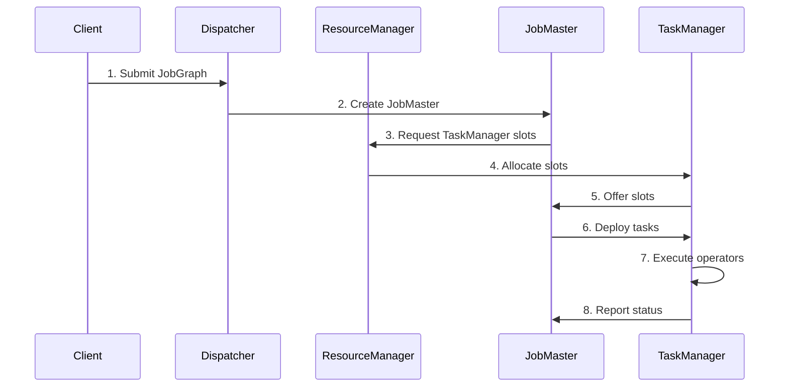

### From User Code to Execution

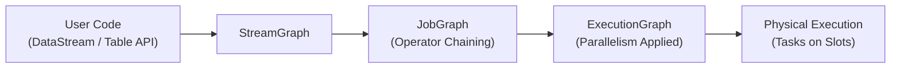

| Abstraction | Description |
|:---|:---|
| **StreamGraph** | Logical DAG of all operators (1:1 mapping to user code) |
| **JobGraph** | Optimized graph — operators chained into single tasks where possible |
| **ExecutionGraph** | Parallel version — each operator expanded by parallelism factor |
| **Physical Execution** | Actual running tasks deployed to TaskManager slots |

---

## 4. Task Slots, Parallelism & Operator Chaining

### Task Slots

Each TaskManager has a fixed number of **task slots** (configured via `taskmanager.numberOfTaskSlots`). Each slot runs one parallel pipeline of chained operators.

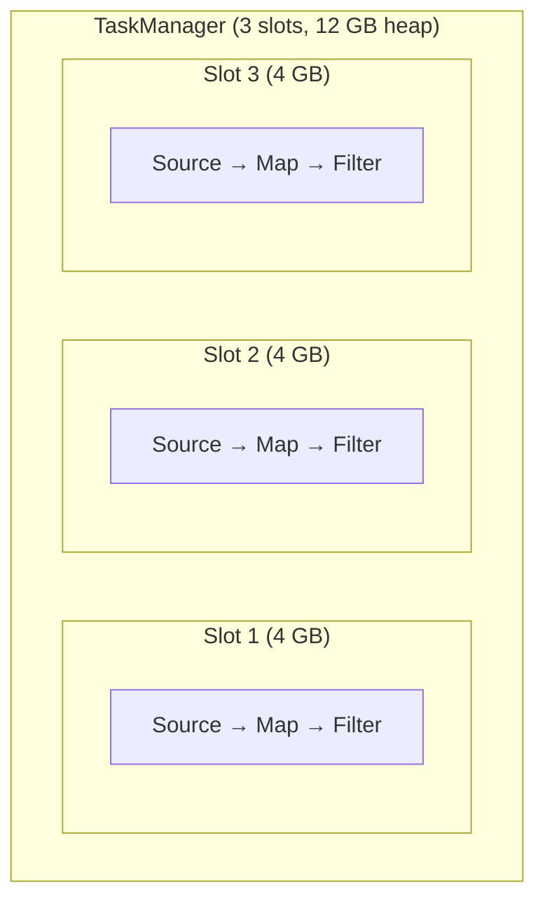

### Operator Chaining

Flink chains operators that can be executed in the same thread (no network shuffle needed). This is similar to Spark's pipelining within a stage.

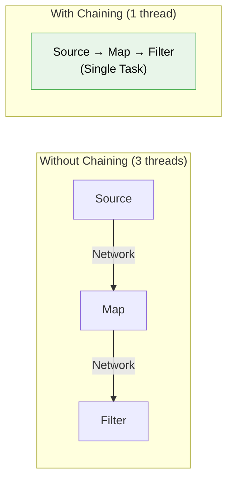

**Chaining conditions:**
- Both operators have the same parallelism
- Connected by forward partitioning (no shuffle)
- Not explicitly disabled by the user

### Slot Sharing

Different operators can **share the same slot**, allowing a full pipeline to run in one slot:

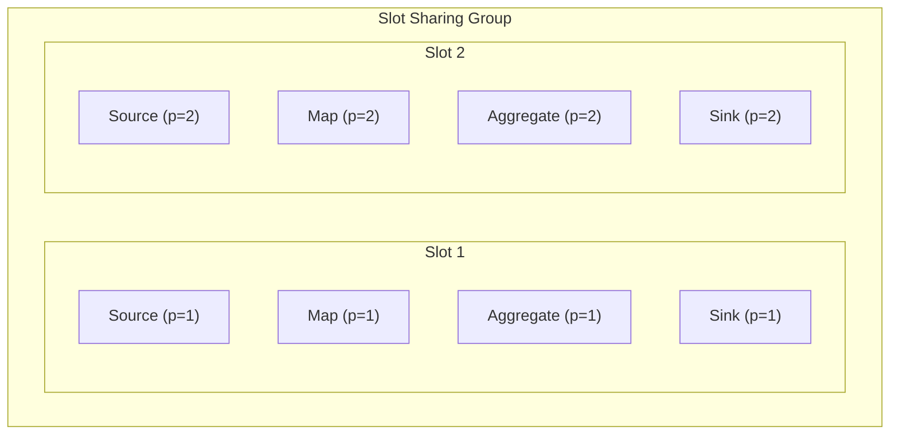

> [!TIP]
> **Slot sharing** means you only need as many slots as the **maximum parallelism** of your job, not the sum of all operator parallelisms.

---

## 5. The Dataflow Model

Flink's programming model is based on transforming data streams through a graph of operators.

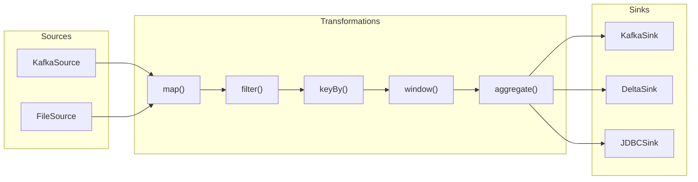

### Code Example: Basic DataStream Pipeline

```java
// Java
StreamExecutionEnvironment env = StreamExecutionEnvironment.getExecutionEnvironment();

DataStream<String> raw = env.fromSource(
    KafkaSource.<String>builder()
        .setBootstrapServers("broker:9092")
        .setTopics("transactions")
        .setGroupId("flink-group")
        .setValueOnlyDeserializer(new SimpleStringSchema())
        .build(),
    WatermarkStrategy.noWatermarks(),
    "Kafka Source"
);

DataStream<Transaction> transactions = raw
    .map(json -> parseTransaction(json))
    .filter(txn -> txn.getAmount() > 100.0)
    .keyBy(Transaction::getUserId)
    .window(TumblingEventTimeWindows.of(Duration.ofMinutes(5)))
    .sum("amount");

transactions.sinkTo(
    KafkaSink.<Transaction>builder()
        .setBootstrapServers("broker:9092")
        .setRecordSerializer(new TransactionSerializer())
        .build()
);

env.execute("Transaction Aggregation");
```

```python
# Python (PyFlink)
env = StreamExecutionEnvironment.get_execution_environment()

ds = env.from_source(
    KafkaSource.builder()
        .set_bootstrap_servers("broker:9092")
        .set_topics("transactions")
        .set_group_id("flink-group")
        .set_value_only_deserializer(SimpleStringSchema())
        .build(),
    WatermarkStrategy.no_watermarks(),
    "Kafka Source"
)

result = (
    ds.map(parse_transaction)
      .filter(lambda txn: txn.amount > 100.0)
      .key_by(lambda txn: txn.user_id)
      .window(TumblingEventTimeWindows.of(Duration.of_minutes(5)))
      .reduce(lambda a, b: Transaction(a.user_id, a.amount + b.amount))
)

result.sink_to(kafka_sink)
env.execute("Transaction Aggregation")
```

---

## 6. Network Data Exchange

Data exchange between operators uses a **credit-based flow control** mechanism (similar to TCP flow control):

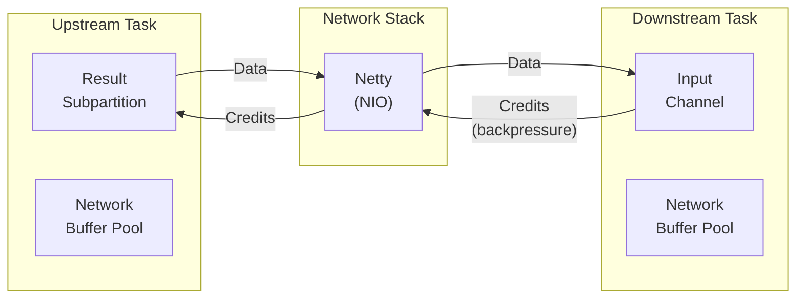

**Exchange Patterns:**

| Pattern | Description | Triggers |
|:---|:---|:---|
| **Forward** | 1:1, same parallelism, no shuffle | `map()`, `filter()` after same-parallelism source |
| **Hash** | Partitioned by key hash | `keyBy()` |
| **Rebalance** | Round-robin distribution | `rebalance()` |
| **Broadcast** | Copy to all downstream | `broadcast()` |
| **Rescale** | Local round-robin (within same TaskManager) | `rescale()` |

---

## 7. Flink 2.0 — Major Changes (Early 2025)

### 7.1 Disaggregated State Storage

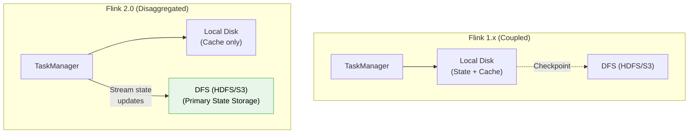

**Benefits:**
- **Elastic scaling**: Add/remove TaskManagers without full state migration
- **Faster recovery**: Up to 49x faster — just reassign DFS state to new TaskManagers
- **No local disk constraint**: State can exceed local disk capacity
- **Better for Kubernetes**: Stateless containers + remote state

### 7.2 Asynchronous Execution Controller (AEC)

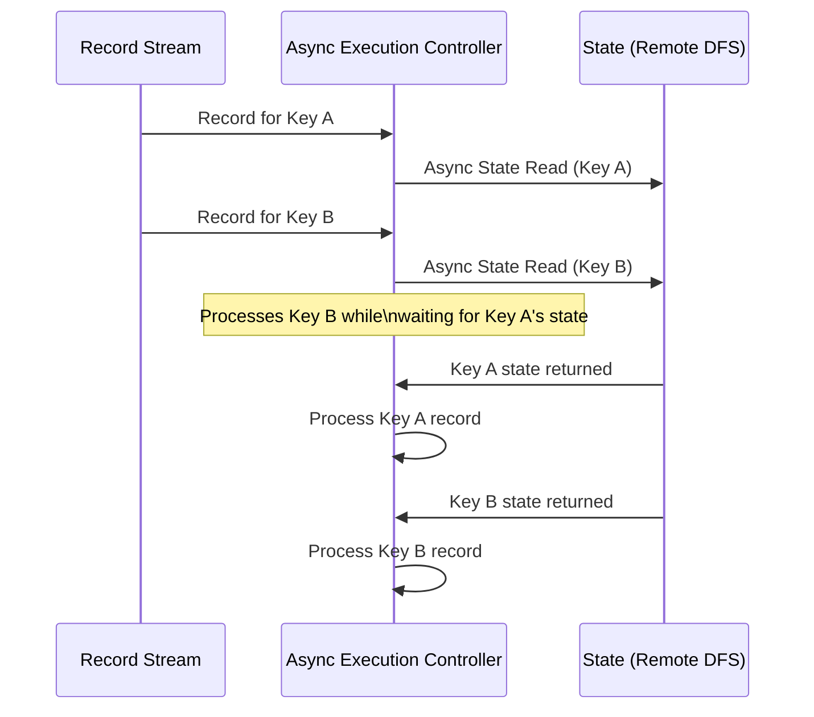

**Key rule:** One active in-flight computation per key — ensures correctness while allowing parallelism across different keys.

### 7.3 Other Flink 2.0 Changes

| Change | Description |
|:---|:---|
| **ForSt State Store** | New state store with unified file system, faster checkpoints |
| **Materialized Tables** | Simplify batch/stream development — focus on business logic |
| **7 SQL operators re-implemented** | Joins, Window/Group Aggregates use async state APIs |
| **DataSet API removed** | Unified to DataStream + Table API |
| **Scala DataStream API removed** | Java only for DataStream (use Table API for Scala) |
| **Java 11 minimum** | Support for Java 17 and 21 |
| **`config.yaml`** | Replaces `flink-conf.yaml` |

---

## 8. Flink Table API & SQL

```python
# PyFlink Table API
from pyflink.table import EnvironmentSettings, TableEnvironment

env = TableEnvironment.create(EnvironmentSettings.in_streaming_mode())

# Define source via SQL DDL
env.execute_sql("""
    CREATE TABLE transactions (
        user_id STRING,
        amount DOUBLE,
        event_time TIMESTAMP(3),
        WATERMARK FOR event_time AS event_time - INTERVAL '5' SECOND
    ) WITH (
        'connector' = 'kafka',
        'topic' = 'transactions',
        'properties.bootstrap.servers' = 'broker:9092',
        'format' = 'json'
    )
""")

# Continuous SQL query
result = env.sql_query("""
    SELECT 
        user_id,
        TUMBLE_START(event_time, INTERVAL '5' MINUTE) as window_start,
        SUM(amount) as total_amount,
        COUNT(*) as txn_count
    FROM transactions
    GROUP BY 
        user_id,
        TUMBLE(event_time, INTERVAL '5' MINUTE)
""")
```

---

## 9. Interview Essentials 🎯

### Q1: How does Flink differ from Spark architecturally?

| Aspect | Spark | Flink |
|:---|:---|:---|
| **Processing** | Micro-batch (treat stream as small batches) | True event-at-a-time |
| **State** | External or limited built-in | First-class, managed by engine |
| **Latency** | ~100ms (micro-batch) | ~1-10ms |
| **Recovery** | Recompute from lineage | Restore from checkpoint |
| **Approach** | Batch engine extended for streaming | Stream engine that handles batch |

### Q2: What are Task Slots in Flink?
**Answer:** Task slots are fixed resource partitions of a TaskManager. Each slot gets an equal share of the TaskManager's memory. Slots provide memory isolation but share CPU threads. With slot sharing, a complete pipeline (source → transform → sink) can run in a single slot, so you only need as many slots as your maximum parallelism.

### Q3: What is operator chaining?
**Answer:** Flink merges consecutive operators into a single task if they have the same parallelism and forward partitioning. This eliminates serialization and network overhead between operators, running them in the same thread. It's analogous to how Spark pipelines narrow transformations within a stage.

---

📄 **Navigation:**
[⬅️ Previous: Spark Ecosystem & Tuning](05_spark_ecosystem_tuning.md) | [➡️ Next: State & Checkpointing](07_flink_state_checkpointing.md)
