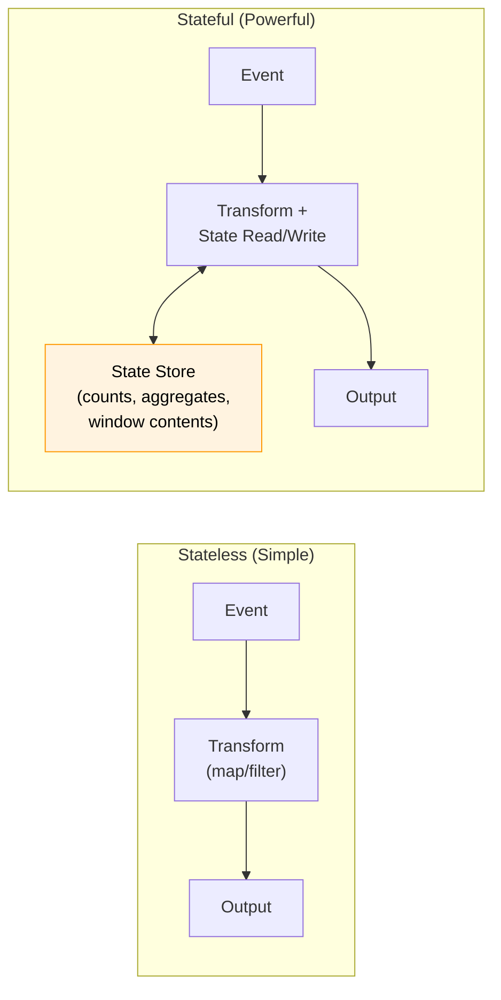
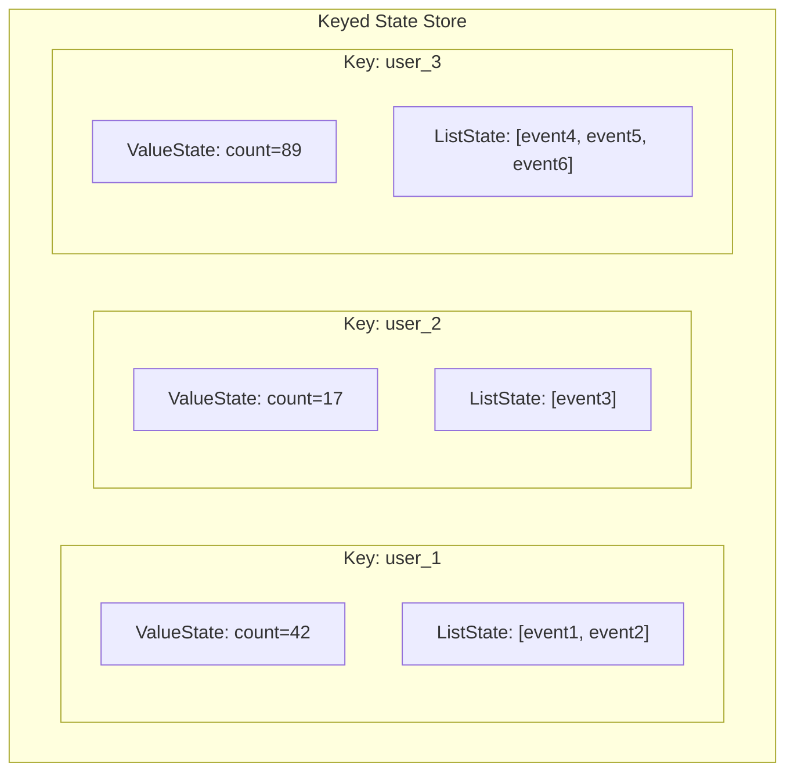
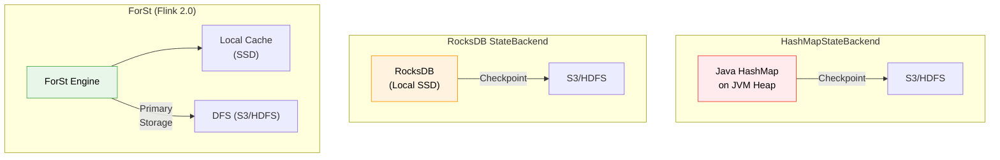
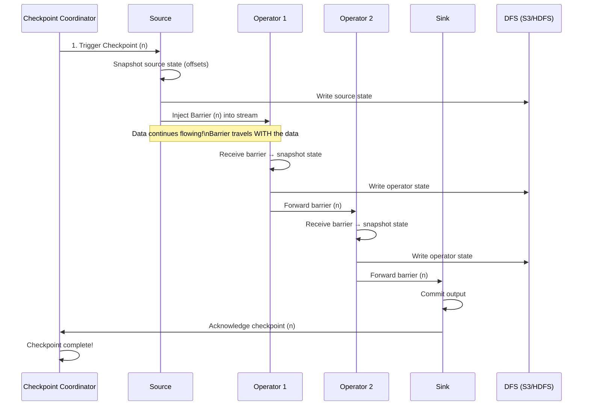
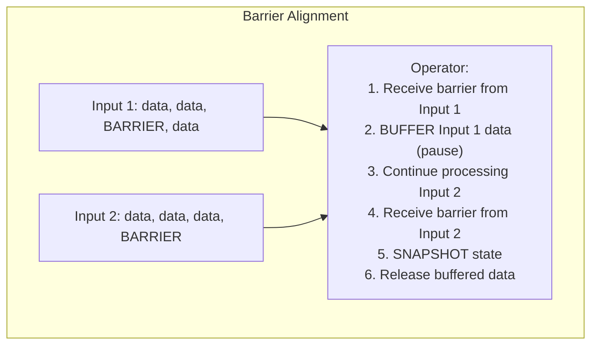
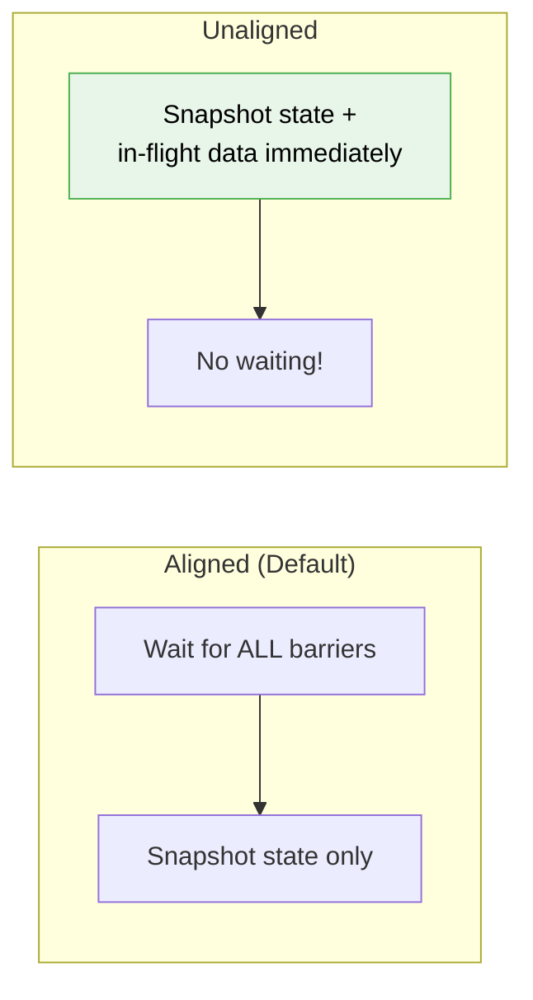
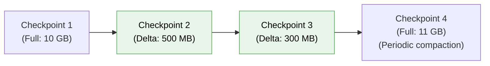
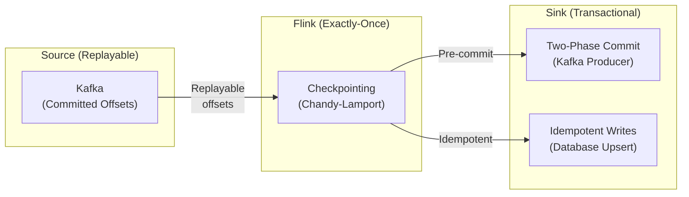
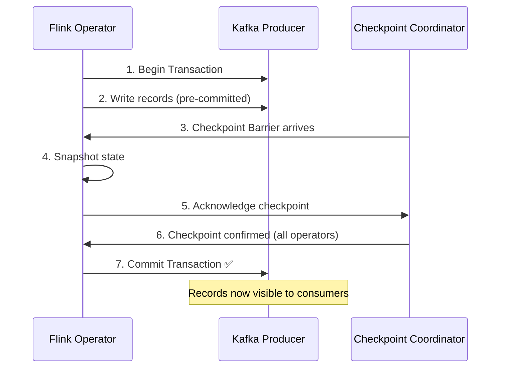

# 🔥 Module 7: Flink State Management & Checkpointing

[⬅️ Previous: Flink Architecture](06_flink_architecture_internals.md) | [➡️ Next: Time, Windows & CEP](08_flink_time_windows_cep.md)

---

## 1. Why State Matters

State is what makes stream processing **powerful**. Without state, you can only do stateless transformations (map, filter). With state, you can:
- Count events per user over time
- Compute running averages, min/max
- Detect patterns across multiple events (fraud detection)
- Join two streams by key
- Implement exactly-once processing



---

## 2. Types of State

### 2.1 Keyed State

Partitioned by key — each key has its own isolated state. Only accessible within a `KeyedStream` (after `keyBy()`).



| State Primitive | Description | Use Case |
|:---|:---|:---|
| **ValueState\<T\>** | Single value per key | Running count, last seen timestamp |
| **ListState\<T\>** | List of values per key | Event history, session events |
| **MapState\<K,V\>** | Map of key-value pairs per key | Feature stores, nested aggregates |
| **ReducingState\<T\>** | Auto-reduces on add | Running sum, min, max |
| **AggregatingState\<IN,OUT\>** | Auto-aggregates with custom function | Complex running aggregates |

### Code Example: Stateful Fraud Detection

```java
public class FraudDetector extends KeyedProcessFunction<String, Transaction, Alert> {

    // State: tracks if we've seen a small transaction
    private transient ValueState<Boolean> smallTxnSeen;
    // State: timer for pattern timeout
    private transient ValueState<Long> timerState;

    @Override
    public void open(Configuration config) {
        smallTxnSeen = getRuntimeContext().getState(
            new ValueStateDescriptor<>("small-txn", Boolean.class));
        timerState = getRuntimeContext().getState(
            new ValueStateDescriptor<>("timer", Long.class));
    }

    @Override
    public void processElement(Transaction txn, Context ctx, Collector<Alert> out) throws Exception {
        Boolean prevSmall = smallTxnSeen.value();

        if (prevSmall != null && prevSmall) {
            // Previous was small, current is large → FRAUD!
            if (txn.getAmount() > 500.0) {
                out.collect(new Alert(txn.getUserId(), "Potential fraud detected!"));
            }
            // Clear state and timer
            smallTxnSeen.clear();
            if (timerState.value() != null) {
                ctx.timerService().deleteProcessingTimeTimer(timerState.value());
            }
            timerState.clear();
        }

        if (txn.getAmount() < 1.0) {
            // Small transaction → set flag and timer
            smallTxnSeen.update(true);
            long timer = ctx.timerService().currentProcessingTime() + 60_000; // 1 min
            ctx.timerService().registerProcessingTimeTimer(timer);
            timerState.update(timer);
        }
    }

    @Override
    public void onTimer(long timestamp, OnTimerContext ctx, Collector<Alert> out) {
        // Timer fired → pattern didn't complete in time, clear state
        smallTxnSeen.clear();
        timerState.clear();
    }
}
```

### 2.2 Operator State

Not partitioned by key — associated with each parallel instance of an operator. Used primarily in source connectors and sinks.

| Redistribution | Description |
|:---|:---|
| **List** | State is split into sub-lists, distributed evenly to new instances on rescale |
| **Union** | Each new instance gets the **complete** list (used for offsets) |
| **Broadcast** | Same state sent to all instances |

---

## 3. State Backends

### Comparison

| Backend | Storage | Speed | State Size | GC Impact |
|:---|:---|:---|:---|:---|
| **HashMapStateBackend** | JVM Heap | ⚡ Fastest | Limited by RAM | High |
| **EmbeddedRocksDBStateBackend** | Local Disk (LSM-tree) | 🔧 Fast | TBs (disk-bound) | Low |
| **ForSt (Flink 2.0)** | Remote DFS | 🌐 Network latency | Unlimited | Very Low |

### Architecture Comparison



### Configuration

```yaml
# config.yaml (Flink 2.0)
state.backend.type: rocksdb  # or 'hashmap' or 'forst'
state.checkpoints.dir: s3://flink-checkpoints/
state.savepoints.dir: s3://flink-savepoints/

# RocksDB-specific tuning
state.backend.rocksdb.memory.managed: true
state.backend.rocksdb.memory.fixed-per-slot: 256mb
state.backend.rocksdb.compaction.style: LEVEL
```

---

## 4. Checkpointing — Distributed Snapshots (Chandy-Lamport)

Flink uses a modified **Chandy-Lamport algorithm** to create consistent distributed snapshots without stopping processing.

### How It Works



### Barrier Alignment (Exactly-Once)

When an operator has **multiple input channels**, it must wait for barriers from ALL channels before snapshotting.



> [!WARNING]
> **Barrier alignment can cause backpressure** if one channel is much faster than another. The fast channel's data must be buffered.

### Unaligned Checkpoints (Flink 1.11+)

For jobs with high backpressure, unaligned checkpoints skip the alignment step:



| Feature | Aligned | Unaligned |
|:---|:---|:---|
| **Latency during checkpoint** | Can be high (backpressure) | Minimal |
| **Checkpoint size** | Smaller (state only) | Larger (state + in-flight) |
| **Guarantees** | Exactly-once | Exactly-once |
| **Best for** | Low-backpressure jobs | High-backpressure jobs |

### Configuration

```yaml
# Enable checkpointing
execution.checkpointing.interval: 60s
execution.checkpointing.mode: EXACTLY_ONCE  # or AT_LEAST_ONCE
execution.checkpointing.timeout: 600s
execution.checkpointing.min-pause: 30s
execution.checkpointing.max-concurrent-checkpoints: 1

# Unaligned checkpoints
execution.checkpointing.unaligned.enabled: true

# Incremental checkpoints (RocksDB only)
state.backend.incremental: true
```

---

## 5. Incremental Checkpoints

For large state sizes, full checkpoints become expensive. **Incremental checkpoints** (RocksDB only) only save the **delta** since the last checkpoint.



---

## 6. Savepoints vs Checkpoints

| Feature | Checkpoints | Savepoints |
|:---|:---|:---|
| **Purpose** | Automatic fault recovery | Manual, operational (upgrades, migrations) |
| **Trigger** | Automatic (periodic) | Manual (`flink savepoint <jobId>`) |
| **Lifecycle** | Deleted when superseded | Persisted until manually deleted |
| **Portability** | Tied to specific job | Portable across job versions |
| **Use Cases** | Crash recovery | Job upgrades, A/B testing, bug fixes |

### Savepoint Operations

```bash
# Trigger a savepoint
flink savepoint <jobId> s3://flink-savepoints/

# Stop job with savepoint (graceful shutdown)
flink stop --savepointPath s3://flink-savepoints/ <jobId>

# Resume from savepoint
flink run -s s3://flink-savepoints/savepoint-abc123 my-job.jar

# Resume with state migration (changed parallelism, added operator)
flink run -s s3://flink-savepoints/savepoint-abc123 \
  --allowNonRestoredState my-job-v2.jar
```

> [!IMPORTANT]
> **State compatibility rules for savepoints:**
> - You **can** change parallelism
> - You **can** add new operators (they start with empty state)
> - You **can** remove operators (use `--allowNonRestoredState`)
> - You **cannot** change state serializers without a migration path
> - You **should** assign explicit UIDs to operators for stable mapping

```java
// Always assign UIDs to stateful operators!
stream
    .keyBy(...)
    .process(new FraudDetector())
    .uid("fraud-detector")      // ← Critical for savepoint compatibility
    .name("Fraud Detection");
```

---

## 7. Exactly-Once End-to-End

Exactly-once within Flink is guaranteed by checkpointing. But **end-to-end** exactly-once requires cooperation with sources and sinks.



### Two-Phase Commit Protocol (Kafka Sink)



---

## 8. Interview Essentials 🎯

### Q1: Explain the Chandy-Lamport algorithm in Flink's context.
**Answer:** The Checkpoint Coordinator injects barrier markers into the data stream at sources. These barriers flow through the operator graph with the data. When an operator receives barriers from all its input channels (barrier alignment), it takes a snapshot of its state and writes it to durable storage. This creates a globally consistent snapshot without stopping processing. The key insight is that barriers divide the stream into "before checkpoint" and "after checkpoint" segments.

### Q2: When would you use unaligned checkpoints?
**Answer:** When a job experiences high backpressure. With aligned checkpoints, a fast input channel must buffer data while waiting for a slow channel's barrier, worsening backpressure. Unaligned checkpoints snapshot both state AND in-flight data immediately, eliminating the waiting period. Trade-off: larger checkpoint sizes.

### Q3: What's the difference between HashMapStateBackend and RocksDB?
**Answer:** HashMap stores state as Java objects on the JVM heap — fastest access but limited by memory and causes GC pressure. RocksDB stores state on local disk using an LSM-tree structure — supports TBs of state, minimal GC, but ~10x slower reads due to serialization/deserialization. Use HashMap for small state with low latency requirements, RocksDB for large state or production deployments.

---

📄 **Navigation:**
[⬅️ Previous: Flink Architecture](06_flink_architecture_internals.md) | [➡️ Next: Time, Windows & CEP](08_flink_time_windows_cep.md)
