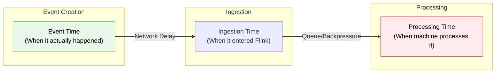
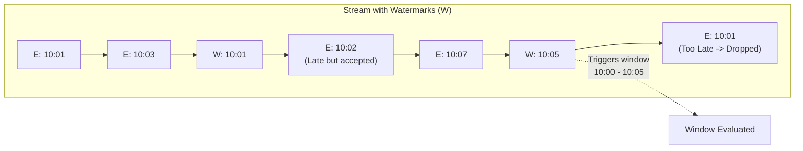
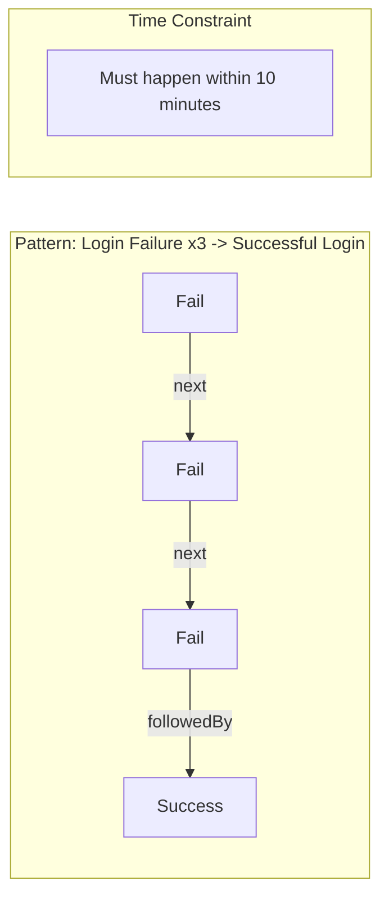

# 🔥 Module 8: Flink Time, Windows & Complex Event Processing (CEP)

[⬅️ Previous: State & Checkpointing](07_flink_state_checkpointing.md) | [➡️ Next: Deployment & Tuning](09_flink_deployment_tuning.md)

---

## 1. Time Semantics

In stream processing, "time" is a nuanced concept. Flink distinguishes between three types of time:



| Time Type | Deterministic? | Handles Late Data? | Performance | Use Case |
|:---|:---:|:---:|:---|:---|
| **Event Time** | ✅ Yes | ✅ Yes | Needs Watermarks | Accurate aggregations, billing, CEP |
| **Processing Time** | ❌ No | ❌ No | Fastest | Latency monitoring, simple metrics |
| **Ingestion Time** | ⚠️ Partially | ❌ No | Medium | (Rarely used in modern Flink) |

> **Best Practice:** Always use **Event Time** unless you have a specific reason not to. Processing time leads to irreproducible results if a job restarts or experiences backpressure.

---

## 2. Watermarks: Handling Out-of-Order Data

Network delays and distributed systems mean events don't arrive in order.

```
Stream arrival order: 00:01, 00:02, 00:05, 00:03 (Late!), 00:06
```

A **Watermark** is a hidden control message injected into the stream. A watermark with time `T` tells Flink: *"I assert that no more events with timestamp <= T will arrive."*



### Configuring Watermarks

```java
// Bounded Out-Of-Orderness (wait up to 5 seconds for late data)
WatermarkStrategy<Transaction> strategy = WatermarkStrategy
    .<Transaction>forBoundedOutOfOrderness(Duration.ofSeconds(5))
    .withTimestampAssigner((event, timestamp) -> event.getEventTime());

DataStream<Transaction> stream = env.fromSource(source, strategy, "Source");
```

---

## 3. Windowing Operations

Windows slice infinite streams into finite buckets for aggregation.

### Window Types

| Type | Characteristics | Example Use Case |
|:---|:---|:---|
| **Tumbling** | Fixed size, non-overlapping | Hourly sales revenue |
| **Sliding** | Fixed size, overlapping | 1-hour moving average, updated every 5 mins |
| **Session** | Gap-based, data-driven | User session activity (timeout after 30 mins) |
| **Global** | One giant window (needs custom trigger) | Keep all data until a specific event happens |

### Code Example: Windows in DataStream API

```java
// Tumbling Window
stream.keyBy(txn -> txn.getUserId())
    .window(TumblingEventTimeWindows.of(Duration.ofHours(1)))
    .sum("amount");

// Sliding Window
stream.keyBy(txn -> txn.getUserId())
    .window(SlidingEventTimeWindows.of(Duration.ofHours(1), Duration.ofMinutes(10)))
    .sum("amount");

// Session Window (30 min inactivity gap)
stream.keyBy(txn -> txn.getUserId())
    .window(EventTimeSessionWindows.withGap(Duration.ofMinutes(30)))
    .process(new SessionAnalyzer());
```

### Dealing with Extremely Late Data

What happens to events that arrive *after* the watermark has passed?

1. **Drop them (Default)**
2. **Allowed Lateness**: Keep the window state around a bit longer.
3. **Side Output**: Send late data to a separate stream for manual handling.

```java
OutputTag<Transaction> lateDataTag = new OutputTag<Transaction>("late-data"){};

SingleOutputStreamOperator<Result> windowed = stream
    .keyBy(txn -> txn.getUserId())
    .window(TumblingEventTimeWindows.of(Duration.ofHours(1)))
    .allowedLateness(Duration.ofMinutes(15)) // 1. Keep state for 15 more mins
    .sideOutputLateData(lateDataTag)         // 2. Anything after 15 mins goes here
    .sum("amount");

// Retrieve late data for auditing/manual fixing
DataStream<Transaction> lateStream = windowed.getSideOutput(lateDataTag);
```

---

## 4. Complex Event Processing (CEP)

CEP is used to detect **complex patterns across a sequence of events**. It's the engine behind real-time fraud detection, anomaly detection, and state machine transitions.

### 4.1 Flink CEP Pattern API



| Pattern Operation | Meaning |
|:---|:---|
| `begin("start")` | Start of the pattern |
| `next("b")` | Strict contiguity (B must immediately follow A) |
| `followedBy("c")` | Relaxed contiguity (C follows A, but other events can be in between) |
| `within(Duration)` | The entire pattern must complete within this time limit |
| `times(n)` | Event must occur N times |

### 4.2 Use Case: Real-Time Fraud Detection (Card Testing)

**Fraud Pattern:** A user makes 3 small transactions (< $1), followed by a large transaction (> $500) within 15 minutes.

```java
import org.apache.flink.cep.PatternStream;
import org.apache.flink.cep.CEP;
import org.apache.flink.cep.pattern.Pattern;
import org.apache.flink.cep.pattern.conditions.SimpleCondition;

// 1. Define the Pattern
Pattern<Transaction, ?> fraudPattern = Pattern.<Transaction>begin("small-txns")
    .where(new SimpleCondition<Transaction>() {
        @Override
        public boolean filter(Transaction txn) {
            return txn.getAmount() < 1.0;
        }
    })
    .times(3) // 3 small transactions
    .followedBy("large-txn")
    .where(new SimpleCondition<Transaction>() {
        @Override
        public boolean filter(Transaction txn) {
            return txn.getAmount() > 500.0;
        }
    })
    .within(Duration.ofMinutes(15)); // Must happen within 15 mins

// 2. Apply pattern to a keyed stream
PatternStream<Transaction> patternStream = CEP.pattern(
    stream.keyBy(Transaction::getUserId), 
    fraudPattern
);

// 3. Extract the matches
DataStream<Alert> alerts = patternStream.process(
    new PatternProcessFunction<Transaction, Alert>() {
        @Override
        public void processMatch(
                Map<String, List<Transaction>> match, 
                Context ctx, 
                Collector<Alert> out) {
            
            Transaction largeTxn = match.get("large-txn").get(0);
            out.collect(new Alert("FRAUD DETECTED for user: " + largeTxn.getUserId()));
        }
    }
);
```

### 4.3 CEP using Flink SQL (MATCH_RECOGNIZE)

You can write the exact same fraud logic using SQL, which is often preferred by analysts.

```sql
SELECT *
FROM transactions
MATCH_RECOGNIZE (
    PARTITION BY user_id
    ORDER BY event_time
    MEASURES
        A.event_time AS start_time,
        C.event_time AS fraud_time,
        C.amount AS fraud_amount
    ONE ROW PER MATCH
    AFTER MATCH SKIP PAST LAST ROW
    PATTERN (A{3} B* C) WITHIN INTERVAL '15' MINUTE
    DEFINE
        A AS A.amount < 1.0,
        C AS C.amount > 500.0
)
```

---

## 5. Interview Essentials 🎯

### Q1: What is the difference between Event Time and Processing Time? Why use Watermarks?
**Answer:** Event time is the time the event actually occurred (embedded in the payload). Processing time is the time the Flink machine clock reads when processing the event. Event time is required for accurate, reproducible results, especially when dealing with network delays or replaying historical data. Watermarks are necessary in Event Time processing to tell the system how long to wait for late data, allowing it to eventually close windows and emit results.

### Q2: How does `followedBy()` differ from `next()` in Flink CEP?
**Answer:** `next()` enforces strict contiguity — the second event must arrive immediately after the first event, with no other events in between. `followedBy()` enforces relaxed contiguity — the second event must arrive after the first, but it's acceptable if other unrelated events happen in between.

### Q3: How do you handle events that arrive after a window has closed?
**Answer:** By default, Flink drops them. To handle them, you can use `.allowedLateness(Duration)` to keep the window state alive for a grace period (late events will cause the window to emit an updated result). For events that arrive even after the allowed lateness, use `.sideOutputLateData(OutputTag)` to route them to a separate stream where they can be logged or processed manually.

---

📄 **Navigation:**
[⬅️ Previous: State & Checkpointing](07_flink_state_checkpointing.md) | [➡️ Next: Deployment & Tuning](09_flink_deployment_tuning.md)
