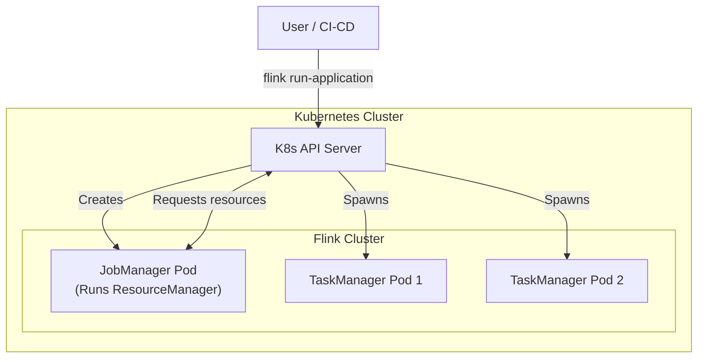
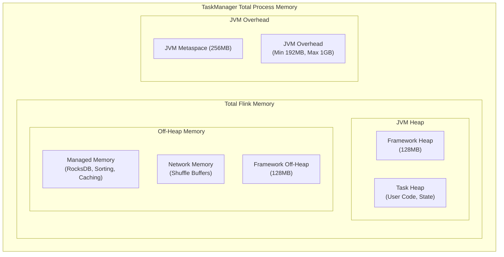

# 🔥 Module 9: Flink Deployment & Performance Tuning

[⬅️ Previous: Time, Windows & CEP](08_flink_time_windows_cep.md) | [➡️ Next: Spark vs Flink Battle](10_spark_vs_flink_battle.md)

---

## 1. Deployment Architectures

Flink supports several deployment targets, but **Kubernetes Native** is the modern standard for production.

### Kubernetes Native Deployment

Flink can talk directly to the Kubernetes API server to allocate TaskManagers dynamically on demand.



### Application Mode vs Session Mode

| Mode | Architecture | Use Case |
|:---|:---|:---|
| **Application Mode** | 1 Cluster = 1 Job. The `main()` method runs on the JobManager. | Production standard. High isolation, better resource management. |
| **Session Mode** | 1 Cluster = Many Jobs. Cluster runs continuously. | Interactive development, short ad-hoc queries. |
| **Per-Job Mode** | (Deprecated in favor of App Mode) | Legacy isolation method. |

---

## 2. The Flink Memory Model

Memory tuning in Flink is notoriously complex. Understanding the breakdown is critical to avoiding `OutOfMemoryError`s.



### Key Configuration Parameters

| Parameter | Description | Tuning Advice |
|:---|:---|:---|
| `taskmanager.memory.process.size` | Total memory requested for container | Set this based on K8s pod limits (e.g., `4g`) |
| `taskmanager.memory.managed.fraction` | % of Flink memory for Managed Memory | Default is `0.4`. **Increase** if using RocksDB. |
| `taskmanager.memory.task.heap.size` | Memory for user objects and HashMap state | **Increase** if using HashMapStateBackend. |
| `taskmanager.memory.network.fraction` | % for network buffers | Default `0.1`. Increase for jobs with massive shuffles (e.g., `keyBy`). |

> [!CAUTION]
> If you are using **RocksDB**, it allocations memory *off-heap* via JNI. If you don't allocate enough Managed Memory, RocksDB might exceed the container limits, causing Kubernetes/YARN to kill the container (`OOMKilled`).

---

## 3. Backpressure: Detection & Mitigation

**Backpressure** occurs when downstream operators cannot process data as fast as upstream operators produce it. 

### How Flink Handles It
Unlike other systems that might drop data or crash, Flink's credit-based flow control gracefully slows down the upstream operators, propagating the backpressure all the way back to the source (e.g., telling Kafka to slow down reads).

### Detecting Backpressure in the UI

1. Go to the Flink Web UI -> Job -> **Backpressure** tab.
2. Look at the colors:
   - 🟢 **OK:** Normal operation.
   - 🟡 **LOW:** Temporary spikes.
   - 🔴 **HIGH:** Serious bottleneck.
3. Look at the **FlameGraph** to find which specific method is eating CPU.

### Common Causes & Solutions

| Cause | Symptom | Solution |
|:---|:---|:---|
| **Data Skew** | One TaskManager has 100% CPU, others are idle. | Use a better key, or add salt (random prefix) before `keyBy`. |
| **External API Calls** | `map()` function calling an external DB blocks the thread. | Use **Async I/O** API (`AsyncDataStream`) to prevent blocking. |
| **Expensive GC** | High JVM CPU, frequent long pauses. | Switch to RocksDB, or optimize object creation in user code. |
| **Slow Sink** | Sink operator is red. | Increase sink parallelism, batch writes, or tune DB indexes. |

---

## 4. Production Best Practices & Anti-Patterns

### ✅ DO: Use Async I/O for External Calls
If your pipeline needs to enrich data via a REST API or Database lookup, doing it synchronously blocks the task slot.

```java
// ❌ BAD: Synchronous call blocks the Flink thread
stream.map(txn -> {
    String username = myDatabase.getUser(txn.getUserId()); // BLOCKS!
    return new EnrichedTxn(txn, username);
});

// ✅ GOOD: Async I/O allows thousands of concurrent requests
AsyncDataStream.unorderedWait(
    stream,
    new AsyncDatabaseRequest(), // Implements AsyncFunction
    1000, TimeUnit.MILLISECONDS,
    100 // Capacity
);
```

### ❌ DON'T: Create large objects per record
Object creation inside a `map()` or `process()` function that runs millions of times a second will destroy GC performance.

```java
// ❌ BAD: Creates new ObjectMapper for every single event
stream.map(json -> {
    ObjectMapper mapper = new ObjectMapper(); 
    return mapper.readValue(json, MyClass.class);
});

// ✅ GOOD: Initialize once in open()
public class MyMapper extends RichMapFunction<String, MyClass> {
    private transient ObjectMapper mapper;
    
    @Override
    public void open(Configuration config) {
        this.mapper = new ObjectMapper(); // Created once per task slot
    }
    
    @Override
    public MyClass map(String json) {
        return mapper.readValue(json, MyClass.class);
    }
}
```

### ✅ DO: Set explicit UIDs for all stateful operators
If you change your code (add/remove operators) without UIDs, Flink cannot map the old state in the savepoint to the new graph.

```java
stream
    .keyBy(...)
    .window(...)
    .aggregate(...)
    .uid("daily-sales-aggregator") // <-- ALWAYS DO THIS
    .name("Daily Sales");
```

---

## 5. Flink Serialization (POJOs vs Kryo)

Flink has its own highly optimized type serialization system. It generates code on the fly to serialize objects into raw bytes.

However, if Flink doesn't recognize your object as a valid **POJO** (Plain Old Java Object), it falls back to **Kryo**.

> [!WARNING]
> **Kryo is significantly slower** than Flink's native POJO serializer.

**Rules for a valid Flink POJO:**
1. Class must be public.
2. Must have a public no-argument constructor.
3. All fields must be either public, or have standard public getter/setter methods.

```java
// ✅ Flink will use fast POJO serializer
public class Transaction {
    public String userId;
    public double amount;
    
    public Transaction() {} // Required!
}

// ❌ Flink will fall back to slow Kryo (missing empty constructor, private fields w/o getters)
public class BadTransaction {
    private final String userId;
    
    public BadTransaction(String userId) { this.userId = userId; }
}
```

---

## 6. Interview Essentials 🎯

### Q1: Your Flink job is failing with `java.lang.OutOfMemoryError: Direct buffer memory`. What is wrong?
**Answer:** This usually happens when the Network Memory or Managed Memory (used by RocksDB, which allocates memory off-heap via JNI) exceeds the configured limits. You should check the `taskmanager.memory.managed.fraction` or increase the overall container size. It indicates the off-heap allocation is starved.

### Q2: How does Flink handle data skew?
**Answer:** Data skew happens after a `keyBy` when one key is much more frequent than others, overloading a single TaskManager. Solutions include: (1) Pre-aggregating data locally before the `keyBy` (if using windowing), (2) "Salting" the keys by appending a random number, doing a partial aggregation, then removing the salt and doing a final aggregation, (3) Tuning the hash function if it's producing poor distribution.

### Q3: What is Application Mode deployment?
**Answer:** In Application Mode, the `main()` method of the user application is executed on the JobManager inside the cluster, rather than on the client machine. This reduces network bandwidth during submission, isolates the application completely (1 cluster = 1 app), and is the recommended approach for modern Kubernetes deployments.

---

📄 **Navigation:**
[⬅️ Previous: Time, Windows & CEP](08_flink_time_windows_cep.md) | [➡️ Next: Spark vs Flink Battle](10_spark_vs_flink_battle.md)
