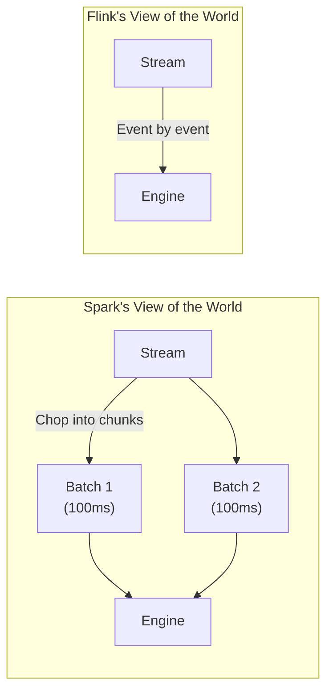
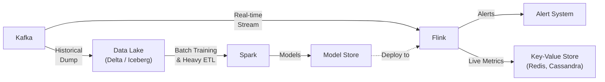

# ⚔️ Module 10: Apache Spark vs Apache Flink — The Definitive Battle

[⬅️ Previous: Deployment & Tuning](09_flink_deployment_tuning.md) | [🏠 Back to Hub](spark-flink-guide.md)

---

## 1. The Core Philosophical Difference

To understand which tool to choose, you must understand how they were built from day one.

- **Apache Spark (Batch-First):** Built to process massive static datasets (replacing Hadoop MapReduce). Streaming was added later (Spark Streaming / Structured Streaming) by breaking the stream into tiny batch jobs (**micro-batching**).
- **Apache Flink (Stream-First):** Built to process infinite streams of events as they arrive (**event-at-a-time**). Batch processing in Flink is simply treated as a stream that happens to have an end.

---

## 2. Feature-by-Feature Comparison (2025 Edition)

| Feature | ⚡ Apache Spark (4.0) | 🔥 Apache Flink (2.0) | Winner / Edge |
|:---|:---|:---|:---:|
| **Processing Model** | Micro-batch (Continuous mode is experimental) | Native Event-at-a-time | **Flink** (True real-time) |
| **Latency** | ~100ms - seconds | ~1ms - 10ms | **Flink** |
| **Throughput** | Extremely High (optimized via Tungsten) | Very High | **Spark** (Better at raw batch) |
| **State Management** | Basic (`transformWithState`) | Advanced (RocksDB, ForSt, Keyed/Operator state) | **Flink** (Industry standard) |
| **Fault Tolerance** | RDD Lineage + WAL | Chandy-Lamport Snapshots | **Tie** (Both exactly-once) |
| **SQL & DataFrame API** | Industry Standard (ANSI compliant, VARIANT) | Good (Table API), but less mature for ad-hoc | **Spark** |
| **Machine Learning** | MLlib (Comprehensive, widely used) | FlinkML (Growing, but niche) | **Spark** |
| **Graph Processing** | GraphX / GraphFrames | Gelly (Basic) | **Spark** |
| **Ecosystem / Integrations**| Massive (Delta Lake, Iceberg, Deep Learning) | Strong in Kafka/Streaming ecosystem | **Spark** |
| **Learning Curve** | Moderate (Python/SQL friendly) | Steep (Complex time/state concepts) | **Spark** |

---

## 3. Decision Matrix: When to Use Which?

### 🟢 Choose Apache Spark If:
1. **Batch ETL & Data Lakehouse:** You are building Medallion architectures (Bronze/Silver/Gold) on Delta Lake or Iceberg.
2. **Machine Learning:** You need to train ML models on petabytes of historical data.
3. **Interactive Analytics:** Data Scientists need to run ad-hoc SQL queries on massive datasets.
4. **"Near" Real-Time is Fine:** Your dashboard only needs to update every 5 seconds or 1 minute.
5. **Team Skillset:** Your team is heavy on Python (PySpark) and SQL, rather than Java/Scala.

### 🔴 Choose Apache Flink If:
1. **Sub-second Latency:** You are building fraud detection, high-frequency trading, or live alerting systems.
2. **Complex Event Processing (CEP):** You need to detect patterns like "Event A followed by B within 5 seconds."
3. **Heavy Stateful Processing:** Your stream logic requires holding and managing massive amounts of state per user/session.
4. **Event Time Accuracy:** You need perfect handling of late-arriving data using watermarks.
5. **Event-Driven Microservices:** Flink functions as the core logic engine of your application, not just a data pipe.

---

## 4. Modern Architectures: Combining Both

In the real world (Netflix, Uber, Alibaba), companies don't choose just one. They use Flink for the **Real-Time Layer** and Spark for the **Batch/Historical Layer**.

### The Kappa Architecture (Unified)

**Workflow:**
1. **Flink** consumes live transactions from Kafka for fraud detection (using ML models).
2. **Kafka** archives raw data to the Data Lake.
3. **Spark** runs nightly to train *new* ML models on the historical data.
4. Spark pushes the new model to a Model Store, which Flink loads dynamically.

---

## 5. Top Interview Questions 🎯

### 1. How does fault tolerance differ between Spark and Flink?
- **Spark:** Uses lineage. If a partition is lost, Spark recalculates it by re-running the deterministic transformations from the original data (or the last checkpoint/WAL).
- **Flink:** Uses distributed snapshots (Chandy-Lamport). It periodically saves the entire state of the application. On failure, it rewinds the stream to the last snapshot and restores the state, resuming from exactly that point.

### 2. Can Spark Streaming achieve sub-millisecond latency?
- Not reliably. Spark's default Structured Streaming uses micro-batching, which incurs overhead for scheduling and committing batches (typically ~100ms minimum). The "Continuous Processing" mode can achieve ~1ms, but it is experimental and only guarantees at-least-once semantics, sacrificing exactly-once. If strict sub-millisecond latency is required with exactly-once, Flink is the correct choice.

### 3. When would you use Spark's `transformWithState` vs Flink's State API?
- Flink's state management is native, highly optimized, and supports massive out-of-core state (via RocksDB/ForSt). Use Flink when state is complex (lists, maps, timers) and massive. Spark 4.0's `transformWithState` is a huge step forward for Spark, but it is still running within the micro-batch paradigm. Use Spark's state API if you are already heavily invested in the Spark ecosystem and only need moderate stateful capabilities.

### 4. What is the difference between PySpark and PyFlink?
- **PySpark** is extremely mature. The Spark Connect architecture in 4.0 makes PySpark a lightweight, primary citizen.
- **PyFlink** historically struggled with performance because data had to be serialized between the JVM and Python workers constantly. While improving, Java/Scala remains the "golden path" for Flink performance in high-throughput production systems.

---

🎉 **Congratulations!** You've completed the Apache Spark & Apache Flink Learning Suite. 

[🏠 Back to Hub](spark-flink-guide.md)
