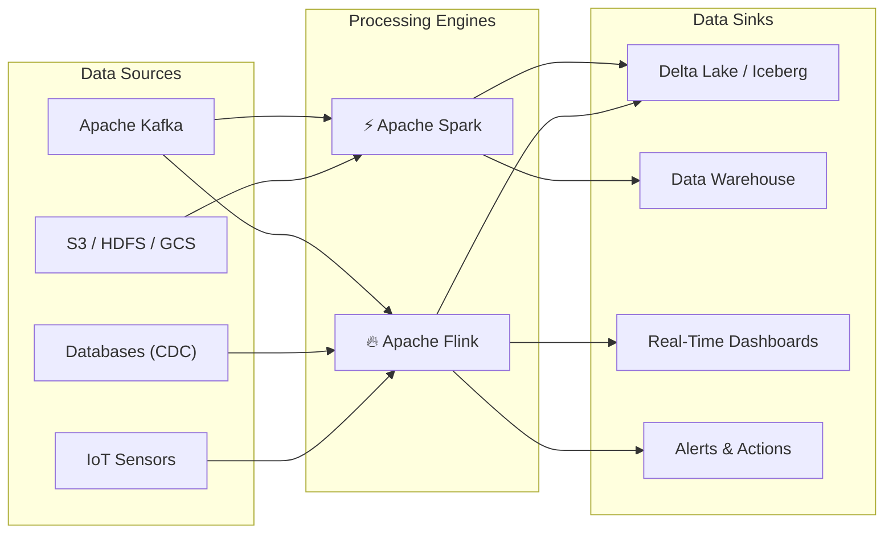
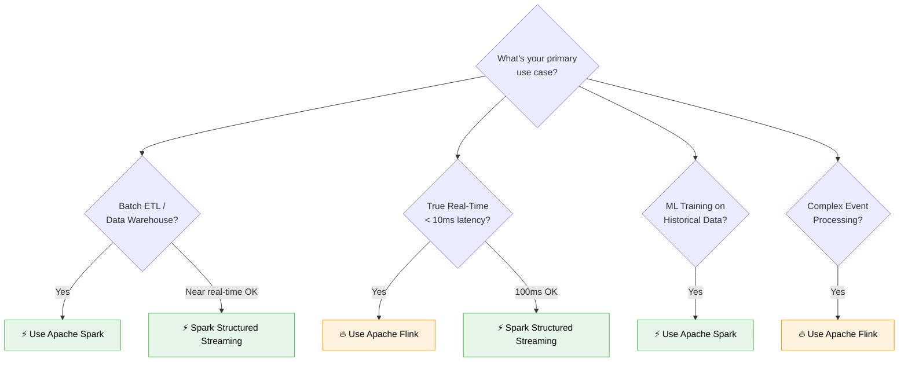
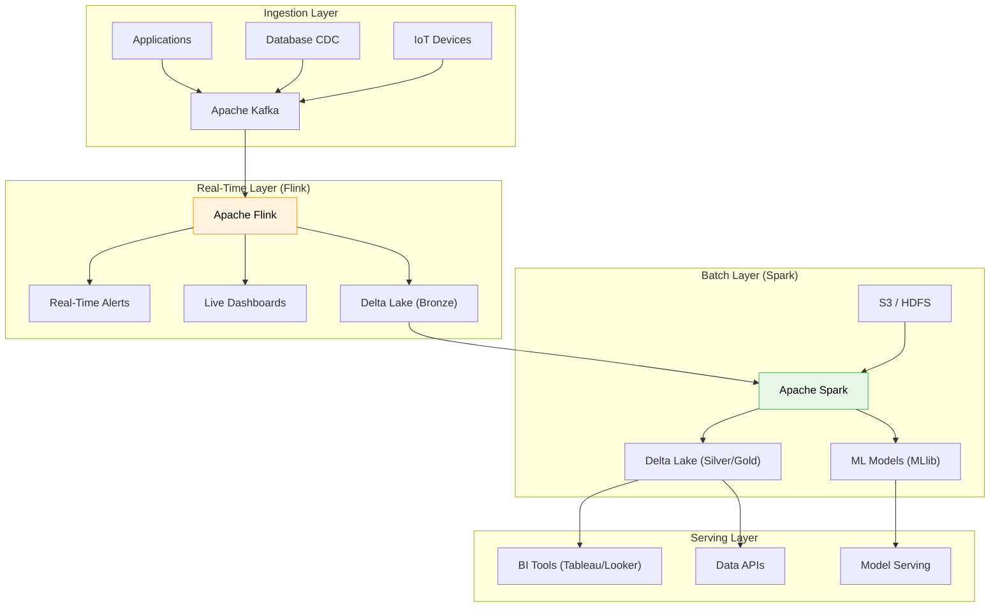

# 🔥 Apache Spark & Apache Flink — The Ultimate Big Data Processing Guide

> From batch pipelines to real-time fraud detection — master the two engines that power modern data platforms.

---

## 🎯 What This Guide Covers

This guide is your comprehensive reference for the **two dominant distributed data processing frameworks** in the industry. Whether you're building petabyte-scale ETL pipelines or millisecond-latency fraud detection systems, one (or both) of these engines will be your tool of choice.

---

## ⚡ At a Glance: Spark vs Flink

| Dimension | Apache Spark (4.0) | Apache Flink (2.0) |
|:---|:---|:---|
| **Primary Strength** | Large-scale batch processing + unified analytics | True real-time stream processing |
| **Streaming Model** | Micro-batching (Structured Streaming) | Event-at-a-time (native streaming) |
| **Latency** | Near real-time (~100ms–seconds) | True real-time (~1ms–10ms) |
| **State Management** | Basic (via `transformWithState` in 4.0) | Advanced, fine-grained, native |
| **Fault Tolerance** | RDD lineage + checkpointing | Chandy-Lamport distributed snapshots |
| **SQL Support** | Mature Spark SQL + ANSI compliance | Flink SQL with continuous queries |
| **ML Libraries** | MLlib (comprehensive) | FlinkML (growing) |
| **Community** | Massive, very mature | Rapidly growing, strong in Asia |
| **Ideal For** | Data lakes, ETL, ML pipelines, interactive SQL | Fraud detection, IoT, CEP, real-time ETL |

---

## 📚 Learning Modules

### Part I: Apache Spark Mastery

| # | Module | What You'll Learn |
|:---:|:---|:---|
| 01 | **[Architecture & Internals](01_spark_architecture_internals.md)** | Cluster architecture, Driver-Executor model, RDD lineage, Spark 4.0 features |
| 02 | **[Execution Engine Deep Dive](02_spark_execution_engine.md)** | Catalyst Optimizer, Tungsten Engine, DAG Scheduler, Adaptive Query Execution |
| 03 | **[Data APIs & Spark SQL](03_spark_data_apis_sql.md)** | RDD vs DataFrame vs Dataset, Spark SQL, UDFs, Spark 4.0 pipe syntax |
| 04 | **[Structured Streaming](04_spark_streaming.md)** | Micro-batch, continuous processing, exactly-once, windowing, watermarks |
| 05 | **[Ecosystem & Tuning](05_spark_ecosystem_tuning.md)** | MLlib, Delta Lake, Kafka integration, memory tuning, production best practices |

### Part II: Apache Flink Mastery

| # | Module | What You'll Learn |
|:---:|:---|:---|
| 06 | **[Architecture & Internals](06_flink_architecture_internals.md)** | JobManager, TaskManager, task slots, dataflow model, Flink 2.0 features |
| 07 | **[State & Checkpointing](07_flink_state_checkpointing.md)** | Keyed/Operator state, state backends, Chandy-Lamport, savepoints, exactly-once |
| 08 | **[Time, Windows & CEP](08_flink_time_windows_cep.md)** | Event time, watermarks, window types, Complex Event Processing, fraud detection |
| 09 | **[Deployment & Tuning](09_flink_deployment_tuning.md)** | K8s-native deployment, memory model, backpressure, monitoring, anti-patterns |

### Part III: The Battle

| # | Module | What You'll Learn |
|:---:|:---|:---|
| 10 | **[Spark vs Flink: The Definitive Comparison](10_spark_vs_flink_battle.md)** | Feature-by-feature battle, decision matrix, hybrid architectures, interview prep |

---

## 🗺️ When to Use What — Quick Decision Tree

---

## 🏗️ Real-World Architecture: The Modern Data Platform

Most production data platforms use **both** Spark and Flink together:

---

## 🛠️ Prerequisites

Before diving in, you should be comfortable with:
- **Java or Python** basics (examples provided in both)
- **Distributed systems concepts** (partitioning, replication, consensus)
- **Apache Kafka** fundamentals ([see our Kafka guide](../kafka/kafka-deep-dive.md))
- **SQL** basics

---

📄 **Navigation:**
[➡️ Start with Module 1: Spark Architecture & Internals](01_spark_architecture_internals.md)
