# 📘 Engineering Books — Key Learnings & Visual Guides

> Practical, diagram-rich takeaways from the most impactful software engineering books.

---

## 📖 In-Depth Book Guides

| # | Book | Focus Area |
| :---: | :--- | :--- |
| 🧠 | [**AI Engineering**](./ai-engineering/README.md) | Building applications with foundation models (Chip Huyen) |
| ⚡ | [**Event-Driven Architecture**](./event-driven-architecture/README.md) | EDA patterns, Kafka, CQRS, Sagas, Observability |

---

## 📚 Top 5 Must-Read Books

| # | Book | Author | Focus Area |
| :---: | :--- | :--- | :--- |
| 1 | [**The Pragmatic Programmer**](./pragmatic-programmer.md) | Andrew Hunt & David Thomas | Engineering mindset, habits, design principles |
| 2 | [**Clean Code**](./clean-code.md) | Robert C. Martin | Writing maintainable, readable code |
| 3 | [**Designing Data-Intensive Applications**](./designing-data-intensive-apps.md) | Martin Kleppmann | Data systems, distributed architecture |
| 4 | [**Refactoring**](./refactoring.md) | Martin Fowler | Improving existing code safely |
| 5 | [**Domain-Driven Design**](./domain-driven-design.md) | Eric Evans | Modeling complex business domains |

## 🌟 Bonus Picks

| # | Book | Author | Focus Area |
| :---: | :--- | :--- | :--- |
| 6 | [**Software Architecture: The Hard Parts**](./software-architecture-hard-parts.md) | Neal Ford et al. | Trade-offs in distributed design |
| 7 | [**Head First Design Patterns**](./head-first-design-patterns.md) | Eric Freeman et al. | Design patterns with practical examples |
| 8 | [**Building Microservices**](./building-microservices.md) | Sam Newman | Microservices patterns and design |

---

## 🗺️ How These Books Connect

```mermaid
flowchart TD
    AIE["🧠 AI Engineering<br/>Foundation Models"] -.-> DDIA
    EDA["⚡ Event-Driven Architecture<br/>Async Patterns"] -.-> Micro

    PP["🧠 Pragmatic Programmer<br/>Engineering Mindset"] --> CC["✍️ Clean Code<br/>Write Better Code"]
    CC --> Refactor["🔄 Refactoring<br/>Improve Existing Code"]
    Refactor --> Patterns["🎨 Design Patterns<br/>Reusable Solutions"]

    PP --> DDD["🏗️ Domain-Driven Design<br/>Model Business Domains"]
    DDD --> Micro["📦 Building Microservices<br/>Service Architecture"]
    Micro --> DDIA["💾 DDIA<br/>Data & Distribution"]
    Micro --> HardParts["⚖️ Hard Parts<br/>Architecture Trade-offs"]
    DDIA --> HardParts

    style PP fill:#e8eaf6,stroke:#3f51b5
    style DDIA fill:#e3f2fd,stroke:#1976d2
    style DDD fill:#e8f5e9,stroke:#4caf50
    style AIE fill:#fce4ec,stroke:#e91e63
    style EDA fill:#fff3e0,stroke:#ff9800
```

---

[🏠 Back to Main Repository](../README.md)

