# Chapter 7: Finetuning

> *When prompting isn't enough — adapting models to your specific needs*

---

## 🎯 Core Concepts

### Should You Finetune? (Decision Flowchart)

```mermaid
flowchart TD
    Start(["🤔 Considering Finetuning?"]) --> Q1{"Have you maxed out<br/>prompt engineering?"}
    Q1 -- No --> MaxPE["⏸️ Go back and optimize<br/>your prompts first"]
    Q1 -- Yes --> Q2{"Do you have 500+<br/>high-quality examples?"}
    Q2 -- No --> Synth["🔄 Generate synthetic data<br/>or collect more examples"]
    Q2 -- Yes --> Q3{"Goal: style/format or<br/>domain adaptation?"}
    Q3 -- Yes --> FT["✅ Finetune!<br/>Start with LoRA"]
    Q3 -- No --> Q4{"Cost reduction via<br/>smaller model?"}
    Q4 -- Yes --> Distill["✅ Distillation:<br/>Large → Small"]
    Q4 -- No --> Skip["❌ Probably don't need<br/>finetuning"]

    style FT fill:#4CAF50,color:white
    style Distill fill:#4CAF50,color:white
    style MaxPE fill:#FF9800,color:white
    style Skip fill:#f44336,color:white
```



### When to Finetune vs. When NOT To

| ✅ Finetune When | ❌ Don't Finetune When |
| :--- | :--- |
| Need consistent style/format | Prompt engineering works well enough |
| Domain-specific language/jargon | Small dataset (< 200 examples) |
| Significant quality gap with prompting | Task changes frequently |
| Need to reduce prompt length/cost | Limited compute budget |
| Proprietary data can't be sent to APIs | You're just starting to explore |

### Types of Finetuning


### PEFT Methods Compared

| Method | Trainable Params | VRAM Needed | Quality | Speed |
| :--- | :---: | :---: | :---: | :---: |
| **Full Finetuning** | 100% | Very High (80GB+) | ⭐⭐⭐⭐⭐ | Slow |
| **LoRA** | ~0.1-1% | Medium (16-24GB) | ⭐⭐⭐⭐ | Fast |
| **QLoRA** | ~0.1-1% | Low (8-12GB) | ⭐⭐⭐⭐ | Fast |
| **Prefix Tuning** | ~0.01% | Low | ⭐⭐⭐ | Very Fast |
| **Adapters** | ~1-5% | Medium | ⭐⭐⭐⭐ | Fast |

### How LoRA Works

```mermaid
flowchart LR
    X["Input x"] --> W["W (d×d)<br/>❄️ FROZEN"]
    X --> A["A (d×r)<br/>🔥 Trainable"]
    A --> B["B (r×d)<br/>🔥 Trainable"]
    W --> Plus(("+"))
    B --> Plus
    Plus --> Y["Output y"]

    style W fill:#e3f2fd,stroke:#1976d2
    style A fill:#fff3e0,stroke:#ff9800
    style B fill:#fff3e0,stroke:#ff9800
```



```
Output = W·x + A·B·x
Where rank r (4, 8, 16, 32) << d
Result: Train 0.1% of parameters, get ~95% of full finetune quality
```

### Finetuning Pipeline

```mermaid
flowchart LR
    Data["1️⃣ Data Prep<br/>Format as<br/>instruction/output"] --> Base["2️⃣ Choose Base<br/>Model<br/>(Llama, Mistral)"]
    Base --> Hyper["3️⃣ Set Hyperparams<br/>LR, epochs,<br/>LoRA rank"]
    Hyper --> Train["4️⃣ Train<br/>Monitor loss,<br/>avoid overfitting"]
    Train --> Eval["5️⃣ Evaluate<br/>Compare vs.<br/>baseline"]
    Eval --> Deploy["6️⃣ Merge & Deploy"]

    style Data fill:#e8eaf6,stroke:#3f51b5
    style Deploy fill:#c8e6c9,stroke:#388e3c
```



### Alignment Techniques

```mermaid
flowchart TD
    SFT["📋 SFT<br/>Supervised Fine-Tuning<br/>Train on instruction-response pairs"] --> RLHF["🏆 RLHF<br/>Reinforcement Learning<br/>from Human Feedback"]
    SFT --> DPO["⚡ DPO<br/>Direct Preference Optimization<br/>Simpler than RLHF, no reward model"]

    RLHF --> RM["Train Reward Model"] --> PPO["Optimize with PPO"]
    DPO --> Pref["Learn directly from<br/>preference pairs"]

    style SFT fill:#e3f2fd,stroke:#1976d2
    style DPO fill:#c8e6c9,stroke:#388e3c
    style RLHF fill:#fff3e0,stroke:#ff9800
```



---

## 📝 My Notes

<!-- Add your own notes, insights, and questions as you read -->


---

## ❓ Questions to Reflect On

1. For your use case, would LoRA or full finetuning be more appropriate?
2. How much data would you need to finetune effectively?
3. How do you know if finetuning is working — what metrics do you track?
4. How do you handle model updates (new base model versions)?

---

## 🔗 Key Takeaways

1. 
2. 
3. 

---

## 🛠️ Practice Ideas

- [ ] Finetune a small model (e.g., Llama 3.2 1B) with LoRA on a custom dataset
- [ ] Compare finetuned model vs. few-shot prompting on the same eval set
- [ ] Experiment with different LoRA ranks (4, 8, 16, 32) and measure impact
- [ ] Try DPO alignment on a preference dataset

---

<div align="center">

[⬅️ Previous Chapter](./chapter-06-rag-and-agents.md) | [🏠 Home](./README.md) | [Next Chapter ➡️](./chapter-08-dataset-engineering.md)

</div>
