# Chapter 10: AI Engineering Architecture & User Feedback

> *The holistic blueprint for building and maintaining world-class AI applications*

---

## 🎯 Core Concepts

### End-to-End Production Architecture

```mermaid
flowchart TD
    User(["👤 User"]) --> LB["⚖️ Load Balancer"]
    LB --> IG["🛡️ Input Guardrails"]

    subgraph INPUT_CHECKS["Input Safety Layer"]
        PII["PII Detection"]
        Inject["Injection Detection"]
        Rate["Rate Limiting"]
        Valid["Input Validation"]
    end
    IG -.-> INPUT_CHECKS

    IG --> Context["📄 Context Construction"]

    subgraph CTX_BUILD["Context Building"]
        RAG["RAG Retrieval"]
        History["Conversation History"]
        SysP["System Prompt"]
    end
    Context -.-> CTX_BUILD

    Context --> Router{"🔀 Model Router"}
    Router -- Simple --> Small["📦 Small Model"]
    Router -- Complex --> Large["📦 Large Model"]
    Router -- Specialized --> Domain["📦 Domain Model"]

    Small --> OG["🛡️ Output Guardrails"]
    Large --> OG
    Domain --> OG

    subgraph OUTPUT_CHECKS["Output Safety Layer"]
        Halluc["Hallucination Check"]
        Safety["Toxicity Filter"]
        Format["Format Validation"]
        Facts["Fact Verification"]
    end
    OG -.-> OUTPUT_CHECKS

    OG --> Stream["🌊 Stream to User"]
    Stream --> Obs["📊 Observability"]

    subgraph MONITORING["Monitoring Stack"]
        Log["Structured Logging"]
        Trace["Distributed Tracing"]
        Metrics["Latency / Cost / Quality"]
        Alert["Alerting"]
    end
    Obs -.-> MONITORING

    Obs --> FB["🔄 Feedback Loop"]
    FB --> Improve["♻️ Continuous Improvement"]
    Improve -.-> Context

    style User fill:#e3f2fd,stroke:#1976d2
    style IG fill:#ffcdd2,stroke:#c62828
    style OG fill:#ffcdd2,stroke:#c62828
    style FB fill:#c8e6c9,stroke:#388e3c
```

### Input Guardrails — Defense in Depth

```mermaid
flowchart LR
    Input(["Raw User Input"]) --> S1["1️⃣ Rate Limiting<br/>Prevent abuse"]
    S1 --> S2["2️⃣ Input Validation<br/>Format, length, lang"]
    S2 --> S3["3️⃣ PII Detection<br/>Redact sensitive data"]
    S3 --> S4["4️⃣ Prompt Injection<br/>Detection"]
    S4 --> S5["5️⃣ Content Filtering<br/>Block harmful/off-topic"]
    S5 --> Safe(["✅ Safe Input"])

    style Input fill:#ffcdd2,stroke:#c62828
    style Safe fill:#c8e6c9,stroke:#388e3c
```

### Output Guardrails

| Check | Description | Action on Failure |
| :--- | :--- | :--- |
| **Hallucination Check** | Verify claims against source docs | Flag or regenerate |
| **Safety Filter** | Block harmful/biased content | Replace with safe response |
| **Format Validation** | Ensure output matches schema | Parse and reformat |
| **Confidence Scoring** | Low confidence → human review | Route to human agent |
| **PII Leakage** | Check output doesn't leak PII | Redact and log |

### Observability — What to Monitor

```mermaid
flowchart TD
    subgraph PERF["⚡ Performance"]
        P1["P50 Latency < 1s"]
        P2["P99 Latency < 5s"]
        P3["Error Rate < 0.1%"]
        P4["Throughput (req/s)"]
    end

    subgraph QUALITY["📊 Quality"]
        Q1["AI Judge Scores"]
        Q2["User Satisfaction (👍/👎)"]
        Q3["Task Completion Rate"]
        Q4["Hallucination Rate"]
    end

    subgraph COST["💰 Cost"]
        C1["Cost per Query"]
        C2["Token Usage Trends"]
        C3["Model Mix (small vs large)"]
    end

    subgraph SAFETY["🛡️ Safety"]
        S1["Guardrail Trigger Rate"]
        S2["Injection Attempts"]
        S3["PII Leak Incidents"]
    end

    style PERF fill:#e3f2fd,stroke:#1976d2
    style QUALITY fill:#e8f5e9,stroke:#4caf50
    style COST fill:#fff3e0,stroke:#ff9800
    style SAFETY fill:#ffcdd2,stroke:#c62828
```

### The Feedback Flywheel

```mermaid
flowchart TD
    Deploy["🚀 Deploy"] --> Collect["📥 Collect Feedback"]
    Collect --> Analyze["🔍 Analyze<br/>Cluster failure patterns"]
    Analyze --> Prioritize["📊 Prioritize<br/>Impact × Frequency"]
    Prioritize --> Fix["🔧 Fix"]

    subgraph FIX_OPTIONS["Improvement Actions"]
        direction LR
        F1["Update Prompts"]
        F2["Fix RAG Data"]
        F3["Add to Eval Set"]
        F4["Finetune"]
        F5["Add Guardrails"]
    end
    Fix -.-> FIX_OPTIONS

    Fix --> Eval["✅ Evaluate vs Baseline"]
    Eval --> Deploy

    style Deploy fill:#4CAF50,color:white
    style Collect fill:#2196F3,color:white
    style Analyze fill:#FF9800,color:white
```

### Feedback Signal Types

| Signal | How to Collect | Value |
| :--- | :--- | :--- |
| **Explicit** | 👍/👎 buttons, star ratings | Direct but sparse |
| **Corrections** | User edits AI output | Very high — free training data |
| **Implicit** | Copy-paste, time on page, follow-ups | Abundant but noisy |
| **Escalations** | User contacts support after failure | High signal for critical bugs |

### Security Threat Model

### Building a Defensible AI System

---

## 📝 My Notes

<!-- Add your own notes, insights, and questions as you read -->

---

## ❓ Questions to Reflect On

1. What guardrails does your application need from day one?
2. How will you collect and use user feedback?
3. What's your observability strategy — what metrics matter most?
4. How do you build a data flywheel for continuous improvement?
5. What are the biggest security risks for your specific application?

---

## 🔗 Key Takeaways

1. 
2. 
3. 

---

## 🛠️ Practice Ideas

- [ ] Design a complete AI architecture diagram for your application
- [ ] Implement input + output guardrails for a simple AI API
- [ ] Set up logging and tracing (LangSmith / Langfuse / custom)
- [ ] Build a feedback collection mechanism (thumbs up/down + free text)
- [ ] Run a red-team exercise: try to break your AI system

---

[⬅️ Previous Chapter](./chapter-09-inference-optimization.md) | [🏠 Home](./README.md)

