# 📦 Building Microservices — Key Learnings

> *Sam Newman (2nd Edition)*
> Practical patterns for designing, building, and operating microservice architectures.

[🏠 Back to Books](./README.md)

---

## Core Philosophy

> **"Microservices are independently deployable services modeled around a business domain."**

---

## 1. Monolith → Microservices

```mermaid
flowchart LR
    Mono["🧱 Monolith"] --> Modular["📦 Modular Monolith"]
    Modular --> Extract["🔪 Extract Services"]
    Extract --> Micro["☁️ Microservices"]

    style Mono fill:#ffcdd2,stroke:#c62828
    style Modular fill:#fff3e0,stroke:#ff9800
    style Micro fill:#c8e6c9,stroke:#388e3c
```

> **Don't start with microservices.** Start with a well-structured monolith. Extract services when there's a clear reason.

### Decomposition Strategies

| Strategy | How | Best For |
| :--- | :--- | :--- |
| **By business capability** | Align services with business functions | Mature domains |
| **By subdomain (DDD)** | Use bounded contexts as service boundaries | Complex domains |
| **Strangler Fig** | Gradually replace monolith piece by piece | Legacy migration |

---

## 2. Communication Patterns

| | Synchronous | Asynchronous |
| :--- | :--- | :--- |
| **Coupling** | Higher (temporal) | Lower |
| **Latency** | Immediate response | Eventual |
| **Failure** | Cascading | Isolated |
| **Complexity** | Simpler to understand | Harder to debug |
| **Best For** | Queries, user-facing APIs | Events, background processing |

---

## 3. Data Ownership

```mermaid
flowchart LR
    subgraph WRONG["❌ Shared Database"]
        S1["Service A"] --> DB[("Shared DB")]
        S2["Service B"] --> DB
        S3["Service C"] --> DB
    end

    subgraph RIGHT["✅ Database per Service"]
        SA["Service A"] --> DA[("DB A")]
        SB["Service B"] --> DB_B[("DB B")]
        SC["Service C"] --> DC[("DB C")]
    end

    style WRONG fill:#ffcdd2,stroke:#c62828
    style RIGHT fill:#c8e6c9,stroke:#388e3c
```

> **Each service owns its data.** If another service needs data, it asks via API or subscribes to events. No reaching into another service's database.

---

## 4. Resilience Patterns

```mermaid
flowchart TD
    Resilience["Resilience Patterns"] --> CB["🔌 Circuit Breaker<br/>Stop calling a failing service"]
    Resilience --> Retry["🔄 Retry with Backoff<br/>Retry transient failures"]
    Resilience --> Bulkhead["🚢 Bulkhead<br/>Isolate failures to one area"]
    Resilience --> Timeout["⏱️ Timeouts<br/>Don't wait forever"]
    Resilience --> Fallback["🔀 Fallback<br/>Degrade gracefully"]

    style CB fill:#e3f2fd,stroke:#1976d2
    style Retry fill:#fff3e0,stroke:#ff9800
    style Bulkhead fill:#e8f5e9,stroke:#4caf50
```

### Circuit Breaker States

```mermaid
flowchart LR
    Closed["✅ Closed<br/>(Normal)"] -->|"Failures exceed threshold"| Open["🔴 Open<br/>(Reject calls)"]
    Open -->|"Timeout expires"| HalfOpen["🟡 Half-Open<br/>(Try one call)"]
    HalfOpen -->|"Success"| Closed
    HalfOpen -->|"Failure"| Open

    style Closed fill:#c8e6c9,stroke:#388e3c
    style Open fill:#ffcdd2,stroke:#c62828
    style HalfOpen fill:#fff3e0,stroke:#ff9800
```

---

## 5. Deployment Patterns

| Pattern | Description | Complexity |
| :--- | :--- | :---: |
| **Blue-Green** | Two identical environments, switch traffic | ⭐⭐ |
| **Canary** | Route small % of traffic to new version | ⭐⭐⭐ |
| **Rolling** | Gradually replace old instances | ⭐⭐ |
| **Feature Flags** | Enable/disable features without deploy | ⭐⭐ |

---

## 6. Observability — The Three Pillars

| Pillar | What | Tools |
| :--- | :--- | :--- |
| **Logs** | Structured event records | ELK, CloudWatch, Loki |
| **Metrics** | Numeric measurements over time | Prometheus, Grafana, Datadog |
| **Traces** | Request flow across services | Jaeger, Zipkin, X-Ray |

> **Correlation IDs** are essential — propagate them through every service call to trace a request end-to-end.

---

## 7. Key Takeaways

| # | Lesson |
| :---: | :--- |
| 1 | **Start with a monolith** — decompose when you have a reason |
| 2 | **Services own their data** — no shared databases |
| 3 | **Prefer async communication** — reduces coupling |
| 4 | **Design for failure** — circuit breakers, retries, timeouts |
| 5 | **Observability is not optional** — logs + metrics + traces |
| 6 | **Automate everything** — CI/CD, testing, infrastructure |
| 7 | **Organization structure matters** — Conway's Law is real |

---

[⬅️ Previous: Design Patterns](./head-first-design-patterns.md) | [🏠 Back to Books](./README.md)

