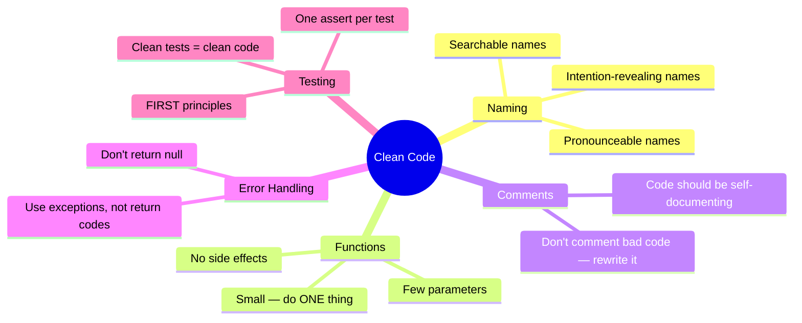
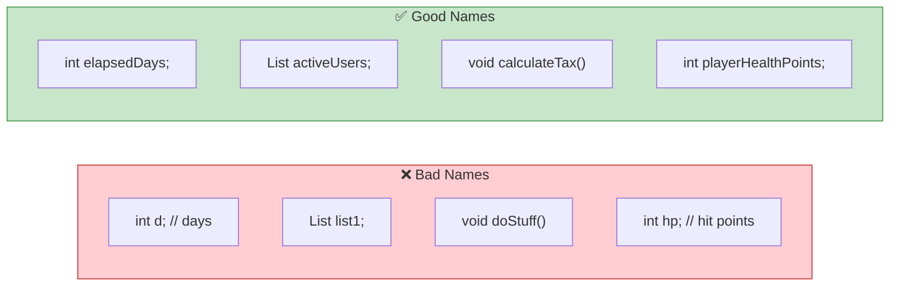
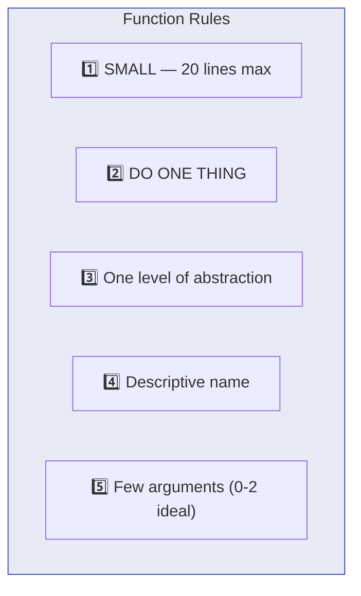
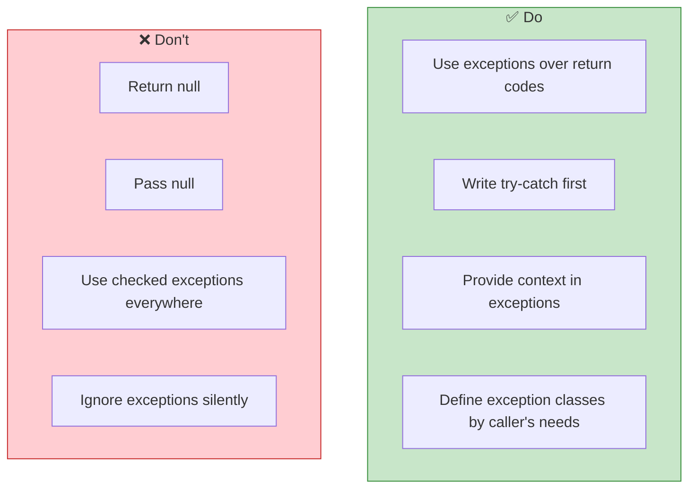
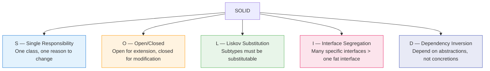

# ✍️ Clean Code — Key Learnings

> *Robert C. Martin ("Uncle Bob")*
> How to write code that humans can read, understand, and maintain.

[🏠 Back to Books](./README.md)

---

## Core Philosophy

> **"Any fool can write code that a computer can understand. Good programmers write code that humans can understand."** — Martin Fowler

---

## 1. Meaningful Names

| Rule | Bad | Good |
| :--- | :--- | :--- |
| **Reveal intent** | `d` | `elapsedTimeInDays` |
| **Avoid disinformation** | `accountList` (if not a List) | `accounts` or `accountGroup` |
| **Make pronounceable** | `genymdhms` | `generationTimestamp` |
| **Make searchable** | `7` (magic number) | `MAX_RETRIES = 7` |
| **Avoid encodings** | `strName`, `iCount` | `name`, `count` |

---

## 2. Functions — Small & Focused

| Args | Name | Quality |
| :---: | :--- | :--- |
| 0 | Niladic | ⭐⭐⭐⭐⭐ Best |
| 1 | Monadic | ⭐⭐⭐⭐ Good |
| 2 | Dyadic | ⭐⭐⭐ OK |
| 3 | Triadic | ⭐⭐ Avoid |
| 4+ | Polyadic | ⭐ Extract to object |

> **The Step-Down Rule:** Read code top-to-bottom like a newspaper — high-level abstractions first, details below.

---

## 3. Comments — When & When Not

| ✅ Good Comments | ❌ Bad Comments |
| :--- | :--- |
| Legal/copyright headers | Redundant (repeats the code) |
| Explaining WHY, not WHAT | Journal comments (use git) |
| Warning of consequences | Commented-out code (delete it!) |
| TODO notes (temporary) | Position markers (`// end of if`) |
| Clarifying complex regex/algo | Noise (`// default constructor`) |

> **Best comment is the one you didn't have to write** — because the code was clear enough.

---

## 4. Error Handling

---

## 5. The SOLID Principles

---

## 6. Testing — FIRST Principles

| Letter | Principle | Meaning |
| :---: | :--- | :--- |
| **F** | Fast | Tests run quickly — seconds, not minutes |
| **I** | Independent | Tests don't depend on each other |
| **R** | Repeatable | Same result every time, any environment |
| **S** | Self-Validating | Pass or fail — no manual inspection |
| **T** | Timely | Written BEFORE or WITH the production code |

---

## 7. Code Smells — Quick Reference

| Smell | Description | Fix |
| :--- | :--- | :--- |
| **Long Method** | Function does too many things | Extract Method |
| **Large Class** | Class has too many responsibilities | Extract Class |
| **Long Parameter List** | Function takes 5+ params | Parameter Object |
| **Duplicate Code** | Same code in multiple places | Extract and share |
| **Feature Envy** | Method uses another class's data more | Move Method |
| **Data Clumps** | Same 3 vars always appear together | Extract Class |
| **Primitive Obsession** | Using primitives for domain concepts | Create value objects |
| **Refused Bequest** | Subclass doesn't use parent methods | Rethink hierarchy |

---

## 8. The Boy Scout Rule

> **"Leave the campground cleaner than you found it."**

Every time you touch code:
- Rename a variable to be clearer
- Extract a small function
- Remove a dead comment
- Simplify a conditional

Small improvements compound into massive quality gains over time.

---

[⬅️ Previous: Pragmatic Programmer](./pragmatic-programmer.md) | [🏠 Back to Books](./README.md) | [Next: DDIA ➡️](./designing-data-intensive-apps.md)

