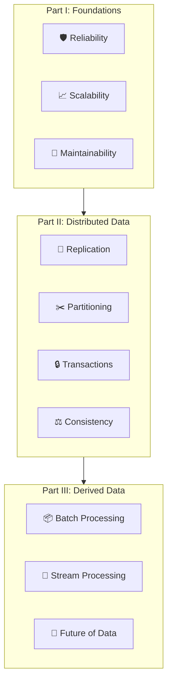
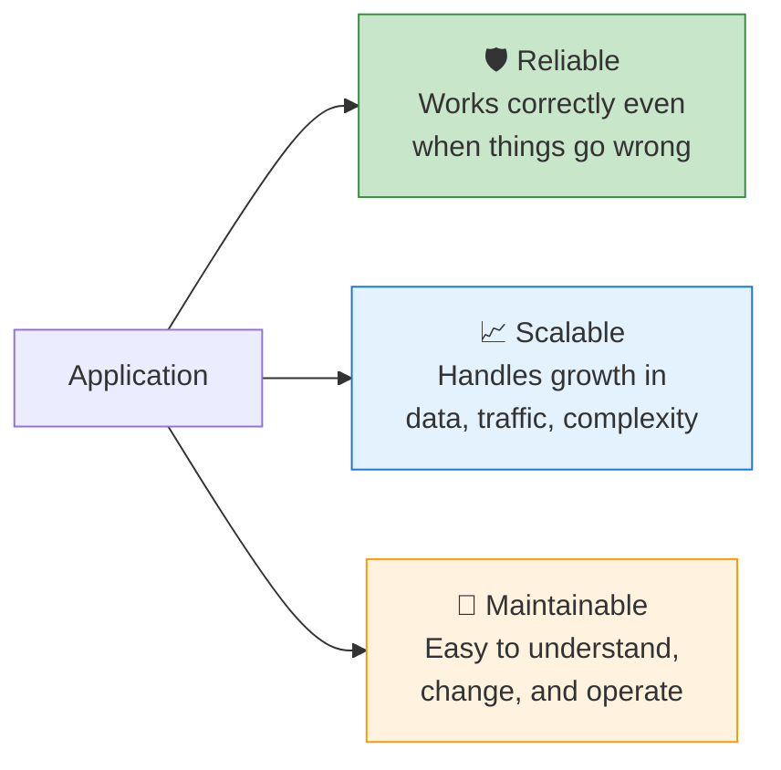
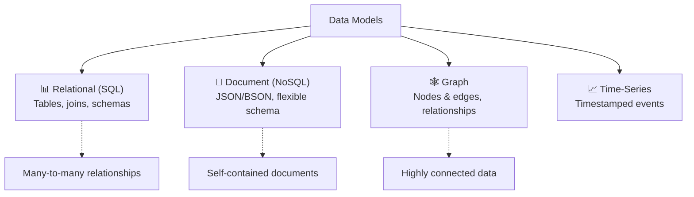
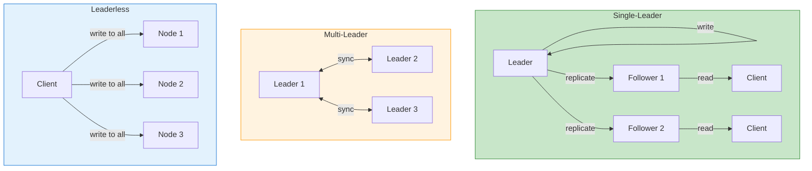
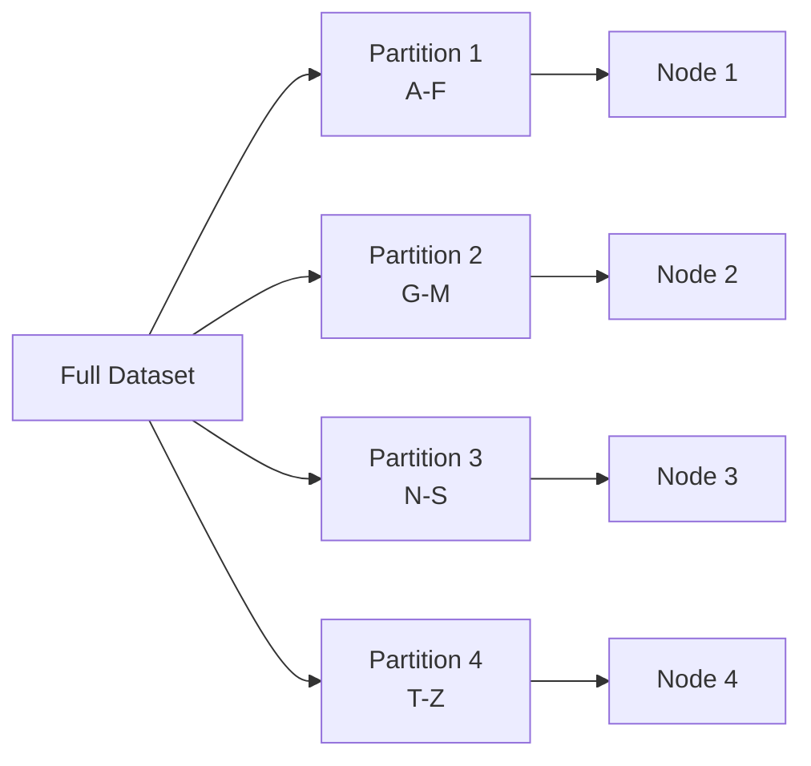
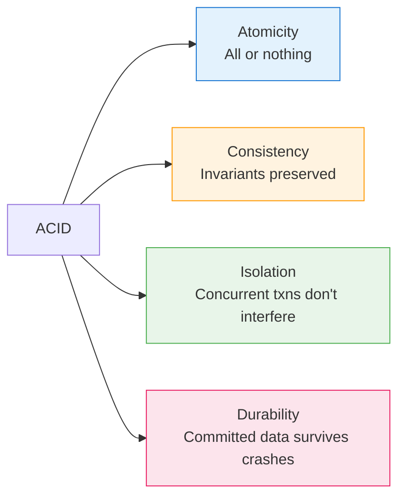
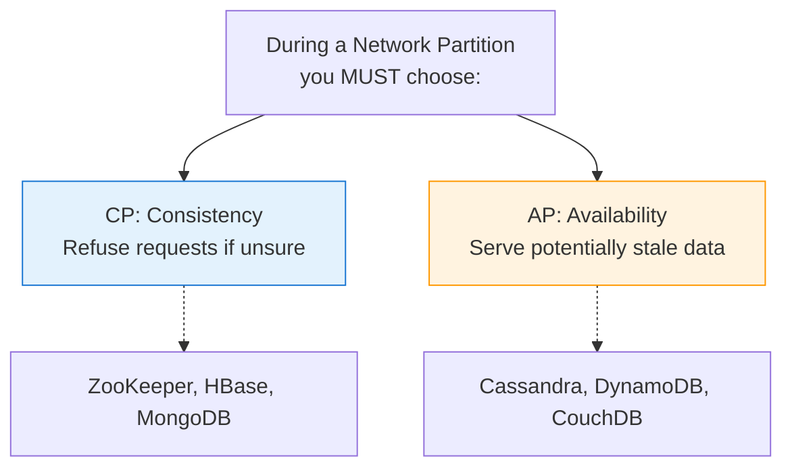
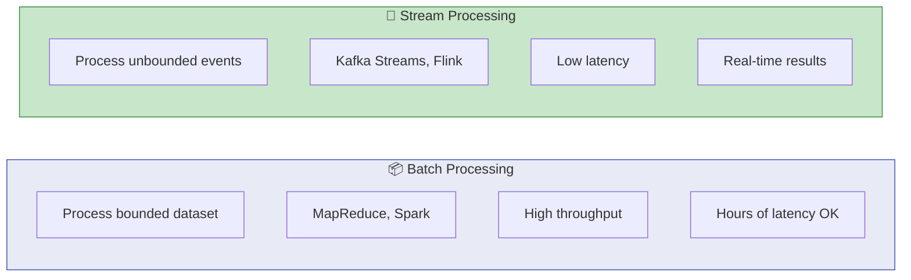

# 💾 Designing Data-Intensive Applications — Key Learnings

> *Martin Kleppmann*
> The bible of distributed systems — data storage, replication, partitioning, consistency, and batch/stream processing.

[🏠 Back to Books](./README.md)

---

## The Big Picture

---

## 1. Reliability, Scalability, Maintainability

| Property | Key Question | Strategies |
| :--- | :--- | :--- |
| **Reliability** | Does it work when things fail? | Redundancy, testing, monitoring |
| **Scalability** | Can it handle 10x growth? | Sharding, caching, async |
| **Maintainability** | Can a new dev understand it? | Simple design, docs, modularity |

---

## 2. Data Models & Query Languages

| Model | Best For | Avoid When |
| :--- | :--- | :--- |
| **Relational** | Complex queries, joins, transactions | Extreme write throughput |
| **Document** | Flexible schemas, nested data | Many cross-document joins |
| **Graph** | Social networks, recommendations | Simple key-value lookups |
| **Key-Value** | Caching, sessions, simple lookups | Complex queries |

---

## 3. Replication

| Strategy | Consistency | Availability | Use Case |
| :--- | :---: | :---: | :--- |
| **Single-Leader** | Strong | Medium | Most applications |
| **Multi-Leader** | Eventual | High | Multi-datacenter |
| **Leaderless** | Tunable | High | Dynamo-style (Cassandra) |

---

## 4. Partitioning (Sharding)

| Strategy | How | Hot Spots? | Rebalancing |
| :--- | :--- | :---: | :--- |
| **Key Range** | A-F, G-M, etc. | ⚠️ Yes | Move boundaries |
| **Hash** | hash(key) % N | ✅ No | Consistent hashing |
| **Composite** | Hash + range | ✅ No | Complex but flexible |

---

## 5. Transactions & ACID

### Isolation Levels

| Level | Dirty Reads | Non-Repeatable Reads | Phantoms | Performance |
| :--- | :---: | :---: | :---: | :---: |
| **Read Uncommitted** | ⚠️ Yes | ⚠️ Yes | ⚠️ Yes | ⚡ Fastest |
| **Read Committed** | ✅ No | ⚠️ Yes | ⚠️ Yes | ⚡ Fast |
| **Repeatable Read** | ✅ No | ✅ No | ⚠️ Yes | 🔄 Medium |
| **Serializable** | ✅ No | ✅ No | ✅ No | 🐢 Slowest |

---

## 6. The CAP Theorem (Simplified)

> **Reality:** CAP is about trade-offs during partitions. In normal operation, you can have all three. The real question is: **what happens when the network fails?**

---

## 7. Batch vs. Stream Processing

| Aspect | Batch | Stream |
| :--- | :--- | :--- |
| **Input** | Bounded dataset | Unbounded event stream |
| **Latency** | Minutes to hours | Milliseconds to seconds |
| **Tools** | Hadoop, Spark | Kafka, Flink, Kinesis |
| **Use Case** | Analytics, ETL | Real-time dashboards, alerts |

---

## 8. Key Takeaways

1. **There is no one-size-fits-all database** — choose based on access patterns
2. **Replication and partitioning** are the two fundamental strategies for scaling
3. **Consistency and availability** are trade-offs, not absolutes
4. **Transactions** provide guarantees but at a performance cost
5. **Batch and stream processing** are complementary, not competing

---

[⬅️ Previous: Clean Code](./clean-code.md) | [🏠 Back to Books](./README.md) | [Next: Refactoring ➡️](./refactoring.md)

