# 🏗️ Domain-Driven Design — Key Learnings

> *Eric Evans*
> Model complex business domains and align code with real business needs.

[🏠 Back to Books](./README.md)

---

## Core Philosophy

> **"The heart of software is its ability to solve domain-related problems for its user."**

---

## 1. Ubiquitous Language

```mermaid
flowchart LR
    subgraph WITHOUT["❌ Without Ubiquitous Language"]
        Dev["Developer says:<br/>'UserRecord object'"]
        Biz["Business says:<br/>'Customer account'"]
        QA["QA says:<br/>'Test user profile'"]
    end

    subgraph WITH["✅ With Ubiquitous Language"]
        All["Everyone says:<br/>'Customer Account'"]
        All --> Code["Code: CustomerAccount"]
        All --> Docs["Docs: Customer Account"]
        All --> Conv["Meetings: Customer Account"]
    end

    style WITHOUT fill:#ffcdd2,stroke:#c62828
    style WITH fill:#c8e6c9,stroke:#388e3c
```

> **Rule:** If the word in your code isn't the word the business uses, one of you is wrong. Fix the code.

---

## 2. Bounded Contexts

```mermaid
flowchart TD
    subgraph SALES["💰 Sales Context"]
        SC["Customer = name, email,<br/>purchase history, discount tier"]
    end

    subgraph SHIPPING["📦 Shipping Context"]
        SH["Customer = name, address,<br/>delivery preferences"]
    end

    subgraph BILLING["💳 Billing Context"]
        BI["Customer = name, payment method,<br/>billing address, tax ID"]
    end

    SALES -.->|"Context Map"| SHIPPING
    SALES -.->|"Context Map"| BILLING

    style SALES fill:#e3f2fd,stroke:#1976d2
    style SHIPPING fill:#e8f5e9,stroke:#4caf50
    style BILLING fill:#fff3e0,stroke:#ff9800
```

> **Key Insight:** "Customer" means different things in different contexts. Each bounded context has its OWN model. Don't try to build one universal "Customer" class.

---

## 3. Entities vs. Value Objects

| | Entity | Value Object |
| :--- | :--- | :--- |
| **Identity** | Has unique ID | Defined by attributes |
| **Equality** | Same ID = same entity | Same attributes = equal |
| **Mutability** | Mutable | Immutable (create new) |
| **Example** | `Order(id=123)` | `Money(100, "USD")` |
| **Lifecycle** | Tracked over time | Created, used, discarded |

---

## 4. Aggregates

```mermaid
flowchart TD
    subgraph AGG["🔲 Order Aggregate"]
        Root["🔑 Order (Aggregate Root)"]
        Root --> LI1["OrderLine: Widget x2"]
        Root --> LI2["OrderLine: Gadget x1"]
        Root --> Addr["ShippingAddress"]
    end

    External["External Code"] -->|"Access ONLY through root"| Root
    External -.->|"❌ Never access directly"| LI1

    style AGG fill:#e8eaf6,stroke:#3f51b5
    style Root fill:#fff3e0,stroke:#ff9800
```

**Aggregate Rules:**
1. External code accesses **only through the root**
2. Aggregate root enforces **all invariants**
3. One transaction = **one aggregate** modification
4. Reference other aggregates **by ID**, not by object

---

## 5. Domain Events

> **Domain Event = something meaningful that happened in the domain.** Named in past tense: `OrderPlaced`, `PaymentReceived`, `AccountSuspended`.

---

## 6. Strategic Patterns — Context Map

| Pattern | Description | Use When |
| :--- | :--- | :--- |
| **Shared Kernel** | Two contexts share a small model | Close teams, shared code |
| **Customer-Supplier** | Upstream serves downstream | Clear dependency direction |
| **Conformist** | Downstream adopts upstream model | No negotiating power |
| **Anti-Corruption Layer** | Translate between models | Integrating legacy or external systems |
| **Open Host Service** | Published API for consumers | Multiple downstream contexts |
| **Separate Ways** | No integration needed | Independent contexts |

```mermaid
flowchart LR
    Legacy["🏚️ Legacy System"] --> ACL["🛡️ Anti-Corruption Layer<br/>Translates old model → new model"]
    ACL --> Modern["✨ Your Domain Model"]

    style Legacy fill:#ffcdd2,stroke:#c62828
    style ACL fill:#fff3e0,stroke:#ff9800
    style Modern fill:#c8e6c9,stroke:#388e3c
```

---

## 7. Subdomains

| Type | Description | Example | Investment |
| :--- | :--- | :--- | :--- |
| **Core** | Competitive advantage, unique business logic | Pricing algorithm, matching engine | Maximum |
| **Supporting** | Needed but not differentiating | User management, reporting | Moderate |
| **Generic** | Same across industries | Email, auth, payments | Buy or use libraries |

> **Focus your best engineers on your Core Domain.** For Generic subdomains, use off-the-shelf solutions.

---

## 8. Key Takeaways

| # | Principle |
| :---: | :--- |
| 1 | **Speak the same language** — code mirrors business terminology |
| 2 | **Bounded contexts define boundaries** — same word can mean different things |
| 3 | **Aggregates are consistency boundaries** — one transaction per aggregate |
| 4 | **Entities have identity, Value Objects don't** — know the difference |
| 5 | **Domain events connect contexts** — asynchronous, loose coupling |
| 6 | **Anti-corruption layers protect your model** — never let legacy corrupt your domain |
| 7 | **Focus on the core domain** — it's your competitive advantage |

---

[⬅️ Previous: Refactoring](./refactoring.md) | [🏠 Back to Books](./README.md) | [Next: Architecture Hard Parts ➡️](./software-architecture-hard-parts.md)

