# Chapter 1: EDA Fundamentals & Core Concepts

> *Understanding the paradigm shift from request-response to event-driven systems*

---

## 🎯 Core Concepts

### What is Event-Driven Architecture?

```mermaid
flowchart LR
    subgraph TRAD["Traditional: Request-Response"]
        direction TB
        C["Client"] -->|"1. Request"| S["Server"]
        S -->|"2. Response"| C
    end

    subgraph EDA["Event-Driven"]
        direction TB
        P["Producer"] -->|"1. Emit Event"| B["📨 Broker"]
        B -->|"2. Deliver"| C1["Consumer A"]
        B -->|"2. Deliver"| C2["Consumer B"]
        B -->|"2. Deliver"| C3["Consumer C"]
    end

    style TRAD fill:#fff3e0,stroke:#ff9800
    style EDA fill:#c8e6c9,stroke:#388e3c
```

- **Event:** An immutable record of something that happened (past tense)
- **Producer:** Service that emits events when state changes
- **Consumer:** Service that reacts to events
- **Broker:** Infrastructure that routes events from producers to consumers

### Why EDA? — The Key Benefits

### EDA vs. Other Architectural Styles

| Style | Communication | Coupling | Scalability | When to Use |
| :--- | :--- | :--- | :--- | :--- |
| **Monolith** | In-process calls | Very tight | Limited | Small apps, MVPs |
| **SOA** | SOAP/REST | Medium | Moderate | Enterprise integration |
| **Microservices (sync)** | REST/gRPC | Medium | Good | Request-response workflows |
| **Event-Driven** | Async events | Very loose | Excellent | Decoupled, reactive systems |
| **Hybrid** | Mix of sync + async | Varies | Excellent | Real-world production systems |

### Key Terminology

```mermaid
flowchart TD
    Event["📨 Event<br/>'Something happened'<br/>Immutable fact"] --> Command["📤 Command<br/>'Do something'<br/>Intent to act"]
    Event --> Query["📥 Query<br/>'Tell me something'<br/>Read request"]

    Event -.->|"Example"| E1["OrderPlaced"]
    Command -.->|"Example"| C1["PlaceOrder"]
    Query -.->|"Example"| Q1["GetOrderDetails"]

    style Event fill:#c8e6c9,stroke:#388e3c
    style Command fill:#fff3e0,stroke:#ff9800
    style Query fill:#e3f2fd,stroke:#1976d2
```

---

## 📝 My Notes

<!-- Add your own notes as you read -->

---

## ❓ Questions to Reflect On

1. What systems in your current work would benefit from EDA?
2. What are the trade-offs of eventual consistency vs. strong consistency?
3. How do you decide between synchronous and asynchronous communication?

---

## 🛠️ Practice Ideas

- [ ] Draw an architecture diagram of a system you know — identify where EDA would help
- [ ] List 5 domain events for an e-commerce system
- [ ] Compare how a feature would be built with REST vs. EDA

---

[🏠 Home](./README.md) | [Next Chapter ➡️](./chapter-02-events-and-messaging.md)

