# Chapter 2: Events, Messages & Communication

> *Understanding the building blocks of event-driven communication*

---

## 🎯 Core Concepts

### Event Anatomy

```
{
  "eventId":        "550e8400-e29b-41d4-a716-446655440000",
  "eventType":      "OrderPlaced",
  "aggregateId":    "order-12345",
  "timestamp":      "2025-02-28T15:30:00Z",
  "version":        1,
  "source":         "order-service",
  "correlationId":  "req-abc-123",
  "causationId":    "cmd-place-order-456",
  "data": {
    "customerId": "cust-789",
    "items": [{"sku": "WIDGET-1", "qty": 2}],
    "total": 49.98
  }
}
```

### Types of Events

```mermaid
flowchart TD
    Events["📨 Event Types"] --> Notif["🔔 Notification Event<br/>'OrderPlaced'<br/>Minimal — just the fact"]
    Events --> ECST["📦 State Transfer Event<br/>'OrderPlaced + full order data'<br/>Consumer gets everything"]
    Events --> Domain["🏗️ Domain Event<br/>'OrderPlaced in Order context'<br/>Bounded context language"]
    Events --> CDC["🔄 CDC Event<br/>'Row INSERT in orders table'<br/>From DB transaction log"]

    Notif -.-> NEx["Consumers call back for data"]
    ECST -.-> EEx["No callback needed"]
    Domain -.-> DEx["DDD-aligned, semantic"]
    CDC -.-> CEx["Debezium, DynamoDB Streams"]

    style Notif fill:#e3f2fd,stroke:#1976d2
    style ECST fill:#fff3e0,stroke:#ff9800
    style Domain fill:#e8f5e9,stroke:#4caf50
    style CDC fill:#fce4ec,stroke:#e91e63
```



### Messages vs. Events vs. Commands

```mermaid
flowchart LR
    subgraph MSG["Message (Envelope)"]
        direction TB
        Headers["Headers: ID, timestamp, routing"]
        Payload["Payload: Event OR Command"]
    end

    MSG --> EventMsg["📨 Event Message<br/>Broadcast, many consumers<br/>'Something happened'"]
    MSG --> CmdMsg["📤 Command Message<br/>Point-to-point, one consumer<br/>'Do this thing'"]

    style EventMsg fill:#c8e6c9,stroke:#388e3c
    style CmdMsg fill:#fff3e0,stroke:#ff9800
```



| | Event | Command | Query |
| :--- | :--- | :--- | :--- |
| **Intent** | Record what happened | Request an action | Request data |
| **Naming** | Past tense (`OrderPlaced`) | Imperative (`PlaceOrder`) | Question (`GetOrder`) |
| **Consumers** | Zero to many | Exactly one | Exactly one |
| **Coupling** | Very loose | Tighter | Tight |

### Communication Patterns


---

## 📝 My Notes

<!-- Add your own notes as you read -->

---

## ❓ Questions to Reflect On

1. When would you use a Notification Event vs. Event-Carried State Transfer?
2. How do you handle event ordering when multiple producers emit events?
3. What metadata should every event carry?

---

## 🛠️ Practice Ideas

- [ ] Design an event schema for a banking domain (account events)
- [ ] Implement a simple event producer that publishes to a topic
- [ ] Compare message sizes: notification event vs. state transfer event

---

<div align="center">

[⬅️ Previous](./chapter-01-eda-fundamentals.md) | [🏠 Home](./README.md) | [Next ➡️](./chapter-03-message-brokers.md)

</div>
