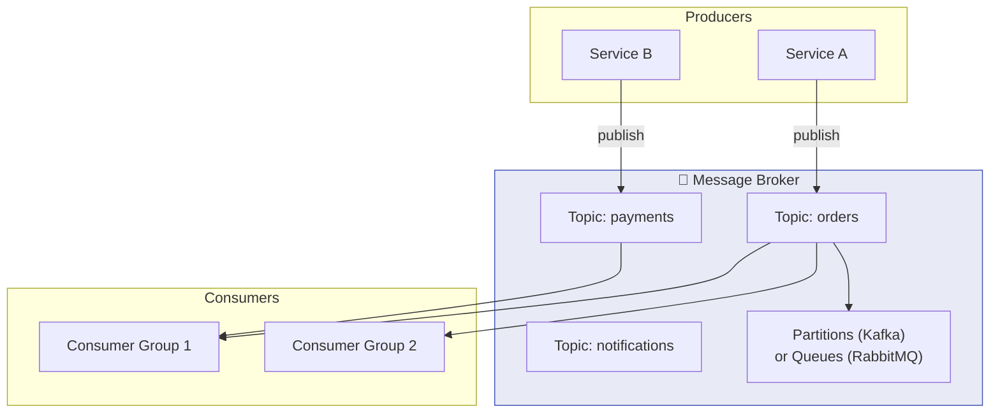
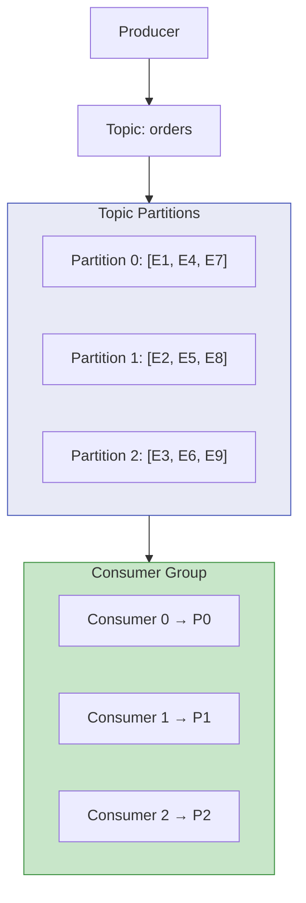
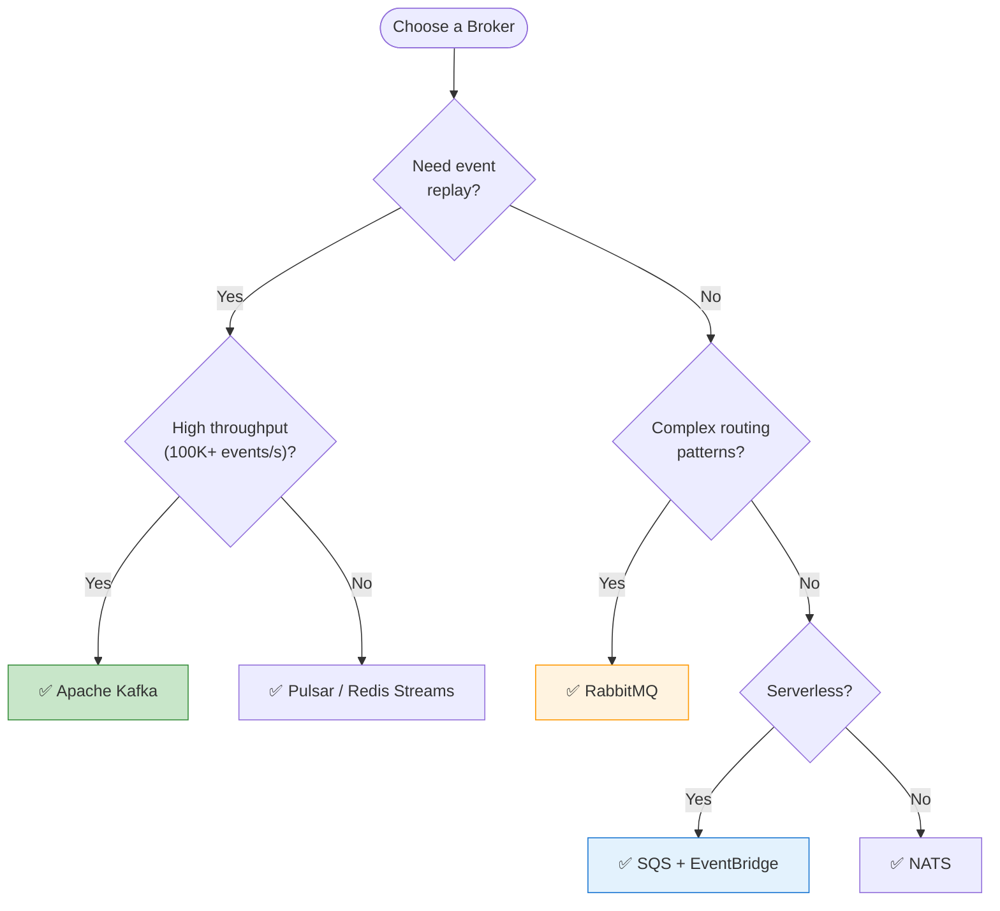

# Chapter 3: Message Brokers & Event Infrastructure

> *Choosing and understanding the backbone of your event-driven system*

---

## 🎯 Core Concepts

### Broker Architecture

### Kafka Architecture (Deep Dive)

### Message Queue vs. Event Stream

| Feature | Message Queue (RabbitMQ, SQS) | Event Stream (Kafka, Pulsar) |
| :--- | :--- | :--- |
| **Message lifecycle** | Deleted after consumption | Retained for configurable period |
| **Replay** | ❌ Not possible | ✅ Replay from any offset |
| **Multiple consumers** | Competing consumers only | Multiple independent consumer groups |
| **Ordering** | Per queue | Per partition |
| **Use case** | Task distribution, work queues | Event sourcing, streaming analytics |

### Broker Comparison

---

## 📝 My Notes

<!-- Add your own notes as you read -->

---

## ❓ Questions to Reflect On

1. What broker best fits your current project's requirements?
2. When would you choose a message queue over an event stream?
3. How do partitioning strategies affect ordering and scalability?

---

## 🛠️ Practice Ideas

- [ ] Set up Kafka locally and produce/consume messages
- [ ] Compare RabbitMQ and Kafka for the same use case
- [ ] Experiment with consumer groups and partition assignment

---

[⬅️ Previous](./chapter-02-events-and-messaging.md) | [🏠 Home](./README.md) | [Next ➡️](./chapter-04-pub-sub-patterns.md)

