# Chapter 4: Publish-Subscribe Patterns

> *The foundational pattern of event-driven architecture*

---

## 🎯 Core Concepts

### Pub/Sub — The Core Pattern

```mermaid
flowchart TD
    subgraph PRODUCERS["Producers (don't know consumers)"]
        P1["🛒 Order Service"]
        P2["💳 Payment Service"]
    end

    subgraph BROKER["📨 Event Bus / Broker"]
        T1["orders.placed"]
        T2["payments.completed"]
    end

    subgraph CONSUMERS["Consumers (subscribe independently)"]
        C1["📧 Email Service"]
        C2["📊 Analytics"]
        C3["📦 Shipping"]
        C4["📋 Audit Log"]
    end

    P1 -->|publish| T1
    P2 -->|publish| T2
    T1 --> C1
    T1 --> C2
    T1 --> C3
    T2 --> C2
    T2 --> C4

    style BROKER fill:#e8eaf6,stroke:#3f51b5
```

### Fan-Out Patterns

| Pattern | Behavior | Use Case |
| :--- | :--- | :--- |
| **Simple Fan-Out** | All consumers get every event | Notifications, logging, analytics |
| **Filtered Fan-Out** | Consumers only get matching events | Content-based routing |
| **Competing Consumers** | Only one consumer in group processes each event | Load balancing, work distribution |
| **Consumer Groups** | Group-level load balancing with broadcast across groups | Kafka consumer groups |

### Topic Design Best Practices

| ✅ Do | ❌ Don't |
| :--- | :--- |
| Use domain-based naming: `orders.placed` | Generic names: `topic1`, `events` |
| One event type per topic | Multiple unrelated events in one topic |
| Include version: `orders.placed.v2` | Break consumers with schema changes |
| Document topic ownership | Leave topics undocumented |

---

## 📝 My Notes

<!-- Add your own notes as you read -->

---

## ❓ Questions to Reflect On

1. How do you handle a consumer that's slower than the producer?
2. What's the right topic granularity for your domain?
3. How do you add a new consumer without affecting existing ones?

---

## 🛠️ Practice Ideas

- [ ] Implement a fan-out scenario: order placed → email + analytics + inventory
- [ ] Set up competing consumers and verify load distribution
- [ ] Design a topic naming convention for your domain

---

[⬅️ Previous](./chapter-03-message-brokers.md) | [🏠 Home](./README.md) | [Next ➡️](./chapter-05-event-sourcing.md)

